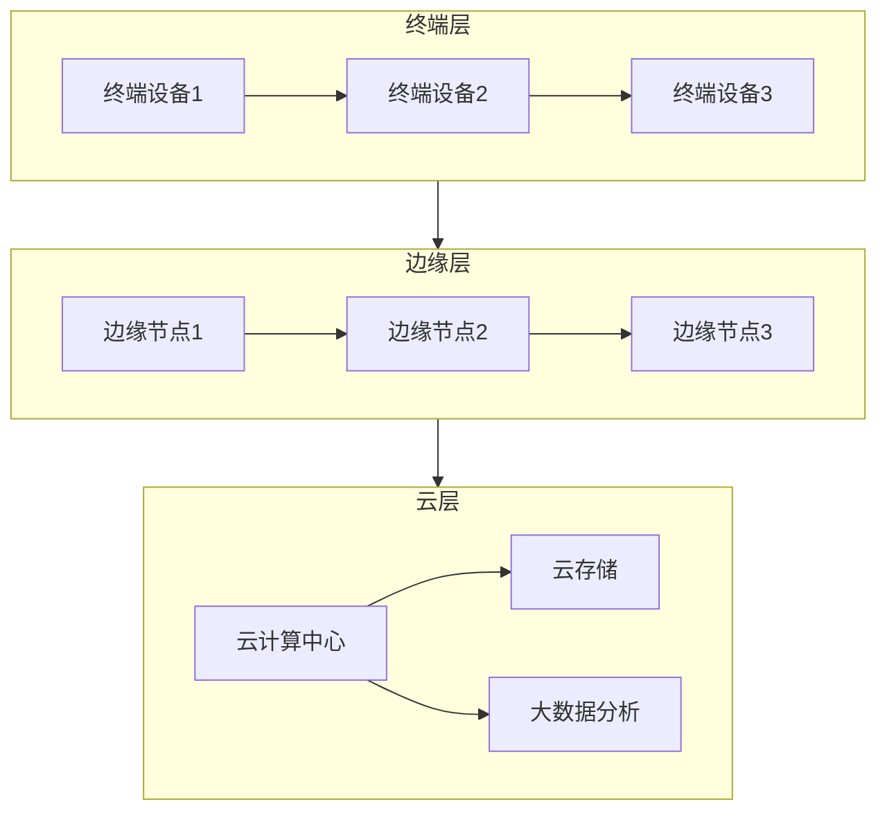
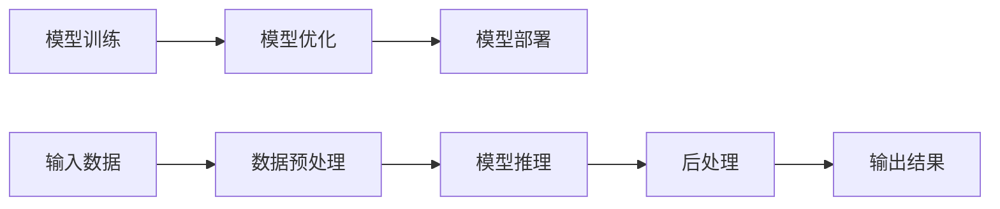

# 边缘计算与端侧推理原理与代码实战案例讲解

## 1. 背景介绍

### 1.1 边缘计算的兴起

随着物联网(IoT)设备和智能终端的快速普及,传统的云计算架构面临着一些挑战,例如:

- 网络延迟:将大量数据传输到云端进行处理会导致较高的网络延迟,影响实时性应用的体验。
- 带宽成本:上传海量数据到云端需要消耗大量的网络带宽,增加了运营成本。
- 隐私和安全:敏感数据上传到云端可能会带来隐私和安全风险。

为了解决这些问题,边缘计算(Edge Computing)应运而生。边缘计算是一种将计算资源靠近数据源的分布式计算范式,它可以在靠近数据源的网络边缘节点(如基站、路由器、网关等)上进行数据处理和分析,从而减少数据传输的延迟和带宽消耗,提高系统的实时性和隐私性。

### 1.2 端侧推理的重要性

在边缘计算架构中,端侧推理(On-device Inference)扮演着关键角色。端侧推理是指在终端设备(如手机、平板电脑、物联网设备等)上直接运行机器学习模型,进行数据处理和决策,而无需将数据上传到云端或边缘节点。

端侧推理具有以下优势:

1. **低延迟**:避免了数据传输的延迟,可实现实时响应。
2. **节省带宽**:无需上传数据,节省了网络带宽。
3. **隐私保护**:敏感数据不离开终端设备,降低了隐私泄露风险。
4. **设备自主性**:终端设备可以独立运行,不依赖网络连接。

随着终端设备硬件性能的不断提升,以及机器学习模型压缩和优化技术的进步,端侧推理在计算机视觉、自然语言处理、语音识别等领域得到了广泛应用。

## 2. 核心概念与联系

### 2.1 边缘计算架构

边缘计算架构通常包括以下几个层次:

1. **终端层(Device Layer)**: 包括各种物联网设备、智能手机、可穿戴设备等数据源。
2. **边缘层(Edge Layer)**: 由边缘节点(如基站、网关、路由器等)组成,负责收集和处理来自终端层的数据。
3. **云层(Cloud Layer)**: 提供大规模的计算、存储和分析能力,处理复杂的任务和长期数据存储。

这三个层次通过网络相互连接,形成一个分层的计算架构。数据可以在不同层次之间流动和处理,实现计算资源的优化分配和协同工作。

### 2.2 端侧推理流程

端侧推理通常包括以下几个步骤:

1. **模型优化**: 将训练好的机器学习模型进行压缩、量化等优化,以适应终端设备的硬件资源限制。
2. **模型部署**: 将优化后的模型部署到终端设备上,通常采用跨平台的深度学习框架(如TensorFlow Lite、NCNN等)。
3. **数据预处理**: 对输入数据(如图像、语音等)进行预处理,以满足模型的输入要求。
4. **模型推理**: 在终端设备上运行模型,对输入数据进行推理,获得输出结果。
5. **后处理**: 对模型输出结果进行后处理,根据应用场景进行可视化、决策等操作。

### 2.3 边缘计算与端侧推理的关系

边缘计算和端侧推理是相辅相成的关系:

- **边缘计算为端侧推理提供支持**: 边缘节点可以作为中间层,协助终端设备进行模型优化、部署和更新,减轻终端设备的计算压力。
- **端侧推理是边缘计算的重要组成部分**: 终端设备上的端侧推理能力是边缘计算架构的基础,可以实现数据的本地处理和决策,减少数据传输。
- **协同工作实现计算资源优化**: 终端设备、边缘节点和云端可以根据任务复杂度和资源限制,灵活分配计算任务,实现计算资源的优化利用。

通过边缘计算和端侧推理的紧密结合,可以构建一个高效、实时、安全的分布式智能系统,满足各种应用场景的需求。

## 3. 核心算法原理具体操作步骤

### 3.1 模型压缩和优化

由于终端设备(如手机、物联网设备等)通常具有有限的计算资源和存储空间,因此需要对训练好的深度学习模型进行压缩和优化,以便在资源受限的环境中高效运行。常见的模型压缩和优化技术包括:

#### 3.1.1 模型剪枝(Model Pruning)

模型剪枝是通过删除模型中的冗余权重和神经元来减小模型大小的技术。主要步骤如下:

1. **计算权重重要性**: 使用一些标准(如权重绝对值、权重对输出的敏感度等)来评估每个权重的重要性。
2. **剪枝低重要性权重**: 将重要性较低的权重设置为0,从而实现稀疏化。
3. **微调模型**: 在剪枝后,对剩余权重进行微调训练,以恢复模型的准确性。

#### 3.1.2 知识蒸馏(Knowledge Distillation)

知识蒸馏是将一个大型教师模型(Teacher Model)的知识迁移到一个小型学生模型(Student Model)的过程。主要步骤如下:

1. **训练教师模型**: 使用大量数据训练一个高容量、高精度的教师模型。
2. **生成软标签**: 使用教师模型对训练数据进行推理,获得软标签(Soft Label),即输出层的概率分布。
3. **训练学生模型**: 使用软标签作为监督信号,训练一个小型的学生模型,使其学习教师模型的知识。

#### 3.1.3 量化(Quantization)

量化是将模型的浮点数权重和激活值转换为较低位宽(如8位或更低)的整数值,从而减小模型大小和计算量。主要步骤如下:

1. **确定量化范围**: 计算权重和激活值的最大最小值,确定量化范围。
2. **量化映射**: 将浮点数值映射到离散的整数值上。
3. **量化感知训练**: 使用量化后的模型进行训练,以提高量化模型的精度。

#### 3.1.4 模型压缩工具

深度学习框架(如TensorFlow、PyTorch等)通常提供了模型压缩和优化的工具和库,如TensorFlow的TensorFlow Model Optimization Toolkit、PyTorch的PyTorch Mobile等,可以方便地对模型进行压缩和优化。

### 3.2 端侧推理框架

为了在终端设备上高效地部署和运行机器学习模型,通常需要使用专门的端侧推理框架。常见的端侧推理框架包括:

#### 3.2.1 TensorFlow Lite

TensorFlow Lite是Google开源的用于移动和嵌入式设备的轻量级深度学习框架。它支持多种硬件加速(如GPU、NNAPI、EdgeTPU等),可以高效地运行各种机器学习模型。

TensorFlow Lite的工作流程如下:

1. **模型转换**: 使用TensorFlow Lite Converter将训练好的TensorFlow模型转换为TensorFlow Lite格式。
2. **模型优化**: 对转换后的模型进行优化,如量化、权重剪枝等。
3. **模型部署**: 将优化后的模型部署到移动设备或嵌入式系统上。
4. **模型推理**: 使用TensorFlow Lite Interpreter在设备上运行模型,进行推理。

#### 3.2.2 NCNN

NCNN(Nihui's Convolutional Neural Networks)是一个高性能的神经网络推理框架,专注于移动端的部署和优化。它支持多种深度学习模型,如SSD、YOLO、MobileNet等,并提供了多种硬件加速方案。

NCNN的工作流程如下:

1. **模型转换**: 将训练好的模型转换为NCNN可识别的格式,如ONNX、Caffe等。
2. **模型优化**: 使用NCNN提供的工具对模型进行优化,如量化、剪枝等。
3. **模型部署**: 将优化后的模型部署到移动设备上。
4. **模型推理**: 使用NCNN的C++接口在设备上运行模型,进行推理。

#### 3.2.3 CoreML

CoreML是Apple公司开发的机器学习框架,专门用于在iOS、iPadOS和macOS设备上部署和运行机器学习模型。它支持多种深度学习模型,如视觉、自然语言处理、音频等,并提供了硬件加速支持。

CoreML的工作流程如下:

1. **模型转换**: 将训练好的模型转换为CoreML格式,通常使用Xcode或Python工具。
2. **模型优化**: 使用CoreML Tools对模型进行优化,如量化、权重剪枝等。
3. **模型部署**: 将优化后的模型集成到iOS、iPadOS或macOS应用程序中。
4. **模型推理**: 使用CoreML的API在设备上运行模型,进行推理。

### 3.3 硬件加速技术

为了提高端侧推理的性能,终端设备通常需要利用硬件加速技术,如GPU、NPU、DSP等。常见的硬件加速技术包括:

#### 3.3.1 GPU加速

GPU(图形处理单元)具有大量的并行计算能力,可以加速深度学习模型的推理过程。常见的GPU加速技术包括:

- **OpenCL**: 开放式异构并行计算框架,支持在CPU、GPU和其他处理器上进行并行计算。
- **Vulkan**: 新一代的低级别图形API,可以更好地利用GPU的并行计算能力。
- **CUDA**: NVIDIA公司开发的GPU加速计算平台,可以在NVIDIA GPU上高效运行深度学习模型。

#### 3.3.2 NPU加速

NPU(神经网络处理单元)是专门为深度学习推理而设计的专用硬件,具有高能效和低功耗的特点。常见的NPU加速技术包括:

- **ARM Ethos-N**: ARM公司开发的NPU IP,可以在移动设备和物联网设备上提供高效的深度学习推理能力。
- **谷歌TPU**: 谷歌开发的张量处理单元(TPU),专门用于加速深度学习模型的训练和推理。
- **华为达芬奇架构**: 华为自主研发的NPU架构,可以在手机、平板电脑等终端设备上提供高性能的AI计算能力。

#### 3.3.3 DSP加速

DSP(数字信号处理器)是一种专门用于数字信号处理的处理器,可以高效地执行矩阵运算和卷积运算,因此也可以用于加速深度学习推理。常见的DSP加速技术包括:

- **Hexagon DSP**: 高通公司开发的Hexagon DSP,可以在高通移动芯片上加速深度学习推理。
- **TI DSP**: 德州仪器(TI)公司开发的DSP系列,可以在嵌入式系统和物联网设备上提供高效的信号处理和深度学习推理能力。

通过利用这些硬件加速技术,可以显著提高端侧推理的性能和能效,满足各种实时应用的需求。

## 4. 数学模型和公式详细讲解举例说明

在深度学习模型中,常见的数学模型和公式包括卷积运算、池化运算、激活函数等。下面将