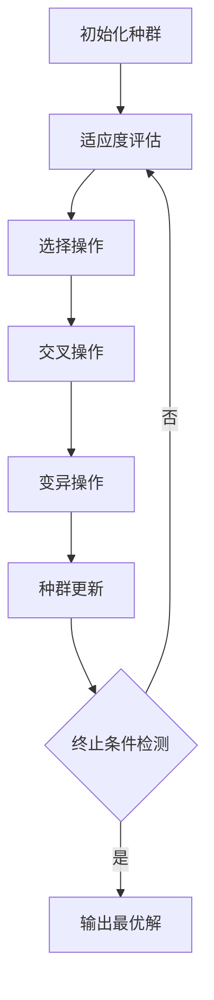

# 遗传算法在社会学研究中的应用

## 1.背景介绍

社会学研究是一门探索人类社会行为、结构和发展的学科。随着大数据时代的到来,海量的社会数据为社会学研究带来了新的机遇和挑战。传统的统计分析方法往往难以有效地从复杂的社会大数据中发现隐藏的模式和规律。因此,需要引入新的计算智能技术来处理这些高维度、非线性和动态的社会数据。

遗传算法(Genetic Algorithm, GA)作为一种有效的生物启发式计算方法,具有全局寻优、鲁棒性强、易于并行等优点,在社会学研究中展现出了广阔的应用前景。遗传算法借鉴了生物进化过程中的自然选择和遗传机制,通过模拟生物种群的遗传、变异和选择过程,可以有效地解决复杂的组合优化问题。

## 2.核心概念与联系

遗传算法的核心思想是模拟生物进化过程,通过选择、交叉和变异等遗传操作,从初始种群中不断产生新的后代个体,并保留适应度较高的个体,最终收敛到全局最优解或近似最优解。

在社会学研究中,常常需要处理复杂的组合优化问题,例如社会网络分析、人口迁移模式预测、社会资源分配等。这些问题往往具有高维度、非线性、动态和多目标等特点,传统的分析方法很难有效解决。

遗传算法可以将这些复杂问题抽象为适应度函数优化问题,通过模拟进化过程,从海量的可能解空间中搜索最优解。适应度函数用于评估每个候选解的质量,体现了问题的优化目标。遗传算法通过选择、交叉和变异操作,不断产生新的候选解,并保留适应度较高的个体,最终收敛到全局最优解或近似最优解。

## 3.核心算法原理具体操作步骤

遗传算法的核心操作步骤如下:

1. **初始化种群**: 首先随机生成一个初始种群,每个个体对应一个候选解。通常采用二进制编码或实数编码来表示个体。

2. **适应度评估**: 对每个个体计算其适应度值,即根据适应度函数评估候选解的质量。适应度值越高,表示该个体越优秀。

3. **选择操作**: 根据适应度值,从当前种群中选择一些优秀个体,作为下一代种群的父本。常用的选择方法有轮盘赌选择、锦标赛选择等。

4. **交叉操作**: 对选中的父本个体进行交叉操作,产生新的子代个体。交叉操作通过重组父本的基因,产生新的基因组合。

5. **变异操作**: 以一定的小概率对子代个体进行变异操作,引入新的基因,维持种群的多样性。

6. **种群更新**: 将新产生的子代个体加入种群,替换掉适应度较低的个体,形成新一代种群。

7. **终止条件检测**: 检查是否满足终止条件,如达到最大迭代次数、目标函数值等。若满足则输出最优解,否则回到步骤2,对新一代种群进行迭代。

上述过程反复进行,直到满足终止条件。通过模拟进化过程,遗传算法可以在海量解空间中有效搜索全局最优解或近似最优解。



## 4.数学模型和公式详细讲解举例说明

遗传算法中的数学模型主要包括编码方式、适应度函数、选择操作、交叉操作和变异操作等。

### 4.1 编码方式

编码是将问题的候选解表示为遗传算法可操作的形式,常用的编码方式有二进制编码和实数编码。

以社会网络中的最大独立集问题为例,我们可以采用二进制编码。假设社会网络有 $n$ 个节点,用一个长度为 $n$ 的二进制串表示一个候选解,其中 $1$ 表示该节点被选中,而 $0$ 表示该节点未被选中。例如,对于一个 $5$ 个节点的社会网络,候选解 $10101$ 表示选中了第 $1$、$3$ 和 $5$ 个节点。

### 4.2 适应度函数

适应度函数用于评估每个候选解的质量,体现了优化问题的目标。在社会网络的最大独立集问题中,我们可以将适应度函数定义为:

$$
f(x) = \sum_{i=1}^{n} x_i + \alpha \sum_{(i,j) \in E} (1 - |x_i - x_j|)
$$

其中 $x$ 是长度为 $n$ 的二进制编码,表示一个候选解; $x_i$ 表示第 $i$ 个节点是否被选中; $E$ 是社会网络的边集合; $\alpha$ 是一个惩罚系数,用于惩罚相邻节点同时被选中的情况。这个适应度函数的目标是最大化独立集的大小,同时尽量避免相邻节点同时被选中。

### 4.3 选择操作

选择操作是根据个体的适应度值,从当前种群中选择一些优秀个体,作为下一代种群的父本。常用的选择方法有轮盘赌选择和锦标赛选择。

轮盘赌选择的基本思想是,将每个个体的适应度值作为其被选中的概率。具体操作如下:

1. 计算当前种群所有个体的适应度值之和 $F$。
2. 对于每个个体 $i$,计算其被选中的概率 $p_i = f_i / F$,其中 $f_i$ 是个体 $i$ 的适应度值。
3. 在区间 $[0,1]$ 上随机生成一个数 $r$。
4. 从第一个个体开始,累加其被选中的概率,直到累加值大于 $r$,将该个体选中。
5. 重复步骤 $3$ 和 $4$,直到选中足够多的个体。

锦标赛选择则是从种群中随机选择一些个体,让它们进行竞争,选择其中适应度值最高的个体作为父本。锦标赛选择的优点是计算简单,可以很好地保持种群的多样性。

### 4.4 交叉操作

交叉操作是将两个父本个体的部分基因进行重组,产生新的子代个体。常用的交叉操作有单点交叉、多点交叉和均匀交叉等。

以二进制编码为例,单点交叉的操作步骤如下:

1. 随机选择一个交叉点。
2. 将两个父本个体在交叉点处分成两段。
3. 交换两个父本个体的后半段,生成两个新的子代个体。

例如,对于两个父本个体 $10011101$ 和 $01100110$,假设交叉点选在第 $4$ 位,则交叉后产生的两个子代个体分别为 $10001110$ 和 $01101101$。

### 4.5 变异操作

变异操作是以一定的小概率,对个体的部分基因进行改变,引入新的基因,维持种群的多样性。常用的变异操作有基因变异和调遗变异等。

以二进制编码为例,基因变异的操作步骤如下:

1. 设置一个小的变异概率 $p_m$,通常在 $0.001$ 到 $0.1$ 之间。
2. 对于每个个体,随机生成一个 $[0,1]$ 区间内的数 $r$。
3. 若 $r < p_m$,则随机选择该个体的一个基因位,将其取反;否则保持不变。

例如,对于个体 $10011101$,假设变异概率 $p_m = 0.01$,随机生成的数 $r = 0.008 < p_m$,则随机选择第 $5$ 位基因进行变异,产生新的个体 $10010101$。

通过上述数学模型和公式,我们可以更好地理解和实现遗传算法在社会学研究中的应用。

## 5.项目实践:代码实例和详细解释说明

为了更好地理解遗传算法在社会学研究中的应用,我们以社会网络中的最大独立集问题为例,提供一个 Python 代码实例,并进行详细的解释说明。

最大独立集问题可以描述为:给定一个无向图 $G = (V, E)$,找到一个最大的节点子集 $S \subseteq V$,使得对于任意 $u, v \in S$,都有 $(u, v) \notin E$,即 $S$ 中的节点两两不相邻。

我们将使用遗传算法来求解这个问题,代码如下:

```python
import random
import networkx as nx

# 定义适应度函数
def fitness(individual, G, alpha=1.0):
    score = 0
    for i in range(len(individual)):
        if individual[i] == 1:
            score += 1
            for j in G.neighbors(i):
                if individual[j] == 1:
                    score -= alpha
    return score

# 初始化种群
def init_population(pop_size, n):
    population = []
    for i in range(pop_size):
        individual = [random.randint(0, 1) for j in range(n)]
        population.append(individual)
    return population

# 选择操作
def selection(population, fitness_values):
    total_fitness = sum(fitness_values)
    probabilities = [fitness / total_fitness for fitness in fitness_values]
    new_population = []
    for i in range(len(population)):
        parent1, parent2 = random.choices(population, weights=probabilities, k=2)
        new_population.append(parent1)
        new_population.append(parent2)
    return new_population

# 交叉操作
def crossover(parents, n, crossover_rate=0.8):
    offspring = parents[:]
    for i in range(0, len(parents), 2):
        if random.random() < crossover_rate:
            point = random.randint(1, n - 1)
            offspring[i] = parents[i][:point] + parents[i + 1][point:]
            offspring[i + 1] = parents[i + 1][:point] + parents[i][point:]
    return offspring

# 变异操作
def mutation(individuals, n, mutation_rate=0.1):
    mutated = individuals[:]
    for i in range(len(individuals)):
        if random.random() < mutation_rate:
            point = random.randint(0, n - 1)
            mutated[i][point] = 1 - mutated[i][point]
    return mutated

# 遗传算法主函数
def genetic_algorithm(G, pop_size=100, generations=100, crossover_rate=0.8, mutation_rate=0.1, alpha=1.0):
    n = G.number_of_nodes()
    population = init_population(pop_size, n)
    for gen in range(generations):
        fitness_values = [fitness(individual, G, alpha) for individual in population]
        population = selection(population, fitness_values)
        population = crossover(population, n, crossover_rate)
        population = mutation(population, n, mutation_rate)
    best_individual = max(population, key=lambda x: fitness(x, G, alpha))
    return [i for i, x in enumerate(best_individual) if x == 1]

# 示例用法
G = nx.karate_club_graph()
max_independent_set = genetic_algorithm(G)
print("最大独立集节点:", max_independent_set)
```

代码解释:

1. 首先定义适应度函数 `fitness`。对于每个个体(表示一个候选解),我们计算其包含的节点数,同时减去相邻节点同时被选中的惩罚项。适应度值越高,表示该个体越优秀。

2. `init_population` 函数用于初始化种群,随机生成一定数量的个体。

3. `selection` 函数实现了轮盘赌选择操作,根据个体的适应度值,选择一些优秀个体作为父本。

4. `crossover` 函数实现了单点交叉操作,根据交叉率,对选中的父本进行交叉,产生新的子代个体。

5. `mutation` 函数实现了基因变异操作,根据变异率,对个体的部分基因进行变异,引入新的基因。

6. `genetic_algorithm` 函数是遗传算法的主函数,包括初始化种群、选择、交叉、变异和更新种群等操作。它接受一个网络图 `G` 作为输入,并返回最大独立集的节点索引列表。

7. 