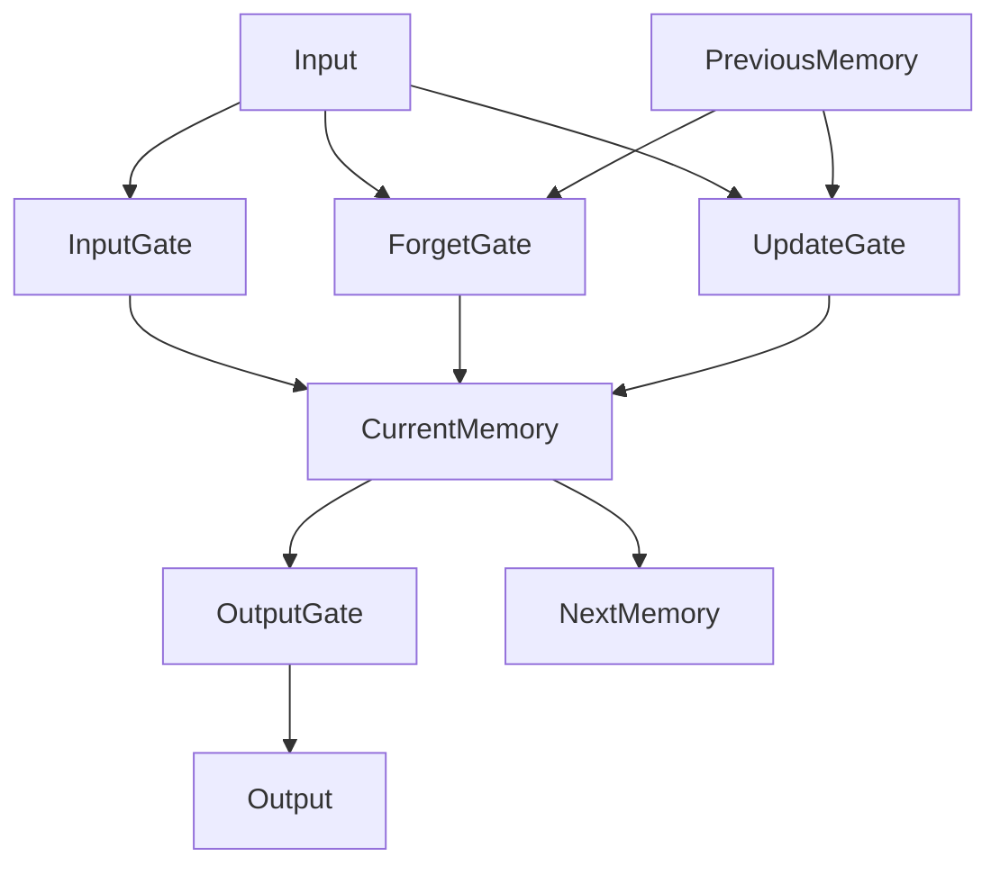

# 长短时记忆网络 (LSTM) 原理与代码实例讲解

## 1. 背景介绍
### 1.1 深度学习的发展历程
#### 1.1.1 人工神经网络的起源
#### 1.1.2 深度学习的崛起
#### 1.1.3 循环神经网络的提出

### 1.2 循环神经网络的局限性
#### 1.2.1 梯度消失与梯度爆炸问题
#### 1.2.2 难以捕捉长期依赖关系
#### 1.2.3 对序列建模能力有限

### 1.3 LSTM网络的诞生
#### 1.3.1 LSTM的提出背景
#### 1.3.2 LSTM的核心思想
#### 1.3.3 LSTM解决RNN面临的问题

## 2. 核心概念与联系
### 2.1 LSTM的网络结构
#### 2.1.1 LSTM的基本单元
#### 2.1.2 输入门、遗忘门和输出门
#### 2.1.3 状态更新与信息传递

### 2.2 LSTM的前向传播过程
#### 2.2.1 输入门的计算
#### 2.2.2 遗忘门的计算  
#### 2.2.3 状态更新的计算
#### 2.2.4 输出门和最终输出的计算

### 2.3 LSTM的反向传播过程
#### 2.3.1 时间反向传播(BPTT)算法
#### 2.3.2 门控单元的梯度计算
#### 2.3.3 状态单元的梯度计算
#### 2.3.4 参数更新

### 2.4 LSTM与传统RNN的联系与区别
#### 2.4.1 参数共享机制的异同
#### 2.4.2 信息传递与更新方式的差异
#### 2.4.3 梯度计算与优化过程的比较



## 3. 核心算法原理具体操作步骤
### 3.1 LSTM前向传播算法
#### 3.1.1 输入门计算步骤
#### 3.1.2 遗忘门计算步骤
#### 3.1.3 状态更新计算步骤 
#### 3.1.4 输出门与最终输出计算步骤

### 3.2 LSTM反向传播算法
#### 3.2.1 输出门梯度计算步骤
#### 3.2.2 状态单元梯度计算步骤
#### 3.2.3 遗忘门梯度计算步骤
#### 3.2.4 输入门梯度计算步骤
#### 3.2.5 模型参数梯度计算与更新步骤

## 4. 数学模型和公式详细讲解举例说明
### 4.1 输入门
#### 4.1.1 输入门计算公式
$$i_t = \sigma(W_i \cdot [h_{t-1}, x_t] + b_i)$$
其中，$i_t$ 表示 $t$ 时刻输入门的输出，$\sigma$ 为 sigmoid 激活函数，$W_i$ 和 $b_i$ 分别为输入门的权重矩阵和偏置项，$h_{t-1}$ 为上一时刻的隐藏状态，$x_t$ 为当前时刻的输入。

#### 4.1.2 输入门作用解释
输入门控制了当前时刻的输入信息有多少能够进入记忆单元，对信息进行筛选和加权。

### 4.2 遗忘门
#### 4.2.1 遗忘门计算公式 
$$f_t = \sigma(W_f \cdot [h_{t-1}, x_t] + b_f)$$
其中，$f_t$ 表示 $t$ 时刻遗忘门的输出，$W_f$ 和 $b_f$ 分别为遗忘门的权重矩阵和偏置项。

#### 4.2.2 遗忘门作用解释
遗忘门决定了上一时刻的记忆信息有多少能够保留到当前时刻，实现了对过去信息的选择性遗忘。

### 4.3 状态更新
#### 4.3.1 候选记忆单元计算公式
$$\tilde{C}_t = \tanh(W_C \cdot [h_{t-1}, x_t] + b_C)$$
其中，$\tilde{C}_t$ 表示 $t$ 时刻的候选记忆单元，$\tanh$ 为双曲正切激活函数，$W_C$ 和 $b_C$ 分别为候选记忆单元的权重矩阵和偏置项。

#### 4.3.2 记忆单元更新公式
$$C_t = f_t * C_{t-1} + i_t * \tilde{C}_t$$
其中，$C_t$ 表示 $t$ 时刻更新后的记忆单元，$C_{t-1}$ 为上一时刻的记忆单元，$*$ 表示按元素相乘。

这一步综合了遗忘门和输入门的输出，对上一时刻的记忆进行选择性保留，并加入当前时刻的新信息，实现了记忆的更新。

### 4.4 输出门与最终输出
#### 4.4.1 输出门计算公式
$$o_t = \sigma(W_o \cdot [h_{t-1}, x_t] + b_o)$$
其中，$o_t$ 表示 $t$ 时刻输出门的输出，$W_o$ 和 $b_o$ 分别为输出门的权重矩阵和偏置项。

#### 4.4.2 隐藏状态计算公式
$$h_t = o_t * \tanh(C_t)$$
其中，$h_t$ 表示 $t$ 时刻的隐藏状态，即 LSTM 单元的最终输出。

输出门控制了当前时刻的记忆信息有多少能够输出，与记忆单元状态结合产生最终的隐藏状态输出。

## 5. 项目实践：代码实例和详细解释说明
下面我们使用 Python 和 Pytorch 深度学习框架来实现一个基本的 LSTM 网络，并对代码进行详细解释。

```python
import torch
import torch.nn as nn

class LSTMModel(nn.Module):
    def __init__(self, input_size, hidden_size, output_size):
        super(LSTMModel, self).__init__()
        self.hidden_size = hidden_size
        
        # 定义LSTM层
        self.lstm = nn.LSTM(input_size, hidden_size)
        
        # 定义全连接输出层
        self.fc = nn.Linear(hidden_size, output_size)
    
    def forward(self, input, hidden):
        # LSTM前向传播
        output, hidden = self.lstm(input, hidden)
        
        # 取LSTM最后一个时间步的输出
        output = output[-1]
        
        # 全连接层输出
        output = self.fc(output)
        return output, hidden
    
    def init_hidden(self, batch_size):
        # 初始化隐藏状态和记忆单元状态
        hidden = (torch.zeros(1, batch_size, self.hidden_size),
                  torch.zeros(1, batch_size, self.hidden_size))
        return hidden
```

代码解释：
1. 我们定义了一个继承自 `nn.Module` 的 `LSTMModel` 类，作为我们的 LSTM 网络模型。
2. 在 `__init__` 方法中，我们定义了 LSTM 层 `self.lstm`，它接收输入特征大小 `input_size`，隐藏状态维度 `hidden_size`，并使用 `nn.LSTM` 类创建。
3. 接着，我们定义了一个全连接输出层 `self.fc`，将 LSTM 的输出转换为最终的预测结果。
4. 在 `forward` 方法中，我们定义了前向传播的过程。首先将输入数据 `input` 和初始隐藏状态 `hidden` 传入 LSTM 层，得到输出 `output` 和更新后的隐藏状态 `hidden`。
5. 我们取 LSTM 最后一个时间步的输出，通过全连接层得到最终的预测结果。
6. `init_hidden` 方法用于初始化 LSTM 的隐藏状态和记忆单元状态，将它们初始化为全0张量，形状为 (1, batch_size, hidden_size)。

使用示例：
```python
# 创建LSTM模型实例
model = LSTMModel(input_size=10, hidden_size=20, output_size=5)

# 初始化隐藏状态
hidden = model.init_hidden(batch_size=4)

# 准备输入数据
input = torch.randn(6, 4, 10)  # 序列长度为6，批次大小为4，特征维度为10

# 前向传播
output, hidden = model(input, hidden)

print(output.shape)  # 输出形状为(4, 5)
```

以上就是一个基本的 LSTM 网络的 Pytorch 实现，通过定义 LSTM 层和全连接输出层，并在前向传播过程中进行计算，我们可以使用 LSTM 处理序列数据并得到预测结果。你可以根据具体任务的需求，对模型结构进行进一步的修改和扩展。

## 6. 实际应用场景
LSTM 网络在许多领域都有广泛的应用，下面列举几个典型的应用场景：

### 6.1 自然语言处理
LSTM 在自然语言处理任务中表现出色，如：
- 语言模型：基于 LSTM 的语言模型可以学习文本序列的长期依赖关系，预测下一个单词的概率分布。
- 机器翻译：将源语言序列编码为固定长度的向量表示，再通过 LSTM 解码器生成目标语言序列。
- 情感分析：利用 LSTM 对文本序列进行建模，捕捉上下文信息，判断文本的情感倾向。
- 命名实体识别：通过 LSTM 对词序列进行编码，识别出文本中的命名实体，如人名、地名、组织机构名等。

### 6.2 语音识别
LSTM 可以对语音信号的时间序列进行建模，用于：
- 声学模型：将语音信号转化为音素或词的概率序列，LSTM 可以有效地捕捉语音的长期依赖关系。
- 语言模型：基于 LSTM 的语言模型可以提高语音识别的准确性，为识别出的词序列提供语言学约束。

### 6.3 时间序列预测
LSTM 在时间序列预测任务中表现优异，例如：
- 股票价格预测：利用历史价格数据训练 LSTM 模型，预测未来的股票走势。
- 交通流量预测：根据历史交通流量数据，使用 LSTM 预测未来一段时间内的交通状况。
- 设备故障预测：通过设备运行数据的时间序列，训练 LSTM 模型预测设备的潜在故障。

### 6.4 图像描述生成
LSTM 可以与卷积神经网络（CNN）结合，用于生成图像的文本描述：
- CNN 提取图像的特征表示，LSTM 根据图像特征生成自然语言描述。
- 通过端到端的训练，实现图像到文本的转换，生成准确和流畅的图像描述。

以上仅是 LSTM 的一些典型应用场景，LSTM 强大的序列建模能力使其在处理时序数据和长期依赖问题上表现出色，在学术研究和工业界都有广泛的应用。

## 7. 工具和资源推荐
以下是一些常用的深度学习框架和工具，以及相关的学习资源，可以帮助你更好地学习和应用 LSTM 网络：

### 7.1 深度学习框架
- Pytorch：一个基于 Python 的开源深度学习框架，提供了动态计算图和自动求导功能，使用灵活，适合研究和快速原型开发。官网：https://pytorch.org/
- TensorFlow：由 Google 开发的开源深度学习框架，提供了丰富的工具和资源，社区活跃，适合大规模部署和生产环境。官网：https://www.tensorflow.org/
- Keras：一个高层次的神经网络 API，可以基于 TensorFlow、CNTK 或 Theano 运行，提供了简洁易用的接口，适合快速构建和训练模型。官网：https://keras.io/

### 7.2 学习资源
- 《深度学习》（Deep Learning）：由 Ian Goodfellow、Yoshua Bengio 和 Aaron Courville 合著的深度学习圣经，系统全面地介绍了深度学习的理论和实践。
- 《序列模型》（Sequence Models）：吴