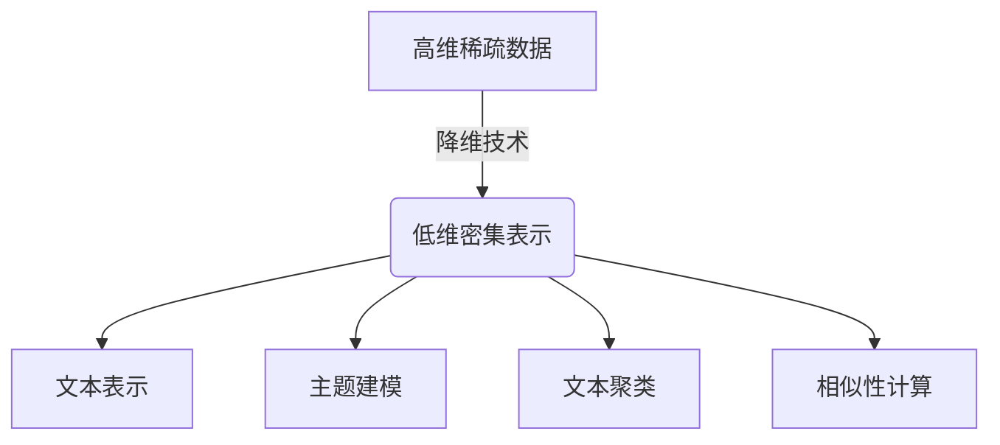

# 降维在语义分析中的应用

## 1.背景介绍

在自然语言处理和文本分析领域,我们经常会遇到高维稀疏数据的问题。这种数据通常以向量空间模型(Vector Space Model)的形式表示,其中每个文档或单词都被表示为一个高维向量。然而,高维数据不仅计算复杂,而且还容易受到"维数灾难"(Curse of Dimensionality)的影响,导致数据变得稀疏和噪声严重。

为了解决这个问题,降维技术应运而生。降维是指将高维数据映射到低维空间的过程,同时尽可能保留原始数据的重要特征和结构信息。通过降维,我们可以减少数据的复杂性,提高计算效率,并且更容易发现数据的内在模式和结构。

在语义分析中,降维技术被广泛应用于文本表示、主题建模、文本聚类和相似性计算等任务。降维不仅可以帮助我们更好地理解和可视化文本数据,还能提高后续任务的性能和效率。

## 2.核心概念与联系

降维技术的核心思想是将高维数据投影到一个低维空间,同时尽可能保留原始数据的重要特征和结构信息。在语义分析中,常用的降维技术包括:

1. **奇异值分解(SVD)**: 将文档-词矩阵分解为三个矩阵的乘积,其中一个矩阵包含了文档在低维空间中的表示。
2. **主成分分析(PCA)**: 通过线性变换将高维数据投影到一个低维空间,同时最大化投影后数据的方差。
3. **t-SNE(t-Distributed Stochastic Neighbor Embedding)**: 一种非线性降维技术,能够很好地保留数据的局部结构和全局结构。
4. **LDA(Latent Dirichlet Allocation)**: 一种主题建模技术,可以将文档表示为主题的概率分布,从而实现降维。

这些降维技术在语义分析中发挥着重要作用,它们能够捕捉文本数据的语义信息,并将其映射到一个低维空间中进行处理和分析。



## 3.核心算法原理具体操作步骤

在这一部分,我们将重点介绍两种广泛应用的降维算法:奇异值分解(SVD)和主成分分析(PCA)。

### 3.1 奇异值分解(SVD)

奇异值分解是一种线性代数技术,它可以将任意矩阵分解为三个矩阵的乘积:$A = U\Sigma V^T$。其中,U和V是正交矩阵,代表了文档和词在低维空间中的表示;$\Sigma$是一个对角矩阵,对角线元素称为奇异值,反映了对应维度的重要性。

在语义分析中,我们通常对文档-词矩阵进行SVD分解,得到文档在低维空间中的表示U。具体操作步骤如下:

1. 构建文档-词矩阵A,其中$A_{ij}$表示第i个文档中第j个词的出现次数或TF-IDF值。
2. 对矩阵A进行SVD分解,得到U、$\Sigma$和$V^T$。
3. 选择前k个最大的奇异值及对应的左、右奇异向量,构建降维后的矩阵$U_k$、$\Sigma_k$和$V_k^T$。
4. 文档在低维空间中的表示为$U_k$的行向量。

通过SVD降维,我们可以获得文档在低维空间中的紧凑表示,同时保留了原始数据的重要语义信息。

### 3.2 主成分分析(PCA)

主成分分析是一种常用的线性无监督降维技术。它通过线性变换将高维数据投影到一个低维空间,同时最大化投影后数据的方差,从而保留了原始数据的最大变化信息。

PCA的具体操作步骤如下:

1. 对输入数据进行中心化,即将每个特征的均值减去,使得数据的均值为0。
2. 计算数据的协方差矩阵$\Sigma$。
3. 对协方差矩阵$\Sigma$进行特征值分解,得到特征值和对应的特征向量。
4. 选择前k个最大的特征值及对应的特征向量,构建投影矩阵P。
5. 将原始数据乘以投影矩阵P,得到降维后的数据。

在语义分析中,我们可以将文档表示为词频向量或TF-IDF向量,然后对这些高维向量应用PCA进行降维。降维后的向量可以作为文档的低维表示,用于后续的聚类、分类或相似性计算等任务。

## 4.数学模型和公式详细讲解举例说明

在上一部分,我们介绍了SVD和PCA两种常用的降维算法。现在,我们将更深入地探讨它们的数学模型和公式,并通过具体例子来说明它们的工作原理。

### 4.1 奇异值分解(SVD)

对于一个$m\times n$的矩阵A,SVD可以将其分解为三个矩阵的乘积:

$$A = U\Sigma V^T$$

其中:

- U是一个$m\times m$的正交矩阵,每一列表示输入数据在新的正交基向量系中的分量。
- $\Sigma$是一个$m\times n$的对角矩阵,对角线元素称为奇异值,反映了对应维度的重要性。
- V是一个$n\times n$的正交矩阵,每一行表示输出数据在新的正交基向量系中的分量。

通过SVD,我们可以获得矩阵A在新的正交基向量系中的表示,即U和V。这种表示具有很好的性质,例如:

- 奇异值的大小反映了对应维度的重要性,我们可以通过保留前k个最大的奇异值来实现降维。
- 奇异向量具有很好的解释性,可以揭示数据的内在结构和模式。

让我们通过一个简单的例子来说明SVD的工作原理。假设我们有一个$3\times 2$的矩阵A:

$$A = \begin{bmatrix}
1 & 4\\
2 & 5\\
3 & 6
\end{bmatrix}$$

对A进行SVD分解,我们可以得到:

$$U = \begin{bmatrix}
-0.57 & -0.82\\
-0.63 & 0.33\\
-0.52 & 0.46
\end{bmatrix}, \Sigma = \begin{bmatrix}
9.52 & 0\\
0 & 0.64
\end{bmatrix}, V = \begin{bmatrix}
-0.44 & -0.90\\
-0.90 & 0.44
\end{bmatrix}$$

我们可以看到,矩阵A在新的正交基向量系中的表示为U和V。如果我们只保留第一个奇异值及对应的奇异向量,就可以实现降维:

$$A \approx U_1\Sigma_1V_1^T = \begin{bmatrix}
-5.41\\
-6.00\\
-4.96
\end{bmatrix}\begin{bmatrix}
-4.38 & -8.95
\end{bmatrix}$$

通过这个例子,我们可以直观地理解SVD降维的过程和原理。

### 4.2 主成分分析(PCA)

主成分分析的目标是找到一个新的坐标系,使得原始数据在这个新坐标系中的投影具有最大的方差。具体来说,PCA试图找到一组正交基向量$\{v_1, v_2, \ldots, v_n\}$,使得原始数据在这些基向量上的投影具有最大的方差。

设原始数据为$\{x_1, x_2, \ldots, x_m\}$,其中$x_i$是一个n维向量。我们定义投影后的数据为$y_i = v^Tx_i$,其中v是一个n维单位向量。我们希望找到一个v,使得$y_i$的方差最大化:

$$\max_{v}\frac{1}{m}\sum_{i=1}^m(v^Tx_i - \bar{y})^2$$

其中$\bar{y}$是$y_i$的均值。通过一些代数运算,我们可以得到:

$$\max_{v}\frac{1}{m}\sum_{i=1}^m(v^Tx_i - \bar{y})^2 = v^T\Sigma v$$

其中$\Sigma$是数据的协方差矩阵。因此,我们需要找到$\Sigma$的最大特征值对应的特征向量,就是我们想要的投影方向v。

通过重复这个过程,我们可以找到一组正交基向量$\{v_1, v_2, \ldots, v_n\}$,它们对应着数据的前n个主成分。我们可以选择前k个主成分,将原始数据投影到这k维空间中,从而实现降维。

让我们通过一个例子来说明PCA的工作原理。假设我们有一组二维数据:

$$X = \begin{bmatrix}
2 & 3\\
1 & 2\\
3 & 1\\
2 & 4
\end{bmatrix}$$

我们首先计算数据的均值向量$\mu = (2, 2.5)$,然后计算协方差矩阵:

$$\Sigma = \begin{bmatrix}
0.67 & 0.67\\
0.67 & 1.67
\end{bmatrix}$$

对$\Sigma$进行特征值分解,我们可以得到两个特征值$\lambda_1 = 2.17, \lambda_2 = 0.17$,以及对应的特征向量$v_1 = (0.71, 0.71), v_2 = (-0.71, 0.71)$。

我们可以选择第一个主成分$v_1$作为投影方向,将原始数据投影到这条直线上,从而实现降维。投影后的数据为:

$$Y = \begin{bmatrix}
3.54\\
2.12\\
2.83\\
4.24
\end{bmatrix}$$

通过这个例子,我们可以直观地理解PCA降维的过程和原理。

## 5.项目实践:代码实例和详细解释说明

在这一部分,我们将提供一些Python代码示例,演示如何使用流行的机器学习库(如scikit-learn和TruncatedSVD)来实现SVD和PCA降维。

### 5.1 使用scikit-learn实现SVD降维

```python
from sklearn.decomposition import TruncatedSVD

# 创建一个文档-词矩阵
corpus = [
    "This is the first document.",
    "This is the second document.",
    "And the third one.",
    "Is this the first document?",
]
vectorizer = TfidfVectorizer()
X = vectorizer.fit_transform(corpus)

# 使用TruncatedSVD进行SVD降维
svd = TruncatedSVD(n_components=2)
X_reduced = svd.fit_transform(X)

# 输出降维后的文档表示
print(X_reduced)
```

在这个示例中,我们首先创建了一个文档-词矩阵X,然后使用scikit-learn中的TruncatedSVD类进行SVD降维。我们将n_components参数设置为2,表示将数据降维到2维空间。最后,我们可以得到降维后的文档表示X_reduced。

TruncatedSVD类实现了一种高效的SVD算法,可以处理大规模的稀疏矩阵。它通过截断奇异值分解,只保留前k个最大的奇异值及对应的奇异向量,从而实现降维。

### 5.2 使用scikit-learn实现PCA降维

```python
from sklearn.decomposition import PCA

# 创建一个样本数据集
X = np.array([[-1, -1], [-2, -1], [-3, -2], [1, 1], [2, 1], [3, 2]])

# 使用PCA进行降维
pca = PCA(n_components=1)
X_reduced = pca.fit_transform(X)

# 输出降维后的数据表示
print(X_reduced)
```

在这个示例中,我们首先创建了一个简单的二维数据集X,然后使用scikit-learn中的PCA类进行PCA降维。我们将n_components参数设置为1,表示将数据降维到1维空间。最后,我们可以得到降维后的数据表示X_reduced。

PCA类实现了主成分分析算法,它可以自动计算数据的协方差矩阵,并找到对应的特征向量和特征值。通过选择前k个最大的特征值及对