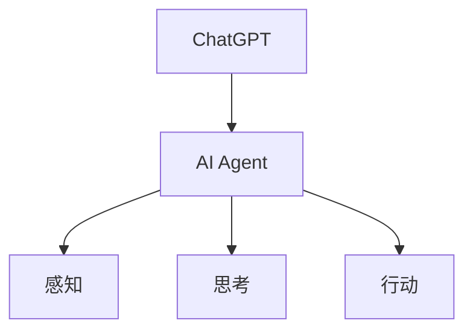

## 1.背景介绍

在过去的十年里，人工智能(AI)已经从科幻小说的概念进化为日常生活的一部分。从推荐系统，到语音和图像识别，再到自动驾驶汽车，AI已经在许多领域产生了重大影响。然而，这仅仅是开始。AI的下一个风口可能是AI Agent，一个能够理解和执行复杂任务的智能体。从ChatGPT到智能体，我们将探讨这个新兴领域的发展。

## 2.核心概念与联系

AI Agent是一种可以在环境中进行感知和行动的实体，其目标是通过执行一系列的动作来实现预设的目标。AI Agent的核心概念包括感知、思考和行动。感知是指AI Agent通过输入获取环境信息的过程，思考是指AI Agent根据输入信息做出决策的过程，而行动是指AI Agent执行决策的过程。

ChatGPT是一个基于GPT-3的聊天机器人，它可以理解和生成人类语言。ChatGPT是AI Agent的一个例子，它通过感知用户的输入，思考如何回应，然后行动生成回应。



## 3.核心算法原理具体操作步骤

AI Agent的核心算法可以分为三个步骤：感知、思考和行动。

1. **感知**：AI Agent通过输入获取环境信息。在ChatGPT中，这个过程是通过解析用户的输入实现的。

2. **思考**：AI Agent根据感知的信息做出决策。在ChatGPT中，这个过程是通过使用GPT-3模型生成回应的。

3. **行动**：AI Agent执行决策。在ChatGPT中，这个过程是通过返回生成的回应给用户实现的。

## 4.数学模型和公式详细讲解举例说明

在AI Agent中，我们可以使用马尔科夫决策过程(MDP)来描述其决策过程。MDP是一个五元组 $(S, A, P, R, \gamma)$，其中：

- $S$ 是状态空间，代表AI Agent可能遇到的所有情况。
- $A$ 是动作空间，代表AI Agent可以执行的所有动作。
- $P$ 是状态转移概率，$P(s'|s, a)$ 代表在状态 $s$ 下执行动作 $a$ 后转移到状态 $s'$ 的概率。
- $R$ 是奖励函数，$R(s, a, s')$ 代表在状态 $s$ 下执行动作 $a$ 并转移到状态 $s'$ 后得到的奖励。
- $\gamma$ 是折扣因子，用于调整未来奖励的重要性。

在ChatGPT中，我们可以将每个对话状态视为一个状态，每个可能的回应视为一个动作。然后，我们可以使用GPT-3模型来估计状态转移概率和奖励函数。

## 5.项目实践：代码实例和详细解释说明

假设我们要使用Python和transformers库来实现一个简单的ChatGPT。首先，我们需要安装transformers库：

```bash
pip install transformers
```

然后，我们可以使用以下代码来实现ChatGPT：

```python
from transformers import GPT2LMHeadModel, GPT2Tokenizer

tokenizer = GPT2Tokenizer.from_pretrained("gpt2")
model = GPT2LMHeadModel.from_pretrained("gpt2")

def chatGPT(input_text):
    inputs = tokenizer.encode(input_text, return_tensors='pt')
    outputs = model.generate(inputs, max_length=1000, do_sample=True)
    return tokenizer.decode(outputs[0])

print(chatGPT("Hello, world!"))
```

这段代码首先加载了GPT-2模型和对应的tokenizer，然后定义了一个chatGPT函数，该函数接受一个输入文本，然后使用GPT-2模型生成一个回应。最后，我们使用"Hello, world!"作为输入，然后打印出生成的回应。

## 6.实际应用场景

AI Agent可以在许多领域中找到应用，包括但不限于：

- **客户服务**：AI Agent可以作为自动客服，帮助公司处理大量的客户咨询。
- **个人助手**：AI Agent可以作为个人助手，帮助人们管理日常任务，例如设置提醒，回答问题等。
- **教育**：AI Agent可以作为虚拟教师，帮助学生学习新的知识。

## 7.工具和资源推荐

如果你对AI Agent感兴趣，以下是一些推荐的工具和资源：

- **transformers库**：一个Python库，提供了许多预训练的模型，包括GPT-3。
- **OpenAI API**：OpenAI的API提供了对GPT-3的访问，可以用于开发AI Agent。
- **Reinforcement Learning: An Introduction**：这本书是强化学习的经典入门书籍，可以帮助你理解AI Agent的理论基础。

## 8.总结：未来发展趋势与挑战

AI Agent是AI的一个新兴领域，它有着广阔的应用前景。然而，也存在许多挑战，包括如何理解复杂的任务，如何处理不确定性，如何保证AI Agent的行为符合道德和法律等。尽管如此，我相信随着技术的进步，我们将能够克服这些挑战，开创AI的新篇章。

## 9.附录：常见问题与解答

**Q: AI Agent和传统的AI有什么区别？**

A: 传统的AI通常专注于单一的任务，而AI Agent则需要理解和执行复杂的任务。此外，AI Agent还需要在环境中进行感知和行动，这是传统AI不具备的。

**Q: 我可以在哪里学习更多关于AI Agent的知识？**

A: 你可以查阅相关的书籍和在线课程，例如"Artificial Intelligence: A Modern Approach"和"Reinforcement Learning"。此外，OpenAI和DeepMind的博客也是很好的资源。

**Q: 如何评估AI Agent的性能？**

A: 评估AI Agent的性能通常需要定义一个目标或者奖励函数，然后观察AI Agent在实现这个目标或者获取奖励方面的表现。

作者：禅与计算机程序设计艺术 / Zen and the Art of Computer Programming