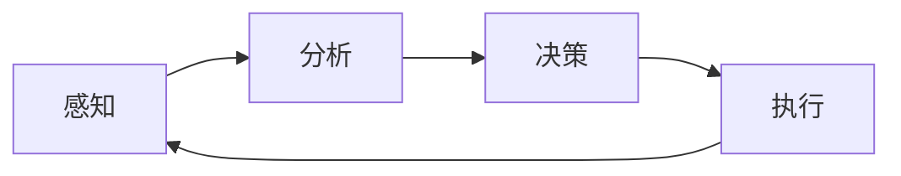

# AI人工智能代理工作流 AI Agent WorkFlow：在公关危机管理中的应用

## 1. 背景介绍

在当今瞬息万变的商业环境中,企业面临着各种各样的公关危机。这些危机可能源于产品质量问题、管理不善、负面舆情等多方面因素,如果处理不当,可能会对企业的声誉和业绩造成严重影响。传统的公关危机管理主要依赖于人工处理,存在反应速度慢、应对不及时等问题。随着人工智能技术的飞速发展,利用AI代理工作流来辅助甚至替代人工,实现公关危机的快速响应和有效管控,已经成为一种新的趋势和方向。

本文将重点探讨AI人工智能代理工作流在公关危机管理中的应用。首先介绍AI代理工作流的核心概念和基本原理,然后重点阐述其在公关危机管理各个环节中的具体应用,包括危机预警、快速响应、舆情监测、声誉修复等。同时给出相关的数学模型和算法,并提供代码实例加以说明。最后总结AI代理工作流在公关危机管理中的优势和挑战,展望其未来的发展前景。

## 2. 核心概念与联系

### 2.1 AI人工智能代理

人工智能代理(AI Agent)是一种基于人工智能技术,能够感知环境、分析数据、推理决策并采取行动的自主实体。它通过机器学习算法,从历史数据中学习和总结规律,具备一定程度的智能和自主能力。常见的AI Agent包括对话机器人、智能助手、自动驾驶汽车等。

### 2.2 工作流 Workflow 

工作流(Workflow)是一系列相互关联的任务和活动,按照一定的规则和流程自动执行,用于实现特定的业务目标。工作流管理系统根据预先定义好的流程模板,协调和调度各个任务,实现业务流程的自动化。

### 2.3 AI代理工作流

AI代理工作流是将AI Agent技术与工作流管理相结合的产物。通过将AI算法和模型嵌入到工作流的各个环节,赋予工作流以智能化的能力。AI Agent作为工作流的执行主体,通过感知、分析、决策、执行等步骤,自主地完成任务和目标。下图展示了一个典型的AI代理工作流架构:

### 2.4 公关危机管理

公关危机管理是指组织为预防和应对突发事件对组织声誉造成的负面影响而采取的管理行为。其目标是最大限度地减少危机对组织的伤害,尽快恢复正常运转,重塑良好形象。公关危机管理的主要任务包括:

- 危机预警:通过大数据分析等技术,提前发现潜在的危机信号。
- 快速响应:危机发生后,第一时间启动应急预案,控制事态蔓延。
- 舆情监测:实时监测网络舆情动向,了解危机影响和发展态势。
- 声誉修复:通过公关宣传和品牌重塑等手段,修复组织声誉。

### 2.5 AI代理工作流在公关危机管理中的价值

AI代理工作流可以为公关危机管理提供智能化、自动化的解决方案,具体体现在:

1. 提高预警能力:通过机器学习算法分析海量数据,及早识别危机征兆。
2. 加快响应速度:7x24小时不间断运行,快速启动应急处置流程。
3. 优化资源配置:自动协调各部门行动,提高危机处置效率。
4. 辅助决策制定:利用智能算法优化对策方案,为管理层决策提供支持。

## 3. 核心算法原理具体操作步骤

### 3.1 数据采集与预处理

AI代理工作流的首要任务是获取和理解所处的环境,因此需要从多渠道采集数据。在公关危机管理场景下,主要包括以下数据来源:

- 内部数据:如客户投诉、产品质检、员工反馈等。
- 外部数据:如媒体报道、网络舆情、行业资讯等。
- 结构化数据:如数据库、日志文件等。
- 非结构化数据:如文本、图像、音视频等。

采集到的原始数据往往含有噪声和冗余,需要进行预处理,主要步骤包括:

1. 数据清洗:去除缺失值、异常值等。
2. 数据集成:将异构数据源整合到统一的数据框架中。
3. 数据变换:对原始数据进行归一化、标准化等转换。
4. 数据简化:通过特征选择、降维等方法,提取数据的本质特征。

### 3.2 特征工程

为了让机器学习算法更好地理解数据,需要从原始数据中提取有效的特征。在公关危机管理中,可以提取的特征包括:

- 文本特征:如关键词频率、情感倾向、主题分布等。
- 时间特征:如事件发生时间、持续时长等。
- 传播特征:如传播速度、影响范围、参与人数等。
- 用户特征:如用户属性、历史行为等。

常用的特征提取方法包括:

- 文本挖掘:如TF-IDF、Word2Vec等。
- 时间序列分析:如移动平均、指数平滑等。
- 图挖掘:如PageRank、社区发现等。
- 统计分析:如相关性分析、因子分析等。

### 3.3 机器学习建模

利用提取的特征,可以训练机器学习模型,用于危机预警、舆情分析等任务。常用的机器学习算法包括:

- 分类算法:如逻辑回归、决策树、支持向量机等,用于危机分类。
- 聚类算法:如K-Means、DBSCAN等,用于事件聚类。
- 回归算法:如线性回归、随机森林等,用于影响评估。
- 深度学习:如CNN、RNN等,用于复杂特征的提取和建模。

以危机分类为例,其基本步骤如下:

1. 准备训练数据:收集历史危机事件,并标注危机类型。
2. 特征工程:提取事件的文本、时间、传播等特征。
3. 模型训练:使用分类算法如逻辑回归,训练危机分类模型。
4. 模型评估:使用交叉验证等方法,评估模型的准确率、召回率等指标。
5. 模型优化:通过特征选择、参数调优等方法,不断优化模型性能。
6. 模型应用:将训练好的模型部署到生产环境,对新的事件进行分类预警。

### 3.4 知识图谱构建

知识图谱是一种结构化的知识库,通过图的形式来表示实体及其关系。在公关危机管理中,可以构建危机事件知识图谱,涵盖事件、人物、组织、时间、地点等多维信息,挖掘事件背后的关联和因果。其基本构建步骤包括:

1. 实体抽取:从非结构化文本中识别出实体,如人名、地名等。
2. 关系抽取:从文本中抽取实体间的语义关系,如"导致"、"位于"等。
3. 知识融合:将抽取的实体和关系整合到统一的知识库中。
4. 知识推理:利用已有的知识,推理出新的隐含知识。

构建好的知识图谱可用于事理逻辑推理、因果分析等,辅助公关决策。例如通过知识图谱发现危机事件的关键人物和影响路径,有助于制定更加精准的应对策略。

## 4. 数学模型和公式详细讲解举例说明

### 4.1 TF-IDF文本特征提取

TF-IDF是一种常用的文本特征提取方法,用于评估词语对文本的重要程度。其中TF(Term Frequency)表示词频,IDF(Inverse Document Frequency)表示逆文档频率。二者的乘积TF-IDF可以很好地表征词语的特征。设词语 $t$ 在文本 $d$ 中的词频为 $tf_{t,d}$,文档总数为 $N$,包含词语 $t$ 的文档数为 $df_t$,则TF-IDF定义为:

$$
tfidf_{t,d} = tf_{t,d} \cdot log(\frac{N}{df_t})
$$

举例说明,假设语料库中有1000个文档,其中10个文档包含词语"危机",某篇文档 $d_1$ 中"危机"出现了5次,则:

- $tf_{危机,d_1} = 5$
- $N = 1000$
- $df_{危机} = 10$
- $tfidf_{危机,d_1} = 5 \cdot log(\frac{1000}{10}) = 5 \cdot 2 = 10$

可见"危机"这个词对于 $d_1$ 这篇文档的重要程度为10。通过计算文档中每个词的TF-IDF值,就可以得到文档的特征向量,用于后续的机器学习建模。

### 4.2 逻辑回归分类模型

逻辑回归是一种常用的分类算法,通过拟合样本特征到类别标签的映射函数,实现对新样本的预测。设样本特征向量为 $\boldsymbol{x} = (x_1,x_2,...,x_n)$,类别标签为 $y \in \{0,1\}$,逻辑回归的目标是学习一个参数向量 $\boldsymbol{w} = (w_1,w_2,...,w_n)$ 和偏置项 $b$,使得:

$$
P(y=1|\boldsymbol{x}) = \frac{1}{1+e^{-(\boldsymbol{w}^T\boldsymbol{x}+b)}}
$$

其中 $P(y=1|\boldsymbol{x})$ 表示在给定特征 $\boldsymbol{x}$ 的条件下,样本属于正例的概率。上式可以通过极大似然估计求解参数 $\boldsymbol{w}$ 和 $b$。

举例说明,假设提取了文本的TF-IDF特征向量 $\boldsymbol{x} = (1.5, 0.8, 2.0)$,并训练得到逻辑回归参数 $\boldsymbol{w} = (0.5, 1.2, -0.3)$, $b = -1.0$,则:

$$
\begin{aligned}
P(y=1|\boldsymbol{x}) &= \frac{1}{1+e^{-(0.5 \cdot 1.5 + 1.2 \cdot 0.8 - 0.3 \cdot 2.0 - 1.0)}} \\
&= \frac{1}{1+e^{-0.11}} \approx 0.53
\end{aligned}
$$

可见对于特征 $\boldsymbol{x} = (1.5, 0.8, 2.0)$ 的文本,模型预测其为正例(危机事件)的概率为0.53。

### 4.3 PageRank 重要度计算

PageRank是一种用于评估网络节点重要性的算法,通过随机游走的方式计算节点的得分。在公关危机管理中,可以利用PageRank算法评估危机事件的重要人物。设危机知识图谱包含 $n$ 个节点,节点 $i$ 的PageRank值为 $PR(i)$,节点 $i$ 有 $out(i)$ 条出边,指向节点 $j$ 的边权重为 $w_{ij}$,则PageRank值的计算公式为:

$$
PR(i) = \frac{1-d}{n} + d \sum_{j \in in(i)} \frac{PR(j)}{out(j)} w_{ji}
$$

其中 $d$ 为阻尼因子,一般取值0.85,表示随机游走过程中继续向前的概率。$in(i)$ 表示指向节点 $i$ 的节点集合。

举例说明,假设危机事件知识图谱中有5个节点,其中节点A分别指向节点B、C、D,节点B指向节点E,初始时每个节点的PageRank值为0.2,边权重均为1,则根据上式,第一轮迭代后各节点的PageRank值为:

$$
\begin{aligned}
PR(A) &= 0.15 / 5 = 0.03 \\
PR(B) &= 0.03 + 0.85 \cdot 0.2 / 3 = 0.0867 