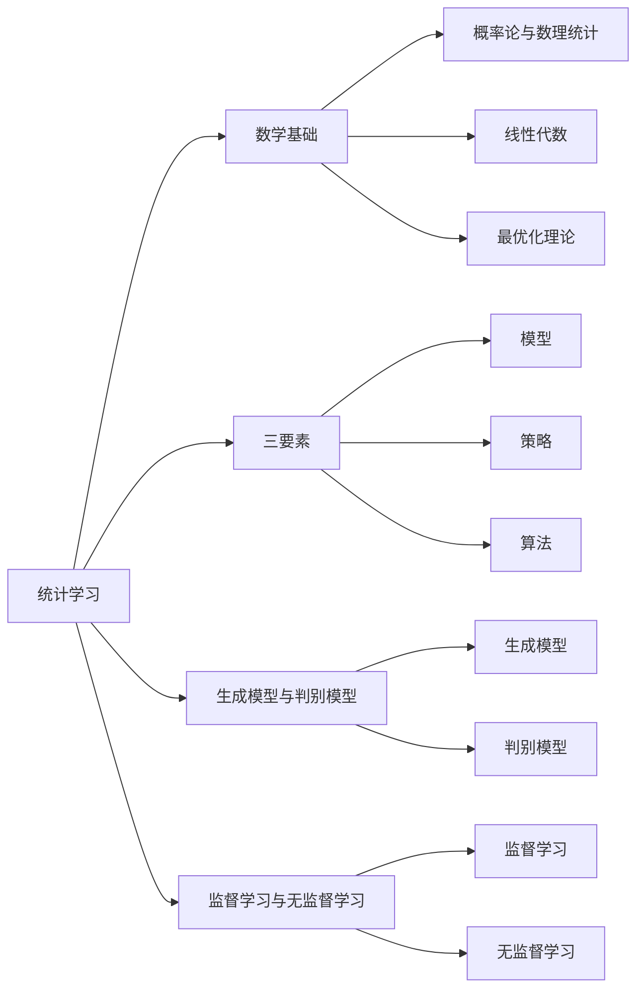

# AI人工智能核心算法原理与代码实例讲解：统计学习

## 1. 背景介绍

### 1.1 人工智能与机器学习的发展历程

人工智能（Artificial Intelligence，AI）自1956年达特茅斯会议提出以来，经历了从早期的符号主义、专家系统到机器学习和深度学习等阶段。其中，机器学习作为实现人工智能的重要途径，近年来取得了长足的进步。

### 1.2 统计学习在机器学习中的地位

统计学习（Statistical Learning）是机器学习的重要分支，它基于统计学原理，通过对数据进行建模，从而对未知数据进行预测和分析。统计学习主要包括监督学习、无监督学习、半监督学习、强化学习等范式。

### 1.3 统计学习的应用领域

统计学习在计算机视觉、自然语言处理、语音识别、推荐系统等领域有广泛应用，极大地推动了人工智能技术的发展和落地。

## 2. 核心概念与联系

### 2.1 统计学习的数学基础

- 概率论与数理统计
- 线性代数
- 最优化理论

### 2.2 统计学习的三要素

- 模型：对数据的数学抽象，用参数化的形式表示
- 策略：基于经验风险最小化或结构风险最小化的学习策略  
- 算法：模型的具体学习与计算方法，如梯度下降法

### 2.3 生成模型与判别模型

- 生成模型：对联合概率分布p(x,y)建模，如朴素贝叶斯、隐马尔可夫模型
- 判别模型：对条件概率分布p(y|x)建模，如logistic回归、支持向量机

### 2.4 监督学习与无监督学习

- 监督学习：训练数据带有标签，如分类、回归问题
- 无监督学习：训练数据无标签，如聚类、降维问题

## 3. 核心算法原理具体操作步骤

### 3.1 感知机 Perceptron

感知机是二分类的线性分类模型，通过误分类驱动的方式学习模型参数。

#### 感知机学习算法

输入：训练集 $T=\{(x_1,y_1),(x_2,y_2),...,(x_N,y_N)\}$，其中 $x_i \in \mathcal{X} = R^n, y_i \in \mathcal{Y}=\{-1,+1\}, i=1,2,...,N$

输出：感知机模型 $f(x)=sign(w \cdot x+b)$

1. 选取初值 $w_0, b_0$
2. 训练集中选取数据 $(x_i,y_i)$
3. 如果 $y_i(w \cdot x_i+b) \leq 0$
   - $w \leftarrow w+\eta y_i x_i$
   - $b \leftarrow b+\eta y_i$
4. 转至步骤2，直至训练集中没有误分类点

### 3.2 k近邻法 k-Nearest Neighbor

k近邻法是一种基本的分类与回归方法，它的基本思想是对于一个新的输入实例，在训练集中找到与其最邻近的k个实例，并基于它们的标签进行预测。

#### k近邻算法

输入：训练集 $T=\{(x_1,y_1),(x_2,y_2),...,(x_N,y_N)\}$，其中 $x_i \in \mathcal{X} = R^n, y_i \in \mathcal{Y}=\{c_1,c_2,...,c_K\}, i=1,2,...,N$

输出：实例 $x$ 所属的类别 $y$

1. 根据指定的距离度量，在训练集 $T$ 中找出与 $x$ 最邻近的 $k$ 个点，涵盖这 $k$ 个点的 $x$ 的邻域记作 $N_k(x)$
2. 在 $N_k(x)$ 中根据分类决策规则（如多数表决）决定 $x$ 的类别 $y$
   - $y=\arg\max_{c_j} \sum_{x_i \in N_k(x)} I(y_i=c_j), i=1,2,...,k$

### 3.3 朴素贝叶斯 Naive Bayes

朴素贝叶斯是基于贝叶斯定理与特征条件独立假设的分类方法。对于给定的训练集，首先基于特征条件独立假设学习输入/输出的联合概率分布，然后基于此模型，对给定的输入 $x$，利用贝叶斯定理求出后验概率最大的输出 $y$。

#### 朴素贝叶斯算法

输入：训练集 $T=\{(x_1,y_1),(x_2,y_2),...,(x_N,y_N)\}$，其中 $x_i=(x_i^{(1)},x_i^{(2)},...,x_i^{(n)})^T, y_i \in \{c_1,c_2,...,c_K\}, i=1,2,...,N$

输出：实例 $x$ 所属的类别 $y$

1. 计算先验概率及条件概率
   - $P(Y=c_k)=\frac{\sum_{i=1}^N I(y_i=c_k)}{N}, k=1,2,...,K$
   - $P(X^{(j)}=a_{jl}|Y=c_k)=\frac{\sum_{i=1}^N I(x_i^{(j)}=a_{jl},y_i=c_k)}{\sum_{i=1}^N I(y_i=c_k)}, j=1,2,...,n; l=1,2,...,S_j$
2. 对于给定的实例 $x=(x^{(1)},x^{(2)},...,x^{(n)})^T$，计算
   - $P(Y=c_k)\prod_{j=1}^n P(X^{(j)}=x^{(j)}|Y=c_k), k=1,2,...,K$
3. 确定实例 $x$ 的类别
   - $y=\arg\max_{c_k} P(Y=c_k)\prod_{j=1}^n P(X^{(j)}=x^{(j)}|Y=c_k)$

### 3.4 决策树 Decision Tree

决策树是一种基本的分类与回归方法，它可以看作if-then规则的集合，也可以认为是定义在特征空间划分上的类条件概率分布。

#### 决策树学习算法

输入：训练集 $D=\{(x_1,y_1),(x_2,y_2),...,(x_N,y_N)\}$，属性集 $A$，阈值 $\epsilon$

输出：决策树 $T$

1. 生成节点 $t$，计算训练集 $D$ 的纯度
   - 如果 $D$ 中所有实例属于同一类，将 $t$ 标记为该类叶节点，返回 $t$
   - 如果 $A=\emptyset$ 或 $D$ 中实例在 $A$ 上取值相同，将 $t$ 标记为叶节点，其类别标记为 $D$ 中实例数最多的类，返回 $t$
2. 从 $A$ 中选择最优划分属性 $a_*$
3. 对 $a_*$ 的每一个值 $a_*^v$
   - 为 $t$ 生成一个分支，令 $D_v$ 表示 $D$ 中在 $a_*$ 上取值为 $a_*^v$ 的实例子集
   - 如果 $D_v$ 为空，将分支节点标记为叶节点，其类别标记为 $D$ 中实例最多的类，返回
   - 否则，以 $TreeGenerate(D_v,A\setminus\{a_*\})$ 为分支节点
4. 返回 $t$

## 4. 数学模型和公式详细讲解举例说明

### 4.1 支持向量机 Support Vector Machine

支持向量机（SVM）是一种二分类模型，它的基本模型是定义在特征空间上的间隔最大的线性分类器，间隔最大使它有别于感知机；SVM还包括核技巧，这使它成为实质上的非线性分类器。

#### 线性可分支持向量机

给定线性可分训练集 $T=\{(x_1,y_1),(x_2,y_2),...,(x_N,y_N)\}$，其中 $x_i \in \mathcal{X}=R^n, y_i \in \mathcal{Y}=\{-1,+1\}, i=1,2,...,N$，求解约束最优化问题：

$$
\begin{aligned}
\min_{w,b} \quad & \frac{1}{2} \|w\|^2\\
s.t. \quad & y_i(w \cdot x_i+b) \geq 1, i=1,2,...,N
\end{aligned}
$$

求得最优解 $w^*,b^*$，得到线性可分支持向量机，分离超平面 $S: w^* \cdot x+b^*=0$，分类决策函数 $f(x)=sign(w^* \cdot x+b^*)$。

#### 软间隔支持向量机

对于线性不可分的情况，通过引入松弛变量 $\xi_i \geq 0$，使得部分样本允许分类错误，优化目标变为：

$$
\begin{aligned}
\min_{w,b,\xi} \quad & \frac{1}{2} \|w\|^2+C\sum_{i=1}^N \xi_i\\
s.t. \quad & y_i(w \cdot x_i+b) \geq 1-\xi_i, i=1,2,...,N\\
& \xi_i \geq 0, i=1,2,...,N
\end{aligned}
$$

其中 $C>0$ 为惩罚参数，$\xi_i$ 为第 $i$ 个样本的松弛变量。求解该优化问题可得软间隔支持向量机。

#### 非线性支持向量机

对于输入空间中的非线性分类问题，可以通过非线性变换将它转化为某个高维特征空间中的线性分类问题，在高维特征空间中学习线性支持向量机。

设原空间为 $\mathcal{X} \subset R^n$，新空间为 $\mathcal{Z} \subset R^m$，$m>n$，定义从原空间到新空间的变换 $\phi(x): \mathcal{X} \rightarrow \mathcal{Z}$，新空间的内积 $\langle \phi(x),\phi(z)\rangle$ 通过核函数 $\kappa(x,z)=\langle \phi(x),\phi(z)\rangle$ 计算，则非线性支持向量机的优化问题变为：

$$
\begin{aligned}
\min_{w,b,\xi} \quad & \frac{1}{2} \|w\|^2+C\sum_{i=1}^N \xi_i\\
s.t. \quad & y_i(w \cdot \phi(x_i)+b) \geq 1-\xi_i, i=1,2,...,N\\
& \xi_i \geq 0, i=1,2,...,N
\end{aligned}
$$

求解后得到非线性支持向量机 $f(x)=sign(\sum_{i=1}^N \alpha_i^* y_i \kappa(x,x_i)+b^*)$。

### 4.2 提升方法 Boosting

提升（boosting）方法是一种常用的统计学习方法，在分类问题中，它通过改变训练样本的权重，学习多个分类器，并将这些分类器进行线性组合，提高分类的性能。

#### AdaBoost算法

输入：训练集 $T=\{(x_1,y_1),(x_2,y_2),...,(x_N,y_N)\}$，其中 $x_i \in \mathcal{X}, y_i \in \mathcal{Y}=\{-1,+1\}, i=1,2,...,N$；弱学习算法；迭代次数 $M$

输出：最终分类器 $G(x)$

1. 初始化训练数据的权值分布 $D_1=(w_{11},w_{12},...,w_{1N})$，其中 $w_{1i}=\frac{1}{N}, i=1,2,...,N$
2. 对 $m=1,2,...,M$
   1. 使用具有权值分布 $D_m$ 的训练集学习，得到基本分类器 $G_m(x): \mathcal{X} \rightarrow \{-1,+1\}$
   2.