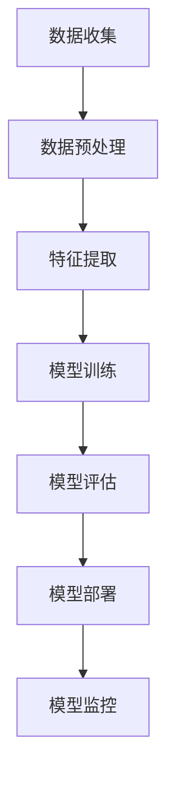

## 1. 背景介绍

人工智能（Artificial Intelligence，简称AI）作为一种新兴技术，在各个领域取得了显著的进展。然而，AI系统的可靠性仍然是人们关注的重点之一。为了确保AI技术的可持续发展，需要对AI可靠性进行法律法规和政策分析。

## 2. 核心概念与联系

在本文中，我们将讨论AI可靠性、法律法规和政策之间的关系。我们将从以下几个方面进行分析：

1. AI可靠性：AI可靠性是指AI系统能够在特定环境下满足预期功能和性能的能力。可靠性是评估AI系统质量的一个重要指标。
2. 法律法规：法律法规是国家和地区为了维护社会秩序、保障公民权益而制定的规则和规定。AI领域的法律法规主要包括数据保护、隐私权、责任等方面。
3. 政策：政策是政府为了实现特定目标而制定的计划和措施。AI领域的政策主要包括技术创新、产业发展、人才培养等方面。

## 3. 核心算法原理具体操作步骤

在分析AI可靠性时，我们需要了解其核心算法原理和具体操作步骤。以下是一个简单的AI算法流程图：



## 4. 数学模型和公式详细讲解举例说明

在AI领域，数学模型和公式是理解AI可靠性的关键。以下是一个简单的数学公式示例：

$$
R = \frac{TP}{TP + FP}
$$

其中，R表示可靠性，TP表示真阳性，FP表示假阳性。

## 5. 项目实践：代码实例和详细解释说明

为了帮助读者更好地理解AI可靠性，我们将通过一个项目实践案例进行讲解。以下是一个简单的代码示例：

```python
import numpy as np
from sklearn.metrics import accuracy_score

def train_model(X, y):
    # train model logic here
    pass

def evaluate_model(model, X, y):
    y_pred = model.predict(X)
    accuracy = accuracy_score(y, y_pred)
    return accuracy

X, y = load_data()
model = train_model(X, y)
accuracy = evaluate_model(model, X, y)
print("Model accuracy: {:.2f}%".format(accuracy * 100))
```

## 6. 实际应用场景

AI可靠性在实际应用场景中具有重要意义。以下是一些典型的应用场景：

1. 医疗诊断：AI可靠性在医疗诊断领域具有重要价值，用于辅助医生进行诊断和治疗。
2. 自动驾驶：AI可靠性在自动驾驶领域是一个关键因素，直接影响安全性和效率。
3. 金融风险管理：AI可靠性在金融风险管理中可以帮助识别潜在风险并采取相应措施。

## 7. 工具和资源推荐

为了帮助读者更好地了解AI可靠性，我们推荐以下工具和资源：

1. TensorFlow：一个开源的机器学习框架，提供了丰富的工具和功能，方便开发者构建AI系统。
2. Scikit-learn：一个用于机器学习的Python库，提供了许多常用的算法和工具。
3. Coursera：一个提供在线课程的平台，包含许多关于AI可靠性和相关技术的课程。

## 8. 总结：未来发展趋势与挑战

AI可靠性是AI技术发展的重要方向之一。在未来，AI可靠性将受到更高的关注和要求。以下是一些未来发展趋势和挑战：

1. 数据驱动的决策：AI可靠性在数据驱动决策方面具有重要价值，可以帮助企业和政府做出更明智的决策。
2. 人工智能安全：AI可靠性在人工智能安全方面是一个关键因素，需要不断创新和优化。
3. 法律法规与政策制定：AI领域的法律法规和政策制定将对AI可靠性产生重要影响，需要持续关注和研究。

## 9. 附录：常见问题与解答

在本文中，我们讨论了AI可靠性、法律法规和政策之间的关系，并分析了AI可靠性在实际应用场景中的重要性。以下是一些常见问题和解答：

1. AI可靠性如何与法律法规和政策相关？AI可靠性在法律法规和政策制定中具有重要作用，需要不断关注和研究。
2. 如何提高AI可靠性？提高AI可靠性需要不断创新和优化算法原理、数学模型和代码实现等方面。
3. AI可靠性在未来将如何发展？AI可靠性将受到更高的关注和要求，需要持续关注和研究。

作者：禅与计算机程序设计艺术 / Zen and the Art of Computer Programming