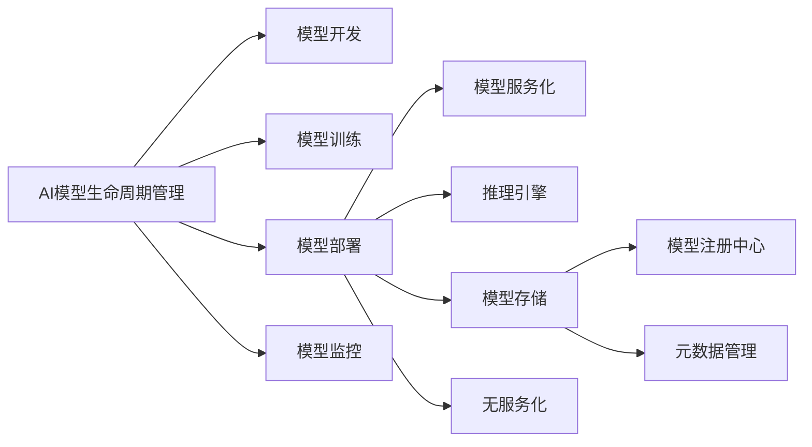

# AI模型部署到云原理与代码实战案例讲解

## 1. 背景介绍

### 1.1 AI模型部署的重要性

在人工智能的快速发展中,模型训练只是AI应用落地的第一步。如何将训练好的AI模型高效、稳定、安全地部署到生产环境中,并提供可靠的服务,是实现AI价值的关键。云计算的发展为AI模型部署提供了理想的平台,利用云平台的弹性计算、存储和网络资源,可以快速搭建AI模型服务,实现弹性伸缩和高可用。

### 1.2 云原生技术的兴起

近年来,以容器、微服务、DevOps为代表的云原生技术蓬勃发展,为应用开发部署带来了革命性变化。将AI模型容器化并采用云原生架构进行部署,可以充分利用云原生的优势,如服务化、声明式API、不可变基础设施等,实现AI模型的敏捷开发、持续集成与部署。

### 1.3 AI模型部署面临的挑战

尽管云计算和云原生为AI模型部署提供了便利,但实践中仍面临诸多挑战:

- 模型适配:不同框架训练的模型,需要进行统一格式转换,适配在线推理引擎
- 资源调度:AI模型对算力、内存等资源要求较高,需要合理调度和隔离
- 伸缩性:AI服务的访问量变化较大,需要能够弹性伸缩以应对流量高峰
- 版本管理:频繁迭代的模型版本,需要进行有效管理,并支持灰度发布和回滚
- 监控运维:需要对AI服务进行全方位监控,快速发现和定位问题,保障服务稳定性

本文将系统介绍AI模型部署到云的原理和最佳实践,并结合代码实战案例,为你揭示云上AI模型部署的方方面面。

## 2. 核心概念与联系

### 2.1 AI模型生命周期管理

端到端的AI模型生命周期管理,涵盖了模型开发、训练、部署、监控等各个环节。其中模型部署是连接模型训练和应用服务的关键环节,直接影响AI的落地价值。

### 2.2 模型服务化

将训练好的AI模型包装为标准的服务接口,如REST API或gRPC,可以实现模型能力的复用和组合。服务化是云原生架构的核心理念,让AI模型与具体框架和环境解耦,更易于集成和迁移。

### 2.3 推理引擎

推理引擎负责加载AI模型并提供在线推理服务,对低延迟、高并发和可伸缩性有较高要求。常见的推理引擎有TensorFlow Serving、TorchServe、ONNX Runtime、Triton Inference Server等。

### 2.4 模型存储

训练好的模型文件,需要有一个集中的模型存储,用于存储、版本管理和分发。模型注册中心和元数据管理,是模型存储的重要组成部分。

### 2.5 无服务化

Serverless 是一种云原生的计算范式,让用户聚焦于核心代码,而无需关心服务器资源。将AI推理服务部署为Serverless服务,可以实现自动、按需的弹性伸缩,大幅降低运维成本。

### 2.6 核心概念关系图

下面使用Mermaid流程图,展示以上核心概念之间的关系:



从上图可见,AI模型部署处于AI模型生命周期的核心环节,通过模型服务化、推理引擎、模型存储和无服务化等关键技术,打通了AI模型从训练到服务的通路,让AI模型在云上落地开花。

## 3. 核心算法原理与具体操作步骤

### 3.1 模型格式转换

不同框架训练的模型,其格式和部署方式差异较大。因此部署前,需要将模型转换为通用的中间格式,如ONNX(Open Neural Network Exchange)。

以TensorFlow模型转ONNX为例,核心步骤如下:

1. 保存TensorFlow训练图
2. 冻结图中的变量
3. 转换为ONNX格式
4. 优化ONNX模型
5. 测试转换后的ONNX模型

### 3.2 模型量化

模型量化是指将模型权重和激活从浮点数(如FP32)转换为低比特定点数(如INT8),可以减小模型体积,提高推理性能,降低内存占用。

常见的量化算法有:

- 静态量化:事先收集小批量数据,离线计算量化参数,然后在推理时直接使用
- 动态量化:在模型推理时,根据输入数据动态计算量化参数
- 量化感知训练:在模型训练时就考虑量化因素,端到端优化量化精度

### 3.3 模型优化

除了量化之外,还可以采取一些模型优化手段,在尽量保证精度的同时,提升推理性能,如:

- 模型剪枝:去掉冗余和不重要的神经元连接
- 低秩近似:用若干个低秩矩阵,近似大的二维矩阵
- 知识蒸馏:用复杂教师模型,蒸馏训练一个小型学生模型

### 3.4 模型容器化

将模型和推理引擎打包为Docker镜像,可以实现"一次构建,随处运行",屏蔽底层环境差异。模型容器化的步骤如下:

1. 编写模型服务代码
2. 准备模型文件
3. 编写Dockerfile
4. 构建Docker镜像
5. 推送镜像到镜像仓库

### 3.5 模型服务编排

当有多个模型服务需要协同工作时,可以采用Kubernetes等容器编排平台进行声明式管理。通过编写YAML文件,定义模型服务的部署规格、资源需求、弹性策略等,实现全自动化的模型服务编排。

## 4. 数学模型和公式详细讲解举例说明

### 4.1 模型量化中的数学原理

以对称量化为例,其核心是将浮点数线性映射到定点数:

$$
Q = round(\frac{R}{S}) = round(\frac{R}{\frac{max(abs(R))}{2^{n-1} - 1}})
$$

其中:
- Q是量化后的定点数
- R是量化前的浮点数
- S是量化比例因子
- n是定点数的比特数

反量化公式为:

$$
R^{*} = Q \times S
$$

其中$R^{*}$是反量化后的浮点数,与$R$近似。

举例说明:
假设有浮点数序列$R=[-0.9, 1.2, 3.4, 0.2, -2.5]$,要求量化为8比特有符号整数。

首先计算量化比例因子:

$$
S = \frac{max(abs(R))}{2^{8-1} - 1} = \frac{3.4}{127} \approx 0.0268
$$

然后逐个量化每个浮点数:

$$
\begin{aligned}
Q_1 &= round(\frac{-0.9}{0.0268}) = -34 \\
Q_2 &= round(\frac{1.2}{0.0268}) = 45 \\
Q_3 &= round(\frac{3.4}{0.0268}) = 127 \\
Q_4 &= round(\frac{0.2}{0.0268}) = 7 \\
Q_5 &= round(\frac{-2.5}{0.0268}) = -93
\end{aligned}
$$

可见,量化后的定点数范围在[-128, 127]之间。

反量化时,用量化后的定点数乘以比例因子,即可近似恢复原浮点数:

$$
\begin{aligned}
R_1^{*} &= -34 \times 0.0268 = -0.9112 \approx -0.9 \\  
R_2^{*} &= 45 \times 0.0268 = 1.206 \approx 1.2\\
R_3^{*} &= 127 \times 0.0268 = 3.4036 \approx 3.4\\
R_4^{*} &= 7 \times 0.0268 = 0.1876 \approx 0.2\\
R_5^{*} &= -93 \times 0.0268 = -2.4924 \approx -2.5
\end{aligned}
$$

可见,量化和反量化会带来一定的精度损失,但大大减小了数据位宽。在实际应用中,需要在模型精度和性能之间寻求平衡。

## 5. 项目实践:代码实例和详细解释说明

下面以MNIST手写数字识别为例,演示如何使用TensorFlow 2.0训练模型,并转换为ONNX格式进行部署。

### 5.1 模型训练

```python
import tensorflow as tf

# 加载MNIST数据集
mnist = tf.keras.datasets.mnist
(x_train, y_train), (x_test, y_test) = mnist.load_data()

# 图像归一化
x_train, x_test = x_train / 255.0, x_test / 255.0

# 构建模型
model = tf.keras.models.Sequential([
    tf.keras.layers.Flatten(input_shape=(28, 28)),
    tf.keras.layers.Dense(128, activation='relu'),
    tf.keras.layers.Dropout(0.2),
    tf.keras.layers.Dense(10, activation='softmax')
])

# 编译模型
model.compile(optimizer='adam',
              loss='sparse_categorical_crossentropy',
              metrics=['accuracy'])

# 训练模型
model.fit(x_train, y_train, epochs=5)

# 评估模型
model.evaluate(x_test,  y_test, verbose=2)

# 保存模型
model.save("mnist_model")
```

### 5.2 模型转换

安装tf2onnx:
```
pip install tf2onnx
```

加载并转换TensorFlow模型:

```python
import onnx
from tf2onnx import convert

# 加载TensorFlow模型
model_path = "mnist_model"

# 设置输入输出节点
spec = (
    tf.TensorSpec((None, 28, 28), tf.float32, name="input"),
    tf.TensorSpec((None, 10), tf.float32, name="output")
)

# 转换模型
onnx_model, _ = convert.from_keras(model_path, spec, opset=13)

# 优化模型
passes = ["extract_constant_to_initializer", "eliminate_unused_initializer"]
optimized_model = onnx.optimizer.optimize(onnx_model, passes)

# 保存ONNX模型 
onnx.save(optimized_model, "mnist_model.onnx")
```

### 5.3 模型部署

编写模型服务代码`app.py`:

```python
import onnxruntime as ort
from PIL import Image
import numpy as np
from flask import Flask, request, jsonify

app = Flask(__name__)

# 加载ONNX模型
ort_session = ort.InferenceSession("mnist_model.onnx")

def preprocess(img):
    """图像预处理"""
    img = img.resize((28, 28))
    img = img.convert('L')
    img = np.array(img, dtype=np.float32)
    img = img / 255.0
    img = np.expand_dims(img, axis=0)
    return img
    
@app.route("/predict", methods=["POST"])
def predict():
    # 获取上传的图片
    file = request.files['image']
    img = Image.open(file.stream)
    
    # 图像预处理
    input_data = preprocess(img)
    
    # 模型推理
    ort_inputs = {ort_session.get_inputs()[0].name: input_data}
    ort_outputs = ort_session.run(None, ort_inputs)
    
    # 处理预测结果
    pred = np.argmax(ort_outputs[0], axis=1)[0]
    
    return jsonify({'prediction': int(pred)})

if __name__ == "__main__":
    app.run(host='0.0.0.0', port=5000)
```

编写Dockerfile:

```dockerfile
FROM python:3.8-slim

WORKDIR /app

COPY requirements.txt ./
RUN pip install --no-cache-dir -r requirements.txt

COPY ./mnist_model.onnx /app/mnist_model.onnx
COPY ./app.py /app/app.py

CMD ["python", "app.py"]
```

构建并运行Docker镜像:

```bash
# 构建镜像
docker build -t mnist-serving .

# 运行容器
docker run -p 5000:5000 mnist-serving
```

现在,手写数字识别服务已经在本地的5000端口启动。可以通过HTTP POST请求`http://localhost:5000/predict