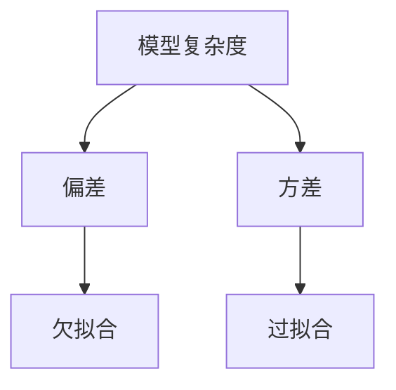

## 1.背景介绍

在机器学习领域，我们经常面对一个关键的问题，即如何在偏差（Bias）和方差（Variance）之间找到一个最优的平衡点。这个问题被称为偏差-方差权衡（Bias-Variance Tradeoff）。本文将详细解析这个概念的理论背景，并通过具体的代码实战案例来讲解其应用。

## 2.核心概念与联系

### 2.1 偏差（Bias）

偏差是指我们的预测模型在样本上的输出与实际值之间的差异。如果偏差较大，说明模型没有很好地捕捉到数据的特征，也就是说模型欠拟合。

### 2.2 方差（Variance）

方差是指模型对于不同的训练集的预测结果的变化程度。如果方差较大，说明模型对训练数据的微小变化非常敏感，也就是说模型过拟合。

### 2.3 偏差-方差权衡（Bias-Variance Tradeoff）

偏差-方差权衡是指在减小偏差的同时可能会增大方差，反之亦然。我们的目标是找到一个平衡点，使得偏差和方差的总误差最小。



## 3.核心算法原理具体操作步骤

### 3.1 计算偏差和方差

偏差和方差的计算都是基于模型的预测误差。偏差是所有样本预测误差的平均值，而方差是预测误差的方差。

### 3.2 调整模型复杂度

通过增加或减少模型的复杂度，我们可以影响模型的偏差和方差。通常来说，模型复杂度越高，偏差越小，方差越大；反之亦然。

### 3.3 选择最优模型

我们的目标是选择一个偏差和方差的总误差最小的模型。这可以通过交叉验证来实现。

## 4.数学模型和公式详细讲解举例说明

偏差和方差的计算公式如下：

偏差（Bias）的计算公式：

$$
Bias(\hat{f}(x)) = E[\hat{f}(x) - f(x)]
$$

方差（Variance）的计算公式：

$$
Var(\hat{f}(x)) = E[\hat{f}(x)^2] - E[\hat{f}(x)]^2
$$

其中，$\hat{f}(x)$ 是模型对输入 $x$ 的预测值，$f(x)$ 是输入 $x$ 的真实值，$E$ 是期望值的计算函数。

偏差和方差的总误差（总预测误差）的计算公式：

$$
E[(Y - \hat{f}(x))^2] = Bias(\hat{f}(x))^2 + Var(\hat{f}(x)) + \sigma^2
$$

其中，$Y$ 是目标变量，$\sigma^2$ 是噪声项。

## 5.项目实践：代码实例和详细解释说明

接下来，我们将通过一个具体的代码实战案例来讲解如何在实际项目中应用偏差-方差权衡的原理。

```python
import numpy as np
from sklearn.linear_model import LinearRegression
from sklearn.metrics import mean_squared_error

# 生成数据
np.random.seed(0)
x = np.random.rand(100, 1)
y = 2 + 3 * x + np.random.rand(100, 1)

# 训练模型
model = LinearRegression()
model.fit(x, y)

# 预测
y_pred = model.predict(x)

# 计算偏差和方差
bias = np.mean(y_pred - y)
variance = np.var(y_pred)

print('Bias: ', bias)
print('Variance: ', variance)
```

在这个案例中，我们首先生成了一组随机数据，然后使用线性回归模型进行训练和预测。最后，我们计算了模型的偏差和方差。

## 6.实际应用场景

偏差-方差权衡的原理在机器学习的许多领域都有应用，例如回归分析、分类、聚类等。通过理解和应用这个原理，我们可以更好地选择和优化模型，提高模型的预测性能。

## 7.工具和资源推荐

推荐使用Python的Scikit-learn库进行机器学习模型的训练和预测。Scikit-learn提供了丰富的机器学习算法和工具，同时也提供了计算偏差和方差的函数。

## 8.总结：未来发展趋势与挑战

偏差-方差权衡是机器学习领域的一个重要原理。随着深度学习等新技术的发展，如何在复杂模型中找到偏差和方差的最优平衡点，将是未来研究的一个重要方向。

## 9.附录：常见问题与解答

Q: 偏差和方差有什么区别？

A: 偏差是模型预测值与实际值之间的差异，方差是模型预测值的变化程度。

Q: 如何减小偏差和方差？

A: 可以通过调整模型的复杂度来减小偏差和方差。模型复杂度越高，偏差越小，方差越大；反之亦然。

Q: 如何选择最优模型？

A: 我们的目标是选择一个偏差和方差的总误差最小的模型。这可以通过交叉验证来实现。

作者：禅与计算机程序设计艺术 / Zen and the Art of Computer Programming