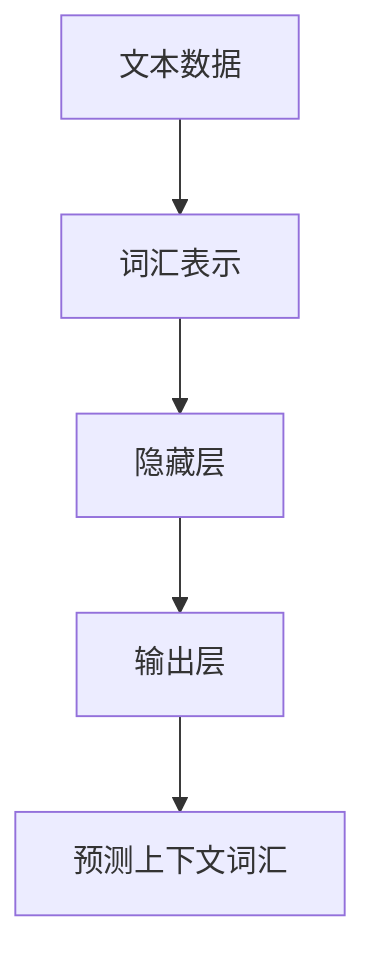

## 背景介绍
Word2Vec是近年来在自然语言处理领域引起广泛关注的技术之一，它能够将文本数据映射到一个连续的向量空间，从而捕捉到词汇间的语义关系。Word2Vec的核心思想是通过一种神经网络结构来学习文本数据中的词汇表示，从而实现文本数据的聚类分析。下面我们将深入探讨Word2Vec的原理、算法、实现以及实际应用场景。
## 核心概念与联系
Word2Vec主要包括两种网络结构：Continuous Bag-of-Words（CBOW）和Skip-gram。CBOW网络结构是一种上下文词汇预测模型，它将一个词汇作为输入，预测其附近的词汇；Skip-gram则是相反的网络结构，它将一个词汇作为输入，预测其附近的词汇。两种网络结构都使用一种神经网络结构来学习词汇表示，其中隐藏层使用线性激活函数，输出层使用softmax激活函数。下面我们将分别深入探讨CBOW和Skip-gram的原理和实现方法。
## CBOW原理与实现
CBOW网络结构使用多个输入单元，分别对应文本数据中的每个词汇。这些输入单元通过一个权重矩阵相互连接，形成一个隐藏层。隐藏层使用线性激活函数进行处理，然后通过另一个权重矩阵连接到输出层。输出层使用softmax激活函数，对输入词汇的上下文词汇进行预测。CBOW网络结构的目标是最小化预测错误率，从而学习词汇间的语义关系。下面是CBOW网络结构的Mermaid流程图：

## Skip-gram原理与实现
Skip-gram网络结构使用单个输入单元，对输入词汇的上下文词汇进行预测。与CBOW不同，Skip-gram使用负采样来减少计算量。Skip-gram网络结构的目标同样是最小化预测错误率，从而学习词汇间的语义关系。下面是Skip-gram网络结构的Mermaid流程图：

## 数学模型和公式详细讲解举例说明
Word2Vec的数学模型主要包括两个部分：隐藏层的线性激活函数和输出层的softmax激活函数。隐藏层的线性激活函数可以表示为：
$$
h_i = \sum_{j=1}^{N} w_{ij}x_j
$$
其中 $h_i$ 是隐藏层的输出，$N$ 是输入单元的数量，$w_{ij}$ 是隐藏层的权重矩阵，$x_j$ 是输入单元的输出。输出层的softmax激活函数可以表示为：
$$
p(w_o|w_i) = \frac{exp(v_{wo}^T v_i)}{\sum_{k=1}^{M} exp(v_{ko}^T v_i)}
$$
其中 $p(w_o|w_i)$ 是输出层的预测概率，$M$ 是输出单元的数量，$v_{wo}$ 和 $v_{ko}$ 是输出层的权重矩阵，$v_i$ 是输入单元的输出。通过最小化预测错误率，可以学习词汇间的语义关系。
## 项目实践：代码实例和详细解释说明
在本节中，我们将使用Python和gensim库来实现Word2Vec。首先，我们需要准备一个文本数据集。假设我们有一个名为"text.txt"的文本文件，其中包含以下内容：
```
hello world hello world
hello hello hello
world world world
```
接下来，我们使用gensim库来实现Word2Vec。首先，我们需要安装gensim库：
```bash
pip install gensim
```
然后，我们可以使用以下代码来实现Word2Vec：
```python
from gensim.models import Word2Vec

# 加载文本数据
sentences = [['hello', 'world', 'hello', 'world'],
             ['hello', 'hello', 'hello'],
             ['world', 'world', 'world']]

# 创建Word2Vec模型
model = Word2Vec(sentences, vector_size=100, window=5, min_count=1, workers=4)

# 保存Word2Vec模型
model.save("word2vec.model")
```
以上代码首先加载文本数据，然后创建一个Word2Vec模型。最后，我们将Word2Vec模型保存到文件中。接下来，我们可以使用以下代码来加载Word2Vec模型，并查看某个词汇的表示：
```python
# 加载Word2Vec模型
model = Word2Vec.load("word2vec.model")

# 查看某个词汇的表示
print(model.wv['hello'])
```
## 实际应用场景
Word2Vec的实际应用场景非常广泛，可以用于文本分类、文本聚类、文本推荐等。例如，在文本分类中，我们可以使用Word2Vec来学习文本数据的词汇表示，然后使用聚类算法来将文本数据划分为不同的类别。在文本聚类中，我们可以使用Word2Vec来学习文本数据的词汇表示，然后使用聚类算法来将文本数据划分为不同的类别。在文本推荐中，我们可以使用Word2Vec来学习文本数据的词汇表示，然后使用推荐算法来推荐给用户。
## 工具和资源推荐
在学习Word2Vec时，你可能会需要一些工具和资源。以下是一些推荐：
1. **gensim库**：gensim库是一个Python库，提供了Word2Vec等自然语言处理算法的实现。gensim库的文档可以在[这里](http://radimrehurek.com/gensim/)找到。
2. **TensorFlow**：TensorFlow是一个开源的机器学习框架，可以用于实现Word2Vec等深度学习算法。TensorFlow的文档可以在[这里](https://www.tensorflow.org/)找到。
3. **Word2Vec在线教程**：Word2Vec官方网站提供了一个在线教程，可以帮助你更好地了解Word2Vec。教程可以在[这里](https://code.google.com/archive/p/word2vec/)找到。
## 总结：未来发展趋势与挑战
Word2Vec是一种具有广泛应用前景的技术，未来将在各种自然语言处理任务中发挥重要作用。然而，Word2Vec也面临着一些挑战，如计算资源的需求、数据稀疏的问题等。未来，研究人员将继续探索新的算法和方法，以解决这些挑战，并推动Word2Vec在各种应用场景中的更广泛应用。
## 附录：常见问题与解答
在学习Word2Vec时，你可能会遇到一些常见的问题。以下是一些常见问题与解答：
1. **Q：Word2Vec的性能如何？**
A：Word2Vec在许多自然语言处理任务中表现出色，例如文本聚类、文本分类等。然而，Word2Vec并不是万能的，在某些任务中可能需要使用其他算法或方法。
2. **Q：Word2Vec的计算复杂度如何？**
A：Word2Vec的计算复杂度取决于输入单元的数量和隐藏层的大小。Word2Vec的计算复杂度通常较高，需要大量的计算资源。
3. **Q：Word2Vec如何处理词汇不在训练数据中的情况？**
A：Word2Vec使用负采样来处理词汇不在训练数据中的情况。在训练过程中，Word2Vec会随机选择一些词汇作为负采样，避免过于依赖训练数据中的词汇。
4. **Q：Word2Vec如何处理长文本的情况？**
A：Word2Vec主要处理短文本的情况。在处理长文本时，需要将长文本划分为多个短文本，然后将这些短文本作为输入进行训练。