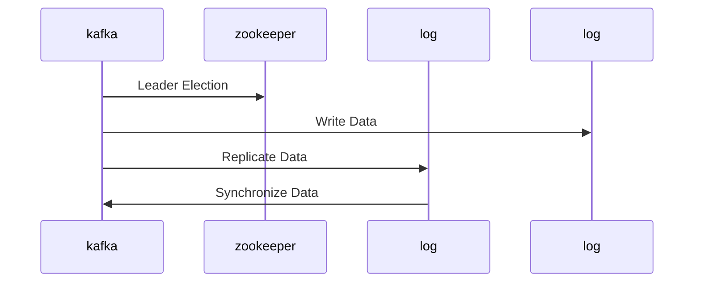

## 背景介绍

Apache Kafka 是一个分布式流处理平台，它提供了高吞吐量、低延迟和可扩展的数据流处理能力。Kafka 的复制机制是其核心组件之一，保证了系统的可用性和数据的持久性。本篇文章将从原理和代码实例两个方面详细讲解 Kafka 的复制机制。

## 核心概念与联系

Kafka 的复制机制主要包括以下几个环节：

1. **Leader Election**: 每个 topic partition 都有一个 leader, leader 是负责处理读写请求的。Kafka 使用 Zookeeper 来选举 leader。
2. **Log Replication**: leader 负责将写入的数据持久化到自己的 log, 同时将数据复制到 follower 的 log。
3. **Log Synchronization**: follower 需要与 leader 进行同步, 以确保数据的一致性。

下面是 Kafka Replication 的 Mermaid 流程图：



## 核心算法原理具体操作步骤

### Leader Election

Kafka 使用 Zookeeper 来进行 leader 选举。Zookeeper 提供了一个简单的选举算法，基于 Paxos 算法。选举过程如下：

1. 每个 partition 的 replicas 都会向 Zookeeper 发送一个选票。
2. Zookeeper 根据选票中的 majority (大多数) 选出新的 leader。
3. 新的 leader 将向其他 replicas 发送一个广播，通知它们自己是新的 leader。

### Log Replication

leader 负责将写入的数据持久化到自己的 log，并将数据复制到 follower 的 log。复制过程如下：

1. client 写入数据后，leader 会将数据写入自己的 log。
2. leader 写入数据后，会将数据发送给所有 follower。
3. follower 收到数据后，将数据写入自己的 log。

### Log Synchronization

follower 需要与 leader 进行同步，以确保数据的一致性。同步过程如下：

1. leader 会将自己的 log 中的数据发送给 follower。
2. follower 收到数据后，会将数据写入自己的 log。
3. follower 会向 leader 发送一个 ack，确认数据已写入。

## 数学模型和公式详细讲解举例说明

Kafka 的复制机制并不涉及复杂的数学模型和公式。主要是基于 Zookeeper 进行 leader 选举，然后通过网络复制数据。

## 项目实践：代码实例和详细解释说明

Kafka 的复制机制主要涉及到 Zookeeper 和 Kafka 的代码。以下是一个简化的代码示例：

```java
// Zookeeper
public class Zookeeper {
    public void electLeader() {
        // ... Zookeeper 选举 leader 的代码 ...
    }
}

// Kafka
public class Kafka {
    private Zookeeper zookeeper;
    private List<Log> logs;

    public Kafka(Zookeeper zookeeper, List<Log> logs) {
        this.zookeeper = zookeeper;
        this.logs = logs;
    }

    public void writeData(String data) {
        // ... 写入数据的代码 ...
    }

    public void replicateData(Log log) {
        // ... 复制数据的代码 ...
    }

    public void synchronizeData(Log log) {
        // ... 同步数据的代码 ...
    }
}
```

## 实际应用场景

Kafka 的复制机制广泛应用于大数据处理、实时数据流处理等场景。例如，Kafka 可以用于实时数据分析、实时推荐、日志收集等。

## 工具和资源推荐

- [Apache Kafka 官方文档](https://kafka.apache.org/documentation/)
- [Kafka Tutotial](https://kafka-tutorial.howtographql.com/)
- [Kafka: The Definitive Guide](https://www.oreilly.com/library/view/kafka-the-definitive/9781491970110/)

## 总结：未来发展趋势与挑战

Kafka 的复制机制已经成为其核心组件之一，保证了系统的可用性和数据的持久性。未来，Kafka 的复制机制将会继续发展，更加高效和可靠。同时，Kafka 也面临着一些挑战，例如数据安全性、数据可靠性等。

## 附录：常见问题与解答

1. **如何选择 leader 和 follower 的数量？**
   一般来说，选择 leader 和 follower 的数量取决于系统的需求和规模。通常情况下，可以选择一个 leader 和多个 follower。
2. **Kafka 的复制机制如何保证数据的可靠性？**
   Kafka 的复制机制通过 leader 选举和 log 同步来保证数据的可靠性。当 leader 挂掉的时候，Zookeeper 会重新选举新的 leader。同时，follower 会从 leader 中复制数据，保证数据的一致性。