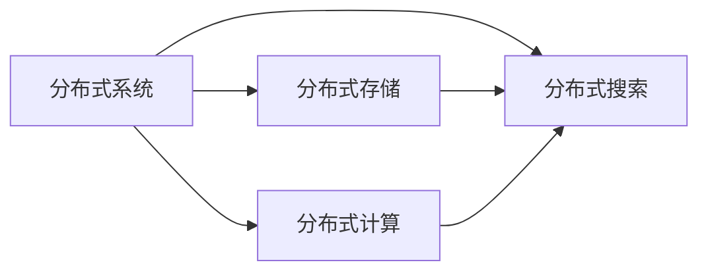
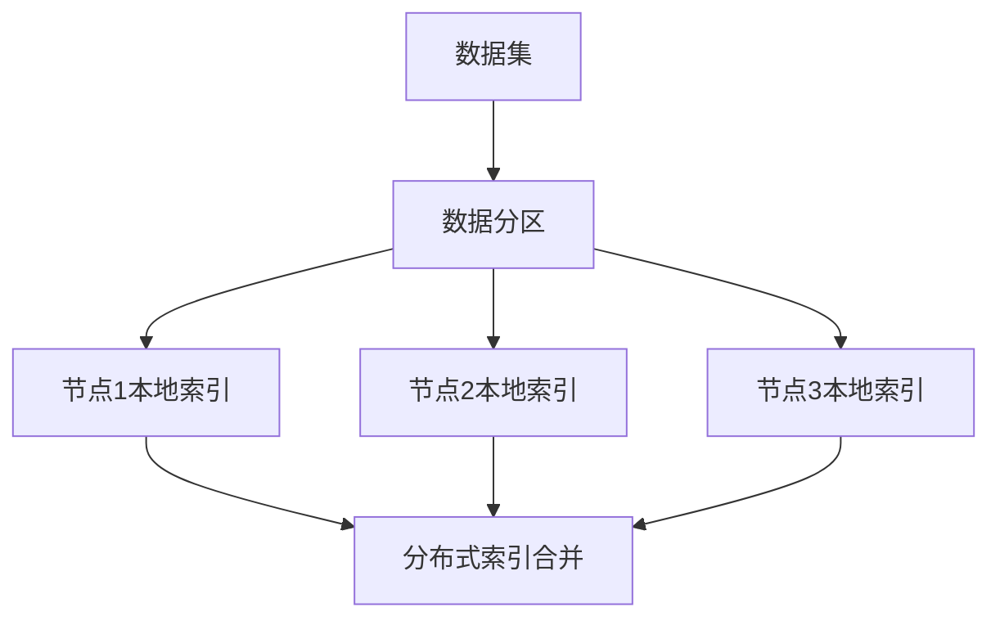
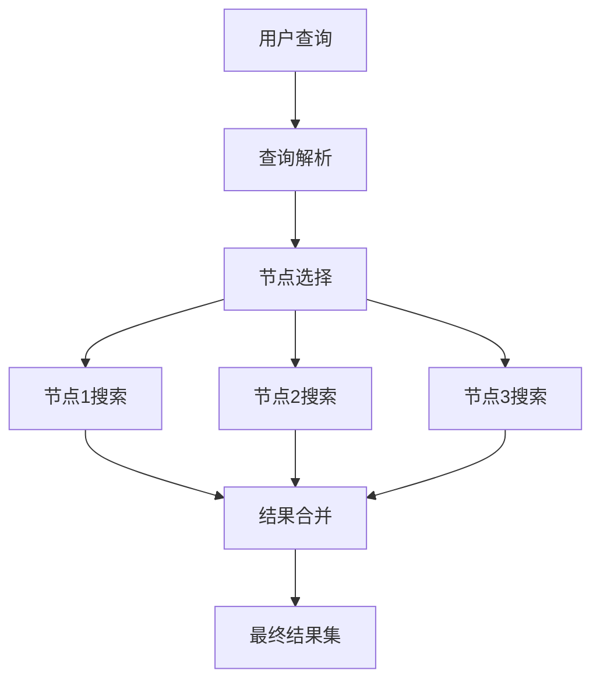

# 【AI大数据计算原理与代码实例讲解】分布式搜索

## 1.背景介绍

### 1.1 大数据时代的到来

在当今时代,数据的规模和复杂性都在不断增长。从网络日志、社交媒体内容到物联网传感器数据,海量的结构化和非结构化数据不断涌现。这种数据爆炸式增长带来了巨大的挑战,传统的集中式计算架构很难满足大规模数据处理的需求。因此,分布式系统应运而生,成为解决大数据计算挑战的关键技术之一。

### 1.2 分布式系统的重要性

分布式系统通过将计算任务分散到多个节点上并行执行,从而提高了数据处理的效率和可扩展性。它们具有高容错性、高可用性和负载均衡等优点,能够有效处理海量数据,满足各种大数据应用场景的需求。其中,分布式搜索作为分布式系统的一个重要组成部分,在大数据环境下发挥着关键作用。

### 1.3 分布式搜索的应用场景

分布式搜索广泛应用于各种领域,包括但不限于:

- 网络搜索引擎:处理海量网页数据,为用户提供高效准确的搜索结果。
- 电子商务平台:支持商品信息的快速检索和推荐。
- 日志分析:对海量日志数据进行实时搜索和分析。
- 安全监控:快速搜索和处理安全事件数据,及时发现潜在威胁。

## 2.核心概念与联系

### 2.1 分布式系统概念

分布式系统是由多个独立的计算机组成的软件系统,这些计算机通过网络相互协调工作,为用户提供一致的服务。分布式系统的核心目标是透明性、开放性、可扩展性、容错性和并行性。

### 2.2 分布式搜索概念

分布式搜索是指在分布式环境下对海量数据进行高效检索的技术。它将数据分散存储在多个节点上,并通过分布式索引和查询机制实现快速搜索。常见的分布式搜索系统包括Elasticsearch、Apache Solr等。



### 2.3 分布式搜索的核心组件

1. **分布式存储**:负责将海量数据分散存储在多个节点上,常用的分布式存储技术包括HDFS、Ceph等。
2. **分布式索引**:对分散存储的数据进行索引,建立倒排索引等数据结构,以加速搜索过程。
3. **分布式查询引擎**:接收用户查询请求,协调各节点进行并行搜索,合并和排序最终结果。
4. **负载均衡**:通过负载均衡器将查询请求分发到不同节点,实现高可用和负载均衡。
5. **集群管理**:管理和监控整个分布式搜索集群的运行状态,进行故障转移和扩缩容等操作。

## 3.核心算法原理具体操作步骤  

### 3.1 分布式索引构建

分布式索引是分布式搜索系统的核心组件之一。它的主要步骤包括:

1. **数据分区**:将海量数据按照某种策略(如文档ID哈希)划分为多个分区,分散存储在不同节点上。
2. **本地索引构建**:每个节点对本地数据分区构建倒排索引等数据结构,作为本地搜索的索引。
3. **索引合并**:系统会定期将各节点的本地索引合并,形成一个全局的分布式索引,用于跨节点搜索。



### 3.2 分布式查询执行

当用户发出搜索查询时,分布式搜索系统会执行以下步骤:

1. **查询解析**:将用户查询解析为可执行的查询计划。
2. **节点选择**:根据查询条件,选择需要参与搜索的数据节点集合。
3. **并行搜索**:在选定的节点上并行执行搜索操作,获取局部结果集。
4. **结果合并**:将各节点的局部结果集进行合并、去重、排序等操作,得到最终结果集。
5. **结果返回**:将最终结果集返回给用户。



### 3.3 分布式搜索优化策略

为了提高分布式搜索系统的性能和效率,可以采取以下优化策略:

1. **缓存**:缓存热点数据和查询结果,减少重复计算。
2. **分区策略优化**:优化数据分区策略,减少数据倾斜和节点间数据传输。
3. **查询路由优化**:根据查询条件智能选择最优节点集合,减少不必要的节点参与。
4. **索引压缩**:对索引进行压缩,减少索引的存储空间和网络传输开销。
5. **集群扩缩容**:根据实际负载情况,动态调整集群的节点数量,实现资源的弹性伸缩。

## 4.数学模型和公式详细讲解举例说明

在分布式搜索系统中,常用的数学模型和算法包括:

### 4.1 向量空间模型(VSM)

向量空间模型是信息检索领域的一种基础模型,它将文档和查询表示为向量,通过计算它们之间的相似度来排序结果。

假设有一个文档集合 $D = \{d_1, d_2, \ldots, d_n\}$,其中每个文档 $d_i$ 是一个向量 $(w_{i1}, w_{i2}, \ldots, w_{it})$,其中 $w_{ij}$ 表示第 $j$ 个词项在文档 $d_i$ 中的权重。查询 $q$ 也可以表示为一个向量 $(q_1, q_2, \ldots, q_t)$。

文档 $d_i$ 与查询 $q$ 的相似度可以用余弦相似度来计算:

$$\text{sim}(d_i, q) = \frac{\vec{d_i} \cdot \vec{q}}{|\vec{d_i}||\vec{q}|} = \frac{\sum_{j=1}^{t}w_{ij}q_j}{\sqrt{\sum_{j=1}^{t}w_{ij}^2}\sqrt{\sum_{j=1}^{t}q_j^2}}$$

根据相似度得分对文档进行排序,得分越高表示与查询越相关。

### 4.2 BM25 排序算法

BM25 是一种常用的相似度计算公式,它考虑了词频(TF)、逆文档频率(IDF)和文档长度等因素,能够更好地排序结果。

对于一个查询 $q$,文档 $d$ 的 BM25 得分计算公式如下:

$$\text{score}(d, q) = \sum_{i=1}^{n}\text{IDF}(q_i)\frac{f(q_i, d)(k_1+1)}{f(q_i,d)+k_1\left(1-b+b\frac{|d|}{avgdl}\right)}$$

其中:

- $f(q_i, d)$ 表示查询词 $q_i$ 在文档 $d$ 中的词频
- $|d|$ 表示文档 $d$ 的长度
- $avgdl$ 表示文档集合的平均长度
- $k_1$ 和 $b$ 是调节因子,用于控制词频、文档长度的影响程度

### 4.3 PageRank 算法

PageRank 算法最初用于网页排名,它通过计算网页之间的链接关系,评估网页的重要性和权重。在分布式搜索中,PageRank 算法也可以应用于评估文档的重要性,从而提高搜索结果的质量。

对于一个网页(或文档) $p$,它的 PageRank 值 $PR(p)$ 可以计算为:

$$PR(p) = (1-d) + d\sum_{q\in M(p)}\frac{PR(q)}{L(q)}$$

其中:

- $M(p)$ 表示所有链接到页面 $p$ 的页面集合
- $L(q)$ 表示页面 $q$ 的出链接数
- $d$ 是一个阻尼系数,通常取值 0.85

PageRank 值越高,表示该页面(或文档)越重要。在搜索结果排序时,可以将 PageRank 值作为一个重要的排序特征。

## 5.项目实践:代码实例和详细解释说明

为了更好地理解分布式搜索的原理和实现,我们将通过一个基于 Elasticsearch 的实例项目进行讲解。Elasticsearch 是一个开源的分布式搜索和分析引擎,提供了分布式索引、搜索和分析等功能。

### 5.1 环境准备

1. 安装 Elasticsearch 和 Kibana
2. 启动 Elasticsearch 和 Kibana 服务

### 5.2 创建索引和映射

```python
# 创建索引
PUT /products

# 定义映射
PUT /products/_mapping
{
  "properties": {
    "name": {
      "type": "text"
    },
    "description": {
      "type": "text"
    },
    "price": {
      "type": "double"
    },
    "category": {
      "type": "keyword"
    }
  }
}
```

上述代码创建了一个名为 `products` 的索引,并定义了包含 `name`、`description`、`price` 和 `category` 字段的映射。

### 5.3 插入文档

```python
# 插入一个文档
PUT /products/_doc/1
{
  "name": "Apple iPhone 13",
  "description": "The latest iPhone with A15 Bionic chip and 5G support.",
  "price": 999.99,
  "category": "Smartphones"
}

# 批量插入多个文档
POST /products/_bulk
{"index":{"_id":2}}
{"name":"Samsung Galaxy S22","description":"Samsung's latest flagship smartphone with 5G and powerful camera.","price":899.99,"category":"Smartphones"}
{"index":{"_id":3}}
{"name":"Dell XPS 13","description":"Ultrabook with 11th Gen Intel Core i7 processor and 4K display.","price":1499.99,"category":"Laptops"}
```

上述代码插入了三个产品文档,包括智能手机和笔记本电脑。

### 5.4 搜索查询

```python
# 查询所有文档
GET /products/_search
{
  "query": {
    "match_all": {}
  }
}

# 根据名称搜索
GET /products/_search
{
  "query": {
    "match": {
      "name": "iPhone"
    }
  }
}

# 多字段搜索
GET /products/_search
{
  "query": {
    "multi_match": {
      "query": "Samsung 5G",
      "fields": ["name", "description"]
    }
  }
}

# 分页和排序
GET /products/_search
{
  "query": {
    "match_all": {}
  },
  "sort": [
    {
      "price": {
        "order": "desc"
      }
    }
  ],
  "from": 0,
  "size": 2
}
```

上述代码展示了不同类型的搜索查询,包括全文搜索、多字段搜索、分页和排序等。您可以根据需求构建更复杂的查询。

### 5.5 聚合分析

```python
# 按类别统计产品数量
GET /products/_search
{
  "aggs": {
    "categories": {
      "terms": {
        "field": "category"
      }
    }
  }
}

# 计算每个类别的平均价格
GET /products/_search
{
  "aggs": {
    "categories": {
      "terms": {
        "field": "category"
      },
      "aggs": {
        "avg_price": {
          "avg": {
            "field": "price"
          }
        }
      }
    }
  }
}
```

上述代码演示了如何使用 Elasticsearch 的聚合功能进行数据分析,包括按类别统计产品数量和计算每个类别的平均价格。

通过这个实例项目,您可以了解到如何在 Elasticsearch 中创建索引、插入文档、执行搜索查询和进