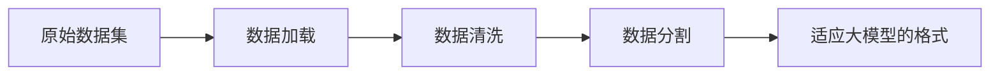
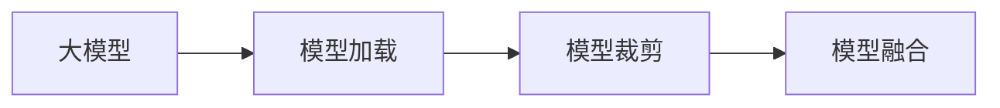
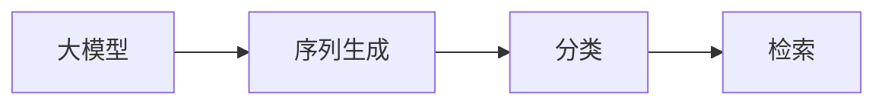
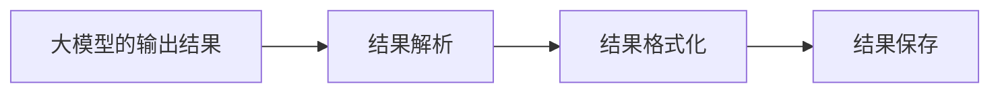

## 背景介绍

随着大型语言模型（LLM）的不断发展，我们在自然语言处理（NLP）领域取得了巨大的进展。近年来，GPT-3、BERT等模型已经成为NLP领域的代表。然而，这些模型的复杂性和规模使得它们难以直接用于实际应用。为了解决这个问题，许多研究者和工程师开始探索如何将这些大模型与其他工具和技术相结合，以便为各种实际应用提供更好的支持。

LangChain是一个开源框架，旨在帮助开发人员更轻松地构建和部署基于大模型的应用。它提供了一组模块化的组件，允许开发人员轻松地将大模型与其他技术（如数据处理、机器学习、人工智能等）结合起来，以实现更复杂和高效的应用。通过使用LangChain，我们可以更好地利用大模型的能力，实现各种应用。

本文将从以下几个方面详细介绍LangChain编程：

1. 大模型原理与联系
2. 核心算法原理具体操作步骤
3. 数学模型和公式详细讲解举例说明
4. 项目实践：代码实例和详细解释说明
5. 实际应用场景
6. 工具和资源推荐
7. 总结：未来发展趋势与挑战
8. 附录：常见问题与解答

## 核心概念与联系

在深入探讨LangChain编程之前，我们需要了解大模型的原理以及它与其他技术的联系。下面我们将简要介绍GPT-3和BERT等大模型，以及它们与LangChain的联系。

### GPT-3

GPT-3（Generative Pre-trained Transformer 3）是一种基于Transformer架构的自然语言生成模型，由OpenAI开发。它具有157亿个参数，可以生成高质量的文本，适用于各种自然语言处理任务。

### BERT

BERT（Bidirectional Encoder Representations from Transformers）是Google开发的一种基于Transformer的预训练模型。与GPT-3不同，BERT旨在理解文本中的语义关系，而不仅仅是生成文本。它使用双向编码器学习文本中的上下文关系，从而提高了各种NLP任务的性能。

### LangChain与大模型的联系

LangChain旨在帮助开发人员更轻松地将大模型（如GPT-3和BERT等）与其他技术相结合，以实现更复杂和高效的应用。通过使用LangChain，我们可以轻松地将大模型与数据处理、机器学习、人工智能等技术相结合，从而实现各种实际应用。

## 核心算法原理具体操作步骤

在了解LangChain编程之前，我们需要了解其核心算法原理以及具体操作步骤。下面我们将简要介绍LangChain的核心组件以及它们的操作步骤。

### 1. 数据处理

数据处理是LangChain编程的第一个步骤。我们需要将原始数据集转换为适用于大模型的格式。LangChain提供了许多数据处理组件，如数据加载、数据清洗、数据分割等。这些组件可以帮助我们轻松地将原始数据转换为适用于大模型的格式。

### 2. 模型加载与预处理

在实际应用中，我们需要将大模型加载到LangChain中，并对其进行预处理。LangChain提供了许多预处理组件，如模型加载、模型裁剪、模型融合等。这些组件可以帮助我们轻松地将大模型加载到LangChain中，并对其进行预处理。

### 3. 任务处理

任务处理是LangChain编程的核心步骤。在这个步骤中，我们需要将大模型与其他技术（如数据处理、机器学习、人工智能等）结合起来，以实现更复杂和高效的应用。LangChain提供了许多任务处理组件，如序列生成、分类、检索等。这些组件可以帮助我们轻松地将大模型与其他技术结合起来，以实现各种实际应用。

### 4. 结果输出

最后，我们需要将大模型的输出结果转换为适合实际应用的格式。LangChain提供了许多结果输出组件，如结果解析、结果格式化、结果保存等。这些组件可以帮助我们轻松地将大模型的输出结果转换为适合实际应用的格式。

## 数学模型和公式详细讲解举例说明

在本节中，我们将详细讲解LangChain编程中的数学模型和公式，并提供实际示例以帮助读者理解。

### 1. 数据处理

数据处理是LangChain编程的第一个步骤。在这个步骤中，我们需要将原始数据集转换为适用于大模型的格式。以下是一个简化的数据处理流程图：



### 2. 模型加载与预处理

在实际应用中，我们需要将大模型加载到LangChain中，并对其进行预处理。以下是一个简化的模型加载与预处理流程图：



### 3. 任务处理

任务处理是LangChain编程的核心步骤。在这个步骤中，我们需要将大模型与其他技术（如数据处理、机器学习、人工智能等）结合起来，以实现更复杂和高效的应用。以下是一个简化的任务处理流程图：



### 4. 结果输出

最后，我们需要将大模型的输出结果转换为适合实际应用的格式。以下是一个简化的结果输出流程图：



## 项目实践：代码实例和详细解释说明

在本节中，我们将通过一个实际项目实践的代码示例来详细解释LangChain编程。我们将使用GPT-3模型来构建一个简单的聊天机器人。

### 代码示例

```python
from langchain import Chatbot
from langchain.chatbots.gpt3 import GPT3Chatbot

# 加载GPT-3模型
gpt3_chatbot = GPT3Chatbot()

# 创建聊天机器人实例
chatbot = Chatbot(gpt3_chatbot)

# 与聊天机器人进行交互
response = chatbot.reply("你好，我是人工智能助手。请问有什么可以帮助您的？")
print(response)
```

### 详细解释说明

在上面的代码示例中，我们首先从langchain库中导入Chatbot类，然后导入GPT3Chatbot类，用于加载GPT-3模型。接着，我们创建一个GPT3Chatbot实例，然后创建一个Chatbot实例，并将GPT3Chatbot实例作为参数传递给Chatbot实例。最后，我们使用Chatbot实例与聊天机器人进行交互，并输出其回复。

## 实际应用场景

LangChain编程具有广泛的实际应用场景，下面我们将举几个例子：

### 1. 问答系统

LangChain可以用于构建问答系统，通过将大模型与数据处理、机器学习、人工智能等技术结合起来，实现高效的问答功能。

### 2. 文本摘要

LangChain可以用于构建文本摘要系统，通过将大模型与数据处理、机器学习、人工智能等技术结合起来，实现高效的文本摘要功能。

### 3. 文本生成

LangChain可以用于构建文本生成系统，通过将大模型与数据处理、机器学习、人工智能等技术结合起来，实现高效的文本生成功能。

## 工具和资源推荐

在LangChain编程中，我们需要使用一些工具和资源来帮助我们更轻松地构建和部署基于大模型的应用。以下是一些推荐的工具和资源：

### 1. 开源框架

LangChain：一个开源框架，提供了许多模块化的组件，帮助开发人员更轻松地构建和部署基于大模型的应用。

### 2. 数据集

GPT-3数据集：OpenAI提供的GPT-3数据集，包含了大量的文本数据，可以用于训练和测试大模型。

### 3. 文档

LangChain文档：LangChain官方文档，提供了详细的介绍和示例，帮助开发人员更轻松地使用LangChain。

### 4. 社区

LangChain社区：LangChain社区是一个活跃的社区，提供了许多资源和支持，帮助开发人员更轻松地使用LangChain。

## 总结：未来发展趋势与挑战

LangChain编程具有广泛的应用前景，随着大模型和自然语言处理技术的不断发展，我们可以期待LangChain在未来将具有更多的应用场景和更高的效率。然而，LangChain编程也面临着一些挑战，如模型规模、计算资源、数据安全等。我们需要不断地优化LangChain，提高其性能和可用性，以满足不断变化的应用需求。

## 附录：常见问题与解答

在本文中，我们介绍了LangChain编程的原理、核心组件、数学模型和公式、项目实践、实际应用场景、工具和资源推荐、未来发展趋势与挑战。对于LangChain编程的常见问题，以下是一些解答：

### Q1：LangChain是什么？

LangChain是一个开源框架，旨在帮助开发人员更轻松地构建和部署基于大模型的应用。它提供了一组模块化的组件，允许开发人员轻松地将大模型与其他技术（如数据处理、机器学习、人工智能等）结合起来，以实现更复杂和高效的应用。

### Q2：如何使用LangChain？

要使用LangChain，我们需要按照以下步骤进行：

1. 安装LangChain库。
2. 加载大模型（如GPT-3或BERT等）。
3. 对原始数据进行处理和预处理。
4. 使用LangChain提供的组件实现各种任务处理（如序列生成、分类、检索等）。
5. 将大模型的输出结果转换为适合实际应用的格式。

### Q3：LangChain有什么优势？

LangChain的优势在于它提供了许多模块化的组件，帮助开发人员轻松地将大模型与其他技术结合起来，以实现更复杂和高效的应用。同时，LangChain还提供了许多工具和资源，帮助开发人员更轻松地使用LangChain。

### Q4：LangChain有什么局限？

LangChain编程的局限性主要体现在模型规模、计算资源、数据安全等方面。我们需要不断地优化LangChain，提高其性能和可用性，以满足不断变化的应用需求。

### Q5：如何解决LangChain编程中的问题？

要解决LangChain编程中的问题，我们需要充分了解LangChain的原理、核心组件、数学模型和公式，并通过实际项目实践来学习和优化LangChain。同时，我们还需要关注LangChain社区的讨论和资源，以便更好地了解LangChain的最新发展和最佳实践。