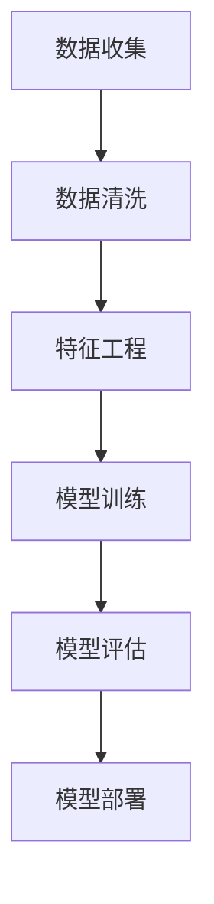

## 背景介绍

随着互联网的不断发展和普及，大数据和人工智能已成为当今时代的热门话题。然而，大数据和人工智能并不是一蹴而就的，它需要我们对其本质和原理有深入的了解和研究。那么，大数据和人工智能之间的关系如何？如何处理大规模数据集？本文将从以下几个方面为您揭开答案。

## 核心概念与联系

首先，我们需要对大数据和人工智能这两个概念进行简单的概述。**大数据**是指以高速、广度和多样性存储和分析的数据集合。**人工智能**是指让计算机以人类智能的方式进行决策的科学。那么，大数据和人工智能之间的联系是什么呢？这就是我们需要探讨的问题。

## 核心算法原理具体操作步骤

在处理大规模数据集时，我们需要一种高效的算法来实现这一目标。下面是一个典型的算法流程图：



## 数学模型和公式详细讲解举例说明

在处理大数据集时，我们常常需要使用数学模型来进行分析。例如，线性回归模型可以用于预测某个变量的值。以下是一个简单的线性回归模型示例：

$$
y = mx + b
$$

其中,$$y$$表示预测值,$$x$$表示自变量,$$m$$表示斜率,$$b$$表示截距。通过训练线性回归模型，我们可以得到$$m$$和$$b$$的值，从而进行预测。

## 项目实践：代码实例和详细解释说明

在实际项目中，我们需要使用代码来实现大数据处理和人工智能算法。以下是一个简单的Python代码示例，使用Scikit-Learn库实现线性回归模型：

```python
from sklearn.linear_model import LinearRegression
from sklearn.model_selection import train_test_split
from sklearn.metrics import mean_squared_error

# 数据加载
X, y = load_data()

# 数据划分
X_train, X_test, y_train, y_test = train_test_split(X, y, test_size=0.2, random_state=42)

# 模型训练
model = LinearRegression()
model.fit(X_train, y_train)

# 预测
y_pred = model.predict(X_test)

# 评估
mse = mean_squared_error(y_test, y_pred)
print(f'MSE: {mse}')
```

## 实际应用场景

大数据和人工智能在实际应用中有许多场景。例如，金融领域可以使用大数据和人工智能进行风险管理和投资决策；医疗领域可以使用大数据和人工智能进行疾病预测和个性化治疗方案等。

## 工具和资源推荐

处理大规模数据集时，我们需要使用各种工具和资源来帮助我们实现目标。以下是一些推荐的工具和资源：

* 数据处理：Pandas、NumPy
* 机器学习：Scikit-Learn、TensorFlow、PyTorch
* 数据可视化：Matplotlib、Seaborn

## 总结：未来发展趋势与挑战

大数据和人工智能是未来发展趋势的代表。随着技术的不断发展，我们需要不断地学习和研究，提高自己在大数据和人工智能方面的技能。同时，我们也需要面对一些挑战，如数据安全和隐私问题等。

## 附录：常见问题与解答

在处理大规模数据集时，常常会遇到一些问题。以下是一些常见问题和解答：

Q: 如何选择合适的算法？

A: 根据问题类型和数据特点，选择合适的算法是非常重要的。可以参考相关文献和实际应用来进行选择。

Q: 如何处理数据偏差？

A: 数据偏差可能会影响模型的预测效果。可以使用数据清洗和特征工程等方法来处理数据偏差。

Q: 如何评估模型性能？

A: 通过使用指标，如均方误差（MSE）和准确率（Accuracy）等，可以评估模型的性能。还可以使用交叉验证来评估模型的泛化能力。