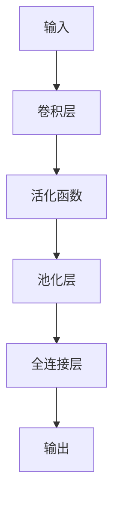

## 背景介绍
视频监控在现代社会中无处不在，为人们的生活和企业的运营带来了巨大的便利和安全保障。然而，随着监控设备的不断增加，视频数据的处理和分析也变得 increasingly complex。传统的监控分析方法往往无法满足日益严峻的挑战，这时深度学习（Deep Learning）作为一种高效、智能的分析方法，开始在视频监控领域中崛起。

## 核心概念与联系
深度学习是一种人工智能技术，它通过学习大量数据来发现数据之间的复杂关系和模式，从而实现自动化的决策和预测。与传统机器学习方法不同，深度学习方法可以自动学习特征表示和模型参数，从而大大降低了人工特征设计和参数调整的需求。

在视频监控分析中，深度学习可以用来完成多种任务，如目标检测、跟踪、识别和分类等。这些任务可以帮助我们发现潜在的安全威胁、优化运营效率和提高用户体验。

## 核心算法原理具体操作步骤
深度学习算法通常由前处理、特征提取和后处理三个阶段组成。

1. 前处理：包括视频分帧、帧预处理和数据增强等操作。分帧是将连续视频帧切分成单独的图像，用于后续分析。帧预处理包括灰度变换、边界填充和噪声去除等操作。数据增强则是通过旋转、翻转、裁剪等方法生成更多的训练样本，提高模型泛化能力。
2. 特征提取：利用卷积神经网络（CNN）来自动学习视频帧的特征表示。CNN由多个卷积层、池化层和全连接层组成，每个卷积层负责提取特征，池化层负责减少特征维度，全连接层负责完成分类或回归任务。通过堆叠多个卷积层，可以捕捉到更复杂的特征和结构信息。
3. 后处理：根据模型输出结果进行后续处理，如非极大值抑制（NMS）和边界框调整等。这些操作可以进一步优化检测结果，提高准确性和召回率。

## 数学模型和公式详细讲解举例说明
在深度学习中，卷积神经网络（CNN）是一个经典的架构。其核心组成部分是卷积层、池化层和全连接层。以下是一个简单的CNN架构示例：

卷积层使用卷积核对输入数据进行卷积，生成特征图。活化函数（如ReLU）可以引入非线性变换，使得网络能够学习更复杂的函数。池化层用于减少特征图的维度，保留关键特征信息。全连接层负责将特征图转换为输出标签。

## 项目实践：代码实例和详细解释说明
以下是一个简单的深度学习视频目标检测项目实例，使用了Python和TensorFlow库：
```python
import tensorflow as tf
from tensorflow.keras.models import Sequential
from tensorflow.keras.layers import Conv2D, MaxPooling2D, Flatten, Dense

# 构建CNN模型
model = Sequential([
    Conv2D(32, (3, 3), activation='relu', input_shape=(64, 64, 3)),
    MaxPooling2D(pool_size=(2, 2)),
    Conv2D(64, (3, 3), activation='relu'),
    MaxPooling2D(pool_size=(2, 2)),
    Flatten(),
    Dense(128, activation='relu'),
    Dense(1, activation='sigmoid')
])

# 编译模型
model.compile(optimizer='adam', loss='binary_crossentropy', metrics=['accuracy'])

# 训练模型
model.fit(x_train, y_train, batch_size=32, epochs=10, validation_data=(x_val, y_val))
```
## 实际应用场景
深度学习在视频监控分析中的实际应用场景有很多，例如：

1. 安全监控：通过目标检测和跟踪技术，识别出可能威胁安全的物体或行为，如盗窃、破坏等。
2. 人流分析：利用目标检测和分割技术，统计人群密度、流动速度等信息，为城市规划和商业活动提供决策依据。
3. 车辆识别：通过车牌检测和识别技术，实现实时车辆识别，为交通管理提供支持。

## 工具和资源推荐
如果你想学习和实际操作深度学习在视频监控分析中的应用，可以参考以下工具和资源：

1. TensorFlow：一个流行的深度学习框架，可以用于构建和训练各种神经网络。
2. Keras：一个高层神经网络抽象层，方便快速prototyping和实验。
3. OpenCV：一个流行的计算机视觉库，可以用于图像处理和特征提取。
4. PyTorch：一个动态计算图框架，可以用于快速 experimentation 和研究。

## 总结：未来发展趋势与挑战
深度学习在视频监控分析领域取得了显著的进展，但未来仍面临诸多挑战和机遇。随着数据量、算法复杂性和硬件性能的不断提高，深度学习的应用将持续扩展。同时，人工智能和物联网的融合将催生更多创新性的监控方案。为了应对这些挑战和机遇，我们需要不断探索新的算法、优化模型性能和提高算法鲁棒性。

## 附录：常见问题与解答
1. 如何选择合适的神经网络架构？
选择合适的神经网络架构需要根据具体应用场景和数据特点进行权衡。对于简单的分类任务，可以尝试使用较浅的网络结构，如LeNet或AlexNet。对于复杂的识别任务，可以尝试使用较深的网络结构，如VGG或ResNet。
2. 如何处理过拟合问题？
过拟合问题通常可以通过正则化、数据增强和早停等方法来解决。正则化可以加入一个惩罚项，限制模型参数的复杂性。数据增强可以通过生成更多的训练样本来提高模型泛化能力。早停则是在模型性能开始过拟合时提前停止训练。

作者：禅与计算机程序设计艺术 / Zen and the Art of Computer Programming