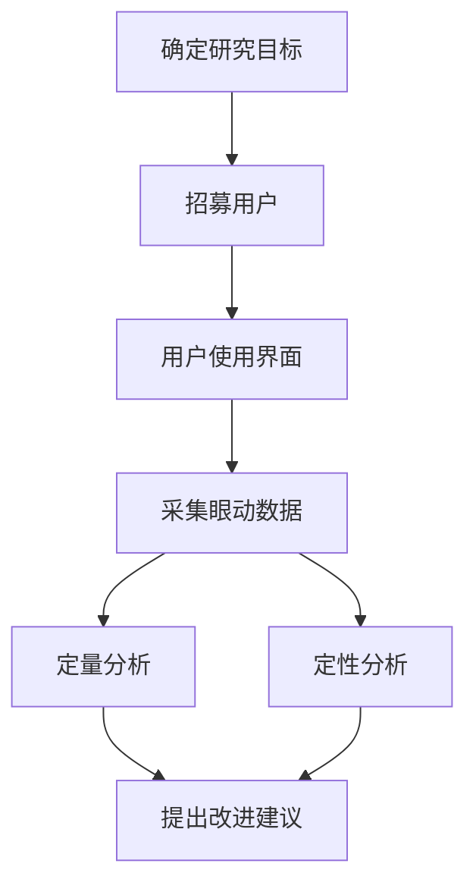

# 人机交互与用户界面设计原理与代码实战案例讲解

## 1. 背景介绍
### 1.1 人机交互的重要性
人机交互(Human-Computer Interaction, HCI)是计算机科学和心理学交叉的一个重要领域,它研究如何设计计算机系统,使其能够方便、高效、愉悦地与人类进行交互。在当今数字化时代,人们越来越多地通过各种数字设备和应用程序来工作、学习、娱乐和社交,优秀的人机交互设计对于提升用户体验、提高工作效率、促进信息传播和知识普及具有重要意义。

### 1.2 用户界面设计的核心目标
用户界面(User Interface,UI)设计是人机交互的重要组成部分,它直接决定了用户与系统交互的方式和体验。一个优秀的用户界面应该做到:
- 清晰明了:布局合理、信息层次分明,让用户一目了然
- 一致性:交互方式、视觉风格在整个系统中保持一致,减少用户的认知负担 
- 高效:最小化用户完成任务所需的步骤,提供便捷的操作方式
- 反馈及时:对用户的操作给出及时的反馈,让用户明白自己的操作结果
- 容错:防止和纠正用户可能的错误操作,提供恢复机制
- 美观:视觉设计要美观大方,界面元素风格统一,色彩搭配和谐

### 1.3 多学科交叉融合
人机交互和用户界面设计是一个多学科交叉的领域,涉及计算机科学、心理学、设计学、人因工程学等多个学科。一个成功的人机交互系统需要技术、美学、认知、商业等多方面因素的综合考虑。设计者既要有扎实的编程技术,又要有敏锐的审美能力和对人性的洞察力。

## 2. 核心概念与联系
### 2.1 可用性与用户体验
- 可用性(Usability):系统容易学习、使用高效、易记忆、少出错、主观满意度高
- 用户体验(User Experience):用户在使用系统过程中建立起的主观感受,涉及使用前的期望、使用中的体验、使用后的满意度等
- 二者关系:可用性是用户体验的基础,是用户体验的必要非充分条件。一个系统的可用性好,用户体验不一定好,但可用性差,用户体验一定差。

### 2.2 以用户为中心的设计
以用户为中心的设计(User-Centered Design,UCD)指以用户的需求、行为和心理为出发点来设计系统,强调用户参与设计的全过程。其基本流程为:
1. 明确用户和使用场景
2. 确定用户需求
3. 设计解决方案
4. 制作原型
5. 评估设计方案
6. 基于评估结果改进设计


### 2.3 信息架构
信息架构(Information Architecture,IA)指对网站或应用中的信息进行组织、标记、检索,使其条理清晰、易于查找和使用。常见的信息架构模式有:
- 层级结构(Hierarchy):将信息分层级、分类别进行组织,如树状目录
- 数据库结构(Database):通过定义数据的属性、关系来组织信息,提供多维度检索
- 超文本结构(Hypertext):通过链接将分散的信息片段关联起来,实现非线性浏览

### 2.4 交互设计 
交互设计(Interaction Design)指设计系统与用户交互的方式和流程。常见的交互设计原则有:
- 可发现性:让功能可被发现,提供可视化的线索
- 反馈:及时告知用户当前系统状态和操作结果
- 对话:用户和系统的交互像人与人对话一样自然
- 一致性:相似的元素拥有相似的交互方式
- 隐喻:利用用户熟悉的概念设计交互方式,减少学习成本

### 2.5 视觉设计
视觉设计(Visual Design)指对界面视觉元素的设计,包括布局、色彩、字体、图标等。视觉设计的目标是塑造系统的形象和风格,传达产品理念,同时要兼顾美观性和功能性。视觉设计需要遵循格式塔原理、色彩理论、字体排印规则等视觉设计理论。

## 3. 核心算法原理具体操作步骤
### 3.1 A/B测试
A/B测试是一种用于评估两个设计方案优劣的实验方法。其基本步骤为:
1. 提出假设:假设某个设计方案A比方案B好
2. 选择评估指标:如点击率、转化率等
3. 将用户随机分为两组
4. 一组使用方案A,一组使用方案B
5. 记录两组用户的评估指标
6. 用统计学方法分析指标差异是否显著
7. 得出结论,选择更优方案

### 3.2 眼动追踪
眼动追踪(Eye Tracking)通过记录用户注视界面的位置、时间、顺序等数据,分析界面的可用性问题。其具体步骤为:
1. 确定研究目标和实验设计
2. 招募用户,安排用户使用界面完成任务
3. 用眼动仪采集用户注视数据
4. 对数据进行定量分析,生成热力图、扫描路径图、注视时间表等
5. 对数据进行定性分析,发现可用性问题
6. 提出改进建议



### 3.3 卡片分类
卡片分类(Card Sorting)是一种了解用户对信息组织方式的认知的方法。邀请用户将写有信息条目的卡片按照自己的逻辑进行分类,从而发现用户心目中的信息结构。步骤为:
1. 罗列出信息条目,制作成卡片
2. 邀请用户参与
3. 用户根据自己的逻辑给卡片分类,并给类别命名
4. 记录每个用户的分类结果
5. 使用聚类分析等统计方法分析不同用户的分类结果
6. 找出用户普遍认可的分类方案

### 3.4 启发式评估
启发式评估是一种由专家根据经验和准则对界面进行分析,找出可用性问题的方法。常用的启发式准则有尼尔森的十项准则:
1. 可见性:让系统状态对用户可见
2. 匹配:界面语言符合用户语言
3. 用户控制和自由:给用户自由和控制感
4. 一致性:遵循平台惯例,元素风格一致
5. 预防错误:防止错误发生
6. 识别而不是记忆:让信息直接可见,不要让用户记忆
7. 灵活高效:满足新手和专家的使用需求
8. 美观简约:去除无关的信息
9. 帮助用户认识、诊断和恢复错误:提供明确的错误提示和恢复方法
10. 帮助和文档:提供必要的帮助信息

## 4. 数学模型和公式详细讲解举例说明
### 4.1 Fitts定律
Fitts定律描述了人类肌肉运动的速度-准确性权衡,可用于预测定位目标的时间。公式为:  
$MT = a + b \log_2(\frac{2D}{W})$

其中:
- $MT$ 为移动到目标的平均时间
- $D$ 为光标初始位置到目标中心的距离  
- $W$ 为目标的宽度
- $a,b$ 为经验参数,可通过实验拟合得到

例如,假设a=50ms,b=150ms,屏幕某处有一个宽度为60像素的按钮,光标距离按钮中心有200像素,则用户移动光标并单击按钮的平均时间为:

$$
\begin{aligned}
MT &= 50 + 150 \log_2(\frac{2 \times 200}{60}) \\
&= 50 + 150 \log_2(6.67) \\ 
&= 50 + 150 \times 2.74 \\
&= 461 \text{ms}
\end{aligned}
$$

Fitts定律告诉我们,缩短移动距离、增大目标尺寸有助于提高选择目标的效率。在设计界面时,应该将常用的功能按钮放在显著位置,并适当增大尺寸。

### 4.2 GOMS模型
GOMS(Goals,Operators,Methods,Selection Rules)是一种分析用户完成任务所需时间的方法。它将用户的操作序列分解为4个层次:
- 目标(Goals):用户想要达成的目标状态
- 操作符(Operators):用户可执行的基本动作,如键击、鼠标移动等
- 方法(Methods):完成子目标的一系列操作符序列
- 选择规则(Selection Rules):在可选的方法之间进行选择的规则

通过分析用户完成任务的方法,将其分解为操作符序列,再根据各操作符的基准执行时间,预测用户完成任务的时间。

例如,分析用户在文本编辑器中打开文件的时间:
- 目标:打开文件
- 方法1:
  - 移动鼠标到菜单栏(1.1秒)
  - 单击"文件"菜单(0.2秒)
  - 移动鼠标到"打开"项(1.2秒)  
  - 单击"打开"项(0.2秒)
  - 在对话框中选择文件(2秒)
  - 单击"打开"按钮(0.2秒)
- 方法2:  
  - 按下Ctrl+O(0.3秒)
  - 在对话框中选择文件(2秒)
  - 单击"打开"按钮(0.2秒)

可见方法2更高效。GOMS分析有助于优化任务的操作方法,提高界面效率。

## 5. 项目实践：代码实例和详细解释说明
下面我们用Python的PyQt库开发一个简单的计算器程序,演示如何使用代码实现用户界面。

```python
import sys
from PyQt5.QtWidgets import QApplication, QWidget, QVBoxLayout, QGridLayout, QPushButton, QLineEdit

class Calculator(QWidget):
    def __init__(self):
        super().__init__()
        self.initUI()

    def initUI(self):
        # 创建界面元素
        self.display = QLineEdit('0')
        self.display.setReadOnly(True)
        self.display.setAlignment(Qt.AlignRight)
        self.display.setMaxLength(15)

        grid = QGridLayout()
        names = ['Cls', 'Bck', '', 'Close',
                 '7', '8', '9', '/',
                 '4', '5', '6', '*',
                 '1', '2', '3', '-',
                 '0', '.', '=', '+']
        positions = [(i, j) for i in range(5) for j in range(4)]
        for position, name in zip(positions, names):
            if name == '':
                continue
            button = QPushButton(name)
            button.clicked.connect(self.buttonClicked)
            grid.addWidget(button, *position)

        vbox = QVBoxLayout()
        vbox.addWidget(self.display)
        vbox.addLayout(grid)
        self.setLayout(vbox)

        self.setGeometry(300, 300, 300, 200)
        self.setWindowTitle('Calculator')

    def buttonClicked(self):
        sender = self.sender()
        text = sender.text()
        if text == '=':
            result = eval(self.display.text())
            self.display.setText(str(result))
        elif text == 'Cls':
            self.display.setText('0')
        elif text == 'Bck':
            self.display.setText(self.display.text()[:-1])
        elif text == 'Close':
            self.close()
        else:
            if self.display.text() == '0':
                self.display.setText(text)
            else:
                self.display.setText(self.display.text() + text)

if __name__ == '__main__':
    app = QApplication(sys.argv)
    calc = Calculator()
    calc.show()
    sys.exit(app.exec_())
```

代码说明:
1. 导入PyQt5库的QApplication、QWidget、QVBoxLayout、QGridLayout、QPushButton、QLineEdit等类。
2. 定义Calculator类