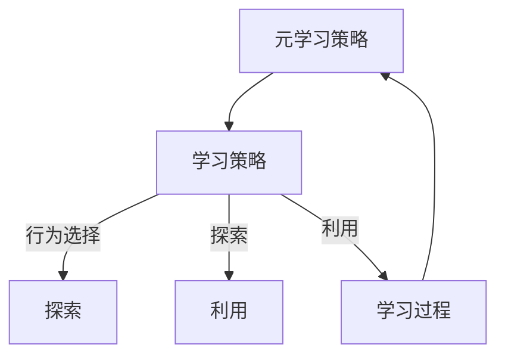

## 背景介绍

强化学习（Reinforcement Learning, RL）是机器学习的分支之一，它致力于解决如何让算法在不明确的环境中学习最佳行为的问题。元强化学习（Meta-Reinforcement Learning, Meta-RL）则是强化学习的一个子领域，研究如何让算法学习学习策略，从而提高学习效率和学习效果。

本文将从以下几个方面探讨元强化学习原理与代码实战案例：

1. 核心概念与联系
2. 核心算法原理具体操作步骤
3. 数学模型和公式详细讲解举例说明
4. 项目实践：代码实例和详细解释说明
5. 实际应用场景
6. 工具和资源推荐
7. 总结：未来发展趋势与挑战
8. 附录：常见问题与解答

## 核心概念与联系

元强化学习（Meta-RL）是一种高级的强化学习方法，它允许学习学习策略。这意味着算法可以学习如何更好地学习其他任务。元强化学习的目标是提高学习效率和学习效果，从而实现更高效的学习和优化。

元强化学习的核心概念包括：

1. **元学习（Meta-Learning）：** 学习如何学习其他任务，通过调整学习策略来优化学习过程。
2. **学习策略（Learning Policy）：** 用于指导学习过程的策略，包括选择行为、探索和利用等。
3. **学习进程（Learning Process）：** 学习策略所涉及的过程，包括收集数据、评估策略、更新策略等。
4. **学习目标（Learning Goal）：** 学习过程所希望达到的目标，例如最大化累积奖励、最小化时间步数等。

元强化学习与常规强化学习的联系在于，它仍然遵循强化学习的基本原理和框架，但将学习过程本身作为一个优化目标。

## 核心算法原理具体操作步骤

元强化学习的核心算法包括两部分：元学习策略（Meta-Learning Policy）和学习策略（Learning Policy）。

1. **元学习策略：** 元学习策略负责学习学习策略，包括学习策略参数的初始化、更新和优化。常见的元学习方法包括：模型平均（Model Averaging）、模型聚合（Model Aggregation）和参数共享（Parameter Sharing）等。
2. **学习策略：** 学习策略负责在具体任务中指导学习过程，包括行为选择、探索和利用等。常见的学习策略包括：Q-Learning、Deep Q-Network（DQN）、Policy Gradient方法等。

元学习策略和学习策略之间的关系可以用以下Mermaid流程图表示：



## 数学模型和公式详细讲解举例说明

元强化学习的数学模型可以用马尔科夫决策过程（Markov Decision Process, MDP）来描述。MDP由状态集、动作集、转移概率、奖励函数和策略函数组成。其中，状态集表示环境的所有可能状态，动作集表示可执行的动作，转移概率表示从一个状态到另一个状态的转移概率，奖励函数表示执行动作后得到的奖励，策略函数表示选择动作的策略。

元强化学习的目标是找到一个好的学习策略，以便在具体任务中实现最优策略。例如，在多元优化问题中，学习策略可以通过梯度下降法（Gradient Descent）来更新参数，从而实现最小化目标函数的最优解。

## 项目实践：代码实例和详细解释说明

在本节中，我们将通过一个简单的例子来说明元强化学习的实际应用。我们将实现一个基于深度强化学习的元学习模型，用于解决多元优化问题。

首先，我们需要准备数据集，例如：

```python
import numpy as np

X = np.random.rand(100, 10)
y = np.random.rand(100, 1)
```

接着，我们将使用深度强化学习（DQN）来实现学习策略。以下是一个简单的DQN模型实现：

```python
import tensorflow as tf
from keras.models import Sequential
from keras.layers import Dense, Flatten

class DQN(tf.Module):
    def __init__(self, state_size, action_size):
        super(DQN, self).__init__()
        self.state_size = state_size
        self.action_size = action_size
        self.model = Sequential([
            Flatten(input_shape=(state_size,)),
            Dense(128, activation='relu'),
            Dense(64, activation='relu'),
            Dense(action_size)
        ])

    def call(self, inputs):
        return self.model(inputs)
```

最后，我们将使用模型平均（Model Averaging）作为元学习策略。以下是一个简单的模型平均实现：

```python
class MetaDQN(tf.Module):
    def __init__(self, model, num_models=5):
        super(MetaDQN, self).__init__()
        self.models = [model() for _ in range(num_models)]

    def call(self, inputs):
        return np.mean([m(inputs) for m in self.models], axis=0)
```

通过以上代码，我们实现了一个基于深度强化学习的元学习模型，可以用于解决多元优化问题。

## 实际应用场景

元强化学习的实际应用场景包括：

1. **游戏学习：** 例如，AlphaGo和AlphaStar等项目使用元强化学习来学习如何在游戏中赢得比赛。
2. **机器人控制：** 元强化学习可以用于训练机器人在复杂环境中执行任务，例如，学习如何行走、抓取对象等。
3. **自然语言处理：** 元强化学习可以用于训练自然语言处理模型，例如，学习如何生成文本或理解语义关系。
4. **金融投资：** 元强化学习可以用于金融投资决策，学习如何选择投资策略和投资组合。

## 工具和资源推荐

以下是一些建议的工具和资源，用于学习和实践元强化学习：

1. **深度强化学习库：** TensorFlow、PyTorch、Keras等深度学习库提供了强化学习的基本组件，如Q-Network、Policy Gradient方法等。
2. **强化学习框架：** RLlib、Stable Baselines等强化学习框架提供了许多现成的强化学习算法，可以作为学习和实践的基础。
3. **学习资源：** 《强化学习》(Reinforcement Learning)和《元学习》(Meta Learning)等书籍提供了元强化学习的基本理论和实践指导。

## 总结：未来发展趋势与挑战

元强化学习在近年来备受关注，其潜在应用范围广泛。然而，元强化学习面临诸多挑战，例如计算资源要求、学习效率和学习效果等。未来，元强化学习将继续发展，逐步解决这些挑战，从而为更多领域带来创新和价值。

## 附录：常见问题与解答

以下是一些关于元强化学习的常见问题和解答：

1. **元强化学习与常规强化学习的区别？**

元强化学习与常规强化学习的主要区别在于，元强化学习关注学习学习策略，从而提高学习效率和学习效果。常规强化学习则关注学习具体任务的最优策略。

1. **元强化学习适用于哪些场景？**

元强化学习适用于各种场景，例如游戏学习、机器人控制、自然语言处理、金融投资等。通过元强化学习，我们可以学习如何在这些场景中实现最优策略。

1. **元强化学习的优势？**

元强化学习的优势在于，它可以学习学习策略，从而提高学习效率和学习效果。这种方法可以实现更高效的学习和优化，为更多领域带来创新和价值。

作者：禅与计算机程序设计艺术 / Zen and the Art of Computer Programming