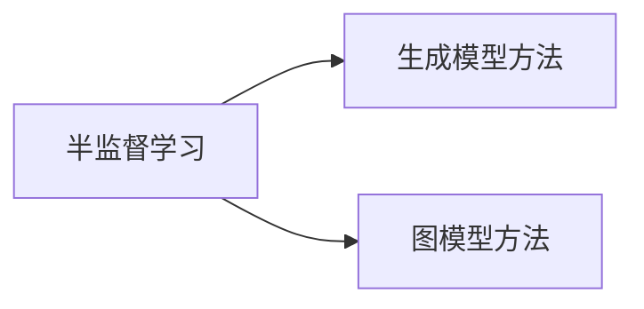

## 1.背景介绍

在机器学习的世界中，我们常常会遇到这样的情况：我们有大量的未标记数据，但只有少量的标记数据。这就是半监督学习（Semi-Supervised Learning）的背景。半监督学习是一种介于监督学习和无监督学习之间的学习方法，它试图通过利用大量的未标记数据，以及少量的标记数据，来提高学习性能。

## 2.核心概念与联系

### 2.1 监督学习与半监督学习

监督学习是我们最常见的机器学习方法，它需要大量的标记数据进行训练。而在实际情况中，获取大量标记数据往往是困难的，甚至是不可能的。这时，半监督学习就派上了用场。半监督学习可以利用未标记的数据，来提高学习的性能。

### 2.2 半监督学习的主要方法

半监督学习的主要方法有两种：生成模型方法和图模型方法。生成模型方法试图建立数据的生成模型，然后利用这个模型来预测新的数据。图模型方法则是将数据表示为图的形式，然后通过图的性质，如图的连通性，来预测新的数据。



## 3.核心算法原理具体操作步骤

### 3.1 生成模型方法

生成模型方法的基本思想是，首先用标记数据和未标记数据共同训练一个生成模型，然后用这个生成模型来预测未标记数据的标签。

### 3.2 图模型方法

图模型方法的基本思想是，首先将所有的数据（包括标记数据和未标记数据）表示为一个图，然后通过图的性质，如图的连通性，来预测未标记数据的标签。

## 4.数学模型和公式详细讲解举例说明

让我们来看一个生成模型方法的例子。假设我们有一个二分类问题，我们的数据是由两个高斯分布生成的。我们可以用以下的公式来表示这个问题：

$$
P(y|x) = \frac{P(x|y)P(y)}{P(x)}
$$

其中，$P(y|x)$ 是后验概率，$P(x|y)$ 是似然概率，$P(y)$ 是先验概率，$P(x)$ 是证据概率。我们的目标是找到一个最优的 $P(y|x)$，使得对于所有的标记数据和未标记数据，$P(y|x)$ 都是最大的。

## 5.项目实践：代码实例和详细解释说明

在Python的scikit-learn库中，我们可以很方便地实现半监督学习。以下是一个简单的例子：

```python
from sklearn.semi_supervised import LabelSpreading
import numpy as np

# 创建数据
X = np.array([[-1, -1], [-2, -1], [-3, -2], [1, 1], [2, 1], [3, 2]])
y = np.array([0, 0, 0, 1, 1, -1]) # -1表示未标记数据

# 创建模型
model = LabelSpreading()

# 训练模型
model.fit(X, y)

# 预测新的数据
print(model.predict([[-0.8, -1]]))
```

## 6.实际应用场景

半监督学习在许多领域都有应用，例如，在图像识别中，我们可以用大量的未标记图片和少量的标记图片来训练一个分类器；在文本分类中，我们可以用大量的未标记文本和少量的标记文本来训练一个分类器。

## 7.工具和资源推荐

推荐使用Python的scikit-learn库来实现半监督学习，它提供了丰富的半监督学习算法，如标签传播算法（Label Propagation）和标签扩散算法（Label Spreading）。

## 8.总结：未来发展趋势与挑战

半监督学习是一个非常有前景的研究领域，它试图解决现实世界中的一个重要问题：如何在少量的标记数据和大量的未标记数据中进行学习。未来，随着数据量的不断增长，半监督学习将发挥越来越重要的作用。

## 9.附录：常见问题与解答

Q: 半监督学习和无监督学习有什么区别？

A: 半监督学习和无监督学习的主要区别在于，半监督学习除了使用未标记数据，还使用了标记数据。

Q: 为什么要使用半监督学习？

A: 在许多情况下，获取大量的标记数据是困难的，甚至是不可能的。而半监督学习可以利用未标记的数据，来提高学习的性能。

Q: 半监督学习有哪些应用？

A: 半监督学习在许多领域都有应用，例如，在图像识别、文本分类、生物信息学等领域。

作者：禅与计算机程序设计艺术 / Zen and the Art of Computer Programming