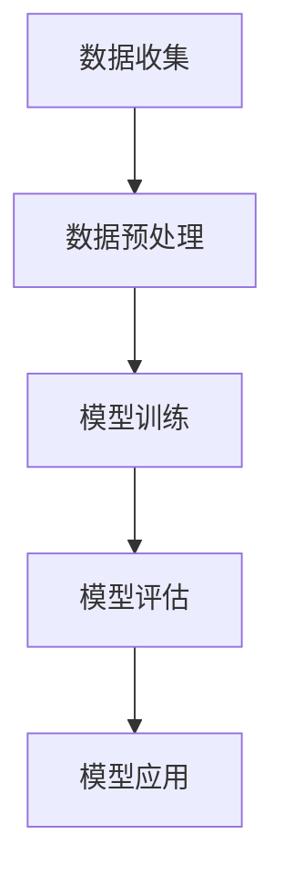

## 背景介绍
近年来，人工智能（AI）和深度学习（DL）技术取得了突飞猛进的发展，特别是自然语言处理（NLP）技术的进步，为许多领域的创新提供了可能。心理分析作为一种古老的科学，在探讨人类心理活动和情感的本质方面具有独特的优势。本文旨在探讨如何将AI LLM（大型语言模型）技术与心理分析相结合，以洞察人类的情感世界。

## 核心概念与联系
首先，我们需要明确AI LLM技术在心理分析中的核心概念和联系。AI LLM技术通过训练大量文本数据，学习语言的语法、语义和上下文规律，从而实现自然语言理解和生成。与此同时，心理分析关注人类心理活动、情感和行为的内在结构和动态变化。因此，结合这两种技术，可以形成一种新的分析方法，帮助我们更深入地理解人类的情感世界。

## 核心算法原理具体操作步骤
为了实现这一目标，我们需要研究AI LLM技术在心理分析中的核心算法原理和具体操作步骤。首先，需要收集大量的心理分析文本数据，包括心理学研究论文、心理咨询记录等。这些建筑数据将作为AI LLM模型的训练数据，帮助模型学习心理分析领域的知识和语言规律。

## 数学模型和公式详细讲解举例说明
在AI LLM技术中，数学模型和公式是核心的组成部分。我们需要详细讲解这些模型和公式，以帮助读者更好地理解技术原理。在本文中，我们将使用Mermaid流程图来清晰地展示这些模型和公式的结构。

## 项目实践：代码实例和详细解释说明
为了让读者更好地理解AI LLM技术在心理分析中的应用，我们将提供一个项目实践的代码示例。这个示例将展示如何使用Python和一个开源的AI LLM库（例如Hugging Face的Transformers）来实现心理分析任务。

## 实际应用场景
最后，我们需要探讨AI LLM技术在心理分析领域的实际应用场景。例如，心理咨询师可以使用该技术来分析客户的语言表达，识别潜在的情感问题，并为其提供有效的建议。此外，AI LLM还可以帮助心理学研究者更深入地探讨人类情感的本质和规律。

## 工具和资源推荐
在学习AI LLM技术和心理分析的过程中，我们需要一些工具和资源来辅助学习。以下是一些建议：

1. Hugging Face的Transformers库：这是一个非常优秀的AI LLM库，可以帮助我们快速上手自然语言处理任务。
2. Python编程语言：Python是学习AI LLM技术的理想语言，因为它具有丰富的机器学习库和社区支持。
3. 心理学研究论文：通过阅读心理学领域的论文，我们可以更好地了解人类情感的本质和规律。

## 总结：未来发展趋势与挑战
虽然AI LLM技术在心理分析领域具有巨大的潜力，但仍然存在一些挑战。首先，数据质量和数量对模型性能的影响非常大，因此需要不断积累和优化数据。其次，AI LLM技术可能会面临伦理和隐私问题，需要制定合适的政策和规范。最后，尽管AI LLM技术可以帮助我们更好地理解人类情感，但心理分析仍然需要人类的独特洞察力和关爱。

## 附录：常见问题与解答
在本文中，我们可能会遇到一些常见的问题。以下是对一些可能的问题的解答：

1. 数据收集和预处理的挑战：由于心理分析领域的数据可能涉及个人隐私，因此需要遵循相关的政策和法规。在数据预处理阶段，我们需要进行去噪和去重等操作，以确保数据质量。
2. 模型评估和优化的方法：在模型评估阶段，我们可以使用传统的机器学习指标（例如准确率、召回率等）以及人工评估来评估模型的性能。在优化模型时，我们可以尝试调整超参数、使用不同的训练策略等。
3. AI LLM技术在心理分析中的局限性：尽管AI LLM技术可以帮助我们更好地理解人类情感，但它并不能完全替代人类的独特洞察力和关爱。心理分析仍然需要人类专家的参与和指导。