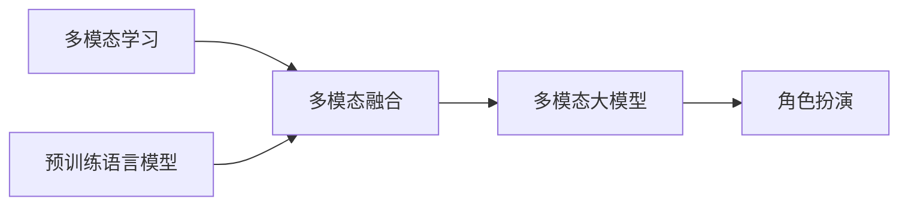

# 多模态大模型：技术原理与实战 如何提高角色扮演能力

## 1. 背景介绍
### 1.1 多模态大模型的兴起
近年来,随着深度学习技术的飞速发展,多模态大模型(Multimodal Large Models)开始崭露头角。多模态大模型能够同时处理文本、图像、音频等不同模态的数据,实现跨模态的信息理解和生成。这为构建更加智能化、人性化的人工智能系统带来了新的可能。

### 1.2 多模态大模型的应用前景
多模态大模型在智能对话、内容创作、信息检索等领域展现出巨大的应用潜力。特别是在角色扮演(Role-playing)场景中,多模态大模型可以根据输入的文本、图像等信息,自动生成符合特定角色特征的对话内容,提供更加真实、丰富的交互体验。这对于游戏、虚拟助手、智能客服等应用有重要意义。

### 1.3 本文的主要内容
本文将围绕多模态大模型在角色扮演中的应用展开讨论。我们将首先介绍多模态大模型的核心概念和技术原理,然后重点分析如何利用多模态信息提高模型的角色扮演能力。接着,我们会给出具体的算法步骤和数学模型,并通过代码实例演示如何实现一个简单的多模态角色扮演系统。最后,我们将总结多模态大模型在角色扮演领域的发展趋势与面临的挑战。

## 2. 核心概念与联系
### 2.1 多模态学习
多模态学习(Multimodal Learning)是指利用不同模态的数据(如文本、图像、音频等)进行联合建模和学习的方法。通过挖掘不同模态数据之间的内在联系,多模态学习可以获得比单一模态更全面、准确的信息表示。

### 2.2 预训练语言模型 
预训练语言模型(Pre-trained Language Models)是近年来自然语言处理领域的重要突破。通过在大规模无标注语料上进行自监督学习,预训练语言模型可以学习到丰富的语言知识和语义表示。代表性的模型包括BERT、GPT等。

### 2.3 多模态融合
多模态融合(Multimodal Fusion)是将不同模态的特征表示映射到一个共同的语义空间,从而实现跨模态信息的交互和整合。常见的融合方式有早期融合、晚期融合和混合融合等。

### 2.4 角色扮演
角色扮演(Role-playing)是一种交互形式,要求AI模型根据设定的角色身份、性格特征等,生成符合该角色的对话内容。这需要模型具备一定的常识推理、上下文理解和语言生成能力。

### 2.5 多模态大模型 
多模态大模型是融合了多模态学习、预训练语言模型等技术的大规模神经网络模型。通过在海量的多模态数据上进行预训练,多模态大模型可以建立起强大的跨模态理解和生成能力,为角色扮演等应用提供支持。

下图展示了多模态大模型的核心概念之间的联系:



## 3. 核心算法原理与具体操作步骤
### 3.1 多模态预训练
多模态大模型的第一步是在大规模多模态语料上进行预训练。常见的预训练任务包括:

1. 掩码语言建模(Masked Language Modeling):随机遮掩输入文本的部分token,让模型根据上下文预测被遮掩的token。

2. 图像-文本匹配(Image-Text Matching):给定图像和文本,让模型判断它们是否匹配。

3. 图像字幕生成(Image Captioning):根据输入的图像,生成相应的文本描述。

通过这些预训练任务,模型可以学习到跨模态的对齐和表示能力。

### 3.2 角色特征编码
为了让模型具备角色扮演能力,需要将角色的特征信息编码到模型中。具体步骤如下:

1. 构建角色属性库,收集不同角色的外貌、性格、背景等属性信息。

2. 将角色属性转换为自然语言描述,如"金发碧眼的女战士,性格刚毅勇敢"。

3. 将角色描述用预训练语言模型(如BERT)编码为向量表示。

4. 在对话生成时,将角色向量作为附加的输入,引导模型生成符合角色特征的回复。

### 3.3 多模态对话生成
有了角色特征编码,多模态大模型就可以进行角色扮演对话生成了。主要步骤包括:

1. 将用户输入的文本和图像分别编码为向量表示。

2. 将文本向量、图像向量和角色特征向量拼接起来,作为模型的输入。

3. 使用多模态融合模块(如Co-Attention)对不同模态的特征进行交互和融合。 

4. 将融合后的多模态表示输入到解码器中,自回归地生成对话回复。

5. 在生成过程中,引入角色相关的约束(如使用角色常用词)来增强角色扮演的真实性。

通过上述步骤,多模态大模型可以根据用户的多模态输入,生成符合特定角色身份和风格的对话内容。

## 4. 数学模型与公式详解
### 4.1 多模态特征提取
给定一个图像 $I$ 和一段文本 $T$,我们首先使用预训练的CNN和Transformer分别提取它们的特征表示:

$$v_I = CNN(I), v_T = Transformer(T)$$

其中, $v_I \in \mathbb{R}^{d_I}$ 是图像特征向量, $v_T \in \mathbb{R}^{d_T}$ 是文本特征向量。

### 4.2 角色特征编码
设角色描述文本为 $R$,我们用预训练的BERT对其进行编码:

$$v_R = BERT(R)$$

其中, $v_R \in \mathbb{R}^{d_R}$ 是角色特征向量。

### 4.3 多模态融合
我们使用Co-Attention机制对不同模态的特征进行融合。首先计算不同模态之间的注意力权重:

$$
\alpha_{IT} = \frac{\exp(v_I^T W_1 v_T)}{\sum_j \exp(v_I^T W_1 v_j)}, \alpha_{TR} = \frac{\exp(v_T^T W_2 v_R)}{\sum_j \exp(v_T^T W_2 v_j)}
$$

然后根据注意力权重对特征进行加权求和,得到融合后的多模态表示:

$$
v_M = \alpha_{IT} v_T + \alpha_{TR} v_R
$$

其中, $v_M \in \mathbb{R}^{d_M}$ 是融合后的多模态特征向量。

### 4.4 对话生成
我们使用基于Transformer的解码器进行自回归对话生成。在第 $t$ 步,模型根据之前生成的token $y_{<t}$ 和多模态特征 $v_M$ 计算当前token的概率分布:

$$
p(y_t|y_{<t},v_M) = softmax(W_o(Transformer(y_{<t}, v_M)))
$$

其中, $W_o$ 是输出层的权重矩阵。模型通过最大化该概率分布来生成下一个token,直到遇到结束符。

在生成过程中,我们还可以引入角色相关的约束,如将角色常用词的概率增大,以增强角色扮演的真实性。

## 5. 项目实践:代码实例与详解
下面我们通过一个简单的代码实例,演示如何用PyTorch实现一个基于BERT的多模态角色扮演对话模型。

```python
import torch
import torch.nn as nn
from transformers import BertModel, BertTokenizer

class MultimodalRolePlayingModel(nn.Module):
    def __init__(self, image_encoder, text_encoder, role_encoder, hidden_size):
        super().__init__()
        self.image_encoder = image_encoder
        self.text_encoder = text_encoder  
        self.role_encoder = role_encoder
        self.fusion = CoAttention(hidden_size)
        self.decoder = TransformerDecoder(hidden_size, num_layers=3)
        self.output = nn.Linear(hidden_size, vocab_size)

    def forward(self, image, text, role, target=None):
        image_feat = self.image_encoder(image)
        text_feat = self.text_encoder(text)
        role_feat = self.role_encoder(role)
        
        fused_feat = self.fusion(image_feat, text_feat, role_feat) 
        
        if target is not None:
            output = self.decoder(target, fused_feat)
            output = self.output(output)
        else:
            output = self.decoder.generate(fused_feat)
            
        return output

# 加载预训练模型
image_encoder = CNN()
text_encoder = BertModel.from_pretrained('bert-base-uncased')
role_encoder = BertModel.from_pretrained('bert-base-uncased')

# 初始化模型
model = MultimodalRolePlayingModel(image_encoder, text_encoder, role_encoder, hidden_size=512)

# 定义优化器
optimizer = torch.optim.AdamW(model.parameters(), lr=1e-4)

# 训练
for epoch in range(num_epochs):
    for image, text, role, target in dataloader:
        output = model(image, text, role, target)
        loss = criterion(output, target)
        
        optimizer.zero_grad()
        loss.backward()
        optimizer.step()
        
# 推理
image = load_image(image_path)
text = "用户:你好!"
role = "金发碧眼的女战士,性格刚毅勇敢"

with torch.no_grad():
    output = model(image, text, role)
    response = tokenizer.decode(output)
    
print(response)
```

以上代码中,我们首先定义了一个`MultimodalRolePlayingModel`类,它包含了图像编码器、文本编码器、角色编码器、多模态融合模块和解码器等部分。前向传播时,模型依次对图像、文本、角色进行编码,然后通过`CoAttention`进行多模态融合,最后用`TransformerDecoder`解码生成对话回复。

在训练阶段,我们将图像、文本、角色描述和目标回复输入到模型中,优化模型参数以最小化生成回复与真实回复之间的交叉熵损失。在推理阶段,我们只需提供图像、文本和角色描述,模型即可自动生成相应的对话回复。

需要注意的是,以上只是一个简单的示例,实际应用中还需要考虑更多细节,如数据预处理、模型调优、生成策略等。

## 6. 实际应用场景
多模态角色扮演对话模型可以应用于以下场景:

1. 游戏NPC:在游戏中根据玩家的对话和当前场景图像,自动生成符合NPC身份和性格的对话内容,增强游戏的沉浸感。

2. 虚拟助手:打造个性化的虚拟助手形象,根据用户的问题和场景图像提供贴心的服务,如导购、旅游向导等。

3. 智能客服:为客服系统赋予多样的人设和情感,根据用户的咨询内容和上传的图片,提供更加人性化和情景化的回复。

4. 社交机器人:让社交机器人能够根据用户的语音、表情和场景图像,生成符合当前交互情境的回应,提升人机交互体验。

5. 创意写作:根据给定的人物角色和场景图像,自动生成符合角色性格和情节走向的创意故事片段,辅助创意写作。

总之,多模态角色扮演对话模型可以让人工智能系统具备更加丰富、灵活的交互能力,为各类应用场景带来更多想象空间。

## 7. 工具与资源推荐
对于多模态角色扮演对话模型的研究和应用,我们推荐以下工具和资源:

1. 🤗 Transformers:包含了主流的预训练语言模型实现,如BERT、GPT等,可用于角色特征编码等。

2. 🧠 OpenAI CLIP:用对比学习方法训练的图文对齐模型,可用于图像-文本匹配和图像特征提取。

3. 💬 ParlAI:专门为对话系统研究而设计的工具包,集成了多种对话数据集和模型。

4. 🎨 Multimodal Datasets:常用的多模态数据集