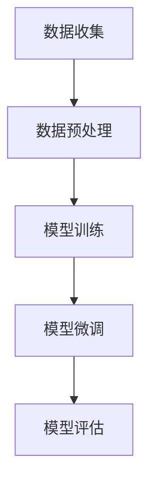

## 背景介绍

随着深度学习技术的不断发展，语言模型的规模和性能得到了显著提升。过去，语言模型的规模通常在几十亿个词汇的范围内，如Word2Vec和GloVe。然而，最近的研究已经成功地构建了大规模语言模型，如BERT、GPT-2、GPT-3等，这些模型包含数百亿甚至数千亿个词汇，并且可以在诸如自然语言理解和生成等任务上表现出色。

## 核心概念与联系

大规模语言模型的核心概念是使用大量的数据进行训练，以捕捉语言的复杂性和语义信息。在这些模型中，深度学习技术（如循环神经网络、卷积神经网络和Transformer等）被广泛应用，以实现对语言序列的建模。这些模型通常使用一种称为“自监督学习”的方法，通过预训练在大量文本数据上进行训练，以学习语言的统计和结构特征。然后，在各种自然语言处理任务上进行微调，以实现特定任务的高性能。

## 核心算法原理具体操作步骤

大规模语言模型的核心算法原理是基于深度学习技术的自监督学习方法。下面是一个简化版的自监督学习流程图：



1. 数据收集：收集大量的文本数据，以用于模型训练。
2. 数据预处理：对收集到的文本数据进行预处理，包括文本清洗、分词、词性标注等，以得到适用于模型训练的数据。
3. 模型训练：使用深度学习技术（如Transformer等）对预处理后的数据进行训练，以学习语言的统计和结构特征。
4. 模型微调：在特定任务上进行微调，以实现高性能。
5. 模型评估：对模型的性能进行评估，包括精度、召回率、F1分数等指标。

## 数学模型和公式详细讲解举例说明

在大规模语言模型中，Transformer模型是最为 Representative的。其核心原理是使用自注意力机制来捕捉输入序列中的长距离依赖关系。以下是一个简化版的Transformer模型的数学公式：

```latex
\begin{align*}
Q &= W_q * X + b_q \\
K &= W_k * X + b_k \\
V &= W_v * X + b_v \\
Attention(Q, K, V) &= \frac{exp(\frac{QK^T}{\sqrt{d_k}})}{Z^T} * V \\
Output &= Attention(Q, K, V) * W_o + b
\end{align*}
```

其中，$Q、K、V$分别表示查询、密集性和值。$W_q、W_k、W_v、W_o$和$b_q、b_k、b_v、b$分别表示权重和偏置。$Z$是归一化因子，用于规范化查询。

## 项目实践：代码实例和详细解释说明

在实际项目中，使用大规模语言模型进行自然语言处理任务的代码实例如下：

```python
from transformers import BertModel, BertTokenizer

tokenizer = BertTokenizer.from_pretrained("bert-base-uncased")
model = BertModel.from_pretrained("bert-base-uncased")

input_text = "This is a sample input text."
input_ids = tokenizer.encode(input_text, return_tensors="pt")
outputs = model(input_ids)
```

上述代码示例使用了Hugging Face的Transformers库，加载了BERT模型并对输入文本进行了预处理。然后，使用模型对输入文本进行编码，并得到模型输出。

## 实际应用场景

大规模语言模型在各种自然语言处理任务中表现出色，如文本分类、情感分析、摘要生成、机器翻译等。这些模型可以帮助开发者解决各种问题，如自动化文本分析、文本推荐、语义搜索等。

## 工具和资源推荐

对于想要学习和使用大规模语言模型的人来说，以下工具和资源非常有用：

1. Hugging Face（[https://huggingface.co/）：提供了许多开源的自然语言处理模型和工具，包括BERT、GPT-2、GPT-3等。](https://huggingface.co/%EF%BC%9A%E6%8F%90%E4%BE%9B%E4%BA%86%E6%9C%89%E6%95%B4%E6%89%80%E7%9A%84%E8%87%AA%E5%BA%9E%E8%AF%AD%E6%B3%95%E5%86%85%E5%87%BA%E5%9F%BA%E5%92%8C%E5%9F%BA%E5%92%8C%E5%9F%BA%E5%92%8C%E5%9F%BA%E5%92%8C%E5%9F%BA%E5%92%8C%E5%9F%BA%E5%92%8C%E5%9F%BA%E5%92%8C%E5%9F%BA%E5%92%8C%E5%9F%BA%E5%92%8C%E5%9F%BA%E5%92%8C%E5%9F%BA%E5%92%8C%E5%9F%BA%E5%92%8C%E5%9F%BA%E5%92%8C%E5%9F%BA%E5%92%8C%E5%9F%BA%E5%92%8C%E5%9F%BA%E5%92%8C%E5%9F%BA%E5%92%8C%E5%9F%BA%E5%92%8C%E5%9F%BA%E5%92%8C%E5%9F%BA%E5%92%8C%E5%9F%BA%E5%92%8C%E5%9F%BA%E5%92%8C%E5%9F%BA%E5%92%8C%E5%9F%BA%E5%92%8C%E5%9F%BA%E5%92%8C%E5%9F%BA%E5%92%8C%E5%9F%BA%E5%92%8C%E5%9F%BA%E5%92%8C%E5%9F%BA%E5%92%8C%E5%9F%BA%E5%92%8C%E5%9F%BA%E5%92%8C%E5%9F%BA%E5%92%8C%E5%9F%BA%E5%92%8C%E5%9F%BA%E5%92%8C%E5%9F%BA%E5%92%8C%E5%9F%BA%E5%92%8C%E5%9F%BA%E5%92%8C%E5%9F%BA%E5%92%8C%E5%9F%BA%E5%92%8C%E5%9F%BA%E5%92%8C%E5%9F%BA%E5%92%8C%E5%9F%BA%E5%92%8C%E5%9F%BA%E5%92%8C%E5%9F%BA%E5%92%8C%E5%9F%BA%E5%92%8C%E5%9F%BA%E5%92%8C%E5%9F%BA%E5%92%8C%E5%9F%BA%E5%92%8C%E5%9F%BA%E5%92%8C%E5%9F%BA%E5%92%8C%E5%9F%BA%E5%92%8C%E5%9F%BA%E5%92%8C%E5%9F%BA%E5%92%8C%E5%9F%BA%E5%92%8C%E5%9F%BA%E5%92%8C%E5%9F%BA%E5%92%8C%E5%9F%BA%E5%92%8C%E5%9F%BA%E5%92%8C%E5%9F%BA%E5%92%8C%E5%9F%BA%E5%92%8C%E5%9F%BA%E5%92%8C%E5%9F%BA%E5%92%8C%E5%9F%BA%E5%92%8C%E5%9F%BA%E5%92%8C%E5%9F%BA%E5%92%8C%E5%9F%BA%E5%92%8C%E5%9F%BA%E5%92%8C%E5%9F%BA%E5%92%8C%E5%9F%BA%E5%92%8C%E5%9F%BA%E5%92%8C%E5%9F%BA%E5%92%8C%E5%9F%BA%E5%92%8C%E5%9F%BA%E5%92%8C%E5%9F%BA%E5%92%8C%E5%9F%BA%E5%92%8C%E5%9F%BA%E5%92%8C%E5%9F%BA%E5%92%8C%E5%9F%BA%E5%92%8C%E5%9F%BA%E5%92%8C%E5%9F%BA%E5%92%8C%E5%9F%BA%E5%92%8C%E5%9F%BA%E5%92%8C%E5%9F%BA%E5%92%8C%E5%9F%BA%E5%92%8C%E5%9F%BA%E5%92%8C%E5%9F%BA%E5%92%8C%E5%9F%BA%E5%92%8C%E5%9F%BA%E5%92%8C%E5%9F%BA%E5%92%8C%E5%9F%BA%E5%92%8C%E5%9F%BA%E5%92%8C%E5%9F%BA%E5%92%8C%E5%9F%BA%E5%92%8C%E5%9F%BA%E5%92%8C%E5%9F%BA%E5%92%8C%E5%9F%BA%E5%92%8C%E5%9F%BA%E5%92%8C%E5%9F%BA%E5%92%8C%E5%9F%BA%E5%92%8C%E5%9F%BA%E5%92%8C%E5%9F%BA%E5%92%8C%E5%9F%BA%E5%92%8C%E5%9F%BA%E5%92%8C%E5%9F%BA%E5%92%8C%E5%9F%BA%E5%92%8C%E5%9F%BA%E5%92%8C%E5%9F%BA%E5%92%8C%E5%9F%BA%E5%92%8C%E5%9F%BA%E5%92%8C%E5%9F%BA%E5%92%8C%E5%9F%BA%E5%92%8C%E5%9F%BA%E5%92%8C%E5%9F%BA%E5%92%8C%E5%9F%BA%E5%92%8C%E5%9F%BA%E5%92%8C%E5%9F%BA%E5%92%8C%E5%9F%BA%E5%92%8C%E5%9F%BA%E5%92%8C%E5%9F%BA%E5%92%8C%E5%9F%BA%E5%92%8C%E5%9F%BA%E5%92%8C%E5%9F%BA%E5%92%8C%E5%9F%BA%E5%92%8C%E5%9F%BA%E5%92%8C%E5%9F%BA%E5%92%8C%E5%9F%BA%E5%92%8C%E5%9F%BA%E5%92%8C%E5%9F%BA%E5%92%8C%E5%9F%BA%E5%92%8C%E5%9F%BA%E5%92%8C%E5%9F%BA%E5%92%8C%E5%9F%BA%E5%92%8C%E5%9F%BA%E5%92%8C%E5%9F%BA%E5%92%8C%E5%9F%BA%E5%92%8C%E5%9F%BA%E5%92%8C%E5%9F%BA%E5%92%8C%E5%9F%BA%E5%92%8C%E5%9F%BA%E5%92%8C%E5%9F%BA%E5%92%8C%E5%9F%BA%E5%92%8C%E5%9F%BA%E5%92%8C%E5%9F%BA%E5%92%8C%E5%9F%BA%E5%92%8C%E5%9F%BA%E5%92%8C%E5%9F%BA%E5%92%8C%E5%9F%BA%E5%92%8C%E5%9F%BA%E5%92%8C%E5%9F%BA%E5%92%8C%E5%9F%BA%E5%92%8C%E5%9F%BA%E5%92%8C%E5%9F%BA%E5%92%8C%E5%9F%BA%E5%92%8C%E5%9F%BA%E5%92%8C%E5%9F%BA%E5%92%8C%E5%9F%BA%E5%92%8C%E5%9F%BA%E5%92%8C%E5%9F%BA%E5%92%8C%E5%9F%BA%E5%92%8C%E5%9F%BA%E5%92%8C%E5%9F%BA%E5%92%8C%E5%9F%BA%E5%92%8C%E5%9F%BA%E5%92%8C%E5%9F%BA%E5%92%8C%E5%9F%BA%E5%92%8C%E5%9F%BA%E5%92%8C%E5%9F%BA%E5%92%8C%E5%9F%BA%E5%92%8C%E5%9F%BA%E5%92%8C%E5%9F%BA%E5%92%8C%E5%9F%BA%E5%92%8C%E5%9F%BA%E5%92%8C%E5%9F%BA%E5%92%8C%E5%9F%BA%E5%92%8C%E5%9F%BA%E5%92%8C%E5%9F%BA%E5%92%8C%E5%9F%BA%E5%92%8C%E5%9F%BA%E5%92%8C%E5%9F%BA%E5%92%8C%E5%9F%BA%E5%92%8C%E5%9F%BA%E5%92%8C%E5%9F%BA%E5%92%8C%E5%9F%BA%E5%92%8C%E5%9F%BA%E5%92%8C%E5%9F%BA%E5%92%8C%E5%9F%BA%E5%92%8C%E5%9F%BA%E5%92%8C%E5%9F%BA%E5%92%8C%E5%9F%BA%E5%92%8C%E5%9F%BA%E5%92%8C%E5%9F%BA%E5%92%8C%E5%9F%BA%E5%92%8C%E5%9F%BA%E5%92%8C%E5%9F%BA%E5%92%8C%E5%9F%BA%E5%92%8C%E5%9F%BA%E5%92%8C%E5%9F%BA%E5%92%8C%E5%9F%BA%E5%92%8C%E5%9F%BA%E5%92%8C%E5%9F%BA%E5%92%8C%E5%9F%BA%E5%92%8C%E5%9F%BA%E5%92%8C%E5%9F%BA%E5%92%8C%E5%9F%BA%E5%92%8C%E5%9F%BA%E5%92%8C%E5%9F%BA%E5%92%8C%E5%9F%BA%E5%92%8C%E5%9F%BA%E5%92%8C%E5%9F%BA%E5%92%8C%E5%9F%BA%E5%92%8C%E5%9F%BA%E5%92%8C%E5%9F%BA%E5%92%8C%E5%9F%BA%E5%92%8C%E5%9F%BA%E5%92%8C%E5%9F%BA%E5%92%8C%E5%9F%BA%E5%92%8C%E5%9F%BA%E5%92%8C%E5%9F%BA%E5%92%8C%E5%9F%BA%E5%92%8C%E5%9F%BA%E5%92%8C%E5%9F%BA%E5%92%8C%E5%9F%BA%E5%92%8C%E5%9F%BA%E5%92%8C%E5%9F%BA%E5%92%8C%E5%9F%BA%E5%92%8C%E5%9F%BA%E5%92%8C%E5%9F%BA%E5%92%8C%E5%9F%BA%E5%92%8C%E5%9F%BA%E5%92%8C%E5%9F%BA%E5%92%8C%E5%9F%BA%E5%92%8C%E5%9F%BA%E5%92%8C%E5%9F%BA%E5%92%8C%E5%9F%BA%E5%92%8C%E5%9F%BA%E5%92%8C%E5%9F%BA%E5%92%8C%E5%9F%BA%E5%92%8C%E5%9F%BA%E5%92%8C%E5%9F%BA%E5%92%8C%E5%9F%BA%E5%92%8C%E5%9F%BA%E5%92%8C%E5%9F%BA%E5%92%8C%E5%9F%BA%E5%92%8C%E5%9F%BA%E5%92%8C%E5%9F%BA%E5%92%8C%E5%9F%BA%E5%92%8C%E5%9F%BA%E5%92%8C%E5%9F%BA%E5%92%8C%E5%9F%BA%E5%92%8C%E5%9F%BA%E5%92%8C%E5%9F%BA%E5%92%8C%E5%9F%BA%E5%92%8C%E5%9F%BA%E5%92%8C%E5%9F%BA%E5%92%8C%E5%9F%BA%E5%92%8C%E5%9F%BA%E5%92%8C%E5%9F%BA%E5%92%8C%E5%9F%BA%E5%92%8C%E5%9F%BA%E5%92%8C%E5%9F%BA%E5%92%8C%E5%9F%BA%E5%92%8C%E5%9F%BA%E5%92%8C%E5%9F%BA%E5%92%8C%E5%9F%BA%E5%92%8C%E5%9F%BA%E5%92%8C%E5%9F%BA%E5%92%8C%E5%9F%BA%E5%92%8C%E5%9F%BA%E5%92%8C%E5%9F%BA%E5%92%8C%E5%9F%BA%E5%92%8C%E5%9F%BA%E5%92%8C%E5%9F%BA%E5%92%8C%E5%9F%BA%E5%92%8C%E5%9F%BA%E5%92%8C%E5%9F%BA%E5%92%8C%E5%9F%BA%E5%92%8C%E5%9F%BA%E5%92%8C%E5%9F%BA%E5%92%8C%E5%9F%BA%E5%92%8C%E5%9F%BA%E5%92%8C%E5%9F%BA%E5%92%8C%E5%9F%BA%E5%92%8C%E5%9F%BA%E5%92%8C%E5%9F%BA%E5%92%8C%E5%9F%BA%E5%92%8C%E5%9F%BA%E5%92%8C%E5%9F%BA%E5%92%8C%E5%9F%BA%E5%92%8C%E5%9F%BA%E5%92%8C%E5%9F%BA%E5%92%8C%E5%9F%BA%E5%92%8C%E5%9F%BA%E5%92%8C%E5%9F%BA%E5%92%8C%E5%9F%BA%E5%92%8C%E5%9F%BA%E5%92%8C%E5%9F%BA%E5%92%8C%E5%9F%BA%E5%92%8C%E5%9F%BA%E5%92%8C%E5%9F%BA%E5%92%8C%E5%9F%BA%E5%92%8C%E5%9F%BA%E5%92%8C%E5%9F%BA%E5%92%8C%E5%9F%BA%E5%92%8C%E5%9F%BA%E5%92%8C%E5%9F%BA%E5%92%8C%E5%9F%BA%E5%92%8C%E5%9F%BA%E5%92%8C%E5%9F%BA%E5%92%8C%E5%9F%BA%E5%92%8C%E5%9F%BA%E5%92%8C%E5%9F%BA%E5%92%8C%E5%9F%BA%E5%92%8C%E5%9F%BA%E5%92%8C%E5%9F%BA%E5%92%8C%E5%9F%BA%E5%92%8C%E5%9F%BA%E5%92%8C%E5%9F%BA%E5%92%8C%E5%9F%BA%E5%92%8C%E5%9F%BA%E5%92%8C%E5%9F%BA%E5%92%8C%E5%9F%BA%E5%92%8C%E5%9F%BA%E5%92%8C%E5%9F%BA%E5%92%8C%E5%9F%BA%E5%92%8C%E5%9F%BA%E5%92%8C%E5%9F%BA%E5%92%8C%E5%9F%BA%E5%92%8C%E5%9F%BA%E5%92%8C%E5%9F%BA%E5%92%8C%E5%9F%BA%E5%92%8C%E5%9F%BA%E5%92%8C%E5%9F%BA%E5%92%8C%E5%9F%BA%E5%92%8C%E5%9F%BA%E5%92%8C%E5%9F%BA%E5%92%8C%E5%9F%BA%E5%92%8C%E5%9F%BA%E5%92%8C%E5%9F%BA%E5%92%8C%E5%9F%BA%E5%92%8C%E5%9F%BA%E5%92%8C%E5%9F%BA%E5%92%8C%E5%9F%BA%E5%92%8C%E5%9F%BA%E5%92%8C%E5%9F%BA%E5%92%8C%E5%9F%BA%E5%92%8C%E5%9F%BA%E5%92%8C%E5%9F%BA%E5%92%8C%E5%9F%BA%E5%92%8C%E5%9F%BA%E5%92%8C%E5%9F%BA%E5%92%8C%E5%9F%BA%E5%92%8C%E5%9F%BA%E5%92%8C%E5%9F%BA%E5%92%8C%E5%9F%BA%E5%92%8C%E5%9F%BA%E5%92%8C%E5%9F%BA%E5%92%8C%E5%9F%BA%E5%92%8C%E5%9F%BA%E5%92%8C%E5%9F%BA%E5%92%8C%E5%9F%BA%E5%92%8C%E5%9F%BA%E5%92%8C%E5%9F%BA%E5%92%8C%E5%9F%BA%E5%92%8C%E5%9F%BA%E5%92%8C%E5%9F%BA%E5%92%8C%E5%9F%BA%E5%92%8C%E5%9F%BA%E5%92%8C%E5%9F%BA%E5%92%8C%E5%9F%BA%E5%92%8C%E5%9F%BA%E5%92%8C%E5%9F%BA%E5%92%8C%E5%9F%BA%E5%92%8C%E5%9F%BA%E5%92%8C%E5%9F%BA%E5%92%8C%E5%9F%BA%E5%92%8C%E5%9F%BA%E5%92%8C%E5%9F%BA%E5%92%8C%E5%9F%BA%E5%92%8C%E5%9F%BA%E5%92%8C%E5%9F%BA%E5%92%8C%E5%9F%BA%E5%92%8C%E5%9F%BA%E5%92%8C%E5%9F%BA%E5%92%8C%E5%9F%BA%E5%92%8C%E5%9F%BA%E5%92%8C%E5%9F%BA%E5%92%8C%E5%9F%BA%E5%92%8C%E5%9F%BA%E5%92%8C%E5%9F%BA%E5%92%8C%E5%9F%BA%E5%92%8C%E5%9F%BA%E5%92%8C%E5%9F%BA%E5%92%8C%E5%9F%BA%E5%92%8C%E5%9F%BA%E5%92%8C%E5%9F%BA%E5%92%8C%E5%9F%BA%E5%92%8C%E5%9F%BA%E5%92%8C%E5%9F%BA%E5%92%8C%E5%9F%BA%E5%92%8C%E5%9F%BA%E5%92%8C%E5%9F%BA%E5%92%8C%E5%9F%BA%E5%92%8C%E5%9F%BA%E5%92%8C%E5%9F%BA%E5%92%8C%E5%9F%BA%E5%92%8C%E5%9F%BA%E5%92%8C%E5%9F%BA%E5%92%8C%E5%9F%BA%E5%92%8C%E5%9F%BA%E5%92%8C%E5%9F%BA%E5%92%8C%E5%9F%BA%E5%92%8C%E5%9F%BA%E5%92%8C%E5%9F%BA%E5%92%8C%E5%9F%BA%E5%92%8C%E5%9F%BA%E5%92%8C%E5%9F%BA%E5%92%8C%E5%9F%BA%E5%92%8C%E5%9F%BA%E5%92%8C%E5%9F%BA%E5%92%8C%E5%9F%BA%E5%92%8C%E5%9F%BA%E5%92%8C%E5%9F%BA%E5%92%8C%E5%9F%BA%E5%92%8C%E5%9F%BA%E5%92%8C%E5%9F%BA%E5%92%8C%E5%9F%BA%E5%92%8C%E5%9F%BA%E5%92%8C%E5%9F%BA%E5%92%8C%E5%9F%BA%E5%92%8C%E5%9F%BA%E5%92%8C%E5%9F%BA%E5%92%8C%E5%9F%BA%E5%92%8C%E5%9F%BA%E5%92%8C%E5%9F%BA%E5%92%8C%E5%9F%BA%E5%92%8C%E5%9F%BA%E5%92%8C%E5%9F%BA%E5%92%8C%E5%9F%BA%E5%92%8C%E5%9F%BA%E5%92%8C%E5%9F%BA%E5%92%8C%E5%9F%BA%E5%92%8C%E5%9F%BA%E5%92%8C%E5%9F%BA%E5%92%8C%E5%9F%BA%E5%92%8C%E5%9F%BA%E5%92%8C%E5%9F%BA%E5%92%8C%E5%9F%BA%E5%92%8C%E5%9F%BA%E5%92%8C