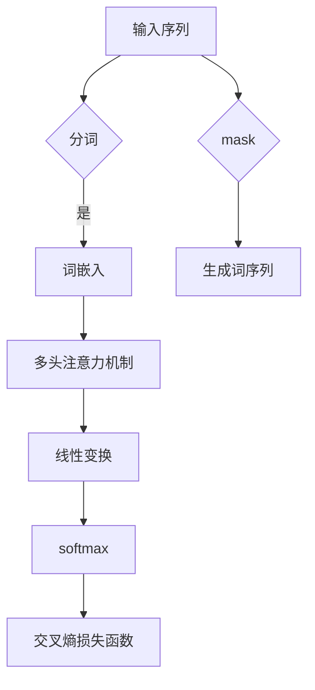

## 背景介绍

随着深度学习技术的不断发展，自然语言处理(NLP)领域也取得了突飞猛进的进展。特别是自2020年以来，基于自监督学习的巨型语言模型（例如BERT、GPT-3等）在众多NLP任务中表现出色，取得了非常显著的成绩。这一发展为我们提供了一个独特的机会，深入研究大规模语言模型的理论和实践，探索模型上下文窗口的扩展。

## 核心概念与联系

在深度学习中，语言模型的核心概念是上下文窗口（context window）。上下文窗口是模型中输入序列中的一个子序列，用于捕捉输入序列中的上下文信息。模型通过学习输入序列中的上下文信息，来预测下一个词或生成连续词序列。

大规模语言模型的关键在于如何扩展上下文窗口。传统的语言模型（如RNN、LSTM等）通常使用固定大小的上下文窗口，限制了模型的上下文理解能力。随着深度学习技术的发展，研究者们开始探索如何扩大上下文窗口，以提高模型的性能。

## 核心算法原理具体操作步骤

为了更好地理解模型上下文窗口的扩展，我们需要了解大规模语言模型的核心算法原理。以下是一个简化版的GPT-3模型架构示例：



GPT-3模型的核心架构包括以下几个部分：

1. **输入序列**：模型接受一个输入序列，用于生成预测的词序列。
2. **分词**：将输入序列按照特定的规则进行分词，生成一个词序列。
3. **词嵌入**：将词序列转换为词向量，用于后续的处理。
4. **多头注意力机制**：通过多头注意力机制，模型可以同时捕捉输入序列中的长距离依赖关系和局部上下文信息。
5. **线性变换**：对多头注意力输出进行线性变换，以减少维度。
6. **softmax**：对线性变换后的输出进行softmax处理，将其转换为概率分布。
7. **交叉熵损失函数**：使用交叉熵损失函数来评估模型的预测性能。
8. **生成词序列**：根据概率分布生成预测的词序列。

## 数学模型和公式详细讲解举例说明

为了更好地理解模型上下文窗口的扩展，我们需要关注多头注意力机制的数学模型。以下是一个简化版的多头注意力机制示例：

$$
\text{Attention}(Q, K, V) = \text{softmax}\left(\frac{QK^T}{\sqrt{d_k}}\right) V
$$

其中，$Q$表示查询矩阵，$K$表示密钥矩阵，$V$表示值矩阵，$d_k$表示密钥向量的维数。

多头注意力机制可以通过将多个单头注意力头组合而成，来扩大上下文窗口。以下是一个简化版的多头注意力机制示例：

$$
\text{MultiHead}(Q, K, V) = \text{Concat}\left(\text{head}_1, ..., \text{head}_h\right)W^O
$$

其中，$h$表示头数，$W^O$表示输出矩阵。

## 项目实践：代码实例和详细解释说明

在实际项目中，我们可以使用PyTorch等深度学习框架来实现大规模语言模型。以下是一个简化版的GPT-3模型代码示例：

```python
import torch
import torch.nn as nn

class GPT3(nn.Module):
    def __init__(self, vocab_size, embed_size, num_heads, num_layers, seq_length):
        super(GPT3, self).__init__()
        self.token_embedding = nn.Embedding(vocab_size, embed_size)
        self.position_embedding = nn.Embedding(seq_length, embed_size)
        self.multihead_attention = nn.MultiheadAttention(embed_size, num_heads)
        self.linear = nn.Linear(embed_size, vocab_size)
    
    def forward(self, x):
        x = self.token_embedding(x)
        x += self.position_embedding(torch.arange(x.size(0)).unsqueeze(1).to(x.device))
        x = self.multihead_attention(x, x, x)[0]
        x = self.linear(x)
        return x
```

## 实际应用场景

大规模语言模型的实际应用场景非常广泛，例如：

1. **机器翻译**：通过学习源语言和目标语言之间的上下文信息，实现语言之间的高质量翻译。
2. **问答系统**：通过学习用户的问题和答案之间的上下文信息，实现智能问答系统。
3. **文本摘要**：通过学习文章中的上下文信息，生成简洁的摘要。
4. **语义搜索**：通过学习用户查询和网页内容之间的上下文信息，实现语义搜索。

## 工具和资源推荐

为了深入研究大规模语言模型和模型上下文窗口的扩展，以下是一些建议的工具和资源：

1. **深度学习框架**：PyTorch、TensorFlow等深度学习框架，用于实现语言模型。
2. **预训练模型**：Hugging Face等平台提供了许多预训练的语言模型，如BERT、GPT-2、GPT-3等，可以作为参考。
3. **论文和教程**：《Attention is All You Need》、《The Annotated Transformer》等论文和教程，提供了深入的理论分析和实践指导。

## 总结：未来发展趋势与挑战

大规模语言模型的发展为我们提供了一个独特的机会，探索模型上下文窗口的扩展。随着算法、硬件和数据的不断进步，我们可以期待大规模语言模型在未来会取得更大的成功。然而，模型上下文窗口的扩展也面临着挑战，如计算资源的限制、数据.privacy问题等。未来，我们需要继续探索新的算法和技术，以解决这些挑战，推动大规模语言模型的持续发展。

## 附录：常见问题与解答

1. **如何选择上下文窗口的大小？**
    - 上下文窗口的大小通常与模型的性能和计算资源有关。通常情况下，选择一个较大的上下文窗口可以提高模型的性能，但也会增加计算资源的需求。在实际项目中，我们需要根据具体情况进行权衡。

2. **为什么模型上下文窗口的扩展会提高模型的性能？**
    - 模型上下文窗口的扩展可以帮助模型学习更广泛的上下文信息，从而更好地理解和生成自然语言。通过扩大上下文窗口，模型可以捕捉到输入序列中的长距离依赖关系和局部上下文信息，从而提高预测性能和生成质量。

3. **如何解决模型上下文窗口扩展时的计算资源问题？**
    - 为了解决计算资源问题，我们可以采用多种策略，如使用高效的算法、优化模型架构、使用分布式计算等。同时，我们也可以考虑使用更强大的硬件资源，如GPU、TPU等，以提高模型的计算效率。

作者：禅与计算机程序设计艺术 / Zen and the Art of Computer Programming