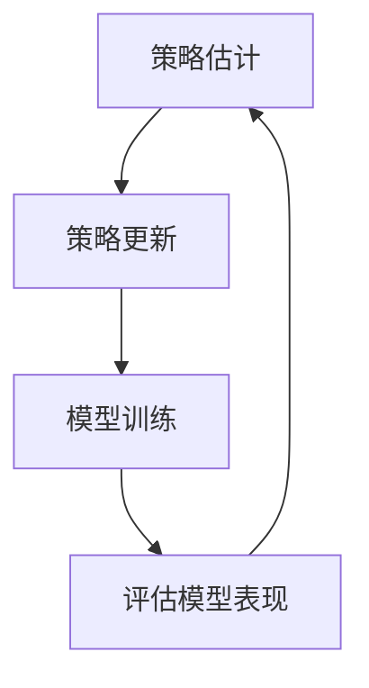

## 背景介绍

随着深度学习技术的不断发展，大型语言模型（Large Language Model, LLM）已经成为人工智能领域的焦点。这些模型通过大量的数据集和计算资源的支持，能够生成准确、连贯和自然的文本内容。其中，Proximal Policy Optimization（PPO）算法在大语言模型领域具有广泛的应用前景。PPO 算法是一种强化学习（Reinforcement Learning, RL）方法，其核心思想是通过迭代地优化策略，从而提高模型的表现。

## 核心概念与联系

### 1.1 强化学习

强化学习是一种机器学习方法，通过与环境之间的交互来学习最佳行为策略。强化学习的基本元素包括：状态（state）、动作（action）、奖励（reward）和策略（policy）。状态表示环境的当前情况，动作是对环境的响应，奖励是对策略的反馈，而策略则是确定行为的规则。

### 1.2 PPO 算法

PPO 算法是一种基于强化学习的方法，旨在通过迭代地优化策略，从而提高模型的表现。PPO 算法的核心思想是：在当前策略下，找到一个在预期回报中较好但不超过预期的新策略。这种策略改进的方法称为“近端策略优化”（Proximal Policy Optimization）。

### 1.3 PPO 算法与大语言模型的联系

大语言模型可以看作一种基于强化学习的生成模型，其目标是通过学习文本数据来生成连贯、准确和自然的文本内容。PPO 算法可以用于优化大语言模型的策略，从而提高模型的生成性能。通过将强化学习技术应用于大语言模型，PPO 算法为构建高效、智能的大语言模型提供了有力支持。

## 核心算法原理具体操作步骤

### 2.1 策略估计

策略估计是 PPO 算法的第一步，用于计算当前策略的值函数（value function）。值函数表示在执行某个策略后所获得的累积奖励的期望。通过计算值函数，可以评估不同策略的效果，从而选择最佳策略。

### 2.2 策略更新

策略更新是 PPO 算法的第二步，用于优化当前策略。策略更新过程中，PPO 算法采用了一个称为“克隆策略”（clipped surrogate objective）的方法。克隆策略可以确保新策略在预期回报中较好但不超过预期，从而实现策略优化。

### 2.3 PPO 算法流程图



## 数学模型和公式详细讲解举例说明

### 3.1 策略估计

策略估计使用了熵熵系数（entropy coefficient）来平衡探索和利用之间的关系。熵熵系数是一种用于衡量策略多样性的指标，较大的熵熵系数表示策略更具探索性，而较小的熵熵系数表示策略更具利用性。

### 3.2 策略更新

策略更新使用了一种名为“克隆策略”（clipped surrogate objective）的方法。克隆策略通过限制新策略与旧策略之间的差异，从而确保新策略在预期回报中较好但不超过预期。

### 3.3 PPO 算法数学公式

PPO 算法的核心公式如下：

$$
L^{clip}\left(\pi_{\theta}, \pi_{\theta'}\right) = \min\left(\frac{\pi_{\theta'}(a|s)}{\pi_{\theta}(a|s)}, clip\left(\frac{\pi_{\theta'}(a|s)}{\pi_{\theta}(a|s)}, 1 - \epsilon, 1 + \epsilon\right)\right) \cdot \frac{P_{\theta'}(s_t|s_{t-1}, a_{t-1})}{P_{\theta}(s_t|s_{t-1}, a_{t-1})} \cdot R_t
$$

其中，$$\pi_{\theta}$$表示当前策略，$$\pi_{\theta'}$$表示新策略，$$\epsilon$$表示剪切参数，$$P_{\theta}$$表示状态转移概率，$$R_t$$表示时间步t的奖励。

## 项目实践：代码实例和详细解释说明

### 4.1 PPO 算法实现

PPO 算法可以使用各种深度学习框架实现，如TensorFlow和PyTorch。以下是一个简单的PPO算法实现示例：

```python
import torch
import torch.nn as nn
import torch.optim as optim

class PPO(nn.Module):
    def __init__(self, num_inputs, num_outputs, hidden_size, learning_rate):
        super(PPO, self).__init__()
        self.fc1 = nn.Linear(num_inputs, hidden_size)
        self.fc2 = nn.Linear(hidden_size, hidden_size)
        self.fc3 = nn.Linear(hidden_size, num_outputs)
        self.optimizer = optim.Adam(self.parameters(), lr=learning_rate)

    def forward(self, x):
        x = torch.tanh(self.fc1(x))
        x = torch.tanh(self.fc2(x))
        return torch.softmax(self.fc3(x), dim=-1)

    def update(self, states, actions, old_log_probs, advantages, clip_ratio, epsilon):
        new_log_probs = self.get_log_prob(states, actions)
        ratio = (new_log_probs - old_log_probs).exp()
        surr1 = ratio * advantages
        surr2 = torch.clamp(ratio, 1 - epsilon, 1 + epsilon) * advantages
        policy_loss = -torch.min(surr1, surr2).mean()
        value_loss = 0.5 * (advantages.mean() ** 2)
        self.optimizer.zero_grad()
        (policy_loss + value_loss).backward()
        self.optimizer.step()

    def get_log_prob(self, states, actions):
        log_prob = torch.log(self.forward(states) * actions)
        return log_prob
```

### 4.2 代码解释

上述代码实现了一个简单的PPO算法，其中包括以下关键部分：

* 模型定义：使用深度学习框架实现PPO算法，包括输入层、隐藏层和输出层。
* 前向传播：将输入数据通过隐藏层进行处理，然后得到输出概率分布。
* 更新策略：计算新老概率比，并根据剪切参数限制其范围。然后计算优势函数，从而计算策略损失和值损失。最后，使用优化器更新模型参数。

## 实际应用场景

PPO 算法在大语言模型领域具有广泛的应用前景。例如，可以用于构建智能助手、机器翻译、文本摘要等应用。通过将强化学习技术应用于大语言模型，PPO 算法为构建高效、智能的大语言模型提供了有力支持。

## 工具和资源推荐

* OpenAI的GPT-3模型：<https://openai.com/api/>
* TensorFlow：<https://www.tensorflow.org/>
* PyTorch：<https://pytorch.org/>
* Proximal Policy Optimization（PPO）论文：<https://arxiv.org/abs/1707.06347>

## 总结：未来发展趋势与挑战

随着深度学习技术的不断发展，大型语言模型在各领域得到广泛应用。PPO 算法作为一种强化学习方法，在大语言模型领域具有广泛的应用前景。然而，PPO 算法面临诸如计算资源、数据集、安全性等挑战。未来，PPO 算法在大语言模型领域的发展趋势将包括更高效的算法、更大的数据集、更强大的安全措施等。

## 附录：常见问题与解答

Q: PPO 算法的优势在哪里？
A: PPO 算法的优势在于其易于实现、易于调参以及较好的稳定性。同时，PPO 算法在大规模数据集和复杂环境下的表现也非常出色。

Q: PPO 算法与其他强化学习方法的区别在哪里？
A: PPO 算法与其他强化学习方法的主要区别在于其策略更新方法。PPO 算法采用了克隆策略，从而在保证策略改进的同时保持策略的稳定性。其他强化学习方法，如TRPO（Trust Region Policy Optimization）则通过限制策略变化的范围来实现稳定性。

Q: 如何选择剪切参数（clip\_ratio）？
A: 剪切参数的选择取决于具体问题和场景。通常情况下，选择一个较小的剪切参数可以确保策略的稳定性，而选择较大的剪切参数可以提高策略的探索能力。在实际应用中，通过多次尝试和调整剪切参数来找到最佳值是一个常见的方法。