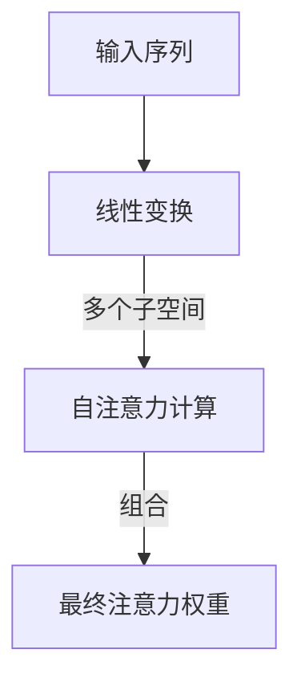

## 背景介绍

近年来，深度学习在自然语言处理（NLP）领域取得了突飞猛进的发展。其中，基于自注意力（self-attention）机制的Transformer模型成为研究和实践的焦点。自注意力机制可以有效地捕捉输入序列中的长程依赖关系，从而提高了模型的性能。

在本文中，我们将探讨一种特殊的自注意力机制——多头自注意力（Multi-Head Attention），并分析其在大语言模型中的应用。我们将从以下几个方面展开讨论：

1. 多头自注意力的核心概念与联系
2. 多头自注意力的核心算法原理与具体操作步骤
3. 多头自注意力的数学模型与公式详细讲解
4. 项目实践：多头自注意力在大语言模型中的应用
5. 实际应用场景
6. 工具和资源推荐
7. 总结：未来发展趋势与挑战

## 多头自注意力的核心概念与联系

多头自注意力是一种特殊的自注意力机制，它将输入的表示分为多个子空间，并在这些子空间上进行独立的自注意力计算。这些子空间可以看作是特征表示的不同视角。然后，将这些子空间的注意力权重线性组合，得到最终的注意力权重。这种方法可以让模型学习多个不同的特征表示，从而提高模型的表达能力。

多头自注意力的核心概念可以追溯到机器翻译领域。早期的机器翻译模型，如sequence-to-sequence（seq2seq）模型，主要依赖递归神经网络（RNN）和循环神经网络（LSTM）。然而，这些模型在处理长距离依赖关系时存在性能瓶颈。随着Transformer模型的出现，多头自注意力成为其核心组件，彻底改变了NLP领域的研究和应用方向。

## 多头自注意力的核心算法原理与具体操作步骤

多头自注意力的计算过程可以分为以下几个步骤：

1. 将输入序列的表示进行线性变换，得到多个子空间的表示。通常情况下，我们会选择一个小于输入维度的数值作为子空间维度。
2. 对每个子空间进行自注意力计算。自注意力计算过程包括三个步骤：求权重、求加权和和归一化。其中，求权重的过程可以使用双线性函数（dot product）或三线性函数（concatenation and feed-forward network）来实现。
3. 对每个子空间的注意力权重进行线性组合，得到最终的注意力权重。组合过程可以使用加权求和或矩阵乘法实现。

多头自注意力计算流程可以使用Mermaid流程图进行可视化，具体实现如下：

## 多头自注意力的数学模型与公式详细讲解

多头自注意力的数学模型可以用以下公式表示：

$$
\text{MultiHead}(Q, K, V) = \text{Concat}(h_1, ..., h_h)W^O
$$

其中，$Q$、$K$和$V$分别表示查询、键和值的输入矩阵，$h$表示子空间的数量，$W^O$表示输出矩阵的权重。

多头自注意力的计算过程可以分为以下几个步骤：

1. 线性变换：对输入矩阵$Q$、$K$和$V$进行线性变换，得到$Q^'$、$K^'$和$V^'$。
2. 自注意力计算：对$Q^'$和$K^'$进行点积运算，得到注意力分数矩阵$A$。然后，对$A$进行归一化，得到注意力权重矩阵$A^'$。
3. 加权求和：对$A^'$和$V^'$进行元素-wise乘法，得到加权求和矩阵$B$。最后，对$B$进行归一化，得到最终的输出矩阵$O$。

## 项目实践：多头自注意力在大语言模型中的应用

多头自注意力在大语言模型中具有广泛的应用，例如BERT、GPT和T5等。这些模型都采用了多头自注意力作为核心组件，以提高模型的表达能力和性能。

例如，在BERT模型中，多头自注意力用于计算输入句子中的上下文关系。输入句子经过词嵌入和位置编码后，经过多头自注意力计算。最后，得到的上下文表示与原始输入句子进行拼接，并输入到后续的任务网络中进行训练。

## 实际应用场景

多头自注意力在实际应用中具有广泛的应用场景，例如：

1. 机器翻译：多头自注意力可以帮助模型捕捉输入序列中的长程依赖关系，从而提高翻译质量。
2. 情感分析：通过分析文本中的词汇和句子间的关系，可以更准确地判断文本的情感倾向。
3. 问答系统：多头自注意力可以帮助模型理解用户的问题，并找到相关的答案。

## 工具和资源推荐

对于想要学习和应用多头自注意力的读者，我们推荐以下工具和资源：

1. TensorFlow和PyTorch：这两个深度学习框架都支持自注意力机制的实现，可以作为学习和应用多头自注意力的好去处。
2. Hugging Face Transformers：这是一个开源的NLP库，提供了许多预训练好的大语言模型，如BERT、GPT和T5等。这些模型都采用了多头自注意力作为核心组件，可以作为学习和参考。
3. 《Attention is All You Need》：这是一个关于Transformer模型的经典论文，详细介绍了多头自注意力的原理和应用。

## 总结：未来发展趋势与挑战

多头自注意力在NLP领域具有广泛的应用前景。随着深度学习技术的不断发展，我们相信多头自注意力在未来将具有更多的应用场景和更高的性能。然而，多头自注意力也面临着一些挑战，如计算复杂性和过拟合等。我们需要不断探索新的技术和方法来解决这些问题，以实现更好的模型性能。

## 附录：常见问题与解答

1. 多头自注意力与单头自注意力有什么区别？

多头自注意力与单头自注意力的主要区别在于它们的计算过程。多头自注意力将输入的表示分为多个子空间，并在这些子空间上进行独立的自注意力计算。然后，将这些子空间的注意力权重线性组合，得到最终的注意力权重。这种方法可以让模型学习多个不同的特征表示，从而提高模型的表达能力。相比之下，单头自注意力只在一个子空间上进行自注意力计算。

2. 多头自注意力有什么优缺点？

多头自注意力的优点在于它可以让模型学习多个不同的特征表示，从而提高模型的表达能力。同时，它也减轻了计算复杂性，降低了模型的参数数量。

多头自注意力的缺点在于它可能导致计算复杂性较高，特别是在处理大规模数据集时。另外，过拟合也是一个需要注意的问题。