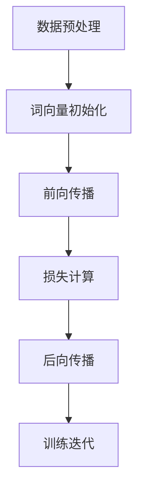

## 背景介绍

随着人工智能技术的不断发展，大型语言模型（LLM）已经成为一种主流技术。它们广泛应用于机器翻译、文本摘要、语音识别、语义分析、自然语言生成等多个领域。近年来，LLM的研究取得了重要突破，如OpenAI的GPT-3、Google的BERT、Hugging Face的Transformers等，这些模型在各个领域取得了显著的成果。

## 核心概念与联系

大型语言模型的核心概念是基于深度学习技术，通过训练大量的文本数据，学习语言的结构和规律，从而实现自然语言处理（NLP）的各种功能。LLM的主要组成模块包括：

1. **词嵌入（Word Embeddings）：** 将词汇映射到高维空间的向量表示，保留词间的语义关系。
2. **文本编码（Text Encoding）：** 将输入文本转换为固定长度的向量序列，用于后续处理。
3. **自注意力机制（Self-Attention Mechanism）：** 利用注意力机制对输入序列进行加权求和，实现长距离依赖关系的捕捉。
4. **解码器（Decoder）：** 根据输入序列生成输出序列，实现语言生成等功能。
5. **优化算法（Optimization Algorithm）：** 通过训练数据对模型进行优化，以最小化损失函数。

这些组成模块之间相互联系，共同构成了大型语言模型的基本架构。

## 核心算法原理具体操作步骤

大型语言模型的训练过程可以概括为以下几个主要步骤：

1. **数据预处理：** 收集大量的文本数据，进行清洗和分词处理，生成输入输出对。
2. **词向量初始化：** 为词汇生成随机初始化的向量表示。
3. **前向传播：** 根据输入序列计算输出序列的概率分布。
4. **损失计算：** 计算预测值与真实值之间的损失。
5. **后向传播：** 根据损失值对模型参数进行更新。
6. **训练迭代：** 重复上述步骤，直到模型收敛。

这些步骤在训练过程中不断重复，直到模型的性能满意为止。



## 数学模型和公式详细讲解举例说明

在本节中，我们将详细讲解大型语言模型的数学模型和公式。我们将以BERT为例进行讲解。

BERT模型的核心是双向自注意力机制，它将输入文本的每个词与其他词之间的关系建模。BERT的输入是一个定长的文本序列，经过特征抽取和分词处理后，输入到模型中。

输入文本经过分词后，得到的词元表示为$$
x = \{x_1, x_2, ..., x_n\}
$$

其中$$
x_i \in \mathbb{R}^d
$$

是词元$$
i
$$的词向量，$$
d
$$是词向量的维度。这些词元向量经过自注意力层处理后，得到上下文向量$$
h = \{h_1, h_2, ..., h_n\}
$$

其中$$
h_i \in \mathbb{R}^d
$$

是词元$$
i
$$的上下文向量。BERT模型使用一个双层Transformer架构，其中一个用于对输入序列进行编码，另一个用于对编码后的序列进行解码。

## 项目实践：代码实例和详细解释说明

在本节中，我们将介绍如何使用Python和Hugging Face的Transformers库实现一个简单的BERT模型。首先，我们需要安装Transformers库：

```python
!pip install transformers
```

然后，我们可以使用以下代码实现一个简单的BERT模型：

```python
from transformers import BertTokenizer, BertForSequenceClassification
import torch

tokenizer = BertTokenizer.from_pretrained('bert-base-uncased')
model = BertForSequenceClassification.from_pretrained('bert-base-uncased')

inputs = tokenizer("This is an example sentence.", return_tensors="pt")
outputs = model(**inputs)

loss = outputs.loss
logits = outputs.logits
```

在上述代码中，我们首先导入了BertTokenizer和BertForSequenceClassification类，并从预训练模型中加载它们。然后，我们使用tokenizer对输入文本进行分词处理，并将其转换为PyTorch的Tensor对象。最后，我们使用模型对输入文本进行编码，并计算损失值和预测结果。

## 实际应用场景

大型语言模型广泛应用于多个领域，以下是一些典型的应用场景：

1. **机器翻译：** 利用LLM将一种自然语言翻译为另一种语言，实现跨语言沟通。
2. **文本摘要：** 根据长篇文章生成简短的摘要，提高信息传递效率。
3. **语音识别：** 将语音信号转换为文本，实现语音与文字之间的互转。
4. **语义分析：** 对文本进行深度分析，抽取关键信息和情感等特征。
5. **自然语言生成：** 根据给定的条件生成自然语言文本，例如生成邮件正文、智能助手响应等。

## 工具和资源推荐

对于学习和实践大型语言模型，以下是一些推荐的工具和资源：

1. **Hugging Face：** 提供了许多预训练模型和相关工具，方便用户快速尝试和使用。
2. **TensorFlow、PyTorch：** 为深度学习提供了强大的框架，支持自定义模型和优化算法。
3. **Coursera、edX：** 提供了许多与深度学习和自然语言处理相关的在线课程，方便学习基础知识和进阶技能。
4. **Google Colab、Jupyter Notebook：** 提供了在线编程平台，方便用户进行实验和代码共享。

## 总结：未来发展趋势与挑战

大型语言模型在自然语言处理领域取得了显著的成果，但仍面临诸多挑战。未来的发展趋势包括：

1. **模型规模和性能的提升：** 未来，LLM将继续扩大规模，以实现更高的性能和效率。
2. **多模态学习：** 未来，LLM将逐渐融合多模态信息，如图像、视频等，实现多任务学习。
3. **安全性和可控性：** 未来，如何确保LLM的安全性和可控性将成为一个重要的挑战。

## 附录：常见问题与解答

在本篇博客中，我们探讨了大型语言模型的原理、组成模块选型、实际应用场景等方面。对于那些仍然存在的问题，我们提供了以下解答：

1. **如何选择合适的模型？** 根据具体应用场景和需求，选择合适的预训练模型和优化算法。
2. **如何优化模型性能？** 通过调整模型参数、使用更好的优化算法、增加更多的训练数据等方式，来提高模型性能。
3. **如何解决模型过拟合的问题？** 可以使用正则化技术、增加更多的训练数据、使用更好的优化算法等方法，来解决模型过拟合的问题。

希望本篇博客能帮助读者更好地理解大型语言模型的原理和工程实践，为实际应用提供有力支持。