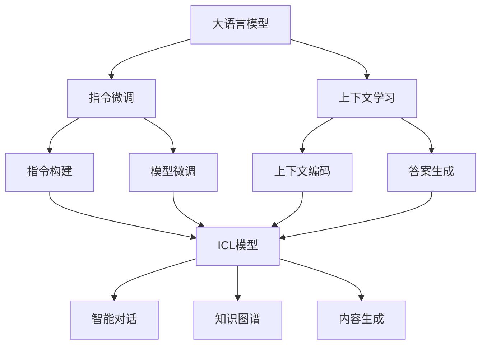

# 大语言模型原理基础与前沿 为什么ICL有效

## 1.背景介绍
### 1.1 大语言模型的发展历程
#### 1.1.1 早期的语言模型
#### 1.1.2 神经网络语言模型的兴起
#### 1.1.3 Transformer的革命性突破
### 1.2 ICL的提出与意义
#### 1.2.1 ICL的概念
#### 1.2.2 ICL解决的问题
#### 1.2.3 ICL的研究价值

## 2.核心概念与联系
### 2.1 大语言模型的基本原理
#### 2.1.1 语言模型的定义
#### 2.1.2 大语言模型的特点
#### 2.1.3 大语言模型的训练方法
### 2.2 ICL的核心思想
#### 2.2.1 指令微调(Instruction Tuning)
#### 2.2.2 上下文学习(Context Learning)
#### 2.2.3 ICL与传统微调方法的区别
### 2.3 ICL与大语言模型的关系
#### 2.3.1 ICL对大语言模型的改进
#### 2.3.2 ICL与大语言模型的互补性
#### 2.3.3 ICL在大语言模型中的应用前景

## 3.核心算法原理具体操作步骤
### 3.1 ICL的训练流程
#### 3.1.1 数据准备
#### 3.1.2 指令构建
#### 3.1.3 模型微调
### 3.2 ICL的推理过程
#### 3.2.1 指令解析
#### 3.2.2 上下文匹配
#### 3.2.3 答案生成
### 3.3 ICL的优化技巧
#### 3.3.1 数据增强
#### 3.3.2 指令优化
#### 3.3.3 模型集成

## 4.数学模型和公式详细讲解举例说明
### 4.1 语言模型的数学表示
#### 4.1.1 概率语言模型
#### 4.1.2 n-gram模型
#### 4.1.3 神经网络语言模型
### 4.2 Transformer的数学原理
#### 4.2.1 自注意力机制
#### 4.2.2 多头注意力
#### 4.2.3 残差连接与层归一化
### 4.3 ICL的数学建模
#### 4.3.1 指令嵌入
#### 4.3.2 上下文编码
#### 4.3.3 答案解码

## 5.项目实践：代码实例和详细解释说明
### 5.1 基于PyTorch实现ICL
#### 5.1.1 数据处理
#### 5.1.2 模型定义
#### 5.1.3 训练与评估
### 5.2 基于TensorFlow实现ICL
#### 5.2.1 数据处理
#### 5.2.2 模型定义 
#### 5.2.3 训练与评估
### 5.3 ICL在实际项目中的应用
#### 5.3.1 智能客服系统
#### 5.3.2 知识问答系统
#### 5.3.3 文本生成系统

## 6.实际应用场景
### 6.1 智能对话系统
#### 6.1.1 个人助理
#### 6.1.2 客服机器人
#### 6.1.3 陪伴型聊天机器人
### 6.2 知识图谱构建
#### 6.2.1 实体关系抽取
#### 6.2.2 知识库问答
#### 6.2.3 知识推理与决策
### 6.3 内容生成与创作
#### 6.3.1 文章写作辅助
#### 6.3.2 故事情节生成
#### 6.3.3 广告文案创作

## 7.工具和资源推荐
### 7.1 开源工具包
#### 7.1.1 Hugging Face Transformers
#### 7.1.2 OpenAI GPT-3 API
#### 7.1.3 Google BERT
### 7.2 预训练模型
#### 7.2.1 BERT
#### 7.2.2 GPT-2/GPT-3
#### 7.2.3 T5
### 7.3 学习资源
#### 7.3.1 在线课程
#### 7.3.2 学术论文
#### 7.3.3 技术博客

## 8.总结：未来发展趋势与挑战
### 8.1 大语言模型的发展趋势
#### 8.1.1 模型规模的持续增长
#### 8.1.2 多模态语言模型的兴起
#### 8.1.3 领域适应与个性化
### 8.2 ICL的研究方向
#### 8.2.1 指令表示的优化
#### 8.2.2 上下文编码的增强
#### 8.2.3 ICL与其他技术的融合
### 8.3 面临的挑战
#### 8.3.1 数据质量与多样性
#### 8.3.2 模型的可解释性
#### 8.3.3 伦理与安全问题

## 9.附录：常见问题与解答
### 9.1 ICL与传统微调方法的区别是什么？
### 9.2 ICL能否应用于其他NLP任务？ 
### 9.3 如何选择合适的预训练模型进行ICL？
### 9.4 ICL对计算资源有什么要求？
### 9.5 如何评估ICL模型的性能？

大语言模型(Large Language Models, LLMs)是自然语言处理领域近年来的重大突破。它们通过在海量文本数据上进行预训练，学习到了丰富的语言知识和生成能力。然而，如何将预训练的语言模型应用于下游任务，并使其具备执行指令的能力，仍然是一个挑战。指令微调(Instruction Tuning)和上下文学习(Context Learning)的结合，即ICL(Instruction-Context Learning)，为解决这一问题提供了一种有效的思路。

ICL的核心思想是通过构建指令-上下文-答案的三元组数据，对预训练的语言模型进行微调，使其学会理解指令并根据上下文生成恰当的答案。在ICL的训练过程中，首先需要准备大量的指令-上下文-答案数据。指令可以是一个问题、一个命令或一个需求；上下文是与指令相关的背景信息；答案则是基于指令和上下文生成的目标文本。通过这种形式的数据，模型可以学习到如何根据指令和上下文进行推理和生成。

在模型训练阶段，ICL采用了指令微调和上下文学习两种方式。指令微调是将指令嵌入到输入中，引导模型根据指令生成答案。上下文学习则是将上下文编码为向量，提供给模型作为附加信息，帮助模型更好地理解指令和生成答案。通过联合优化指令微调和上下文学习的损失函数，模型可以同时学习理解指令和利用上下文。

ICL在实践中已经展现出了优异的性能。通过在大规模语料库上进行训练，ICL模型可以掌握广泛的知识和语言技能。在智能对话、知识图谱构建、内容生成等任务中，ICL模型表现出了强大的理解和生成能力。例如，在智能客服场景下，ICL模型可以根据用户的问题和上下文，生成准确、流畅、符合语境的回复，大大提升了用户体验。在知识图谱构建任务中，ICL模型可以从非结构化文本中抽取实体和关系，并根据上下文进行知识推理和问答。在内容创作领域，ICL模型可以根据给定的主题、关键词、写作风格等指令，自动生成高质量的文章、故事、广告文案等。

ICL的数学原理建立在语言模型和Transformer架构之上。语言模型使用概率分布来刻画单词序列的生成过程，通过最大化目标文本的概率来学习语言规律。Transformer引入了自注意力机制和多头注意力，使模型能够捕捉单词之间的长距离依赖关系，并实现并行计算。ICL在此基础上，通过指令嵌入和上下文编码，将指令和上下文信息引入到语言模型中，引导模型根据指令和上下文生成答案。

尽管ICL已经取得了显著的进展，但仍然存在一些挑战和未来的研究方向。首先，构建高质量、多样化的指令-上下文-答案数据集是一项耗时耗力的工作，需要探索更加自动化、高效的数据生成方法。其次，ICL模型的可解释性仍然是一个问题，需要研究如何让模型的决策过程更加透明和可理解。此外，在实际应用中，还需要考虑ICL模型的伦理和安全问题，如何避免生成有害、偏见或不恰当的内容。

总的来说，ICL是大语言模型领域的一个重要进展，通过指令微调和上下文学习，使预训练的语言模型具备了执行指令的能力。ICL在智能对话、知识图谱、内容生成等任务中展现出了巨大的应用潜力。随着研究的不断深入，ICL有望成为自然语言处理的一个重要范式，推动人机交互和知识应用的发展。

未来，大语言模型的发展趋势包括模型规模的持续增长、多模态语言模型的兴起以及领域适应与个性化。ICL的研究方向也将围绕指令表示的优化、上下文编码的增强以及与其他技术的融合展开。同时，我们还需要关注数据质量与多样性、模型可解释性以及伦理与安全等方面的挑战。

总之，ICL为大语言模型的应用开辟了新的可能性，使其能够更好地理解和执行人类的指令。相信通过研究者的不断探索和创新，ICL将在未来的自然语言处理和人工智能领域发挥更加重要的作用。

作者：禅与计算机程序设计艺术 / Zen and the Art of Computer Programming