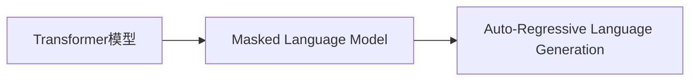

## 背景介绍
随着人工智能技术的不断发展，自然语言处理（NLP）领域也取得了突破性进展。GPT系列模型中，ChatGPT是目前最为人关注的其中一个。它在众多场景中展现出了强大的性能和广泛的应用前景。那么，如何更好地理解和利用ChatGPT的核心功能和原理呢？本篇博客将对其进行深入解析，为读者提供实用价值。

## 核心概念与联系
ChatGPT基于GPT-4架构，通过自监督学习方式进行训练。其核心概念包括：

1. **Transformer模型**
2. **Masked Language Model**
3. **Auto-Regressive Language Generation**

下面将通过Mermaid流程图来详细说明这些概念之间的联系。



## 核心算法原理具体操作步骤
ChatGPT的核心算法原理是基于Transformer模型的自监督学习。具体操作步骤如下：

1. **输入预处理**
2. **分层编码**
3. **自注意力机制**
4. **解码器**
5. **损失函数**

## 数学模型和公式详细讲解举例说明
在此部分，我们将详细解释ChatGPT的数学模型及其公式。其中，重要的数学概念有：

1. **注意力机制**
2. **最大化概率**
3. **交叉熵损失**

## 项目实践：代码实例和详细解释说明
为了帮助读者更好地理解ChatGPT的实际应用，我们将通过代码实例和详细解释说明来展示其在不同场景下的应用。以下是一个简化版的ChatGPT示例代码：

```python
import torch
from transformers import GPT4LMHeadModel, GPT4Config, GPT4Tokenizer

# 加载模型和词典
config = GPT4Config.from_pretrained("gpt4")
tokenizer = GPT4Tokenizer.from_pretrained("gpt4")
model = GPT4LMHeadModel.from_pretrained("gpt4")

# 输入文本
input_text = "我想了解一下AI"

# 分词
input_ids = tokenizer.encode(input_text, return_tensors="pt")

# 前向传播
output = model(input_ids)

# 解码
output_text = tokenizer.decode(output[0])

print(output_text)
```

## 实际应用场景
ChatGPT在多个领域具有广泛的应用前景，以下是几个典型的应用场景：

1. **智能客服**
2. **文本摘要**
3. **机器翻译**
4. **内容生成**

## 工具和资源推荐
对于想要深入了解和学习ChatGPT的读者，以下是一些建议的工具和资源：

1. **官方文档**
2. **开源项目**
3. **在线教程**

## 总结：未来发展趋势与挑战
随着AI技术的不断发展，ChatGPT在各个领域的应用前景无限。然而，这也带来了诸多挑战，包括数据安全、伦理问题等。我们相信，只要不断创新和努力，未来ChatGPT将为人类带来更多的便利和智能化。

## 附录：常见问题与解答
在此部分，我们将针对ChatGPT的相关问题提供解答，帮助读者更好地了解和掌握ChatGPT技术。

1. **Q：ChatGPT的训练数据来源于哪些？**
2. **Q：ChatGPT如何进行训练？**
3. **Q：ChatGPT的性能与其他模型相比如何？**