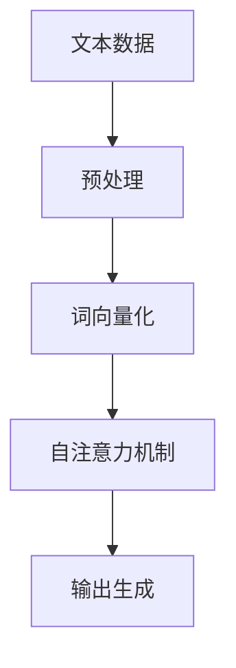

## 背景介绍

近年来，人工智能领域的发展迅速，其中大语言模型（Large Language Model，LLM）成为业界关注的焦点。OpenAI作为一家具有全球影响力的AI研究机构，其大语言模型GPT-3和GPT-4在AI领域引起了巨大的反响。本篇博客将从概念、原理、应用场景等方面详细介绍OpenAI大语言模型，帮助读者更好地了解大语言模型的魅力。

## 核心概念与联系

大语言模型是基于深度学习技术构建的一种自动学习文本表示的方法。它通过学习大量文本数据，从而生成自然语言文本。OpenAI的GPT系列模型（GPT-3和GPT-4）都是基于Transformer架构的大语言模型。下面是Mermaid流程图，简要展示了大语言模型的训练过程：

## 核心算法原理具体操作步骤

### 预处理

首先，需要将原始文本数据进行预处理，包括去停词、分词、标记词性等。

### 词向量化

将预处理后的文本进行词向量化，将文本中的词汇映射到向量空间。通常使用Word2Vec、GloVe等技术进行词向量化。

### 自注意力机制

通过自注意力机制，模型可以根据输入序列的上下文信息生成输出序列。这种机制使得模型能够捕捉输入序列中的长距离依赖关系。

### 输出生成

最后，模型根据输入序列生成输出序列。模型采用概率分布来选择输出序列中的每个词。

## 数学模型和公式详细讲解举例说明

GPT模型的核心数学概念是自注意力机制。对于输入序列，自注意力机制计算每个词与其他词之间的相关性，然后对相关性进行加权求和，得到最终的输出。具体公式如下：

$$
Attention(Q,K,V) = softmax(\frac{QK^T}{\sqrt{d_k}})V
$$

其中，$Q$是查询矩阵，$K$是关键词矩阵，$V$是值矩阵。$d_k$是关键词矩阵的维数。

## 项目实践：代码实例和详细解释说明

OpenAI GPT-3和GPT-4的代码实现比较复杂，不适合在博客中详细介绍。然而，OpenAI官方提供了GPT-2的代码实现，我们可以从这里了解到一些GPT系列模型的基本原理。

## 实际应用场景

大语言模型具有广泛的应用场景，如：

1. 机器翻译
2. 文本摘要
3. 问答系统
4. 文本生成
5. 文本分类
6. 语义理解

## 工具和资源推荐

对于想要学习大语言模型的读者，以下工具和资源非常有用：

1. TensorFlow：一个开源的机器学习和深度学习框架，可以用于构建和训练大语言模型。
2. Hugging Face：提供了许多预训练好的自然语言处理模型和工具，可以快速入手进行实验。
3. "深度学习入门"：一本介绍深度学习基本概念和原理的书籍，非常适合入门读者。

## 总结：未来发展趋势与挑战

随着AI技术的不断发展，大语言模型将在更多领域得到应用。然而，未来大语言模型也面临诸多挑战，如数据偏差、伦理问题等。我们期待着大语言模型在未来不断发展，推动人类文明的进步。

## 附录：常见问题与解答

1. 大语言模型的训练数据来自哪里？

大语言模型的训练数据通常来自互联网上的文本数据，如网页、博客、新闻等。为了确保模型的质量，通常需要进行大量的数据清洗和预处理。

2. 大语言模型为什么会出现偏差？

由于大语言模型的训练数据来源于互联网，因此可能存在数据偏差。例如，模型可能在某些领域存在知识缺失或存在偏见。为了解决这个问题，需要不断地更新模型并进行修正。

3. 如何确保大语言模型的伦理性？

确保大语言模型的伦理性需要从多个方面考虑，如数据隐私、模型解释性等。同时，我们需要制定相关的伦理规范和标准，确保模型在实际应用中符合社会道德和法律要求。