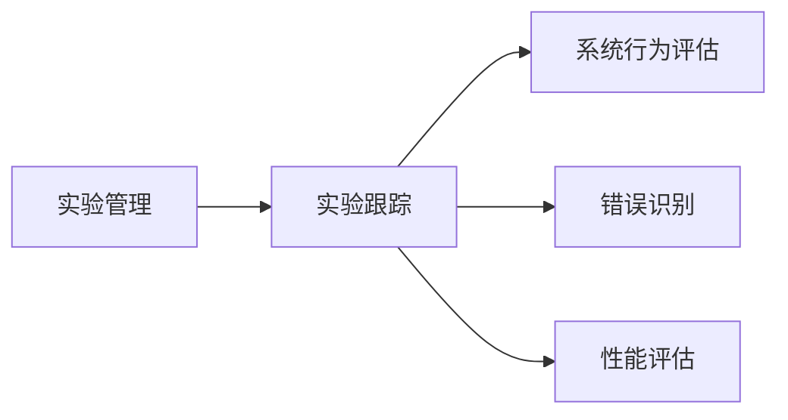

## 1. 背景介绍

实验跟踪和实验管理是现代软件开发过程中不可或缺的环节。它涉及到软件开发的各个阶段，从需求分析、设计、编码到测试和部署。实验跟踪可以帮助开发人员更好地理解系统行为，评估性能，识别错误并解决问题。实验管理则可以帮助团队更好地协作，提高开发效率，降低成本。

在本篇博客中，我们将探讨实验跟踪与实验管理的原理，介绍其在实际应用中的代码实例，并讨论未来发展趋势与挑战。

## 2. 核心概念与联系

实验跟踪是一种用于记录、分析和评估系统行为的方法。它可以帮助开发人员识别错误，评估性能，优化系统。实验管理则是一种用于协作和组织实验的方法。它可以帮助团队更好地协作，提高开发效率，降低成本。

实验跟踪与实验管理之间存在密切的联系。实验管理可以帮助开发人员更好地组织和协作，而实验跟踪则可以帮助开发人员更好地理解系统行为。下面是实验跟踪与实验管理的关系图：

## 3. 核心算法原理具体操作步骤

实验跟踪的核心算法原理是通过收集和分析系统行为数据来评估性能，识别错误并优化系统。以下是实验跟踪的具体操作步骤：

1. 设计实验：根据需求分析和设计阶段的结果，制定实验计划，包括实验目标、实验环境、数据收集方式等。

2. 收集数据：通过各种工具和方法收集系统行为数据，例如日志、性能监控数据、错误日志等。

3. 分析数据：对收集到的数据进行分析，评估系统性能，识别错误，找出系统问题。

4. 优化系统：根据数据分析结果，优化系统，修复错误，提高性能。

实验管理的核心算法原理是通过协作和组织实验来提高开发效率，降低成本。以下是实验管理的具体操作步骤：

1. 设定实验目标：根据项目需求，设定实验目标，确保实验的目的是明确的。

2. 分配资源：根据实验目标，分配人力、物力和财力资源，确保实验能够顺利进行。

3. 协调实验过程：通过各种协作工具和方法，协调实验过程，确保实验能够按照计划进行。

4. 监控实验进度：通过各种监控工具和方法，监控实验进度，确保实验能够按时完成。

## 4. 数学模型和公式详细讲解举例说明

实验跟踪和实验管理的数学模型和公式可以帮助开发人员更好地评估系统性能，识别错误和优化系统。以下是实验跟踪和实验管理的数学模型和公式举例说明：

实验跟踪：

1. 性能评估：可以通过公式 $$ T = \frac{1}{R} $$ 来计算系统响应时间，其中 $$ T $$ 为响应时间，$$ R $$ 为吞吐量。

2. 错误识别：可以通过公式 $$ E = \frac{N}{N+P} $$ 来计算错误率，其中 $$ E $$ 为错误率，$$ N $$ 为正确的请求数，$$ P $$ 为错误的请求数。

实验管理：

1. 资源分配：可以通过公式 $$ R = \frac{P}{T} $$ 来计算资源需求，其中 $$ R $$ 为资源需求，$$ P