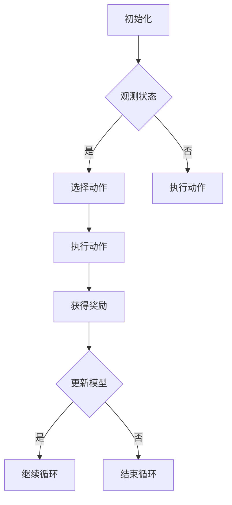

## 背景介绍
强化学习（Reinforcement Learning, 简称RL）是机器学习领域的一个重要分支，它致力于通过与环境的交互来学习行为策略。在过去的几十年里，RL已经成功地应用于许多领域，如游戏、控制、自然语言处理等。然而，在能源领域的应用尚处于起步阶段，特别是在能源效率管理方面。
## 核心概念与联系
在能源效率管理系统中，强化学习可以被用来优化能源使用行为，降低能源消耗，提高能源使用效率。为了实现这一目标，RL系统需要与能源系统建立一个模型，以便了解能源系统的状态、动作和奖励。RL系统可以通过对历史数据进行分析来学习能源系统的行为模式，并根据这些模式来制定优化策略。
## 核心算法原理具体操作步骤
强化学习算法的核心原理是通过试错和学习来优化行为策略。以下是一个简单的强化学习算法的流程图：

在这个流程中，RL系统首先初始化一个模型，然后不断观察系统状态并选择一个动作。执行这个动作后，RL系统会得到一个奖励，然后根据这个奖励来更新模型。如果模型仍然需要更新，RL系统将继续循环，直到模型更新完毕。
## 数学模型和公式详细讲解举例说明
强化学习的数学模型可以用马尔可夫决策过程（Markov Decision Process, MDP）来描述。MDP包含三个组件：状态集S、动作集A和奖励函数R。状态集S表示能源系统的所有可能状态，动作集A表示能源系统可以采取的所有可能动作，奖励函数R表示每个动作对应的奖励值。
## 项目实践：代码实例和详细解释说明
在这个部分，我们将介绍一个实际的RL项目实例：使用强化学习优化空调系统的能效。我们将使用Python和TensorFlow来实现这个项目。
## 实际应用场景
强化学习在能源效率管理系统中的应用有很多。例如，可以使用强化学习来优化建筑物的空调系统，降低能源消耗，提高能源使用效率。还可以使用强化学习来优化电力网的运行，降低能源损失，提高能源使用效率。
## 工具和资源推荐
如果你想深入了解强化学习在能源效率管理系统中的应用，可以参考以下资源：

1. "Reinforcement Learning: An Introduction" by Richard S. Sutton and Andrew G. Barto
2. "Deep Reinforcement Learning Handbook" by Volodymyr Mnih and Nicolas Heess
3. "Energy Management Systems: Design and Implementation" by Miroslav Kulich and Milos J. Dokic
4. "Deep Learning for Energy-Efficient Buildings" by Ammad Abdulbasir and Petri YliSonno
## 总结：未来发展趋势与挑战
在未来，强化学习在能源效率管理系统中的应用将持续发展。随着AI技术的不断进步，RL系统将变得越来越智能化，更好地满足能源系统的需求。然而，RL在能源领域的应用仍面临一些挑战，如数据质量、安全性和可解释性等。为了克服这些挑战，我们需要继续研究RL在能源领域的应用，并寻求更好的解决方案。
## 附录：常见问题与解答
1. Q: 如何选择合适的RL算法？A: 根据问题的特点和需求选择合适的RL算法。例如，DQN适用于具有大规模状态空间的问题，而PPO适用于具有复杂动作空间的问题。
2. Q: 如何评估RL算法的性能？A: 通过比较RL算法在测试环境中的表现来评估其性能。例如，可以使用累计回报、累计奖励或累计预测误差等指标来评估RL算法的性能。
3. Q: 如何解决RL算法的过拟合问题？A: 通过正则化、早停、数据增强等方法来解决RL算法的过拟合问题。