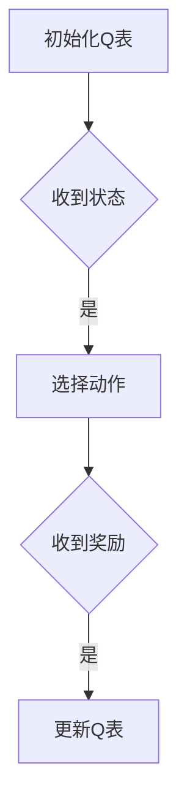

## 背景介绍

强化学习（Reinforcement Learning, RL）是一种机器学习方法，旨在通过交互地探索和利用环境来学习最佳行为策略。强化学习在许多领域具有广泛的应用前景，尤其是在机器人技术中。下面我们将深入探讨强化学习在机器人技术中的应用，包括其核心概念与联系、算法原理、数学模型、项目实践、实际应用场景等。

## 核心概念与联系

强化学习的基本组成部分包括：状态（state）、动作（action）、奖励（reward）和策略（policy）。状态是环境的当前状态，动作是agent（智能体）对环境的响应，奖励是agent所获得的反馈信息，策略是agent根据历史经验决定下一个动作的方法。强化学习的目标是找到一种策略，使得agent在任何给定状态下都能选择最佳动作，从而实现最大的累积奖励。

强化学习与传统机器学习方法的主要区别在于，它不仅仅依赖于数据来学习模型，还需要与环境进行交互以获得反馈信息。这种交互性使得强化学习具有更强的适应性和学习能力，可以在许多复杂的问题中取得优异的效果。

## 核心算法原理具体操作步骤

强化学习的核心算法包括：Q-学习（Q-learning）、 SARSA（State-Action-Reward-State-Action）学习等。以下是一个简单的Q-学习流程图：



在Q-学习中，agent维护一个Q表，以存储所有可能的状态和动作的价值。对于给定的状态，agent会选择一个动作，并在执行动作后获得一个奖励。根据这个奖励，agent会更新其Q表，以便在未来遇到相同状态时能够选择更好的动作。

## 数学模型和公式详细讲解举例说明

强化学习的数学模型通常涉及动态 Programming（DP）和迭代方法。以下是一个简单的Q-学习数学公式：

$$Q(s,a) \leftarrow Q(s,a) + \alpha[r + \gamma \max_{a'} Q(s',a') - Q(s,a)]$$

其中，Q(s,a)表示状态s下执行动作a的价值，α是学习率，r是奖励，γ是折扣因子，max_{a'} Q(s',a')是下一个状态s'下所有动作a'的最大价值。这个公式表示，在给定状态s下执行动作a后，agent会根据获得的奖励r以及未来状态s'的价值来更新其Q表。

## 项目实践：代码实例和详细解释说明

以下是一个简单的Q-学习代码示例，使用Python和OpenAI Gym库实现一个CartPole环境：

```python
import gym
import numpy as np

def q_learning(env, episodes, alpha, gamma, epsilon):
    Q = np.zeros([env.observation_space.n, env.action_space.n])
    
    for episode in range(episodes):
        state = env.reset()
        done = False
        
        while not done:
            if np.random.uniform(0, 1) < epsilon:
                action = env.action_space.sample()
            else:
                action = np.argmax(Q[state, :])
            
            next_state, reward, done, _ = env.step(action)
            Q[state, action] += alpha * (reward + gamma * np.max(Q[next_state, :]) - Q[state, action])
            state = next_state

    return Q

env = gym.make("CartPole-v1")
Q = q_learning(env, 1000, 0.01, 0.99, 0.1)
```

在这个示例中，我们使用OpenAI Gym库中的CartPole环境进行训练。我们初始化一个Q表，并在每次episode中执行Q-学习。每次迭代后，我们更新Q表，以便在未来遇到相同状态时能够选择更好的动作。

## 实际应用场景

强化学习在机器人技术中有很多实际应用场景，例如：

1. 路径规划：通过强化学习，agent可以学习如何在复杂环境中找到最短路径，以避免碰撞和其他障碍物。
2. 控制系统：强化学习可以用于控制复杂的动态系统，如飞行器和车辆，通过学习最佳控制策略来提高系统性能。
3. 机器人任务执行：强化学习可以帮助机器人学习如何执行复杂任务，如抓取对象、走路等。

## 工具和资源推荐

1. OpenAI Gym：一个广泛使用的机器学习库，提供了许多预先训练好的环境，可以用于强化学习实验。
2. TensorFlow：一个流行的深度学习框架，提供了许多强化学习算法的实现。
3. "Reinforcement Learning: An Introduction"：由Richard S. Sutton和Andrew G. Barto编写的经典强化学习教材。

## 总结：未来发展趋势与挑战

强化学习在机器人技术中的应用具有广泛的发展空间。随着算法和硬件技术的不断进步，强化学习将在许多领域取得更大的成功。然而，在实际应用中仍然面临许多挑战，如如何解决不确定性环境、如何设计适应性强的算法等。未来，强化学习将继续发展并为机器人技术带来更多创新和进步。

## 附录：常见问题与解答

1. Q-learning与SARSA学习的主要区别是什么？
答：Q-learning和SARSA学习都是强化学习中常用的算法，但它们在选择动作和更新Q表的方式上有所不同。Q-learning采用最大化未来奖励的策略，而SARSA学习则采用近期奖励的策略。这种区别使得Q-learning在某些情况下表现更好，而SARSA学习在其他情况下则可能更好。
2. 如何选择学习率和折扣因子？
答：学习率和折扣因子是强化学习算法中重要的超参数，可以通过实验进行调参。学习率决定了Q表更新的速度，太大可能导致过快收敛，太小则可能导致收敛速度慢。折扣因子决定了未来奖励的权重，太大可能导致agent过于关注远期奖励，太小则可能导致agent过于关注近期奖励。通常情况下，可以通过交叉验证等方法进行调参。