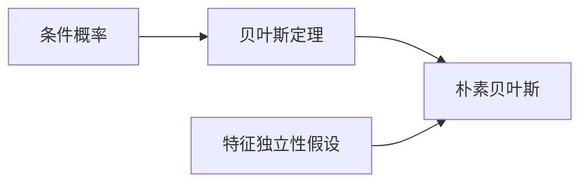

# 朴素贝叶斯(Naive Bayes) - 原理与代码实例讲解

## 1. 背景介绍
### 1.1 什么是朴素贝叶斯
朴素贝叶斯(Naive Bayes)是一种基于贝叶斯定理和特征条件独立假设的分类方法。尽管朴素贝叶斯的假设过于简单,在现实世界中很难完全满足,但朴素贝叶斯在许多复杂的现实情况下仍然能够取得相当好的分类效果。

### 1.2 朴素贝叶斯的应用领域
朴素贝叶斯广泛应用于文本分类、垃圾邮件检测、情感分析等领域。在实际应用中,朴素贝叶斯模型因其简单、高效和易于实现的特点而备受青睐。

### 1.3 朴素贝叶斯的优缺点
朴素贝叶斯的主要优点包括:
- 适用于高维数据。即使特征空间很大,训练和预测的速度也很快。  
- 算法简单,易于实现。
- 对小规模数据表现很好,能处理多分类任务。
- 对缺失数据不敏感。

朴素贝叶斯的主要缺点包括:
- 假设特征之间相互独立,这在现实中往往是不成立的。
- 需要知道先验概率,有时候先验概率很难得到。
- 对输入数据的表达形式很敏感。

## 2. 核心概念与联系
### 2.1 条件概率 
条件概率是指在某个事件A发生的条件下,事件B发生的概率,用P(B|A)表示。

### 2.2 贝叶斯定理
贝叶斯定理描述了两个条件概率之间的关系:
$$ P(A|B) = \frac{P(B|A)P(A)}{P(B)} $$
其中,P(A)是A的先验概率,P(B|A)是给定A的条件下B的条件概率,P(A|B)是给定B的条件下A的条件概率,也称为后验概率。

### 2.3 朴素贝叶斯的独立性假设
朴素贝叶斯基于一个假设:给定目标值时,所有特征相互独立。即:
$$ P(X_1,X_2,...,X_n|Y) = P(X_1|Y)P(X_2|Y)...P(X_n|Y) $$

朴素贝叶斯的关键概念之间的关系可以用下图表示:



## 3. 核心算法原理具体操作步骤
### 3.1 问题描述
给定训练集 $T=\{(x_1,y_1),(x_2,y_2),...,(x_N,y_N)\}$,其中 $x_i=(x_i^{(1)},x_i^{(2)},...,x_i^{(n)})$ 为输入实例,$y_i \in \{c_1,c_2,...,c_K\}$ 为对应的类别标记。朴素贝叶斯的目标是学习一个分类器,对新的实例进行分类。

### 3.2 算法步骤
1. 计算先验概率 $P(Y=c_k)$:
$$ P(Y=c_k) = \frac{\sum_{i=1}^N I(y_i=c_k)}{N}, k=1,2,...,K $$

2. 计算条件概率 $P(X^{(j)}=x^{(j)}|Y=c_k)$:
$$ P(X^{(j)}=x^{(j)}|Y=c_k) = \frac{\sum_{i=1}^N I(x_i^{(j)}=x^{(j)}, y_i=c_k)}{\sum_{i=1}^N I(y_i=c_k)}, j=1,2,...,n $$

3. 对于给定的实例 $x=(x^{(1)},x^{(2)},...,x^{(n)})$,计算
$$ P(Y=c_k)\prod_{j=1}^n P(X^{(j)}=x^{(j)}|Y=c_k), k=1,2,...,K $$

4. 确定实例x的类别:
$$ y = \arg\max_{c_k} P(Y=c_k)\prod_{j=1}^n P(X^{(j)}=x^{(j)}|Y=c_k) $$

## 4. 数学模型和公式详细讲解举例说明
### 4.1 贝叶斯定理
贝叶斯定理是朴素贝叶斯的理论基础。假设有两个事件A和B,贝叶斯定理可以表示为:
$$ P(A|B) = \frac{P(B|A)P(A)}{P(B)} $$

例如,假设有两个盒子,第一个盒子里有30个红球,10个蓝球;第二个盒子里有20个红球,20个蓝球。现在随机从两个盒子中选择一个,并从中随机取出一个球,取出的球是红色的。那么这个红球来自第一个盒子的概率是多少?

设事件A表示选中第一个盒子,事件B表示取出红球。根据题意可知:
$$ P(A) = 0.5, P(B|A) = 0.75, P(B|\neg A) = 0.5 $$

根据全概率公式:
$$ P(B) = P(B|A)P(A) + P(B|\neg A)P(\neg A) = 0.75 \times 0.5 + 0.5 \times 0.5 = 0.625 $$

所以,
$$ P(A|B) = \frac{P(B|A)P(A)}{P(B)} = \frac{0.75 \times 0.5}{0.625} = 0.6 $$

### 4.2 朴素贝叶斯模型
朴素贝叶斯将贝叶斯定理应用于分类任务。假设有 $K$ 个类别 $C=\{c_1,c_2,...,c_K\}$,给定实例 $x=(x^{(1)},x^{(2)},...,x^{(n)})$,朴素贝叶斯通过如下公式计算后验概率:
$$ P(Y=c_k|X=x) = \frac{P(X=x|Y=c_k)P(Y=c_k)}{P(X=x)} $$

进一步,朴素贝叶斯假设各个特征相互独立,因此:
$$ P(X=x|Y=c_k) = \prod_{j=1}^n P(X^{(j)}=x^{(j)}|Y=c_k) $$

将其代入上式,得到:
$$ P(Y=c_k|X=x) = \frac{P(Y=c_k)\prod_{j=1}^n P(X^{(j)}=x^{(j)}|Y=c_k)}{P(X=x)} $$

由于分母 $P(X=x)$ 与类别无关,因此最终朴素贝叶斯分类器可以表示为:
$$ y = \arg\max_{c_k} P(Y=c_k)\prod_{j=1}^n P(X^{(j)}=x^{(j)}|Y=c_k) $$

## 5. 项目实践:代码实例和详细解释说明
下面以Python和scikit-learn为例,演示如何使用朴素贝叶斯进行文本分类。

### 5.1 数据准备
首先,我们需要准备一些文本数据。这里使用20 Newsgroups数据集,它包含了20个主题的新闻文本。

```python
from sklearn.datasets import fetch_20newsgroups

categories = ['alt.atheism', 'soc.religion.christian', 'comp.graphics', 'sci.med']
twenty_train = fetch_20newsgroups(subset='train', categories=categories, shuffle=True, random_state=42)
```

### 5.2 文本特征提取
接下来,需要将文本数据转换为特征向量。这里使用词袋模型和TF-IDF来实现:

```python
from sklearn.feature_extraction.text import CountVectorizer
from sklearn.feature_extraction.text import TfidfTransformer

count_vect = CountVectorizer()
X_train_counts = count_vect.fit_transform(twenty_train.data)

tfidf_transformer = TfidfTransformer()
X_train_tfidf = tfidf_transformer.fit_transform(X_train_counts)
```

### 5.3 训练朴素贝叶斯分类器
使用提取的特征训练一个多项式朴素贝叶斯分类器:

```python
from sklearn.naive_bayes import MultinomialNB

clf = MultinomialNB().fit(X_train_tfidf, twenty_train.target)
```

### 5.4 在新文本上进行预测
最后,我们可以使用训练好的分类器对新文本进行预测:

```python
docs_new = ['God is love', 'OpenGL on the GPU is fast']
X_new_counts = count_vect.transform(docs_new)
X_new_tfidf = tfidf_transformer.transform(X_new_counts)

predicted = clf.predict(X_new_tfidf)

for doc, category in zip(docs_new, predicted):
    print('%r => %s' % (doc, twenty_train.target_names[category]))
```

输出结果为:

```
'God is love' => soc.religion.christian
'OpenGL on the GPU is fast' => comp.graphics
```

## 6. 实际应用场景
朴素贝叶斯在许多实际场景中都有广泛应用,例如:

### 6.1 文本分类
朴素贝叶斯可以用于对文本进行分类,如新闻分类、垃圾邮件检测、情感分析等。

### 6.2 多分类问题
朴素贝叶斯可以很好地处理多分类问题,如手写数字识别等。

### 6.3 推荐系统
在推荐系统中,可以用朴素贝叶斯对用户进行分类,从而实现个性化推荐。

## 7. 工具和资源推荐
- scikit-learn:机器学习库,包含了朴素贝叶斯的高效实现。
- NLTK:自然语言处理工具包,提供了文本预处理和特征提取的各种工具。
- 《统计学习方法》(李航):经典的机器学习教材,对朴素贝叶斯有详细介绍。
- 《机器学习》(周志华):另一本优秀的机器学习教材,介绍了朴素贝叶斯的理论和实践。

## 8. 总结:未来发展趋势与挑战
朴素贝叶斯虽然简单,但在文本分类等领域取得了很好的效果。未来,朴素贝叶斯的研究方向可能包括:
- 进一步放松条件独立性假设,设计更加准确的模型。  
- 将朴素贝叶斯与其他模型(如神经网络)结合,提高分类性能。
- 探索朴素贝叶斯在大数据场景下的优化和改进。

同时,朴素贝叶斯也面临一些挑战:
- 如何有效处理数据不平衡问题。
- 对输入数据的表达形式敏感,需要进行合适的特征工程。
- 有时先验概率难以准确获得。

## 9. 附录:常见问题与解答
### 9.1 朴素贝叶斯和逻辑回归的区别是什么?
- 朴素贝叶斯是生成模型,通过建模联合分布 $P(X,Y)$ 来预测 $P(Y|X)$;而逻辑回归是判别模型,直接建模 $P(Y|X)$。
- 朴素贝叶斯假设特征相互独立;而逻辑回归没有这个假设。  
- 朴素贝叶斯的训练和预测通常更快;而逻辑回归需要迭代优化,训练时间较长。

### 9.2 如何解决朴素贝叶斯的过拟合问题?
可以考虑使用以下方法:
- 进行特征选择,去除不相关的特征。
- 使用拉普拉斯平滑等方法,对概率估计进行校正。
- 在训练时引入正则化项,控制模型复杂度。

### 9.3 朴素贝叶斯适用于哪些类型的数据?
朴素贝叶斯适用于以下类型的数据:
- 离散型数据,如文本数据。
- 高维数据。朴素贝叶斯在高维空间中通常表现良好。
- 小规模数据集。朴素贝叶斯对小样本数据有很好的适应能力。

作者:禅与计算机程序设计艺术 / Zen and the Art of Computer Programming