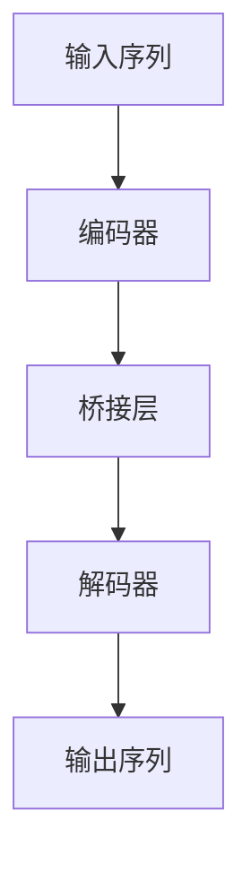

## 背景介绍

序列到序列（Seq2Seq）是机器学习和自然语言处理（NLP）领域中的一种经典架构。它主要用于解决翻译、摘要生成、问答系统等自然语言任务。Seq2Seq架构可以将输入的序列（如文本）转换为输出序列（如翻译文本或摘要），并通过一种称为编码器-解码器的方法实现。这种方法允许模型学习输入和输出之间的映射，从而实现任务需求。

## 核心概念与联系

Seq2Seq架构的核心概念是编码器（Encoder）和解码器（Decoder）。编码器负责将输入序列编码成一个固定长度的向量（即编码状态），而解码器则负责将编码状态解码成输出序列。编码器-解码器之间通过一个桥接层（通常是一个全连接层）进行连接。

下图展示了Seq2Seq架构的基本组成部分：



## 核心算法原理具体操作步骤

 Seq2Seq架构的核心算法原理可以分为以下几个步骤：

1. **输入序列编码**: 首先，将输入序列通过一个循环神经网络（RNN）进行编码。常用的编码器有长短期记忆网络（LSTM）和门控循环网络（GRU）。编码器的输出是一个固定长度的向量，称为编码状态。
2. **桥接层**: 编码状态与解码器之间的桥接层通常是一个全连接层。该层将编码状态展开为一个连续的向量，以便解码器可以处理。
3. **输出序列解码**: 解码器接收到编码状态后，开始生成输出序列。解码器通常也使用RNN进行处理。输出序列的生成过程通常遵循“贪婪选择”或“beam search”策略，以获得最佳结果。

## 数学模型和公式详细讲解举例说明

 Seq2Seq的数学模型主要包括编码器和解码器的损失函数。在经典的Seq2Seq模型中，通常使用交叉熵损失函数。以下是一个简化的数学公式：

$$
L = \sum_{t=1}^{T} -\log p(y_t | y_{1:t-1}, X)
$$

其中，$L$是总损失，$T$是输出序列长度，$y_t$是第$t$个输出词元，$y_{1:t-1}$是前$t-1$个输出词元，$X$是输入序列。$p(y_t | y_{1:t-1}, X)$是条件概率，即在给定输入序列和前$t-1$个输出词元的情况下，生成第$t$个词元的概率。

## 项目实践：代码实例和详细解释说明

以下是一个简化的Python代码示例，展示了如何使用TensorFlow构建一个简单的Seq2Seq模型：

```python
import tensorflow as tf
from tensorflow.keras.layers import Input, LSTM, Dense
from tensorflow.keras.models import Model

# 定义输入序列和输出序列的维度
input_dim = 10000  # 输入序列维度
output_dim = 10000  # 输出序列维度

# 定义编码器
encoder_inputs = Input(shape=(None, input_dim))
encoder = LSTM(128, return_state=True)
encoder_outputs, state_h, state_c = encoder(encoder_inputs)

# 定义桥接层
encoder_states = [state_h, state_c]

# 定义解码器
decoder_inputs = Input(shape=(None, output_dim))
decoder_lstm = LSTM(128, return_sequences=True, return_state=True)
decoder_outputs, _, _ = decoder_lstm(decoder_inputs, initial_state=encoder_states)
decoder_dense = Dense(output_dim, activation='softmax')
decoder_outputs = decoder_dense(decoder_outputs)

# 定义模型
model = Model([encoder_inputs, decoder_inputs], decoder_outputs)
```

## 实际应用场景

Seq2Seq架构在许多实际应用场景中得到了广泛应用，例如：

1. **机器翻译**: 将一种自然语言（如英语）翻译成另一种语言（如中文）。
2. **摘要生成**: 将长篇文本缩短为简短的摘要，以便快速获取关键信息。
3. **问答系统**: 根据用户的问题提供相应的答案。

## 工具和资源推荐

对于学习和实际应用Seq2Seq架构，以下是一些建议的工具和资源：

1. **TensorFlow**: TensorFlow是构建Seq2Seq模型的流行框架。它提供了丰富的API和文档，方便开发者快速搭建模型。
2. **Keras**: Keras是一个高级神经网络API，基于TensorFlow构建。它简化了模型构建、训练和评估的过程，非常适合初学者和专业人士。
3. **论文和教程**: 学术界和在线教程提供了许多关于Seq2Seq架构的论文和教程。通过阅读这些材料，大家可以更深入地了解Seq2Seq的理论和实际应用。

## 总结：未来发展趋势与挑战

Seq2Seq架构在自然语言处理领域具有重要意义。随着深度学习技术的不断发展，Seq2Seq模型在性能和应用方面将获得更大的提升。然而，Seq2Seq仍面临一些挑战，如处理长序列问题、生成不准确的输出等。未来，研究者将继续探索新的方法和技术，以解决这些挑战，为自然语言处理领域带来更大的创新和进步。

## 附录：常见问题与解答

以下是一些常见的问题和解答，帮助大家更好地理解Seq2Seq架构：

1. **为什么需要编码器-解码器架构？**

编码器-解码器架构允许模型学习输入和输出之间的映射，从而实现任务需求。编码器将输入序列编码成一个固定长度的向量，而解码器则将编码状态解码成输出序列。这种方法可以让模型更好地捕捉输入和输出之间的结构和关系。

2. **Seq2Seq模型如何学习长距离依赖关系？**

Seq2Seq模型中的循环神经网络（如LSTM和GRU）可以学习长距离依赖关系。这些网络具有“记忆”能力，可以保留输入序列中之前的信息，以便在生成输出序列时使用。

3. **如何解决Seq2Seq模型生成不准确的输出？**

解决Seq2Seq模型生成不准确的输出，可以尝试以下方法：

* 增加数据集规模：扩大训练数据集，可以让模型学习更多的语法规则和语义知识。
* 使用注意力机制：注意力机制可以使解码器在生成输出序列时关注输入序列的不同部分，从而提高生成的准确性。
* 调整超参数：调整模型超参数（如隐藏层大小、学习率等），以找到最佳的模型配置。

以上是关于Seq2Seq架构的基本介绍和实践。希望通过阅读这篇博客，您可以更好地了解Seq2Seq的原理、实现方法和实际应用。祝您学习愉快！