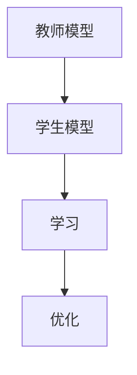

知识蒸馏（Knowledge Distillation）是人工智能领域中一种重要的技术，它可以帮助我们将复杂的模型（如人工神经网络）转化为更简单的模型（如小型神经网络），同时保持较高的准确性。知识蒸馏的主要目标是通过一种可训练的方法，将一个复杂模型的知识转移到一个更简单、更快速的模型中。这种方法有助于在实际应用中实现模型的压缩、加速和部署。

## 2.核心概念与联系

知识蒸馏的核心概念是将一个复杂模型的知识（或权重）转移到一个更简单的模型中。这种方法可以通过一个名为“教师”（Teacher）的复杂模型来实现，通过一个名为“学生”（Student）的简单模型来学习。这个过程可以分为两步：

1. 学习：学生模型通过与教师模型进行交互来学习知识。这个过程类似于人与人之间的知识传授，学生从教师那里汲取经验，从而提高自己的能力。
2. 优化：学生模型通过优化其参数来提高学习到的知识的表现能力。这个过程类似于一个运动员在训练中不断提高自己的技能。

知识蒸馏的核心概念可以用一个简单的流程图来描述，见下图：



## 3.核心算法原理具体操作步骤

知识蒸馏的核心算法原理可以分为以下几个步骤：

1. 获取教师模型的知识：首先，我们需要从教师模型中获取其知识，通常是指教师模型的权重。我们可以通过将教师模型的权重保存到文件中，或者将其导出为模型的形式。
2. 定义知识蒸馏的损失函数：知识蒸馎的损失函数通常由两个部分组成：一部分是学生模型在训练数据上的预测损失，另一部分是教师模型在训练数据上的预测损失。我们需要定义一个方法来计算这两个损失的权重。
3. 训练学生模型：我们使用知识蒸馏的损失函数来训练学生模型。这个过程类似于标准的神经网络训练，除了我们需要同时训练教师模型和学生模型。
4. 优化学生模型：在学生模型训练完成后，我们需要对其进行优化，以提高其性能。这个过程可以通过使用各种优化算法，例如梯度下降、随机梯度下降等来实现。

## 4.数学模型和公式详细讲解举例说明

知识蒸馏的数学模型可以用一个损失函数来表示，通常是由两个部分组成：学生模型的预测损失和教师模型的预测损失。我们可以用以下公式来表示这个损失函数：

$$
L = L_{student} + \lambda L_{teacher}
$$

其中，$L_{student}$表示学生模型在训练数据上的预测损失，$L_{teacher}$表示教师模型在训练数据上的预测损失，$\lambda$表示两个损失之间的权重。

## 5.项目实践：代码实例和详细解释说明

为了更好地理解知识蒸馏，我们需要实际编写一些代码来实现这个过程。在这个例子中，我们将使用Python和PyTorch来实现一个简单的知识蒸馏过程。

1. 首先，我们需要导入必要的库：

```python
import torch
import torch.nn as nn
import torch.optim as optim
from torch.utils.data import DataLoader
```

2. 然后，我们需要定义一个简单的神经网络模型作为教师模型：

```python
class TeacherNet(nn.Module):
    def __init__(self):
        super(TeacherNet, self).__init__()
        self.conv1 = nn.Conv2d(1, 20, 5)
        self.conv2 = nn.Conv2d(20, 20, 5)

    def forward(self, x):
        x = self.conv1(x)
        x = self.conv2(x)
        return x
```

3. 接下来，我们需要定义一个更简单的神经网络模型作为学生模型：

```python
class StudentNet(nn.Module):
    def __init__(self):
        super(StudentNet, self).__init__()
        self.conv1 = nn.Conv2d(1, 20, 5)

    def forward(self, x):
        x = self.conv1(x)
        return x
```

4. 然后，我们需要定义一个知识蒸馏的损失函数：

```python
def distillation_loss(student_output, teacher_output, T, lambda_):
    student_output = student_output / T
    teacher_output = teacher_output / T
    softmax_student = nn.functional.softmax(student_output, dim=1)
    softmax_teacher = nn.functional.softmax(teacher_output, dim=1)
    return -torch.mean(torch.sum(softmax_student * softmax_teacher, dim=1)) + lambda_
```

5. 最后，我们需要训练学生模型和教师模型，并使用知识蒸馏的损失函数来优化学生模型：

```python
# 定义数据集
dataset = ...
dataloader = DataLoader(dataset, batch_size=32, shuffle=True)

# 定义优化器
optimizer_student = optim.Adam(params=student.parameters(), lr=0.001)
optimizer_teacher = optim.Adam(params=teacher.parameters(), lr=0.001)

# 训练学生模型和教师模型
for epoch in range(100):
    for data in dataloader:
        images, labels = data
        images = images.to(device)
        labels = labels.to(device)

        # 前向传播
        student_output = student(images)
        teacher_output = teacher(images)

        # 计算知识蒸馏的损失
        loss = distillation_loss(student_output, teacher_output, T=1.0, lambda_=0.5)

        # 反向传播
        optimizer_student.zero_grad()
        loss.backward()
        optimizer_student.step()

        # 更新教师模型
        optimizer_teacher.zero_grad()
        loss = nn.functional.mse_loss(student_output, teacher_output)
        loss.backward()
        optimizer_teacher.step()
```

## 6.实际应用场景

知识蒸馏在实际应用中有很多用途，例如：

1. 模型压缩：通过将复杂模型的知识转移到更简单的模型中，可以实现模型的压缩，从而减小模型的存储空间和计算资源。
2. 加速部署：知识蒸馏可以将复杂模型的知识转移到更快速的模型中，从而实现模型的加速部署。
3. 优化模型性能：通过使用知识蒸馏的方法来优化学生模型，可以提高学生模型的性能。

## 7.工具和资源推荐

以下是一些关于知识蒸馏的工具和资源推荐：

1. PyTorch：一个流行的深度学习框架，可以用于实现知识蒸馏。
2. TensorFlow：另一个流行的深度学习框架，也可以用于实现知识蒸馏。
3. 论文：“A survey on knowledge distillation”：这篇论文详细介绍了知识蒸馏的相关理论和方法。
4. 论文：“Distilling the knowledge in neural networks”：这篇论文介绍了一种知识蒸馏方法，称为“知识蒸馏”（Knowledge Distillation）。

## 8.总结：未来发展趋势与挑战

知识蒸馏是一种重要的技术，它有助于实现模型的压缩、加速和部署。随着深度学习技术的不断发展，知识蒸馏技术也将得到进一步的发展和改进。未来，知识蒸馏技术将面临以下挑战：

1. 更高效的知识蒸馏方法：如何开发更高效的知识蒸馏方法，以实现更低的计算复杂度和更高的准确性？
2. 更广泛的应用场景：如何将知识蒸馏技术应用于更多的领域，如自然语言处理、计算机视觉等？
3. 更好的模型压缩：如何通过知识蒸馏技术实现更好的模型压缩，从而减小模型的存储空间和计算资源？

## 9.附录：常见问题与解答

1. Q：知识蒸馏的主要目的是什么？

A：知识蒸馏的主要目的是将一个复杂模型的知识（或权重）转移到一个更简单、更快速的模型中，以实现模型的压缩、加速和部署。

1. Q：知识蒸馏的过程有哪些？

A：知识蒸馏的过程包括学习和优化两个阶段。学习阶段，学生模型通过与教师模型进行交互来学习知识。优化阶段，学生模型通过优化其参数来提高学习到的知识的表现能力。

1. Q：知识蒸馏的损失函数是如何定义的？

A：知识蒸馏的损失函数通常由两个部分组成：一部分是学生模型在训练数据上的预测损失，另一部分是教师模型在训练数据上的预测损失。我们需要定义一个方法来计算这两个损失的权重。