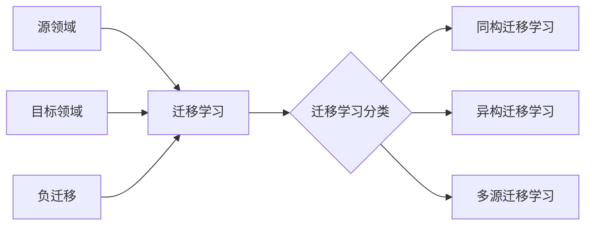

# 迁移学习(Transfer Learning) - 原理与代码实例讲解

## 1. 背景介绍

### 1.1 什么是迁移学习

迁移学习是一种机器学习方法,它利用已经学习过的知识来解决新的但相似的问题。与传统机器学习方法从零开始训练不同,迁移学习通过迁移已学习过的知识,在新的领域获得更好的学习效果和更快的学习速度。

### 1.2 迁移学习的优势

- 减少所需的训练数据:迁移学习可以利用相关领域的知识,减少目标领域所需的训练数据。
- 加快训练速度:通过使用预训练模型,迁移学习可以大大加快新模型的训练速度。
- 提高模型性能:迁移学习可以利用相关领域的知识,提高目标领域模型的性能。

### 1.3 迁移学习的应用场景

迁移学习在计算机视觉、自然语言处理等领域有广泛的应用,如:

- 图像分类:利用在 ImageNet 上预训练的模型,可以快速构建新的图像分类器。
- 目标检测:利用在 COCO 数据集上预训练的模型,可以加快新目标检测器的训练速度。
- 语义分割:利用在 PASCAL VOC 数据集上预训练的模型,可以提高新语义分割模型的性能。

## 2. 核心概念与联系

### 2.1 源领域和目标领域

- 源领域:已有知识的领域,通常有大量标注数据。如 ImageNet 数据集。
- 目标领域:需要解决的新问题所在的领域,通常缺乏足够的标注数据。如医学图像分类。

### 2.2 迁移学习的分类

根据源领域和目标领域的相似程度,迁移学习可分为以下三类:

- 同构迁移学习:源领域和目标领域的特征空间相同,如图像分类到图像分类。
- 异构迁移学习:源领域和目标领域的特征空间不同,如文本分类到图像分类。
- 多源迁移学习:存在多个源领域,如利用多个相关领域的知识进行迁移学习。

### 2.3 负迁移

负迁移指的是源领域和目标领域的差异过大,导致迁移学习后性能反而下降的现象。为了避免负迁移,需要合理选择源领域和目标领域,并采用适当的迁移学习方法。

### 2.4 核心概念之间的联系



## 3. 核心算法原理具体操作步骤

### 3.1 微调(Fine-tuning)

微调是最常用的迁移学习方法,其基本步骤如下:

1. 在源领域训练一个基础模型。
2. 移除基础模型的输出层,并替换为适合目标领域的新输出层。
3. 冻结基础模型的部分或全部参数,仅训练新的输出层。
4. 逐步解冻基础模型的参数,进行端到端的微调训练。

### 3.2 特征提取(Feature Extraction)

特征提取是另一种常用的迁移学习方法,其基本步骤如下:

1. 在源领域训练一个基础模型。
2. 移除基础模型的输出层,将其作为特征提取器。
3. 使用基础模型提取目标领域数据的特征。
4. 使用提取的特征训练一个新的分类器或回归器。

### 3.3 领域自适应(Domain Adaptation)

领域自适应旨在减小源领域和目标领域的分布差异,其基本步骤如下:

1. 在源领域训练一个基础模型。
2. 使用基础模型提取源领域和目标领域数据的特征。
3. 通过对抗训练或最小化统计距离等方法,使源领域和目标领域的特征分布尽可能接近。
4. 使用调整后的模型对目标领域数据进行预测。

## 4. 数学模型和公式详细讲解举例说明

### 4.1 最大均值差异(Maximum Mean Discrepancy, MMD)

MMD 是一种常用的领域自适应方法,用于度量两个分布之间的差异。给定源领域数据 $X_s$ 和目标领域数据 $X_t$,MMD 的计算公式为:

$$
\text{MMD}(X_s, X_t) = \left\| \frac{1}{n_s}\sum_{i=1}^{n_s}\phi(x_i^s) - \frac{1}{n_t}\sum_{j=1}^{n_t}\phi(x_j^t) \right\|_{\mathcal{H}}
$$

其中,$\phi(\cdot)$ 是将数据映射到再生核希尔伯特空间(RKHS)的函数,$n_s$ 和 $n_t$ 分别是源领域和目标领域的样本数。

例如,在图像分类任务中,我们可以使用预训练的 CNN 提取源领域和目标领域图像的特征,然后计算特征的 MMD。通过最小化 MMD,可以使源领域和目标领域的特征分布尽可能接近,提高迁移学习的性能。

### 4.2 对抗训练(Adversarial Training)

对抗训练是另一种常用的领域自适应方法,其基本思想是训练一个领域判别器 $D$,使其能够区分源领域和目标领域的数据;同时训练一个特征提取器 $F$,使其提取的特征能够欺骗领域判别器。数学上,对抗训练的目标函数可以表示为:

$$
\min_F \max_D \mathcal{L}_D(D, F) = \mathbb{E}_{x_s \sim X_s}[\log D(F(x_s))] + \mathbb{E}_{x_t \sim X_t}[\log(1 - D(F(x_t)))]
$$

其中,$\mathcal{L}_D$ 是领域判别器的损失函数,$\mathbb{E}$ 表示期望。通过优化上述目标函数,可以使特征提取器提取的特征在源领域和目标领域上具有相似的分布,从而提高迁移学习的性能。

## 5. 项目实践:代码实例和详细解释说明

下面以 PyTorch 为例,展示如何使用迁移学习进行图像分类。

### 5.1 加载数据集

```python
import torch
import torchvision
from torchvision import datasets, transforms

# 定义数据预处理
transform = transforms.Compose([
    transforms.Resize(256),
    transforms.CenterCrop(224),
    transforms.ToTensor(),
    transforms.Normalize(mean=[0.485, 0.456, 0.406], std=[0.229, 0.224, 0.225])
])

# 加载数据集
train_dataset = datasets.ImageFolder('path/to/train', transform=transform)
val_dataset = datasets.ImageFolder('path/to/val', transform=transform)

train_loader = torch.utils.data.DataLoader(train_dataset, batch_size=32, shuffle=True)
val_loader = torch.utils.data.DataLoader(val_dataset, batch_size=32, shuffle=False)
```

### 5.2 加载预训练模型

```python
import torchvision.models as models

# 加载预训练的 ResNet-18 模型
model = models.resnet18(pretrained=True)

# 替换最后一层全连接层
num_features = model.fc.in_features
model.fc = torch.nn.Linear(num_features, num_classes)
```

### 5.3 微调模型

```python
# 定义损失函数和优化器
criterion = torch.nn.CrossEntropyLoss()
optimizer = torch.optim.SGD(model.parameters(), lr=0.001, momentum=0.9)

# 微调模型
num_epochs = 10
for epoch in range(num_epochs):
    model.train()
    for images, labels in train_loader:
        optimizer.zero_grad()
        outputs = model(images)
        loss = criterion(outputs, labels)
        loss.backward()
        optimizer.step()
    
    model.eval()
    with torch.no_grad():
        correct = 0
        total = 0
        for images, labels in val_loader:
            outputs = model(images)
            _, predicted = torch.max(outputs.data, 1)
            total += labels.size(0)
            correct += (predicted == labels).sum().item()
        
        print(f'Epoch [{epoch+1}/{num_epochs}], Accuracy: {100 * correct / total:.2f}%')
```

在上述代码中,我们首先加载了预训练的 ResNet-18 模型,并替换了最后一层全连接层以适应新的分类任务。然后,我们定义了损失函数和优化器,并对模型进行了微调训练。在每个 epoch 结束后,我们在验证集上评估模型的性能。

## 6. 实际应用场景

迁移学习在许多实际应用场景中都有广泛的应用,例如:

- 医学图像分析:利用在自然图像上预训练的模型,可以快速构建医学图像分类、分割等模型。
- 工业缺陷检测:利用在 ImageNet 上预训练的模型,可以加快工业缺陷检测模型的训练速度。
- 语音识别:利用在大规模语音数据集上预训练的模型,可以提高特定领域语音识别的性能。
- 文本分类:利用在大规模文本数据集上预训练的模型,如 BERT,可以提高特定领域文本分类的性能。

## 7. 工具和资源推荐

- PyTorch Transfer Learning Tutorial:https://pytorch.org/tutorials/beginner/transfer_learning_tutorial.html
- TensorFlow Transfer Learning Guide:https://www.tensorflow.org/tutorials/images/transfer_learning
- 迁移学习相关论文列表:https://github.com/jindongwang/transferlearning/tree/master/doc/awesome_paper.md
- 迁移学习相关数据集:https://github.com/jindongwang/transferlearning/tree/master/data

## 8. 总结:未来发展趋势与挑战

迁移学习是机器学习领域的一个重要研究方向,它可以显著减少所需的训练数据,加快模型训练速度,并提高模型性能。未来,迁移学习将在以下方面有更多的发展:

- 跨模态迁移学习:利用不同模态(如文本、图像、语音)之间的知识进行迁移学习。
- 元学习与迁移学习:利用元学习的思想,学习如何更好地进行迁移学习。
- 持续学习与迁移学习:在持续学习的场景下,利用迁移学习来避免灾难性遗忘。

然而,迁移学习也面临着一些挑战:

- 负迁移:如何避免源领域和目标领域差异过大导致的负迁移现象。
- 可解释性:如何解释迁移学习模型的决策过程,提高模型的可解释性。
- 隐私保护:在迁移学习过程中,如何保护源领域和目标领域数据的隐私。

## 9. 附录:常见问题与解答

### 9.1 什么是预训练模型?

预训练模型是指在大规模数据集上训练的模型,如在 ImageNet 上训练的 CNN 模型。这些模型通常具有很好的特征提取能力,可以作为迁移学习的基础模型。

### 9.2 什么是端到端的微调训练?

端到端的微调训练是指在微调过程中,不仅训练新的输出层,还对基础模型的部分或全部参数进行微调。这种方法可以更好地适应目标领域的数据,但需要更多的计算资源和训练时间。

### 9.3 如何选择合适的源领域和目标领域?

选择合适的源领域和目标领域是迁移学习的关键。一般来说,源领域和目标领域应该具有一定的相似性,如相似的图像风格、相似的文本主题等。此外,还需要考虑源领域数据的质量和数量,以及目标领域数据的特点。

作者:禅与计算机程序设计艺术 / Zen and the Art of Computer Programming