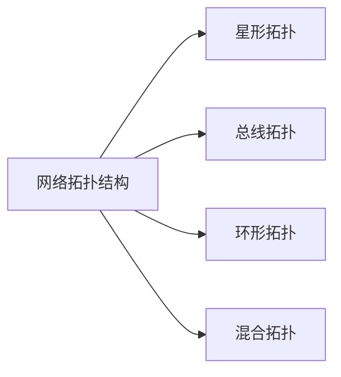
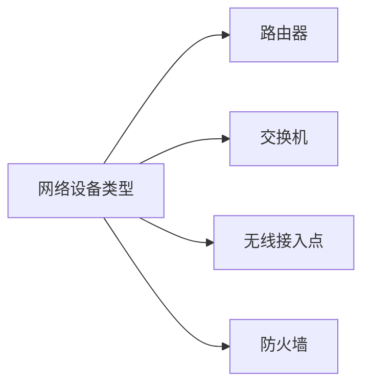
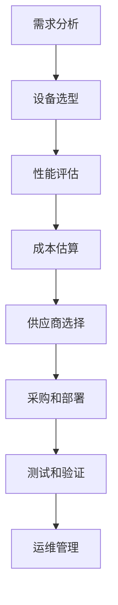

# 零售行业信息化建设中的网络设备选择与购置

## 1. 背景介绍

### 1.1 零售业的数字化转型

在当今快节奏的商业环境中,零售行业正面临着前所未有的挑战和机遇。传统的实体店模式已经无法满足消费者日益增长的需求和期望。为了保持竞争力,零售企业不得不加快数字化转型的步伐,通过利用先进的信息技术来优化业务流程、提升客户体验、降低运营成本。

信息化建设是零售企业实现数字化转型的关键一环。通过构建高效、安全、可扩展的信息系统,零售企业可以获得更好的业务洞察力,实现智能化运营,提高供应链效率,并为客户提供无缝的购物体验。

### 1.2 网络设备在零售信息化中的重要作用

作为信息系统的基础设施,网络设备在零售业信息化建设中扮演着至关重要的角色。高性能、可靠的网络设备能够确保企业内部各个系统之间以及与外部合作伙伴之间的高效通信,保证数据的实时传输和共享。此外,网络设备还为零售企业提供了连接移动设备、物联网设备等新兴技术的能力,助力企业实现创新。

因此,选择合适的网络设备并进行正确的部署和管理,对于零售企业的信息化建设至关重要。本文将重点探讨零售行业信息化建设中网络设备的选择与购置策略。

## 2. 核心概念与联系

### 2.1 网络拓扑结构

在规划和设计零售企业的网络基础架构时,需要考虑网络拓扑结构。常见的网络拓扑结构包括星形拓扑、总线拓扑、环形拓扑和混合拓扑等。每种拓扑结构都有其优缺点,适用于不同的场景。



### 2.2 网络设备类型

根据功能和用途的不同,网络设备可以分为多种类型,包括路由器、交换机、无线接入点、防火墙等。每种设备在网络中扮演着不同的角色,为网络提供不同的服务。



### 2.3 网络带宽和吞吐量

网络带宽和吞吐量是评估网络设备性能的重要指标。带宽指的是网络链路的最大理论传输速率,而吞吐量则是实际的数据传输速率。在选择网络设备时,需要根据实际业务需求合理规划网络带宽和吞吐量,以确保网络的高效运行。

### 2.4 网络安全性

随着网络攻击日益增多和复杂,网络安全性已经成为零售企业信息化建设中不可忽视的重要因素。网络设备需要具备良好的安全防护能力,如防火墙、入侵检测和防御、加密传输等,以保护企业的关键数据和系统免受威胁。

### 2.5 网络管理和监控

为了确保网络的稳定运行和高效管理,零售企业需要部署专门的网络管理和监控系统。这些系统可以实时监控网络设备的运行状态、流量情况、安全威胁等,并提供故障诊断和维护工具,帮助IT团队及时发现和解决网络问题。

## 3. 核心算法原理具体操作步骤

在选择和购置网络设备时,需要遵循一定的原理和步骤,以确保网络设备能够满足零售企业的实际需求,并与现有的IT基础设施无缝集成。以下是核心算法原理和具体操作步骤:



### 3.1 需求分析

需求分析是网络设备选择和购置的第一步。在这一阶段,需要全面评估零售企业的业务需求、用户数量、数据流量、安全要求等,并制定详细的网络规划方案。

### 3.2 设备选型

根据需求分析的结果,选择适合的网络设备类型和型号。需要考虑设备的性能指标(如带宽、吞吐量、接口数量等)、功能特性(如安全防护、管理工具等)、扩展性和可靠性等因素。

### 3.3 性能评估

对初步选定的网络设备进行性能评估,包括理论性能测试、模拟环境测试和现场试用测试等。性能评估的目的是验证设备是否能够满足实际需求,并确定最佳的配置方案。

### 3.4 成本估算

在选择网络设备时,还需要考虑成本因素。包括设备采购成本、安装部署成本、运维成本、升级成本等。通过成本估算,可以确定最具成本效益的解决方案。

### 3.5 供应商选择

根据性能和成本评估的结果,选择合适的网络设备供应商。供应商的选择标准包括产品质量、技术支持、售后服务、商业条款等。

### 3.6 采购和部署

与供应商签订采购合同,并制定详细的部署计划。部署过程中,需要进行网络集成、配置优化、测试验证等工作,确保网络设备能够顺利投入使用。

### 3.7 测试和验证

在正式投入使用之前,需要对已部署的网络设备进行全面的测试和验证,包括功能测试、压力测试、安全测试等,以确保网络设备能够稳定、高效、安全地运行。

### 3.8 运维管理

网络设备投入使用后,需要建立完善的运维管理机制,包括网络监控、故障诊断、性能优化、安全维护等,以确保网络的持续稳定运行。

## 4. 数学模型和公式详细讲解举例说明

在网络设备选择和购置过程中,需要运用一些数学模型和公式来评估和优化网络性能。以下是一些常见的数学模型和公式:

### 4.1 小波理论

小波理论是一种时频分析方法,可以用于网络流量分析和异常检测。小波变换可以将网络流量数据分解为不同的时间尺度和频率分量,从而更好地捕捉流量模式和异常行为。

小波变换公式:

$$
W_f(a,b) = \frac{1}{\sqrt{a}}\int_{-\infty}^{\infty}f(t)\overline{\psi}\left(\frac{t-b}{a}\right)dt
$$

其中,$ f(t) $是原始信号,$ \psi(t) $是小波基函数,$ a $是尺度参数,$ b $是平移参数,$ \overline{\psi} $表示$ \psi $的共轭复数。

通过对网络流量数据进行小波变换,可以获得不同尺度和位置的小波系数,从而实现流量特征提取和异常检测。

### 4.2 队列理论

队列理论可以用于分析和优化网络设备的缓冲区性能。通过建立数学模型,可以计算网络设备的平均等待时间、平均队列长度等指标,从而评估网络延迟和吞吐量。

M/M/1 队列模型是最常见的队列模型之一,其中服务时间和到达时间都服从指数分布。在该模型中,平均等待时间$ W_q $和平均队列长度$ L_q $可以计算如下:

$$
W_q = \frac{\rho}{\mu(1-\rho)}
$$

$$
L_q = \frac{\rho^2}{1-\rho}
$$

其中,$ \rho = \lambda/\mu $是系统的利用率,$ \lambda $是到达率,$ \mu $是服务率。

通过队列理论,可以优化网络设备的缓冲区大小和调度算法,从而提高网络性能。

### 4.3 信道编码理论

在无线网络中,信道编码理论可以用于提高数据传输的可靠性和效率。常见的编码技术包括卷积编码、Turbo 编码和低密度奇偶校验码(LDPC)等。

Shannon 定理给出了信道容量的上限:

$$
C = B\log_2(1+\frac{S}{N})
$$

其中,$ C $是信道容量,$ B $是带宽,$ S/N $是信噪比。

通过合理选择编码方案和调制方式,可以使实际的数据传输速率接近信道容量的理论上限,从而提高无线网络的吞吐量和覆盖范围。

## 5. 项目实践:代码实例和详细解释说明

为了更好地理解网络设备选择和购置的实践操作,我们以一个零售企业的网络基础设施建设项目为例,展示相关的代码实例和详细解释。

### 5.1 网络拓扑设计

在该项目中,我们采用了混合拓扑结构,将总部办公室、区域分销中心和零售门店连接在一起。以下是使用 Python 的 NetworkX 库绘制的网络拓扑图:

```python
import networkx as nx
import matplotlib.pyplot as plt

# 创建一个有向图
G = nx.DiGraph()

# 添加节点
G.add_nodes_from(['总部办公室', '区域分销中心1', '区域分销中心2', '门店1', '门店2', '门店3', '门店4'])

# 添加边
G.add_edges_from([('总部办公室', '区域分销中心1'), ('总部办公室', '区域分销中心2'),
                  ('区域分销中心1', '门店1'), ('区域分销中心1', '门店2'),
                  ('区域分销中心2', '门店3'), ('区域分销中心2', '门店4')])

# 绘制网络拓扑图
pos = nx.spring_layout(G)
nx.draw(G, pos, with_labels=True, node_color='skyblue', edge_color='gray')
plt.axis('off')
plt.show()
```

在这个例子中,我们首先创建了一个有向图 `G`。然后,我们添加了代表总部办公室、区域分销中心和零售门店的节点。接着,我们添加了连接这些节点的边,表示网络链路。最后,我们使用 `nx.draw()` 函数绘制了网络拓扑图。

### 5.2 网络流量模拟

为了评估网络设备的性能,我们可以使用 Python 的 SimPy 库模拟网络流量。以下是一个简单的示例,模拟了一个 M/M/1 队列系统:

```python
import simpy
import random

# 定义服务时间分布
def service_time():
    return random.expovariate(1.0 / 0.5)  # 平均服务时间为 0.5 秒

# 定义到达时间分布
def arrival_time():
    return random.expovariate(1.0 / 0.6)  # 平均到达时间为 0.6 秒

# 定义客户端进程
def customer(env, name, server):
    arrival = env.now
    print(f'{name} arrives at {arrival}')

    # 请求服务
    with server.request() as req:
        yield req
        wait = env.now - arrival
        print(f'{name} waited {wait}')

        # 获取服务
        service_duration = service_time()
        yield env.timeout(service_duration)
        print(f'{name} served in {service_duration}')

# 设置模拟环境
env = simpy.Environment()
server = simpy.Resource(env, capacity=1)  # 创建一个单服务器资源

# 生成客户端进程
for i in range(10):
    env.process(customer(env, f'Customer {i}', server))

# 运行模拟
env.run(until=20)
```

在这个例子中,我们定义了服务时间分布 `service_time()` 和到达时间分布 `arrival_time()`。然后,我们定义了客户端进程 `customer()`。在该进程中,客户端首先请求服务,等待服务器空闲,然后获取服务。我们使用 SimPy 的 `Resource` 类模拟了一个单服务器资源。

最后,我们创建了 10 个客户端进程,并运行模拟 20 个时间单位。通过