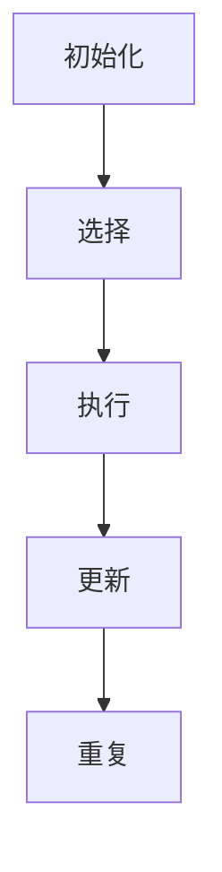

## 背景介绍

在机器学习领域中，马尔可夫决策过程（Markov Decision Process, MDP）是研究决策问题的一种数学框架。它为解决如何在不确定的环境中做出最佳决策提供了一个数学模型。MDP 的核心概念是状态、动作和奖励，这三个要素共同构成了一个动态规划问题。我们将在本篇博客中深入探讨 MDP 的_valueiteration_ 方法，以及如何使用该方法解决决策问题。

## 核心概念与联系

在 MDP 中，状态表示了环境的当前状态，动作表示了可以在当前状态下执行的操作，而奖励表示了执行某个动作后的收益。为了解决 MDP 问题，我们需要找到一种方法来计算每个状态的最佳价值，即在给定状态下执行最佳动作所获得的最大奖励。值迭代（value iteration）方法正是为了解决这一问题而生的。

值迭代方法的核心思想是：通过反复更新每个状态的价值，直到价值的变化趋于零，从而找到最佳的决策策略。值迭代方法基于贝叶斯定理和动态规划技术，可以用来解决各种决策问题，例如控制论、优化问题、机器学习等。

## 核心算法原理具体操作步骤

值迭代方法的具体操作步骤如下：

1. 初始化：为每个状态分配一个初始价值。
2. 选择：从当前状态中选择一个动作。
3. 执行：执行选择的动作，进入新状态。
4. 更新：根据新状态的价值，更新当前状态的价值。
5. 重复：重复步骤 2 到 4，直到价值的变化趋于零。

值迭代方法的算法流程可以用以下 Mermaid 流程图表示：



## 数学模型和公式详细讲解举例说明

为了更好地理解值迭代方法，我们需要了解其数学模型和公式。假设我们有一个 MDP，其中状态集为 S，动作集为 A，奖励函数为 R。我们可以用一个 4 元组（S, A, T, R）来表示 MDP，其中 S 是状态集，A 是动作集，T 是状态转移概率矩阵，R 是奖励函数。

值迭代方法的核心公式是：V(s) = R(s, a) + γ ∑_{a' ∈ A} π(a|s) T(s, a, s')

其中，V(s) 是状态 s 的价值，R(s, a) 是执行动作 a 在状态 s 下获得的奖励，γ 是折扣因子，π(a|s) 是在状态 s 下选择动作 a 的概率，T(s, a, s') 是状态转移概率，从状态 s 执行动作 a 到状态 s' 的概率。

## 项目实践：代码实例和详细解释说明

在本节中，我们将使用 Python 语言编写一个简单的 MDP 值迭代示例。我们将创建一个 2x2 的状态空间，其中每个状态都有两个可选动作。我们将为每个状态动作对赋予一个奖励值，并计算每个状态的最佳价值。

```python
import numpy as np

# 定义状态空间
states = [(0, 0), (0, 1), (1, 0), (1, 1)]

# 定义动作空间
actions = ['left', 'right']

# 定义奖励函数
reward = {
    ('0', '0', 'left'): 1,
    ('0', '1', 'right'): -1,
    ('1', '0', 'right'): 1,
    ('1', '1', 'left'): -1
}

# 定义状态转移概率
transition_prob = {
    ('0', '0', 'left'): ('0', '1'),
    ('0', '1', 'right'): ('0', '1'),
    ('1', '0', 'right'): ('1', '1'),
    ('1', '1', 'left'): ('1', '0')
}

# 初始化价值
V = {s: 0 for s in states}

# 设置折扣因子
gamma = 0.9

# 值迭代
for i in range(1000):
    delta = 0
    for s in states:
        v = V[s]
        for a in actions:
            s'
```