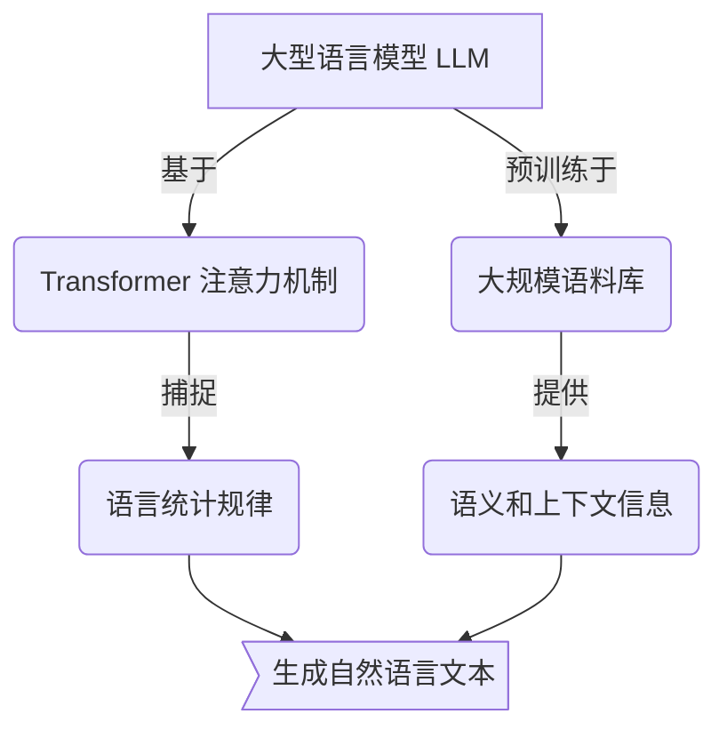
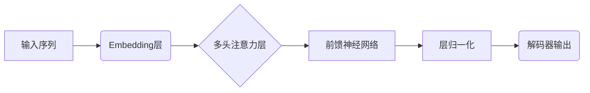
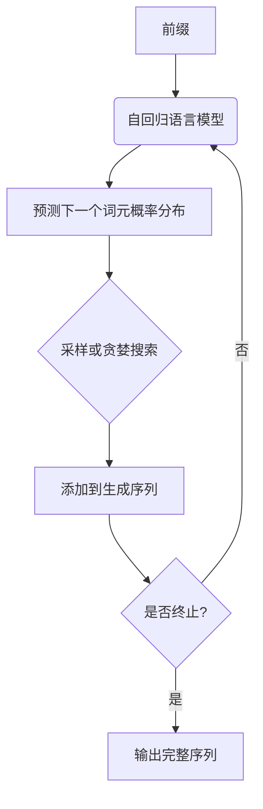
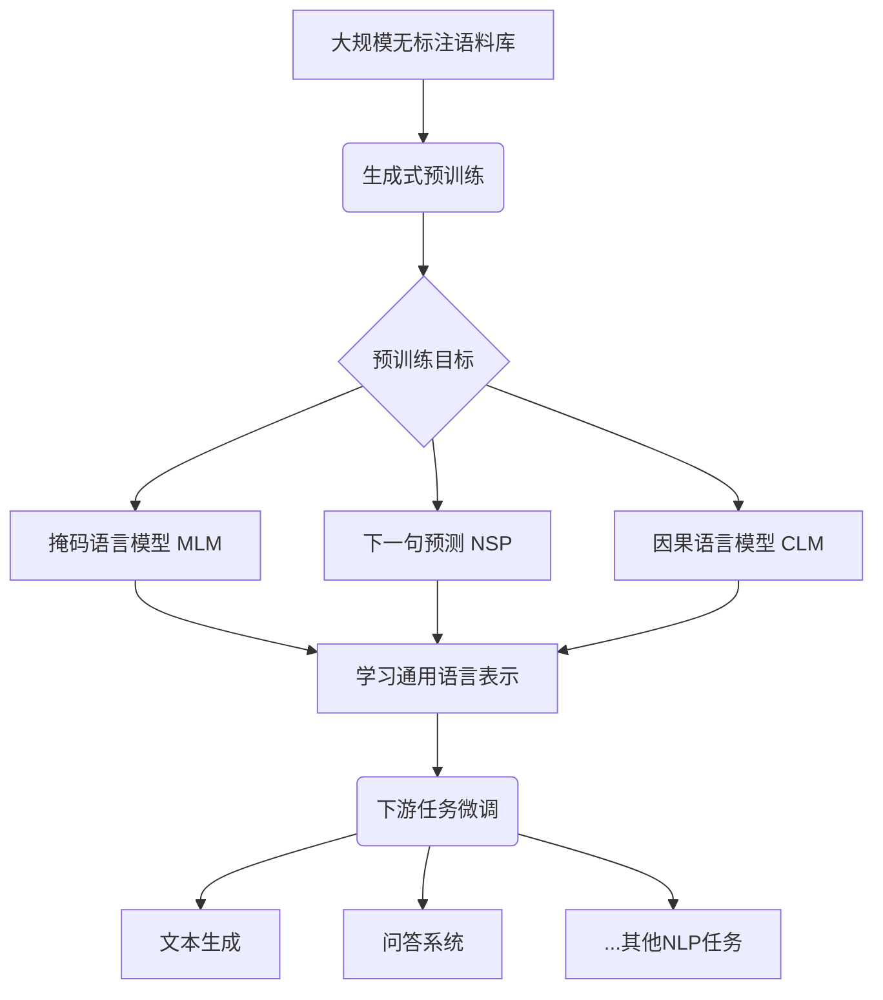

# AIGC从入门到实战：ChatGPT 提升程序员编写代码和设计算法的效率

## 1.背景介绍

### 1.1 人工智能的发展历程

人工智能(Artificial Intelligence, AI)是一个旨在使机器能够模仿人类智能行为的技术领域。自20世纪50年代诞生以来,AI经历了几个重要的发展阶段。

- **早期阶段(1950s-1960s)**: 这一时期的研究主要集中在逻辑推理、博弈论和机器学习等基础理论方面。
- **知识导向时期(1970s-1980s)**: 研究重点转向知识表示和专家系统,试图将人类专家的知识编码到计算机系统中。
- **统计学习时期(1990s-2000s)**: 随着计算能力和数据量的增长,统计机器学习方法开始占据主导地位,如支持向量机、决策树等。
- **深度学习时代(2010s至今)**: 受益于大数据、强大的计算能力和新的训练算法,深度神经网络在计算机视觉、自然语言处理等领域取得了突破性进展。

### 1.2 AIGC的兴起

AIGC(Artificial Intelligence Generated Content)是指利用人工智能技术生成文本、图像、音频、视频等内容的新兴领域。随着深度学习、自然语言处理等技术的快速发展,AIGC开始在内容创作、营销、娱乐等领域发挥重要作用。

其中,以ChatGPT为代表的大型语言模型(Large Language Model, LLM)在自然语言生成方面表现出色,可用于辅助编程、写作、问答等多种场景。程序员可以利用ChatGPT提高代码编写和算法设计的效率,这正是本文的重点探讨内容。

## 2.核心概念与联系

### 2.1 大型语言模型(LLM)

大型语言模型是一种利用深度学习技术从海量文本数据中学习语言模式的人工智能模型。它们通过自监督学习,捕捉语言的统计规律,从而具备生成自然、流畅的文本的能力。

LLM的核心思想是使用Transformer等注意力机制模型结构,并在大规模语料库上进行预训练。代表性模型包括GPT(Generative Pre-trained Transformer)、BERT(Bidirectional Encoder Representations from Transformers)等。

### 2.2 ChatGPT

ChatGPT是OpenAI于2022年11月推出的一款基于GPT-3.5架构的对话式AI助手。它能够理解和回答各种自然语言问题,并生成高质量、人性化的响应。

ChatGPT的强大之处在于:

- 具备广博的知识:经过训练,ChatGPT掌握了涵盖多个领域的知识。
- 上下文理解能力:能够把握对话的上下文,做出合理的回应。
- 生成性能力:可以生成连贯、流畅、多样化的自然语言输出。
- 持续学习能力:具备一定的主动学习和知识迁移能力。

ChatGPT的出现为程序员提供了高效的AI辅助编码工具,可以显著提升编码效率和算法设计能力。

## 3.核心算法原理具体操作步骤

### 3.1 Transformer架构

Transformer是一种基于注意力机制的序列到序列(Seq2Seq)模型,广泛应用于自然语言处理任务。它的核心思想是利用注意力机制捕捉输入序列中不同位置之间的依赖关系,从而更好地建模长距离依赖。

Transformer的主要组成部分包括:

1. **Embedding层**: 将输入的词元(token)映射到连续的向量空间。
2. **多头注意力层(Multi-Head Attention)**: 捕捉不同位置之间的依赖关系。
3. **前馈神经网络(Feed-Forward Network)**: 对注意力输出进行非线性变换。
4. **层归一化(Layer Normalization)**: 加速模型收敛并提高性能。

Transformer架构中没有递归和卷积操作,因此可以高效地并行计算,适合利用GPU等硬件加速训练。

### 3.2 自回归语言模型

自回归语言模型(Autoregressive Language Model)是一种常用的语言生成模型,它基于给定的前缀(prefix)生成下一个词元的概率分布,从而逐步生成完整的文本序列。

该模型的核心思想是利用条件概率链规则将序列的联合概率分解为词元级的条件概率的乘积:

$$P(x_1, x_2, ..., x_n) = \prod_{t=1}^{n} P(x_t | x_1, x_2, ..., x_{t-1})$$

其中,$x_t$表示第$t$个词元,$P(x_t | x_1, x_2, ..., x_{t-1})$表示在给定前$t-1$个词元的条件下,生成第$t$个词元的概率。

在生成过程中,模型会根据前缀和已生成的部分,预测下一个最可能的词元,并将其添加到序列中,重复该过程直至生成完整序列或达到预设长度。

### 3.3 生成式预训练

生成式预训练(Generative Pre-training)是训练大型语言模型的一种常用范式。其核心思想是在大规模无标注语料库上进行自监督学习,捕捉语言的统计规律,从而获得通用的语言表示能力。

常见的生成式预训练目标包括:

1. **掩码语言模型(Masked Language Modeling, MLM)**: 随机掩蔽部分词元,模型需要预测被掩蔽的词元。
2. **下一句预测(Next Sentence Prediction, NSP)**: 判断两个句子是否为连续的句子对。
3. **因果语言模型(Causal Language Modeling, CLM)**: 给定前缀,模型需要预测下一个词元。

经过预训练后,模型可以捕捉到丰富的语义和上下文信息,为下游任务(如文本生成、问答等)提供有力的语言理解和生成能力。

通过上述核心算法原理,ChatGPT等大型语言模型能够在自然语言生成任务上取得优异表现,为程序员提供高效的AI辅助编码工具。

## 4.数学模型和公式详细讲解举例说明

在自然语言处理领域,数学模型和公式扮演着重要角色,为算法提供理论基础和形式化描述。以下将详细讲解一些核心公式,并给出具体例子加深理解。

### 4.1 词嵌入(Word Embedding)

词嵌入是将离散的词元映射到连续的向量空间中的技术,使得语义相似的词元在向量空间中彼此靠近。常用的词嵌入方法包括Word2Vec、GloVe等。

Word2Vec的核心思想是通过神经网络模型最大化目标函数,学习词向量表示。其中,Skip-Gram模型的目标函数为:

$$\max_{\theta} \frac{1}{T}\sum_{t=1}^{T}\sum_{-c \leq j \leq c, j \neq 0} \log P(w_{t+j} | w_t; \theta)$$

其中,$w_t$表示中心词,$w_{t+j}$表示上下文词,$c$为窗口大小,$\theta$为模型参数。

例如,对于句子"我喜欢编程",假设词嵌入维度为2,中心词"编程"的词向量可能是$[0.8, -0.2]$,与其语义相近的"代码"的词向量可能是$[0.7, -0.1]$,而与其语义不相关的"足球"的词向量可能是$[-0.5, 0.9]$。

### 4.2 注意力机制(Attention Mechanism)

注意力机制是Transformer等模型的核心,它允许模型在编码输入序列时,对不同位置的信息赋予不同的权重,从而更好地捕捉长距离依赖关系。

缩放点积注意力(Scaled Dot-Product Attention)的计算公式为:

$$\text{Attention}(Q, K, V) = \text{softmax}(\frac{QK^T}{\sqrt{d_k}})V$$

其中,$Q$为查询(Query)向量,$K$为键(Key)向量,$V$为值(Value)向量,$d_k$为缩放因子(通常为$K$的维度)。

例如,在机器翻译任务中,当模型翻译"我喜欢编程"这个句子时,注意力机制可以自动关注"编程"这个词,并将其对应的值向量$V$赋予更大的权重,从而更好地生成目标语言的正确翻译。

### 4.3 交叉熵损失(Cross-Entropy Loss)

交叉熵损失是自然语言生成任务中常用的损失函数,它衡量了模型预测的概率分布与真实分布之间的差异。

对于一个长度为$N$的序列,交叉熵损失的公式为:

$$\mathcal{L} = -\frac{1}{N}\sum_{i=1}^{N}\log P(y_i|x, \theta)$$

其中,$x$为输入序列,$y_i$为第$i$个目标词元,$\theta$为模型参数。

例如,假设模型输出的概率分布为$P(y_i=\text{apple}|x)=0.6, P(y_i=\text{banana}|x)=0.3, P(y_i=\text{orange}|x)=0.1$,而真实标签为"apple",则该位置的交叉熵损失为$-\log 0.6 = 0.51$。通过最小化该损失函数,模型可以学习生成更准确的概率分布。

通过上述数学模型和公式,我们可以更好地理解大型语言模型的理论基础,为实现高质量的自然语言生成奠定坚实的理论基础。

## 5.项目实践:代码实例和详细解释说明

为了更好地理解如何利用ChatGPT提高编程效率,我们将通过一个实际的代码示例来演示其在代码编写和算法设计中的应用。

### 5.1 问题描述

假设我们需要实现一个简单的文本摘要生成器,它可以从给定的长文本中提取出最重要的几句话作为摘要。我们将使用TextRank算法,这是一种基于图的无监督文本摘要方法。

### 5.2 算法原理

TextRank算法的核心思想是将文本表示为一个无向加权图,其中节点表示句子,边的权重表示两个句子之间的相似度。通过在图上运行PageRank算法,可以计算出每个句子的重要性分数。根据这些分数,我们可以选取得分最高的几个句子作为摘要。

### 5.3 使用ChatGPT辅助编码

我们将使用Python编写这个文本摘要生成器,并利用ChatGPT在以下几个方面提供帮助:

1. **算法实现细节**:我们可以询问ChatGPT关于TextRank算法的具体实现细节,如句子相似度计算、图构建、PageRank计算等。

2. **代码优化建议**:在编写代码时,我们可以让ChatGPT审查代码,提供优化建议,如代码结构、变量命名、注释等。

3. **调试和错误修