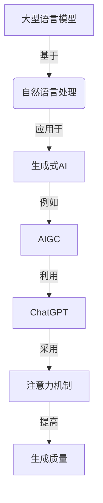
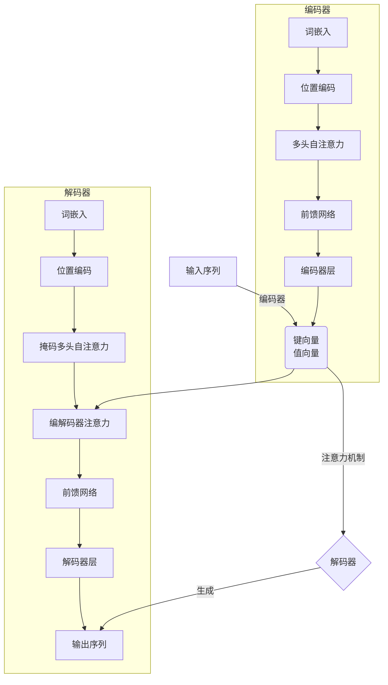

# AIGC从入门到实战：利用 ChatGPT 分析和跟踪算法代码，让它帮你探路

## 1. 背景介绍

### 1.1 人工智能时代的到来

人工智能(AI)技术的飞速发展正在改变着我们的生活和工作方式。随着计算能力的不断提升和算法的不断优化,AI系统已经能够胜任越来越多的复杂任务,从图像识别、自然语言处理到游戏对弈等领域,AI的应用范围不断扩大。

### 1.2 AIGC(AI Generated Content)的崛起

在AI技术的推动下,AIGC(AI Generated Content)应运而生,成为一股不可忽视的新兴力量。AIGC利用AI算法生成文本、图像、音频、视频等各种形式的内容,极大地提高了内容生产的效率和质量。其中,以ChatGPT为代表的大型语言模型在自然语言生成方面表现出色,可以根据用户的提示生成高质量的文本内容。

### 1.3 ChatGPT:强大的AI助手

ChatGPT是OpenAI推出的一款基于GPT-3.5架构的对话式AI助手。它通过对大量文本数据进行预训练,掌握了丰富的自然语言知识,能够进行多轮对话、回答问题、撰写文章等多种任务。ChatGPT的出现为人类与AI之间的交互带来了全新的体验,也为AIGC的发展注入了新的动力。

## 2. 核心概念与联系

### 2.1 大型语言模型

大型语言模型(Large Language Model,LLM)是指通过对海量文本数据进行预训练而获得的庞大神经网络模型。这些模型能够捕捉到自然语言中的语义和语法规则,从而生成看似人类水平的文本内容。GPT-3、PanGu-Alpha等都是知名的大型语言模型。

### 2.2 自然语言处理

自然语言处理(Natural Language Processing,NLP)是人工智能的一个分支,旨在使计算机能够理解和生成人类可理解的自然语言。NLP技术广泛应用于机器翻译、问答系统、文本摘要等领域。大型语言模型的出现极大地推动了NLP技术的发展。

### 2.3 生成式AI

生成式AI(Generative AI)是指能够根据输入生成新的、原创性的内容的AI系统。AIGC就属于生成式AI的一种应用,通过输入提示或上下文信息,AI模型可以生成文本、图像、音频等多种形式的内容。生成式AI与传统的判别式AI(如图像分类、机器翻译等)形成鲜明对比。

### 2.4 注意力机制

注意力机制(Attention Mechanism)是大型语言模型中的一种关键技术。它允许模型在生成文本时,selectively关注输入序列中的不同部分,从而更好地捕捉长距离依赖关系。自注意力(Self-Attention)是注意力机制的一种变体,广泛应用于Transformer等模型架构中。

### 2.5 Mermaid流程图

上图展示了AIGC与ChatGPT相关的核心概念及其联系。大型语言模型是自然语言处理技术的基础,生成式AI则是其一种应用形式。AIGC正是生成式AI在内容生产领域的体现,而ChatGPT作为一款基于注意力机制的大型语言模型,为AIGC提供了强大的生成能力。

## 3. 核心算法原理具体操作步骤

### 3.1 Transformer架构

Transformer是一种全新的基于注意力机制的序列到序列(Sequence-to-Sequence)模型架构,被广泛应用于机器翻译、文本生成等任务。它的核心思想是完全依赖注意力机制来捕捉输入和输出序列之间的长距离依赖关系,而不再使用传统的循环神经网络(RNN)或卷积神经网络(CNN)结构。

Transformer架构主要由编码器(Encoder)和解码器(Decoder)两个模块组成。编码器将输入序列映射为一系列连续的向量表示,解码器则根据这些向量表示生成输出序列。两个模块内部都采用了多头自注意力(Multi-Head Self-Attention)机制,用于捕捉序列内部的依赖关系。

#### 3.1.1 编码器(Encoder)

编码器的主要作用是将输入序列映射为一系列连续的向量表示,称为键(Key)和值(Value)。具体步骤如下:

1. 将输入序列的每个单词映射为相应的词嵌入(Word Embedding)向量。
2. 对词嵌入向量进行位置编码(Positional Encoding),赋予每个单词在序列中的位置信息。
3. 将编码后的向量输入到多头自注意力层,捕捉单词之间的依赖关系,得到注意力输出。
4. 将注意力输出通过前馈神经网络(Feed-Forward Neural Network)进一步处理,得到最终的键(Key)和值(Value)向量表示。
5. 重复步骤3和4,构建多层编码器层。

#### 3.1.2 解码器(Decoder)

解码器的作用是根据编码器输出的向量表示,生成目标输出序列。具体步骤如下:

1. 将目标序列的前一个单词映射为词嵌入向量,并进行位置编码。
2. 将编码后的向量输入到掩码多头自注意力层(Masked Multi-Head Self-Attention),捕捉已生成单词之间的依赖关系,得到自注意力输出。
3. 将自注意力输出与编码器的键(Key)和值(Value)输入到编码器-解码器注意力层(Encoder-Decoder Attention),捕捉输入序列与输出序列之间的依赖关系,得到注意力输出。
4. 将注意力输出通过前馈神经网络进一步处理,得到最终的输出向量表示。
5. 重复步骤2到4,生成下一个单词,直到生成完整的目标序列。

#### 3.1.3 注意力机制(Attention Mechanism)

注意力机制是Transformer架构的核心,它允许模型在生成序列时selectively关注输入序列中的不同部分,从而更好地捕捉长距离依赖关系。具体来说,注意力机制通过计算查询向量(Query)与键向量(Key)之间的相似性得分,然后根据相似性得分对值向量(Value)进行加权求和,得到注意力输出。

多头自注意力(Multi-Head Self-Attention)是一种变体,它将注意力机制应用于同一个序列,捕捉序列内部的依赖关系。掩码多头自注意力(Masked Multi-Head Self-Attention)则在此基础上,通过掩码机制防止注意力计算时关注到未来的单词,确保了生成的自回归性(Auto-Regressive)。

编码器-解码器注意力(Encoder-Decoder Attention)则是将注意力机制应用于编码器和解码器之间,捕捉输入序列与输出序列之间的依赖关系。

### 3.2 GPT(Generative Pre-trained Transformer)

GPT是一种基于Transformer架构的大型语言模型,专门用于生成任务。它通过对大量文本数据进行预训练,学习自然语言的语义和语法规则,从而获得强大的文本生成能力。

GPT模型的训练过程分为两个阶段:预训练(Pre-training)和微调(Fine-tuning)。

#### 3.2.1 预训练(Pre-training)

在预训练阶段,GPT模型会在大规模的文本语料库上进行无监督学习,目标是最大化下一个单词的概率。具体来说,给定一个文本序列,模型需要预测下一个最可能出现的单词。通过这种方式,模型可以学习到自然语言的统计规律和语义知识。

预训练通常采用自回归语言模型(Auto-Regressive Language Model)的方式进行,即模型在生成下一个单词时,只能利用之前的单词,而不能看到未来的单词。这种方式确保了模型具有很强的生成能力,而不是简单地复制输入数据。

#### 3.2.2 微调(Fine-tuning)

在微调阶段,GPT模型会在特定任务的数据集上进行有监督学习,以适应具体的应用场景。例如,如果要将GPT应用于问答任务,就需要在问答数据集上对模型进行微调,使其学习如何根据问题生成合适的答案。

微调过程通常采用监督学习的方式进行,即给定输入和期望输出,模型需要最小化实际输出与期望输出之间的差异。由于GPT模型在预训练阶段已经学习到了丰富的语言知识,因此微调过程通常只需要少量的任务数据和少量的训练步骤,就能获得良好的性能。

### 3.3 ChatGPT

ChatGPT是OpenAI推出的一款基于GPT-3.5架构的对话式AI助手。它采用了GPT模型的预训练-微调范式,但在此基础上进行了一些关键改进和优化。

#### 3.3.1 对话式微调

与传统的GPT模型不同,ChatGPT在微调阶段采用了对话式数据集,即输入和输出都是一个对话的上下文。这种方式使得ChatGPT能够更好地理解对话的语境,生成更加贴切的回复。

#### 3.3.2 人类反馈优化

ChatGPT的训练过程中,还引入了人类反馈的机制。具体来说,人工标注员会评估ChatGPT生成的回复的质量,并给出反馈。这些反馈信息会被纳入模型的训练过程,使得ChatGPT能够不断优化和改进。

#### 3.3.3 提示学习

ChatGPT采用了提示学习(Prompt Learning)的技术,即通过精心设计的提示,引导模型生成特定形式的输出。例如,在进行文本生成任务时,可以在提示中包含一些示例文本,指导模型生成相似风格的内容。

#### 3.3.4 安全性和可控性

为了确保ChatGPT的输出是安全和可控的,OpenAI在模型训练过程中采取了一些策略,如过滤掉有害和不当的内容、引入偏置控制等。这使得ChatGPT在生成内容时,能够避免产生违法、暴力、歧视等不当内容。

### 3.4 Mermaid流程图

上图展示了Transformer架构的核心流程,包括编码器和解码器的具体操作步骤,以及注意力机制在其中的应用。编码器将输入序列映射为键向量和值向量,解码器则根据这些向量生成输出序列。注意力机制在编码器、解码器和编解码器之间发挥着关键作用,帮助模型捕捉长距离依赖关系。

## 4. 数学模型和公式详细讲解举例说明

### 4.1 注意力计算

注意力机制的核心是计算查询向量(Query)与键向量(Key)之间的相似性得分,然后根据相似性得分对值向量(Value)进行加权求和,得到注意力输出。具体计算过程如下:

给定一个查询向量 $\boldsymbol{q} \in \mathbb{R}^{d_q}$、一组键向量 $\boldsymbol{K} = \{\boldsymbol{k}_1, \boldsymbol{k}_2, \ldots, \boldsymbol{k}_n\}$,其中 