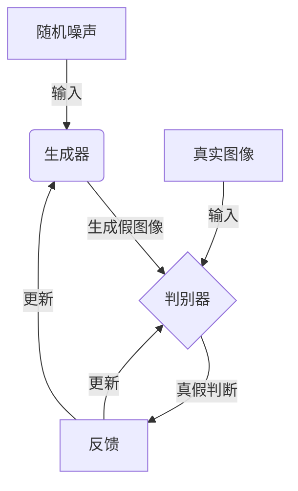
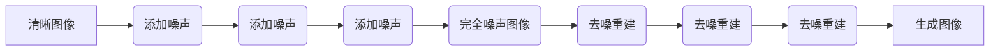
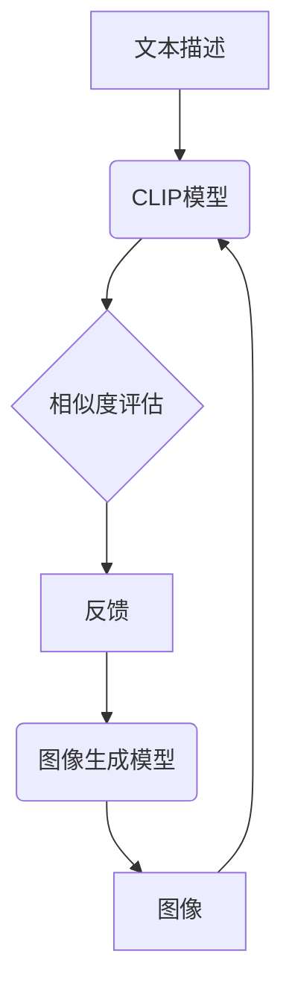

# AIGC从入门到实战：变化：活用Midjourney，你也能成为神笔马良

## 1.背景介绍

### 1.1 人工智能生成内容(AIGC)的兴起

人工智能生成内容(Artificial Intelligence Generated Content,AIGC)是近年来备受关注的一个新兴领域。AIGC技术利用深度学习等人工智能算法,可以生成高质量的文本、图像、音频、视频等多种形式的内容。随着算力和数据量的不断增长,AIGC的能力也在不断提升,正在改变内容创作和消费的方式。

### 1.2 Midjourney:革命性的AIGC图像生成工具

在AIGC图像生成领域,Midjourney是一款具有里程碑意义的工具。它基于扩散模型等先进技术,能够根据用户的文本描述生成逼真的高质量图像。自2022年7月公测以来,Midjourney因其强大的图像生成能力和简单易用的界面,迅速在全球范围内获得了广泛关注和应用。

### 1.3 AIGC影响深远,机遇与挑战并存

AIGC的兴起无疑将深刻影响多个行业,为内容创作者带来全新的机遇。通过AIGC工具如Midjourney,任何人都可以实现高水准的图像创作,打破了传统的专业门槛。但与此同时,AIGC也带来了版权、知识产权等新的法律和伦理挑战。我们需要制定相应的规则和准则,以确保AIGC的健康发展。

## 2.核心概念与联系

### 2.1 生成式对抗网络(GAN)

生成式对抗网络(Generative Adversarial Networks,GAN)是AIGC图像生成的核心技术之一。GAN包含两个神经网络:生成器(Generator)和判别器(Discriminator)。生成器从随机噪声中生成假图像,而判别器则判断输入图像是真实的还是生成的。两个网络相互对抗,最终使生成器能够生成高质量的图像。



### 2.2 扩散模型(Diffusion Models)

扩散模型是另一种流行的AIGC图像生成技术,也是Midjourney所采用的核心算法。扩散模型包含两个过程:扩散(Diffusion)和反扩散(Reverse Diffusion)。扩散过程将清晰的图像逐步添加噪声,直至完全破坏;而反扩散则是从噪声图像中重建原始图像的过程。通过训练,模型可以学会从任意噪声中生成所需图像。



### 2.3 CLIP:文本与图像的联系

为了实现根据文本描述生成图像,AIGC系统需要建立文本和图像之间的联系。CLIP(Contrastive Language-Image Pre-training)是一种有效的方法,它通过对成对的文本-图像数据进行对比式预训练,学习文本和图像的语义关联。在生成过程中,CLIP模型会引导图像生成模型(如GAN或扩散模型)生成与给定文本描述最匹配的图像。



## 3.核心算法原理具体操作步骤

### 3.1 Midjourney的工作原理

Midjourney采用了基于扩散模型的AIGC图像生成算法。具体步骤如下:

1. 用户输入文本描述,描述所需生成的图像内容和风格。
2. 文本经过CLIP模型编码,得到与图像相关的语义表示。
3. 从高斯噪声开始,通过反扩散过程生成初始图像。
4. 利用CLIP模型评估生成图像与文本描述的相似度,并根据评分对图像进行修正。
5. 重复步骤3和4,直至生成的图像与文本描述高度匹配。
6. 输出最终生成的高质量图像。

### 3.2 Midjourney的具体使用流程

1. 注册并加入Midjourney的Discord服务器。
2. 在"Newjobs"频道输入文本描述,如"/imagine prompt:a beautiful landscape painting"。
3. Midjourney会生成4张初始图像,并给出图像ID。
4. 可使用"/reroll"命令重新生成这4张图像的变体。
5. 使用"/uprescale"命令对选定的图像进行超分辨率处理,提高清晰度。
6. 使用"/variation"命令根据选定图像生成相似但不同的变体图像。
7. 使用"/save"命令保存最终满意的图像到个人图像库。

## 4.数学模型和公式详细讲解举例说明

### 4.1 扩散模型数学表示

扩散模型的核心思想是通过添加高斯噪声来逐步破坏图像,再通过学习的方式从噪声图像中重建原始图像。设$x_0$为原始图像,$q(x_t|x_{t-1})$为从$x_{t-1}$到$x_t$的扩散过程,$p_\theta(x_{t-1}|x_t)$为反扩散过程,目标是最大化如下概率:

$$
\begin{aligned}
\log p_\theta(x_0) &= \mathbb{E}_{q(x_{1:T}|x_0)}\left[\log\frac{p_\theta(x_0)}{q(x_{1:T}|x_0)}\right] \\
&= \mathbb{E}_{q(x_{1:T}|x_0)}\left[\sum_{t=1}^T\log\frac{p_\theta(x_{t-1}|x_t)}{q(x_t|x_{t-1})}\right]
\end{aligned}
$$

通过训练,模型可以学习到合适的$p_\theta(x_{t-1}|x_t)$,使其能够从任意噪声$x_T$生成所需图像$x_0$。

### 4.2 CLIP模型

CLIP模型的目标是学习图像和文本之间的语义关联,使得相关的图像-文本对的相似度大于无关对的相似度。设$I$为图像,$T$为文本描述,图像编码器$f(I)$和文本编码器$g(T)$分别将图像和文本映射到同一语义空间。则CLIP的损失函数为:

$$\mathcal{L}_{CLIP}=\mathbb{E}_{(I,T)\sim p_{pos}}\left[-\log\frac{e^{s(I,T)}}{e^{s(I,T)}+\sum_{(\bar{I},\bar{T})\sim p_{neg}}e^{s(\bar{I},\bar{T})}}\right]$$

其中$s(I,T)=f(I)^\top g(T)/\tau$为相似度打分函数,$p_{pos}$为正样本对的分布,$p_{neg}$为负样本对的分布,$\tau$为温度超参数。通过最小化损失函数,CLIP可以学习到良好的图像-文本语义表示。

### 4.3 Midjourney的端到端过程

将扩散模型与CLIP模型相结合,我们可以描述Midjourney的端到端图像生成过程。给定文本描述$T$,目标是生成图像$\hat{I}$使得$s(\hat{I},T)$最大化。具体过程为:

1. 从高斯噪声$x_T\sim\mathcal{N}(0,I)$开始
2. 对$x_T$进行$t$步反扩散,得到$x_{T-t}$
3. 计算$s(x_{T-t},T)$,若分数较低则对$x_{T-t}$进行修正
4. 重复2-3,直至$t=T$得到最终图像$\hat{I}=x_0$

通过上述过程,Midjourney可以生成与给定文本描述高度相关的图像。

## 5.项目实践:代码实例和详细解释说明

虽然Midjourney是一款封闭源代码的商业产品,但我们可以通过开源项目如Stable Diffusion来了解AIGC图像生成的实现细节。以下是一个使用Stable Diffusion生成图像的Python代码示例:

```python
from diffusers import StableDiffusionPipeline
import torch

# 加载预训练模型和VRAM权重
pipe = StableDiffusionPipeline.from_pretrained("runwayml/stable-diffusion-v1-5", torch_dtype=torch.float16)

# 设置生成参数
prompt = "A photorealistic portrait of a cyberpunk girl"
negative_prompt = "blurry, low quality, bad anatomy"
num_images = 4
guidance_scale = 7.5

# 运行生成
images = pipe(prompt, negative_prompt=negative_prompt, num_images_per_prompt=num_images, guidance_scale=guidance_scale)

# 保存生成的图像
for i, image in enumerate(images.images):
    image.save(f"cyberpunk_girl_{i}.png")
```

上述代码首先加载Stable Diffusion的预训练模型和VRAM权重。然后设置所需生成的图像内容(prompt)、不希望出现的内容(negative_prompt)、图像数量和guidance_scale参数。

调用pipe函数执行图像生成,该函数内部会根据prompt通过CLIP模型计算条件,并利用扩散模型的反扩散过程生成满足条件的图像。最后将生成的图像保存到本地文件。

通过修改prompt、num_images等参数,我们可以生成各种不同主题和风格的图像。这个简单的示例代码展示了AIGC图像生成的基本流程。

## 6.实际应用场景

### 6.1 内容创作

AIGC图像生成工具为内容创作者提供了强大的辅助能力。设计师可以使用Midjourney快速创作插画、概念画等,大大提高工作效率。写作者也可以根据文字描述生成配图,为作品增色不少。AIGC将推动内容创作领域的变革。

### 6.2 视觉化和可视化

在数据可视化、产品和服务设计等领域,AIGC图像生成技术可以将抽象的概念转化为直观的视觉呈现,帮助人们更好地理解复杂信息。开发人员只需提供简单的文本描述,就能得到所需的设计图或原型图像。

### 6.3 教育和培训

AIGC可用于生成教学素材、示例图像等,为教育和培训提供有力支持。教师可以根据需求快速生成相关图像,使课程内容更加生动形象;学生也可以借助AIGC辅助学习,将抽象概念具体可视化。

### 6.4 娱乐和创意

Midjourney等AIGC工具为普通用户提供了强大的创意表达能力。人们可以尽情发挥想象力,生成梦想中的奇幻场景、虚构角色等,满足个人兴趣爱好。AIGC正在为大众带来全新的娱乐体验。

## 7.工具和资源推荐

### 7.1 Midjourney

Midjourney无疑是目前最受欢迎的AIGC图像生成工具之一。它提供了Discord机器人和网页两种使用界面,操作简单,能生成高质量的图像。Midjourney有免费试用和付费订阅两种使用模式。

### 7.2 Stable Diffusion

Stable Diffusion是一款优秀的开源AIGC图像生成项目,在GitHub上获得了超过2万星。它不仅提供了预训练模型,还有完整的代码实现,方便研究和二次开发。Stable Diffusion也有基于Web的Demo可供体验。

### 7.3 DALL-E 2

DALL-E 2是OpenAI推出的新一代AIGC图像生成系统,具有卓越的性能。虽然DALL-E 2目前仍处于封闭测试阶段,但其未来的公开发布值得期待。OpenAI也提供了DALL-E Mini在线Demo,供大家初步体验。

### 7.4 资源网站

除了工具之外,一些资源网站也为AIGC爱好者提供了宝贵的信息和交流平台,例如:

- Lex的AI艺术家(lexwww.substack.com/): Lex在Substack分享了大量AIGC