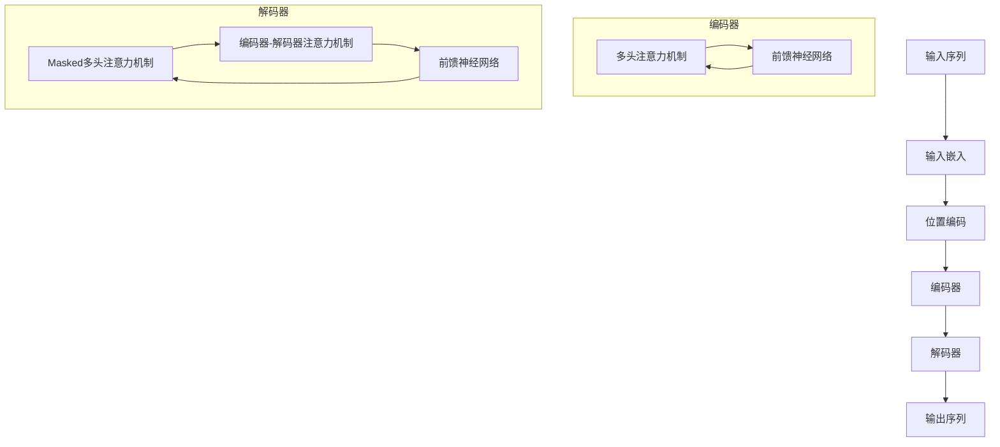

# AIGC从入门到实战：测试：ChatGPT 能扮演什么角色？

## 1.背景介绍

### 1.1 人工智能的发展历程

人工智能(Artificial Intelligence, AI)是当代科技发展的前沿领域,它的起源可以追溯到20世纪50年代。在过去的几十年里,人工智能经历了几个重要的发展阶段:

- 1950年代:人工智能的概念被正式提出,研究者开始探索机器是否能够模拟人类的思维过程。
- 1960-1970年代:专家系统和机器学习算法的发展,为人工智能系统提供了推理和学习的能力。
- 1980-1990年代:神经网络和深度学习的兴起,使得人工智能系统能够处理更加复杂的任务。
- 2000年代至今:大数据、云计算和GPU的发展,为深度学习模型的训练提供了强大的计算能力,推动了人工智能的快速发展。

### 1.2 AIGC的崛起

近年来,随着人工智能技术的不断进步,一种新的人工智能范式应运而生——AIGC(AI Generated Content,人工智能生成内容)。AIGC是指利用人工智能算法和模型自动生成文本、图像、音频、视频等多种形式的内容。

AIGC的核心是大型语言模型(Large Language Model, LLM),如GPT-3、ChatGPT等。这些模型通过对海量文本数据进行训练,学习到了人类语言的模式和知识,从而具备了生成逼真、连贯、有意义的内容的能力。

AIGC技术的出现,为内容创作带来了全新的可能性,它可以极大地提高内容生产的效率,降低成本,同时也为创作者提供了智能辅助的工具,释放人类的创造力。

### 1.3 ChatGPT的崛起

ChatGPT是OpenAI于2022年11月推出的一款基于GPT-3.5架构的对话式人工智能模型。它不仅能够生成高质量的文本内容,还能够与人类进行自然的对话交互。

ChatGPT的出现,引发了全球范围内的热议和关注。它展现出了惊人的语言理解和生成能力,可以回答各种复杂的问题,撰写文章、代码、诗歌等,甚至能够进行简单的推理和分析。

ChatGPT的成功,标志着AIGC技术进入了一个新的里程碑。它不仅是一款强大的工具,更是一个全新的人工智能范式的开端,将深刻影响未来的内容创作、教育、客户服务等多个领域。

## 2.核心概念与联系

### 2.1 大型语言模型(LLM)

大型语言模型(Large Language Model, LLM)是AIGC技术的核心,它是一种基于深度学习的自然语言处理模型。LLM通过对海量文本数据进行预训练,学习到了人类语言的模式和知识,从而具备了生成连贯、有意义的文本内容的能力。

LLM的核心架构是transformer,它是一种基于注意力机制的神经网络结构,能够有效地捕捉长距离的上下文信息,从而生成更加自然、流畅的文本。

常见的LLM包括GPT(Generative Pre-trained Transformer)系列、BERT(Bidirectional Encoder Representations from Transformers)系列、T5(Text-to-Text Transfer Transformer)等。这些模型在不同的任务上表现出色,如文本生成、机器翻译、问答系统等。

LLM的发展离不开大规模的计算资源和海量的训练数据。随着硬件计算能力的提升和数据量的增长,LLM的规模也在不断扩大,从最初的几十万参数,发展到现在的数十亿甚至上百亿参数。

### 2.2 AIGC与传统内容创作的区别

相比于传统的内容创作方式,AIGC具有以下几个显著的区别:

1. **效率提升**:AIGC可以极大地提高内容生产的效率,降低人力成本。
2. **创作辅助**:AIGC可以为创作者提供智能辅助,如自动生成大纲、草稿等,释放人类的创造力。
3. **个性化内容**:AIGC可以根据用户的需求和偏好,生成个性化的内容。
4. **多模态生成**:AIGC不仅可以生成文本内容,还可以生成图像、音频、视频等多种形式的内容。
5. **持续迭代**:AIGC模型可以通过持续学习新数据,不断提升自身的能力。

然而,AIGC也存在一些局限性和挑战,如偏差和不确定性、版权和伦理问题、创造力和原创性的缺乏等。因此,AIGC更多的是作为一种辅助工具,而非完全取代人类创作者。

### 2.3 ChatGPT的核心技术

ChatGPT是一种基于GPT-3.5架构的对话式人工智能模型,它的核心技术包括:

1. **预训练**:ChatGPT在大规模文本数据上进行了预训练,学习到了丰富的语言知识和上下文信息。
2. **微调**:在预训练的基础上,ChatGPT通过对话式数据进行了进一步的微调,使其具备了对话交互的能力。
3. **注意力机制**:ChatGPT采用了transformer的注意力机制,能够有效捕捉长距离的上下文信息,生成更加连贯的对话。
4. **生成式模型**:ChatGPT是一种生成式模型,它可以根据给定的上下文,自动生成新的文本内容。
5. **多任务学习**:ChatGPT在训练过程中,同时学习了多种任务,如问答、文本生成、代码生成等,具备了强大的多功能性。

ChatGPT的核心技术使其具备了出色的语言理解和生成能力,能够进行自然流畅的对话交互,并生成高质量的内容。然而,ChatGPT也存在一些局限性,如缺乏常识推理能力、难以保证输出的一致性和可靠性等。

## 3.核心算法原理具体操作步骤

### 3.1 Transformer架构

Transformer是ChatGPT等大型语言模型的核心架构,它是一种基于注意力机制的序列到序列(Sequence-to-Sequence)模型。Transformer的主要组成部分包括编码器(Encoder)和解码器(Decoder),它们都由多个相同的层组成,每一层都包含多头注意力机制(Multi-Head Attention)和前馈神经网络(Feed-Forward Neural Network)。

Transformer的工作原理如下:

1. **输入嵌入**:将输入序列(如文本)转换为向量表示,作为模型的输入。
2. **位置编码**:由于Transformer没有递归或卷积结构,因此需要添加位置编码来捕获序列的位置信息。
3. **编码器**:编码器由多个相同的层组成,每一层包含两个子层:多头注意力机制和前馈神经网络。编码器的作用是捕获输入序列的上下文信息。
4. **解码器**:解码器也由多个相同的层组成,每一层包含三个子层:masked多头注意力机制、编码器-解码器注意力机制和前馈神经网络。解码器的作用是根据编码器的输出和前一个时间步的输出,生成下一个时间步的输出。
5. **输出**:解码器的最后一层输出作为模型的最终输出,可以是文本、序列标注等形式。

Transformer架构的关键在于注意力机制,它允许模型在计算目标输出时,直接关注输入序列中的任意位置,而不受序列长度的限制。这种灵活的注意力机制使得Transformer能够更好地捕捉长距离的依赖关系,从而生成更加自然流畅的输出。

### 3.2 自注意力机制

自注意力机制(Self-Attention)是Transformer架构中的核心组件,它允许模型在计算目标输出时,直接关注输入序列中的任意位置,而不受序列长度的限制。

自注意力机制的工作原理如下:

1. **查询、键和值**:将输入序列分别映射为查询(Query)、键(Key)和值(Value)三个向量。
2. **注意力分数计算**:计算查询向量与所有键向量的相似性(点积),得到一个注意力分数向量。
3. **注意力分数归一化**:通过Softmax函数对注意力分数向量进行归一化,得到注意力权重向量。
4. **加权求和**:将注意力权重向量与值向量进行加权求和,得到注意力输出向量。

数学表达式如下:

$$
\begin{aligned}
\text{Attention}(Q, K, V) &= \text{softmax}\left(\frac{QK^T}{\sqrt{d_k}}\right)V \\
\text{head}_i &= \text{Attention}\left(QW_i^Q, KW_i^K, VW_i^V\right) \\
\text{MultiHead}(Q, K, V) &= \text{Concat}(\text{head}_1, \ldots, \text{head}_h)W^O
\end{aligned}
$$

其中, $Q$、$K$、$V$分别表示查询、键和值, $W_i^Q$、$W_i^K$、$W_i^V$和$W^O$是可学习的权重矩阵, $d_k$是缩放因子。

多头注意力机制(Multi-Head Attention)是将多个注意力头的输出进行拼接,从而捕捉不同的注意力模式。

自注意力机制的优点在于,它可以直接建立任意两个位置之间的依赖关系,从而更好地捕捉长距离的上下文信息,这对于生成高质量的文本内容至关重要。

### 3.3 生成式模型

ChatGPT是一种生成式模型(Generative Model),它可以根据给定的上下文,自动生成新的文本内容。生成式模型的核心思想是通过学习训练数据中的模式和规律,估计目标序列的条件概率分布,然后根据这个分布进行采样,生成新的序列。

ChatGPT采用的是自回归(Auto-Regressive)生成方式,即在生成每个新的token时,都会考虑之前生成的所有token。具体操作步骤如下:

1. **输入编码**:将输入序列(如问题或上下文)编码为向量表示。
2. **初始化**:初始化解码器的初始隐状态,通常使用编码器的最后一个隐状态。
3. **生成第一个token**:根据初始隐状态和解码器的输出概率分布,采样生成第一个token。
4. **迭代生成**:将已生成的token作为输入,重复步骤3,直到生成完整序列或达到最大长度。

在生成每个新token时,ChatGPT会根据已生成的token和输入上下文,计算出所有可能token的条件概率分布,然后从中采样选择最有可能的token。这个过程可以用数学公式表示如下:

$$
P(y_1, y_2, \ldots, y_T | x) = \prod_{t=1}^T P(y_t | y_1, \ldots, y_{t-1}, x)
$$

其中, $x$表示输入序列, $y_1, y_2, \ldots, y_T$表示生成的目标序列, $P(y_t | y_1, \ldots, y_{t-1}, x)$是在给定之前生成的token和输入上下文的条件下,生成第$t$个token的条件概率。

通过这种自回归的生成方式,ChatGPT可以生成连贯、有意义的文本内容,同时也能够根据不同的输入上下文,生成不同的输出。

## 4.数学模型和公式详细讲解举例说明

### 4.1 Transformer模型

Transformer模型是一种基于注意力机制的序列到序列(Sequence-to-Sequence)模型,它的核心思想是通过自注意力机制(Self-Attention)直接建立