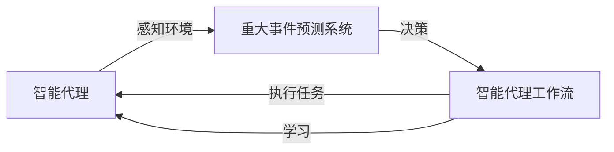

## 1.背景介绍

在当今的信息化社会，大数据和人工智能的应用已经深入到生活的方方面面。其中，智能代理技术作为一种重要的人工智能技术，已经得到了广泛的应用。智能代理可以理解为一种自主的、能够在某种环境中执行任务的系统，这种系统可以根据环境的变化做出反应，进行学习和决策，以达成预设的目标。本文将深入探讨智能代理在重大事件预测系统中的应用，并详细介绍智能代理工作流（AI Agent WorkFlow）的设计和实现。

## 2.核心概念与联系

在深入探讨智能代理在重大事件预测系统中的应用之前，我们首先需要理解几个核心概念：

- **智能代理（AI Agent）**：智能代理是一种可以感知环境并根据感知到的信息进行决策的系统。智能代理的目标是通过学习和决策，优化其行为以达成预设的目标。

- **重大事件预测系统**：重大事件预测系统是一种可以预测未来可能发生的重大事件的系统。这种系统通常会利用大数据和机器学习技术，根据历史数据和当前的情况，预测未来可能发生的事件。

- **智能代理工作流（AI Agent WorkFlow）**：智能代理工作流是指智能代理在执行任务时的工作流程。这个工作流程通常包括感知环境、决策、执行任务和学习等步骤。

这三个概念之间的关系可以用下面的 Mermaid 流程图来表示：



## 3.核心算法原理具体操作步骤

智能代理在重大事件预测系统中的应用，主要体现在以下几个步骤：

1. **感知环境**：智能代理首先需要感知环境，收集相关的数据。这些数据可能包括历史事件、当前的情况、相关的新闻报道等。

2. **决策**：根据收集到的数据，智能代理需要做出决策。这个决策可能是预测未来可能发生的事件，也可能是决定应该采取的行动。

3. **执行任务**：根据决策，智能代理执行相应的任务。这个任务可能是发布预警，也可能是采取其他的行动。

4. **学习**：智能代理需要不断学习和优化其决策和行为。这个学习过程可能包括监督学习、无监督学习、强化学习等。

## 4.数学模型和公式详细讲解举例说明

在智能代理的决策过程中，通常会用到一些数学模型和公式。例如，我们可以使用贝叶斯定理来更新我们对未来事件发生可能性的预测。

贝叶斯定理的公式如下：

$$
P(A|B) = \frac{P(B|A)P(A)}{P(B)}
$$

其中，$A$表示我们要预测的事件，$B$表示我们收集到的数据。$P(A|B)$表示在给定数据$B$的情况下，事件$A$发生的概率。$P(B|A)$表示在事件$A$发生的情况下，我们能够收集到数据$B$的概率。$P(A)$表示事件$A$发生的先验概率，$P(B)$表示我们能够收集到数据$B$的概率。

通过贝叶斯定理，我们可以根据收集到的数据，更新我们对未来事件发生可能性的预测。

## 5.项目实践：代码实例和详细解释说明

在实际的项目中，我们可以使用Python语言和相关的库，实现智能代理在重大事件预测系统中的应用。以下是一个简单的例子：

```python
import numpy as np
from sklearn.naive_bayes import GaussianNB

# 创建一个智能代理
class AIAgent:
    def __init__(self):
        self.model = GaussianNB()

    def perceive(self, data):
        # 感知环境，收集数据
        self.data = data

    def decide(self):
        # 决策，预测未来可能发生的事件
        self.prediction = self.model.predict(self.data)

    def act(self):
        # 执行任务，发布预警
        if self.prediction > 0.5:
            print("预警：可能发生重大事件！")

    def learn(self, data, labels):
        # 学习，优化决策和行为
        self.model.fit(data, labels)
```

在这个例子中，我们使用了朴素贝叶斯分类器来进行决策。我们首先收集数据，然后使用分类器预测未来可能发生的事件，如果预测结果大于0.5，我们就发布预警。最后，我们使用收集到的数据和标签，训练我们的模型，优化我们的决策和行为。

## 6.实际应用场景

智能代理在重大事件预测系统中的应用，可以广泛应用于各种领域。例如，我们可以使用智能代理来预测股市的走势，提前发布预警，帮助投资者做出决策。我们也可以使用智能代理来预测天气，提前发布预警，帮助人们做好防范。此外，智能代理还可以用于预测交通状况、疾病爆发等各种重大事件。

## 7.工具和资源推荐

在实现智能代理在重大事件预测系统中的应用时，我们可以使用以下工具和资源：

- **Python**：Python是一种广泛用于科学计算和数据分析的编程语言。Python有许多库，如NumPy、Pandas、Scikit-learn等，可以方便我们进行数据处理和机器学习。

- **Scikit-learn**：Scikit-learn是一个用于Python的机器学习库。它包含了许多常用的机器学习算法，如朴素贝叶斯分类器、决策树、支持向量机等。

- **Jupyter Notebook**：Jupyter Notebook是一个可以创建和分享文档的应用程序。这些文档可以包含实时代码、方程、可视化和解释性文本。

## 8.总结：未来发展趋势与挑战

随着大数据和人工智能技术的发展，智能代理在重大事件预测系统中的应用将会越来越广泛。然而，这也带来了一些挑战。例如，如何收集和处理大量的数据，如何保证预测的准确性和实时性，如何处理不确定性和噪声等。这些都是我们在未来需要进一步研究和解决的问题。

## 9.附录：常见问题与解答

1. **Q：智能代理的学习过程是怎样的？**
   
   A：智能代理的学习过程通常包括监督学习、无监督学习、强化学习等。在监督学习中，我们提供输入和期望的输出，让智能代理学习如何从输入预测输出。在无监督学习中，我们只提供输入，让智能代理学习输入的结构和模式。在强化学习中，我们让智能代理通过试错和反馈，学习如何优化其行为。

2. **Q：智能代理如何处理不确定性和噪声？**
   
   A：智能代理可以使用贝叶斯定理和其他的概率模型来处理不确定性和噪声。通过对数据的概率分布进行建模，我们可以在不确定性和噪声中做出最优的决策。

作者：禅与计算机程序设计艺术 / Zen and the Art of Computer Programming