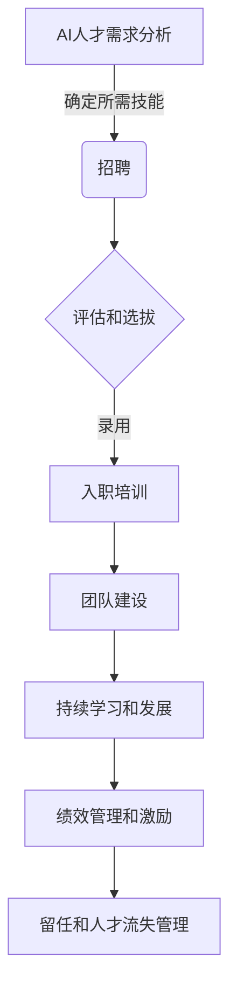

# AI人才招聘与团队建设原理与代码实战案例讲解

## 1.背景介绍

随着人工智能(AI)技术的快速发展,AI人才已经成为当今科技公司和企业最紧缺的资源之一。拥有合格的AI人才团队对于任何组织都是至关重要的,因为他们可以帮助企业利用AI技术提高效率、降低成本、优化业务流程并创造新的收入来源。然而,AI人才的招聘和团队建设过程并非一蹴而就,需要精心策划和执行。

本文将深入探讨AI人才招聘和团队建设的原理和实践,包括确定所需技能、制定招聘策略、评估候选人、构建高绩效团队、培养人才等关键环节。我们还将分享代码实战案例,帮助读者更好地理解如何应用这些原理和最佳实践。

## 2.核心概念与联系

在开始之前,让我们先了解一些核心概念及其相互关系:

### 2.1 AI人才

AI人才是指掌握人工智能相关技术和知识的人员,包括:

- 数据科学家
- 机器学习工程师
- 深度学习研究员
- 自然语言处理专家
- 计算机视觉专家
- AI系统架构师

他们的技能组合通常包括编程、数学、统计学、算法设计等多个领域。

### 2.2 AI团队

AI团队是由具备不同AI专长的人才组成的跨学科团队,旨在协作开发和部署AI解决方案。一个高效的AI团队需要具备以下特点:

- 多元化的技能组合
- 清晰的角色分工
- 顺畅的沟通协作
- 持续学习和成长

### 2.3 AI人才生命周期管理

AI人才生命周期管理是指系统化地管理AI人才的招聘、入职、培训、激励、发展和留任等环节,以确保组织拥有所需的AI人才并最大限度发挥他们的潜力。



上图展示了AI人才生命周期管理的主要流程,每个环节都对AI团队的建设和发展至关重要。

## 3.核心算法原理具体操作步骤

在AI人才招聘和团队建设过程中,有几个核心算法和原理需要了解和应用:

### 3.1 AI技能评估算法

评估AI人才的技能是招聘过程中的关键环节。常见的AI技能评估算法包括:

1. **编码测试**:通过实际编程任务来评估候选人的编码能力和解决问题的能力。

2. **技术面试**:由AI专家对候选人进行技术问题的提问和讨论,评估其对AI概念和技术的理解程度。

3. **项目评估**:要求候选人提交过去的AI项目作品,评估其实践经验和项目管理能力。

4. **案例研究**:提供一个AI相关的真实案例,让候选人分析问题并提出解决方案,评估其分析和解决问题的能力。

这些评估方法可以单独使用,也可以组合使用,以全面评估候选人的AI技能。

### 3.2 AI团队构建算法

构建高效的AI团队需要考虑多个因素,包括技能组合、角色分工、沟通协作等。一种常见的AI团队构建算法如下:

1. **确定所需技能**:根据AI项目的需求,确定所需的技能组合,如机器学习、深度学习、自然语言处理等。

2. **角色定义**:根据所需技能,定义不同的角色,如数据科学家、ML工程师、项目经理等。

3. **人员匹配**:从现有人才库中匹配合适的人选,填补每个角色。

4. **团队优化**:根据团队成员的技能、经验和个性特征,优化团队结构和协作方式。

5. **持续评估**:定期评估团队绩效,并根据需要进行人员调整或培训。

此外,还需要注重团队文化建设、激励机制设计等,以提高团队凝聚力和工作效率。

### 3.3 AI人才培养算法

AI技术发展迅速,AI人才需要持续学习和提升技能。一种常见的AI人才培养算法如下:

1. **技能差距分析**:评估现有AI人才的技能水平,并与未来需求进行对比,确定技能差距。

2. **培训需求确定**:根据技能差距,确定培训的主题、内容和形式(如在线课程、实践项目等)。

3. **培训计划制定**:制定详细的培训计划,包括时间安排、资源分配等。

4. **培训实施**:实施培训计划,并收集反馈以持续优化。

5. **知识共享**:鼓励AI人才之间的知识共享,如内部分享会、技术博客等。

6. **持续学习**:为AI人才提供持续学习的机会和资源,如研讨会、会议、在线课程等。

通过有效的培养机制,AI人才可以跟上技术发展的步伐,为组织创造更大价值。

## 4.数学模型和公式详细讲解举例说明

在AI人才招聘和团队建设中,有一些数学模型和公式可以帮助我们进行量化分析和优化决策。

### 4.1 马尔可夫决策过程(MDP)

马尔可夫决策过程(Markov Decision Process, MDP)是一种用于建模序列决策问题的数学框架。在AI人才招聘和团队建设中,我们可以将它应用于优化招聘和培训决策。

MDP由以下几个要素组成:

- 状态集合 $S$:表示系统可能处于的不同状态,如"缺乏数据科学家"、"团队规模不足"等。
- 行动集合 $A$:表示可以采取的行动,如"招聘新员工"、"提供培训"等。
- 转移概率 $P(s'|s,a)$:表示在状态 $s$ 下采取行动 $a$ 后,转移到状态 $s'$ 的概率。
- 奖励函数 $R(s,a)$:表示在状态 $s$ 下采取行动 $a$ 所获得的即时奖励。
- 折扣因子 $\gamma$:用于平衡即时奖励和未来奖励的权重。

目标是找到一个策略 $\pi:S\rightarrow A$,使得期望的累积折扣奖励最大化:

$$
\max_\pi \mathbb{E}\left[\sum_{t=0}^\infty \gamma^t R(s_t,a_t)\right]
$$

其中 $s_t$ 和 $a_t$ 分别表示第 $t$ 个时间步骤的状态和行动。

通过建模和求解 MDP,我们可以确定在不同状态下应该采取何种行动,以最大化长期收益(如团队绩效、人才保留率等)。

### 4.2 多目标优化

在AI人才招聘和团队建设中,我们通常需要权衡多个目标,如技能覆盖、团队多样性、成本控制等。这可以被建模为一个多目标优化问题:

$$
\begin{aligned}
\max_{x} & \quad f_1(x), f_2(x), \ldots, f_m(x) \\
\text{s.t.} & \quad g_i(x) \leq 0, \quad i = 1, \ldots, p \\
& \quad h_j(x) = 0, \quad j = 1, \ldots, q
\end{aligned}
$$

其中:

- $x$ 是决策变量向量,表示招聘和团队构建决策。
- $f_1(x), f_2(x), \ldots, f_m(x)$ 是 $m$ 个需要最大化的目标函数,如技能覆盖度、团队多样性等。
- $g_i(x) \leq 0$ 和 $h_j(x) = 0$ 分别表示不等式和等式约束,如成本限制、人员配置要求等。

由于目标函数之间可能存在冲突,因此需要采用多目标优化算法来寻找最优解,如遗传算法、粒子群优化等。

通过建模和求解多目标优化问题,我们可以在满足各种约束条件的前提下,找到平衡多个目标的最优招聘和团队构建决策。

## 5.项目实践:代码实例和详细解释说明

为了更好地理解AI人才招聘和团队建设的原理和算法,我们将通过一个实际项目案例进行代码实现和讲解。

### 5.1 项目背景

假设我们是一家AI初创公司,需要招聘一支高素质的AI团队来开发一款智能语音助手产品。我们需要确定所需的技能组合、制定招聘策略、评估候选人、构建高绩效团队并持续培养人才。

### 5.2 代码实现

我们将使用 Python 语言进行代码实现,并利用 scikit-learn、DEAP 等流行库。

#### 5.2.1 AI技能评估

```python
from sklearn.linear_model import LogisticRegression
from sklearn.metrics import accuracy_score

# 训练数据
X_train = [...] # 候选人的编码测试、技术面试、项目评估等数据
y_train = [...] # 候选人是否合格的标签

# 训练逻辑回归模型
model = LogisticRegression()
model.fit(X_train, y_train)

# 评估新候选人
X_new = [...] # 新候选人的数据
y_pred = model.predict(X_new)
print(f"预测结果: {y_pred}")
print(f"准确率: {accuracy_score(y_true, y_pred)}")
```

在这个示例中,我们使用逻辑回归模型来评估候选人是否合格。可以根据实际需求调整特征工程和模型选择。

#### 5.2.2 AI团队构建

```python
import random
from deap import creator, base, tools, algorithms

# 定义个体类
creator.create("FitnessMax", base.Fitness, weights=(1.0,))
creator.create("Individual", list, fitness=creator.FitnessMax)

# 初始化工具箱
toolbox = base.Toolbox()
toolbox.register("attr_bool", random.randint, 0, 1)
toolbox.register("individual", tools.initRepeat, creator.Individual, toolbox.attr_bool, n=100)
toolbox.register("population", tools.initRepeat, list, toolbox.individual)

# 定义目标函数
def evalTeam(individual):
    # 计算技能覆盖度、团队多样性等指标
    ...
    return fitness,

# 注册目标函数和其他操作
toolbox.register("evaluate", evalTeam)
toolbox.register("mate", tools.cxTwoPoint)
toolbox.register("mutate", tools.mutFlipBit, indpb=0.05)
toolbox.register("select", tools.selTournament, tournsize=3)

# 执行遗传算法
pop = toolbox.population(n=300)
fits = toolbox.map(toolbox.evaluate, pop)
for ind, fit in zip(pop, fits):
    ind.fitness.values = fit

# 找到最优解
best_ind = tools.selBest(pop, k=1)[0]
print(f"最优团队构成: {best_ind}")
```

在这个示例中,我们使用遗传算法来寻找最优的团队构成。个体表示一种可能的团队构成,目标函数计算技能覆盖度、团队多样性等指标。可以根据实际需求调整目标函数和约束条件。

#### 5.2.3 AI人才培养

```python
import pandas as pd
from sklearn.cluster import KMeans

# 加载员工技能数据
skills_data = pd.read_csv("employee_skills.csv")

# 使用K-Means聚类算法发现技能差距
kmeans = KMeans(n_clusters=5)
labels = kmeans.fit_predict(skills_data)

# 分析每个聚类的技能特征
for i in range(kmeans.n_clusters):
    cluster_data = skills_data[labels == i]
    print(f"聚类 {i}:")
    print(cluster_data.mean())

# 根据聚类结果制定培训计划
...
```

在这个示例中,我们使用 K-Means 聚类算法来发现员工的技能差距,然后根据聚类结果制定培训计划。可以根据实际需求调整特征工程和聚类算法。

### 5.3 案例总结

通过这个项目实践案例,我们展示了如何使用机器学习和优化算法来支持AI人才招聘和团队建设的各个环