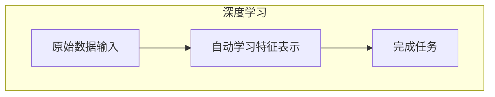
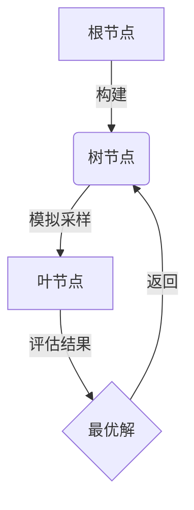
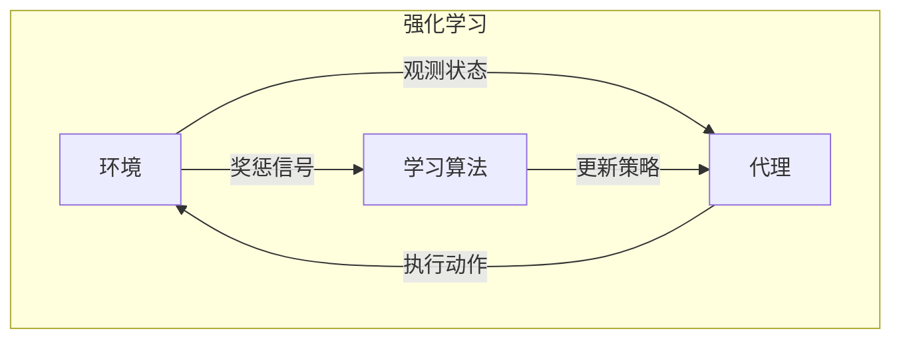
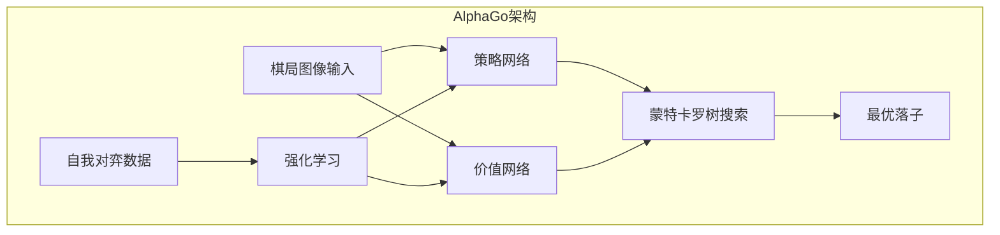

# AlphaGo 原理与代码实例讲解

## 1.背景介绍

AlphaGo是由谷歌DeepMind公司开发的一款人工智能围棋程序,它于2016年在对阵世界顶尖职业棋手李世乭的五番棋比赛中取得了4比1的胜利。这是人工智能首次战胜人类在棋类游戏中的顶尖高手,被誉为人工智能发展史上的一个里程碑式突破。

AlphaGo的出现打破了人们对于传统人工智能方法在复杂游戏中的极限认知。传统人工智能在国际象棋、围棋等复杂游戏中往往无法取得卓越的成绩,因为这些游戏的搜索空间太大,很难用暴力搜索的方式解决。而AlphaGo则是基于深度学习和强化学习等先进技术,通过对大量人机对弈数据的学习,掌握了高水平的围棋知识和策略。

AlphaGo的诞生不仅极大推动了人工智能技术的发展,同时也引发了人们对于人工智能潜力和应用前景的广泛思考和讨论。本文将深入解析AlphaGo的核心原理和算法,并通过代码实例讲解其实现细节,以期帮助读者全面理解这一里程碑式人工智能系统。

## 2.核心概念与联系

AlphaGo主要融合了深度学习(Deep Learning)、蒙特卡罗树搜索(Monte Carlo Tree Search)和强化学习(Reinforcement Learning)三种核心技术。下面我们先简要介绍这些概念:

### 2.1 深度学习

深度学习是机器学习的一个新的领域,它模仿人脑的机制来解释数据,例如图像、声音和文本。深度学习能从原始输入数据中自动学习数据的表示特征,并利用这些表示特征完成最终的任务,如分类或预测。

在AlphaGo中,深度学习主要用于从大量的人类对弈数据中学习围棋知识,包括对当前棋局位置的评估价值,以及在给定棋局下选择下一步最佳落子位置。



### 2.2 蒙特卡罗树搜索

蒙特卡罗树搜索(MCTS)是一种高效的决策序列查找算法,通过统计模拟采样的方式,逐步构建一个导向最优解决方案的搜索树。MCTS能在有限的计算资源下,对具有高维搜索空间的问题给出较优的解。

AlphaGo使用MCTS在当前棋局下模拟大量的对弈情况,并根据模拟结果评估每一个可能的落子位置,最终选择胜率最高的一步落子。



### 2.3 强化学习

强化学习是一种基于对环境交互过程中被赋予的奖惩信号来学习的方法。通过不断试错,调整策略参数,使得在给定环境中可以获得最大的长期期望奖励。

AlphaGo使用策略梯度的强化学习算法,通过自我对弈产生新的经验数据,并优化策略网络和价值网络的参数,从而不断提高下围棋的水平。



### 2.4 AlphaGo总体架构

AlphaGo将上述三种技术有机结合,构建了一个多模块的复合架构:

1. 策略网络(Policy Network)基于深度卷积神经网络,输入当前棋局图像,输出每一个合法落子位置的概率分布作为先验知识。
2. 价值网络(Value Network)也是一个深度卷积网络,输入棋局图像,预测当前棋局对于两方的胜率评分。
3. 蒙特卡罗树搜索模块根据先验知识和价值网络的评估,高效地模拟对弈过程,选择最优的一步落子。
4. 强化学习模块通过策略梯度算法,利用自我对弈产生的新数据,不断优化策略网络和价值网络的参数。



通过这种多模块协同的方式,AlphaGo能够充分利用深度学习从人类数据中习得的知识,再通过蒙特卡罗树搜索和强化学习进一步提高,最终达到超人的水平。

## 3.核心算法原理具体操作步骤

在了解了AlphaGo的核心概念后,我们接下来深入分析其关键算法模块的原理和具体实现细节。

### 3.1 策略网络(Policy Network)

策略网络的任务是为当前棋局的每一个合法落子位置生成一个概率值,代表AI选择落子在该位置的置信程度。

策略网络使用卷积神经网络(CNN)作为基础架构,能够直接从原始棋局图像中自动提取特征,而无需人工设计特征。CNN由卷积层、池化层和全连接层组成。

具体来说,策略网络包含两个主要部分:

1. **卷积策略网络(Convolutional Policy Network)**
   - 输入是二进制编码的当前棋局状态图像
   - 使用12层卷积层和2个全连接层
   - 最后输出一个(N,N)的特征平面,N为棋盘大小
   - 每个特征平面元素对应一个合法落子位置的先验置信度

2. **策略头(Policy Head)**
   - 将卷积策略网络输出的特征平面过一个全连接层和Softmax层
   - 输出(N*N+1)维的概率分布向量
     - 前N*N个值对应每个位置的落子概率
     - 最后一个值对应选择和棋(Pass)的概率

策略网络的训练过程是监督学习,使用了人类专家对局数据。对于每个人类专家的一步落子,我们将其所在位置的概率目标设为1,其它位置设为0,通过最小化实际输出与目标之间的交叉熵损失来优化网络参数。

```python
# 策略网络结构示例(简化版)
import torch.nn as nn

class PolicyNetwork(nn.Module):
    def __init__(self):
        super(PolicyNetwork, self).__init__()
        # 卷积层
        self.conv1 = nn.Conv2d(...)
        self.conv2 = nn.Conv2d(...)
        ...
        # 全连接层
        self.fc1 = nn.Linear(...)
        self.fc2 = nn.Linear(...)
        
    def forward(self, state):
        # 卷积提取特征
        x = self.conv1(state)
        x = self.conv2(x)
        ...
        # 策略头
        x = x.view(x.size(0), -1)
        x = self.fc1(x)
        x = self.fc2(x)
        return x  # 返回(batch, N*N+1)的概率分布
```

### 3.2 价值网络(Value Network)

价值网络的任务是评估当前棋局对于两方的胜率分数,范围在[-1,1]之间。正值表示黑方胜率高,负值表示白方胜率高。

价值网络的网络结构与策略网络类似,也是基于卷积神经网络,能从原始棋局图像中提取特征。不同之处在于最后的输出是一个标量值,而非概率分布。

1. **卷积价值网络(Convolutional Value Network)**
   - 输入是二进制编码的当前棋局状态图像
   - 使用20层卷积层和2个全连接层
   - 最后输出一个标量特征

2. **价值头(Value Head)**
   - 将卷积价值网络输出的标量特征过一个线性层
   - 输出一个[-1,1]区间内的标量值,表示当前棋局的胜率评分

价值网络的训练过程也是监督学习,使用了人类专家对局的最终结果(胜/负/和)作为标签。具体来说,对于每一个人类对局的中间状态,我们将其标签设为最终的胜/负结果,通过最小化实际输出与标签之间的均方差损失来优化网络参数。

```python
# 价值网络结构示例
import torch.nn as nn

class ValueNetwork(nn.Module):
    def __init__(self):
        super(ValueNetwork, self).__init__()
        # 卷积层
        self.conv1 = nn.Conv2d(...)
        self.conv2 = nn.Conv2d(...)
        ...
        # 全连接层
        self.fc1 = nn.Linear(...)
        self.fc2 = nn.Linear(1)
        
    def forward(self, state):
        # 卷积提取特征
        x = self.conv1(state) 
        x = self.conv2(x)
        ...
        # 价值头
        x = x.view(x.size(0), -1)
        x = self.fc1(x)
        x = torch.tanh(self.fc2(x)) # 输出[-1,1]区间
        return x
```

### 3.3 蒙特卡罗树搜索(Monte Carlo Tree Search)

蒙特卡罗树搜索是AlphaGo用于根据当前棋局状态选择最优落子的核心算法。它通过在给定的有限时间和计算资源内,模拟大量的对弈情况,构建一个导向最优解的搜索树。

AlphaGo使用的是基于Upper Confidence Bounds for Trees (UCT)的蒙特卡罗树搜索算法,包含四个基本步骤:

1. **选择(Selection)**
   - 从树的根节点开始,递归地选择最优子节点,直到到达一个叶节点
   - 选择标准是最大化UCB值: $UCB = Q(s,a) + c_{puct} \times P(s,a) \times \frac{\sqrt{\sum_b N(s,b)}}{1+N(s,a)}$
     - $Q(s,a)$是价值网络对该节点的评估分数
     - $P(s,a)$是策略网络对该节点的先验概率
     - $N(s,a)$是该节点的模拟访问次数
     - $c_{puct}$是一个调节参数,控制探索和利用的权衡

2. **扩展(Expansion)**
   - 对选中的叶节点,根据策略网络输出的概率分布,随机采样一个新的合法落子位置
   - 将新的落子位置作为子节点添加到搜索树中

3. **模拟(Simulation)**
   - 从新扩展的节点开始,使用快速的随机模拟策略(如随机落子)
   - 模拟对弈直到终止(两方皆过子)
   - 得到最终结果(胜/负/和)

4. **反向传播(Backpropagation)**
   - 将模拟的最终结果作为反馈,沿着搜索树从叶节点回溯到根节点
   - 更新每个经过节点的统计数据:
     - $N(s,a)$增加1 
     - $Q(s,a)$用新结果的平均值替换旧值
   - 在根节点处,选择访问次数最多的子节点对应的落子作为最终决策

上述四个步骤反复执行,直到搜索时间用尽。通过大量的模拟和反向传播,搜索树会不断向最优解converge。

```python
# 蒙特卡罗树搜索伪代码
def monte_carlo_tree_search(root_node):
    for i in range(num_simulations):
        node = root_node
        state = copy.deepcopy(root_state)
        
        # 选择阶段
        while node.is_leaf() == False:
            node = node.select_optimal_child(c_puct)
            state.play(node.action)
            
        # 扩展和评估阶段    
        node.expand_and_evaluate(policy_net, value_net)
        
        # 模拟阶段
        value = node.simulate(random_policy)
        
        # 反向传播阶段
        while node is not None:
            node.update(value)
            node = node.parent
            
    # 选择访问