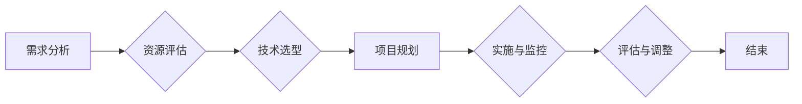

# IT战略规划：制定并执行与公司业务目标相一致的IT战略计划

## 1. 背景介绍

在当今这个信息爆炸的时代，信息技术已经成为企业生存和发展的关键驱动力。IT战略规划作为企业战略的重要组成部分，对于企业在激烈的市场竞争中保持领先地位至关重要。本文旨在探讨如何制定并执行与公司业务目标相一致的IT战略计划。

## 2. 核心概念与联系

### 2.1 IT战略规划的定义

IT战略规划是指根据企业的长期发展目标，结合市场环境、技术发展趋势等因素，对企业IT系统进行全局性的规划与设计。其目的是通过IT技术的应用，提升企业核心竞争力，实现业务目标。

### 2.2 IT战略规划与公司业务目标的联系

IT战略规划应与公司业务目标紧密结合，确保IT系统发展与企业整体战略相一致。具体表现在以下几个方面：

* **目标一致性**：IT战略规划应围绕公司整体战略目标进行设计，使IT系统的发展服务于企业核心业务。
* **资源整合**：IT战略规划应整合企业内部IT资源，提高资源利用效率。
* **风险控制**：IT战略规划应充分考虑潜在风险，确保企业IT系统稳定运行。

## 3. 核心算法原理具体操作步骤

### 3.1 IT战略规划的步骤

1. **需求分析**：了解企业业务目标、市场环境、技术发展趋势等，明确IT战略规划的目标和方向。
2. **资源评估**：评估企业现有IT资源，包括人员、设备、技术等，为战略规划提供依据。
3. **技术选型**：根据业务需求和资源评估，选择合适的技术方案。
4. **项目规划**：制定详细的IT项目计划，明确项目进度、预算、人员安排等。
5. **实施与监控**：按计划推进项目实施，并持续监控项目进度和效果。
6. **评估与调整**：根据项目实施情况，评估战略规划的有效性，并进行必要的调整。

### 3.2 Mermaid流程图



## 4. 数学模型和公式详细讲解举例说明

在IT战略规划过程中，可运用以下数学模型和公式：

### 4.1 投资回报率（ROI）

$$
ROI = \\frac{净利润}{投资成本} \\times 100\\%
$$

### 4.2 成本效益分析

$$
成本效益比 = \\frac{项目收益}{项目成本}
$$

### 4.3 时间效益分析

$$
时间效益比 = \\frac{项目收益}{项目时间}
$$

## 5. 项目实践：代码实例和详细解释说明

以下是一个简单的Python代码实例，用于计算IT项目的投资回报率：

```python
def calculate_roi(net_profit, investment_cost):
    return (net_profit / investment_cost) * 100

if __name__ == \"__main__\":
    net_profit = float(input(\"请输入净利润：\"))
    investment_cost = float(input(\"请输入投资成本：\"))
    roi = calculate_roi(net_profit, investment_cost)
    print(\"投资回报率：{:.2f}%\".format(roi))
```

此代码首先定义了一个计算投资回报率的函数`calculate_roi`，然后读取用户输入的净利润和投资成本，计算并输出投资回报率。

## 6. 实际应用场景

### 6.1 企业数字化转型

在数字化转型过程中，IT战略规划有助于企业明确发展方向，优化资源配置，提高运营效率。

### 6.2 新产品研发

在研发新产品时，IT战略规划可以帮助企业选择合适的技术方案，降低研发风险。

### 6.3 供应链管理

通过IT战略规划，企业可以优化供应链管理，提高供应链效率，降低成本。

## 7. 工具和资源推荐

### 7.1 工具

* **项目管理工具**：Jira、Trello
* **数据分析工具**：Tableau、Power BI
* **协作工具**：Slack、Microsoft Teams

### 7.2 资源

* **在线课程**：Coursera、Udemy
* **技术社区**：Stack Overflow、GitHub
* **行业报告**：IDC、Gartner

## 8. 总结：未来发展趋势与挑战

### 8.1 未来发展趋势

* **智能化**：AI、大数据等技术在IT领域的应用将越来越广泛。
* **云计算**：云计算将成为企业IT基础设施的主流。
* **安全与合规**：企业对IT安全与合规的要求将越来越高。

### 8.2 挑战

* **技术更新换代**：技术更新换代速度加快，企业需要不断进行技术迭代。
* **人才短缺**：IT人才短缺将成为制约企业发展的瓶颈。
* **数据安全**：数据安全成为企业面临的重要挑战。

## 9. 附录：常见问题与解答

### 9.1 问题1：如何确保IT战略规划的有效性？

解答：确保IT战略规划的有效性，首先要与公司业务目标紧密结合，其次要充分考虑市场环境和技术发展趋势，最后要持续评估和调整战略规划。

### 9.2 问题2：IT战略规划与IT项目管理有何区别？

解答：IT战略规划是企业IT发展的全局性规划，而IT项目管理是针对具体项目的执行过程。两者相辅相成，共同推动企业IT发展。

作者：禅与计算机程序设计艺术 / Zen and the Art of Computer Programming