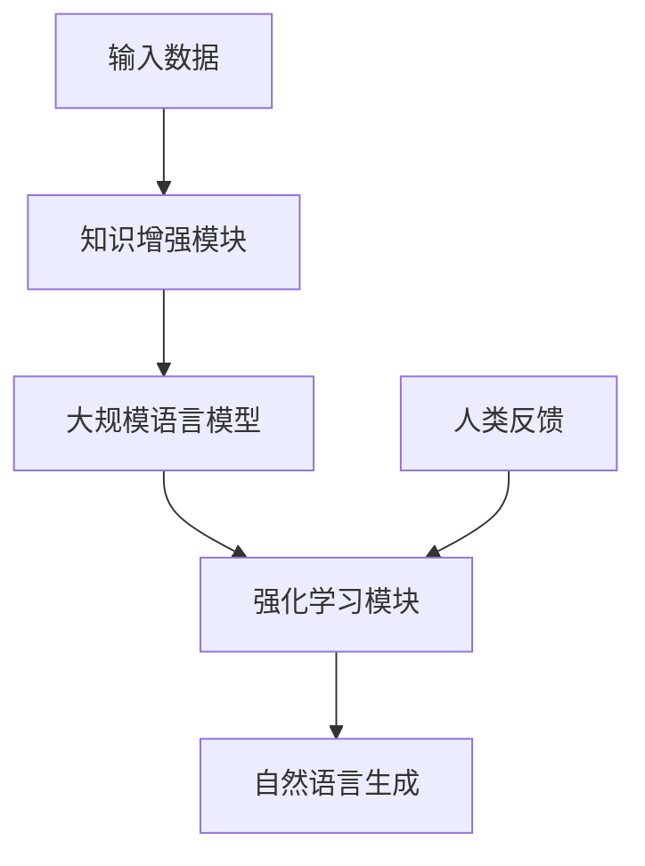

# Megatron-Turing NLG原理与代码实例讲解

## 1.背景介绍

### 1.1 自然语言生成的重要性

在当今的数字时代,自然语言处理(NLP)已经成为人工智能领域中最重要和最具挑战性的研究方向之一。自然语言生成(NLG)作为NLP的一个关键分支,旨在自动生成人类可以理解的自然语言文本,在各种应用场景中发挥着至关重要的作用。

自然语言生成技术可以帮助人类更高效地获取和理解信息。它能够将结构化数据转化为流畅、连贯的自然语言文本,从而使复杂的信息以更易于理解的方式呈现。这种能力在诸多领域都有广泛的应用前景,例如:

- 数据可视化和报告生成
- 对话系统和虚拟助手
- 自动文本摘要和新闻生成
- 个性化内容创作和推荐
- 辅助写作和机器翻译等

### 1.2 Megatron-Turing NLG 的重要性

Megatron-Turing NLG是一种先进的自然语言生成模型,由人工智能领域的顶尖科学家和工程师们共同研发。它结合了大规模语言模型、强化学习和知识增强等多种前沿技术,旨在生成高质量、上下文相关的自然语言输出。

Megatron-Turing NLG的核心优势在于其强大的语言理解和生成能力。它能够捕捉上下文语义,生成流畅、连贯且内容丰富的文本。与传统的基于规则或模板的NLG系统相比,Megatron-Turing NLG可以产生更加自然、多样化的语言输出,从而提供更好的用户体验。

此外,Megatron-Turing NLG还具有可扩展性和可定制化的特点。它可以通过持续学习来不断提高性能,并根据特定应用场景进行微调和优化。这使得该模型在各种领域都有广泛的应用前景,如智能写作辅助、个性化对话系统、自动报告生成等。

## 2.核心概念与联系

### 2.1 自然语言生成的基本概念

自然语言生成(NLG)是指将结构化数据或语义表示转换为自然语言文本的过程。它通常涉及以下几个关键步骤:

1. **数据分析和内容规划**: 从原始数据中提取相关信息,并确定需要生成的内容类型和结构。

2. **句子规划**: 根据内容规划的结果,构建句子的语义表示,包括确定句子的主语、谓语、宾语等成分。

3. **实现化(Realization)**: 将句子的语义表示转换为自然语言文本,包括词汇选择、语法排列等。

4. **结构化和参考化**: 确保生成的文本具有适当的结构和连贯性,并正确地引用上下文中的实体。

5. **修改和优化**: 对生成的文本进行修改和优化,以提高其可读性、流畅度和语义准确性。

### 2.2 Megatron-Turing NLG 的核心概念

Megatron-Turing NLG 是一种基于大规模语言模型和知识增强技术的自然语言生成系统。它的核心概念包括:

1. **大规模语言模型**: Megatron-Turing NLG 使用了一个包含数十亿参数的大型语言模型,该模型经过了大规模文本数据的预训练,能够捕捉丰富的语言知识和上下文信息。

2. **知识增强**: 除了预训练的语言模型,Megatron-Turing NLG 还融合了外部知识库和结构化数据,使其能够生成更加准确、信息丰富的文本输出。

3. **强化学习**: 系统采用了强化学习技术,通过与人类专家的交互和反馈,不断优化和调整模型参数,提高生成文本的质量和相关性。

4. **上下文理解**: Megatron-Turing NLG 能够捕捉输入数据和对话上下文的语义,从而生成与上下文相关的自然语言响应。

5. **多任务学习**: 该系统同时在多个相关任务上进行联合训练,如文本生成、摘要、问答等,从而提高了模型的泛化能力和鲁棒性。

### 2.3 Megatron-Turing NLG 与其他 NLG 模型的关系

Megatron-Turing NLG 是一种集成了多种先进技术的综合性自然语言生成模型。它与其他 NLG 模型的关系如下:

- 基于规则/模板的 NLG 系统: 这些传统系统依赖于手工编写的规则和模板,生成的文本缺乏多样性和自然性。Megatron-Turing NLG 则基于数据驱动的方法,能够生成更加自然和多样化的语言输出。

- 基于统计机器翻译的 NLG: 这些系统将结构化数据视为一种"源语言",将自然语言文本视为"目标语言",并使用统计机器翻译技术进行转换。Megatron-Turing NLG 则直接从数据中学习生成自然语言的能力,无需中间的翻译步骤。

- 基于序列到序列模型的 NLG: 这些系统使用编码器-解码器架构,将结构化数据编码为向量表示,然后解码生成自然语言文本。Megatron-Turing NLG 也采用了类似的架构,但融合了更多的技术,如知识增强和强化学习,以提高生成质量。

- 基于大型语言模型的 NLG: 这些系统利用预训练的大型语言模型作为基础,通过微调或提示学习的方式进行自然语言生成任务。Megatron-Turing NLG 也属于这一类别,但在模型规模、知识融合和优化方法等方面有所创新和提升。

总的来说,Megatron-Turing NLG 集成了多种先进技术,旨在提供更加强大、灵活和可控的自然语言生成能力。

## 3.核心算法原理具体操作步骤

### 3.1 Megatron-Turing NLG 的总体架构

Megatron-Turing NLG 的总体架构如下图所示:

1. **输入数据**: 可以是结构化数据(如表格、JSON等)或非结构化数据(如文本、图像等)。

2. **知识增强模块**: 将输入数据与外部知识库相结合,为语言模型提供更丰富的信息来源。

3. **大规模语言模型**: 一个经过大规模文本数据预训练的深度神经网络模型,用于捕捉语言的语义和上下文信息。

4. **强化学习模块**: 通过与人类专家的交互和反馈,不断优化和调整语言模型的参数,提高生成文本的质量和相关性。

5. **自然语言生成**: 基于优化后的语言模型,生成与输入数据和上下文相关的自然语言文本输出。

6. **人类反馈**: 人类专家对生成的文本输出进行评估和反馈,用于强化学习模块的优化过程。

### 3.2 知识增强模块

知识增强模块的作用是将输入数据与外部知识库相结合,为语言模型提供更丰富的信息来源。它的具体操作步骤如下:

1. **知识库构建**: 从各种来源(如维基百科、新闻文章、专业数据库等)收集相关的结构化和非结构化知识,构建一个综合的知识库。

2. **知识表示学习**: 使用图神经网络或其他技术,从知识库中学习实体、概念和它们之间的关系的向量表示。

3. **知识融合**: 将输入数据与相关的知识表示相结合,形成一个丰富的上下文向量表示。

4. **上下文注入**: 将上下文向量表示注入到语言模型的编码器或解码器中,为生成过程提供额外的知识支持。

通过知识增强模块,Megatron-Turing NLG 能够利用外部知识库中的信息,生成更加准确、信息丰富的自然语言输出。

### 3.3 大规模语言模型

大规模语言模型是 Megatron-Turing NLG 的核心部分,它负责捕捉语言的语义和上下文信息,并生成自然语言文本。其具体操作步骤如下:

1. **预训练**: 使用自监督学习技术(如掩码语言模型、下一句预测等)在大规模文本数据上预训练一个深度transformer模型,获得初始的语言模型参数。

2. **微调**: 根据特定的自然语言生成任务,在预训练模型的基础上进行微调,使模型更好地适应目标任务的数据分布和要求。

3. **上下文编码**: 将输入数据(包括知识增强模块提供的上下文向量表示)输入到语言模型的编码器中,获得上下文的隐藏状态表示。

4. **自回归生成**: 语言模型的解码器基于编码器的隐藏状态表示,自回归地生成一个个单词或子词,组成最终的自然语言文本输出。

5. **生成策略**: 在生成过程中,可以采用不同的策略来控制输出质量,如topk/topp采样、beam search、注意力覆盖等。

6. **生成重计分**: 对生成的候选文本进行重新评分,选择质量最高的输出作为最终结果。

通过大规模语言模型,Megatron-Turing NLG 能够生成流畅、连贯且与上下文相关的自然语言输出。

### 3.4 强化学习模块

强化学习模块的作用是通过与人类专家的交互和反馈,不断优化和调整语言模型的参数,提高生成文本的质量和相关性。其具体操作步骤如下:

1. **人机交互环境构建**: 构建一个允许人类专家与语言模型进行交互的环境,例如一个对话系统或写作辅助工具。

2. **反馈收集**: 人类专家对语言模型生成的文本输出进行评估和反馈,反馈可以是分数、注释或修改后的文本等形式。

3. **奖赏函数设计**: 根据人类反馈,设计一个奖赏函数,用于量化生成文本的质量和相关性。

4. **策略优化**: 使用强化学习算法(如策略梯度、Q-Learning等),基于奖赏函数优化语言模型的生成策略,使其能够产生更高质量的输出。

5. **模型微调**: 将优化后的生成策略应用到语言模型中,通过反向传播调整模型参数,使其能够直接生成更好的文本输出。

6. **迭代优化**: 重复上述步骤,持续优化语言模型的性能,直到达到满意的生成质量。

通过强化学习模块,Megatron-Turing NLG 能够不断从人类专家的反馈中学习和改进,生成更加符合需求的自然语言输出。

## 4.数学模型和公式详细讲解举例说明

### 4.1 transformer 模型

Megatron-Turing NLG 的大规模语言模型基于 transformer 架构,transformer 是一种全新的基于注意力机制的序列到序列模型,它能够有效地捕捉长距离依赖关系,并行化计算,从而在机器翻译、文本生成等任务上取得了卓越的表现。

transformer 模型的核心是多头自注意力机制,它允许模型在计算目标序列的每个位置时,关注输入序列的所有位置。具体来说,给定一个查询向量 $q$、键向量 $k$ 和值向量 $v$,自注意力机制计算如下:

$$\mathrm{Attention}(q, k, v) = \mathrm{softmax}(\frac{qk^T}{\sqrt{d_k}})v$$

其中 $d_k$ 是缩放因子,用于防止点积过大导致梯度饱和。多头注意力机制则是将注意力机制独立运行 $h$ 次,然后将结果拼接:

$$\mathrm{MultiHead}(Q, K, V) = \mathrm{Concat}