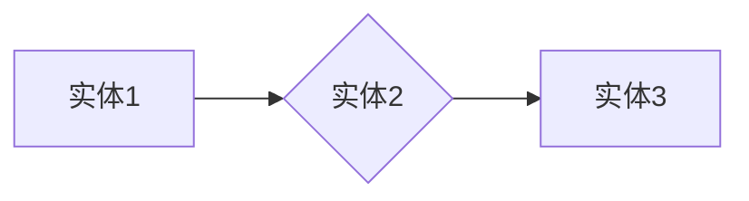
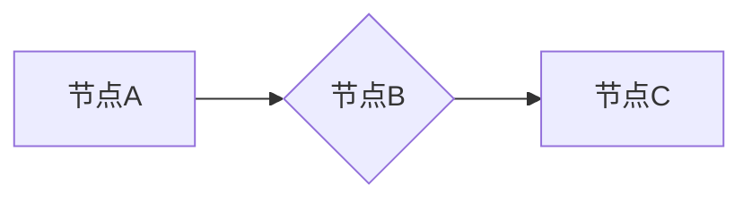

# Neo4j原理与代码实例讲解

## 1. 背景介绍

Neo4j是一款领先的开源NoSQL图形数据库，它以图结构作为存储方式，擅长处理复杂关系型数据。在当今数据量巨大、关系复杂的环境中，Neo4j因其高效、灵活的特性而受到广泛关注。本文将深入浅出地讲解Neo4j的原理，并通过实际代码示例帮助读者更好地理解和应用Neo4j。

## 2. 核心概念与联系

Neo4j的核心概念是节点（Node）和关系（Relationship）。节点代表图中的实体，而关系则表示实体之间的连接。以下是一个简单的图结构示例：



在这个例子中，A、B、C分别是三个节点，它们之间的关系通过箭头表示。Neo4j中的图结构可以非常直观地表示实体之间的关系，使得数据处理和分析变得更加容易。

## 3. 核心算法原理具体操作步骤

Neo4j采用了一种称为B+-树的索引结构，该结构能够有效地管理大量数据。以下是Neo4j中核心算法的具体操作步骤：

1. 将数据存储在磁盘上，采用B+-树结构；
2. 在内存中维护一个哈希表，用于快速查找节点和关系；
3. 通过索引和哈希表快速定位到目标节点和关系；
4. 根据查询条件对节点和关系进行过滤；
5. 返回查询结果。

## 4. 数学模型和公式详细讲解举例说明

Neo4j的数学模型主要包括：

1. 节点表示：每个节点用一个唯一的ID和一个属性列表表示；
2. 关系表示：每个关系用一个唯一的ID和两个节点ID表示；
3. 索引结构：采用B+-树结构存储节点和关系；
4. 图遍历算法：如BFS（广度优先搜索）和DFS（深度优先搜索）。

以下是一个简单的例子：



在这个例子中，节点A和节点B之间存在一个关系。Neo4j将这个关系存储在数据库中，并建立索引以便快速查询。

## 5. 项目实践：代码实例和详细解释说明

以下是一个使用Neo4j进行数据存储和查询的示例代码：

```java
import org.neo4j.driver.AuthTokens;
import org.neo4j.driver.Driver;
import org.neo4j.driver.GraphDatabase;
import org.neo4j.driver.Session;
import org.neo4j.driver.Transaction;
import org.neo4j.driver.Result;
import org.neo4j.driver.Value;
import org.neo4j.driver.Record;

public class Neo4jExample {
    public static void main(String[] args) {
        try (Driver driver = GraphDatabase.driver(\"bolt://localhost:7687\", AuthTokens.basic(\"neo4j\", \"password\"))) {
            try (Session session = driver.session()) {
                // 创建节点
                session.run(\"CREATE (a:Person {name: 'Alice'})\");
                session.run(\"CREATE (b:Person {name: 'Bob'})\");
                // 创建关系
                session.run(\"MATCH (a:Person {name: 'Alice'}), (b:Person {name: 'Bob'}) CREATE (a)-[:FRIEND]->(b)\");
                
                // 查询
                Result result = session.run(\"MATCH (p:Person {name: 'Alice'})-[:FRIEND]->(friend) RETURN friend.name\");
                while (result.hasNext()) {
                    Record record = result.next();
                    Value name = record.get(\"friend.name\");
                    System.out.println(name.asString());
                }
            }
        }
    }
}
```

在这个示例中，我们首先创建了一个Neo4j数据库实例，然后创建两个节点（Alice和Bob）和一个关系（Alice和Bob是朋友）。最后，我们查询Alice的朋友，并输出结果。

## 6. 实际应用场景

Neo4j在以下场景中具有广泛的应用：

1. 社交网络分析：通过Neo4j可以方便地分析用户之间的关系，挖掘用户兴趣和推荐；
2. 供应链管理：Neo4j可以帮助企业分析供应商、客户、产品之间的关系，优化供应链；
3. 智能推荐系统：Neo4j可以用于构建推荐系统，通过分析用户行为和物品之间的关联，提供个性化的推荐；
4. 生物信息学：Neo4j在基因序列分析、蛋白质结构预测等领域有广泛的应用。

## 7. 工具和资源推荐

以下是一些Neo4j相关的工具和资源：

1. Neo4j Desktop：Neo4j的图形化界面，方便进行图数据的可视化；
2. Neo4j Browser：Neo4j的Web界面，用于执行Cypher查询；
3. Neo4j Online Documentation：Neo4j的官方文档，提供了丰富的教程和示例；
4. Neo4j Academy：Neo4j官方的在线学习平台，提供各种课程和教程。

## 8. 总结：未来发展趋势与挑战

随着大数据和人工智能技术的发展，Neo4j在图数据库领域的地位将越来越重要。以下是Neo4j未来发展趋势和挑战：

1. 支持更多的数据类型：未来Neo4j将支持更多的数据类型，如地理信息、时间序列等；
2. 高性能：Neo4j将继续优化算法和索引结构，提高查询性能；
3. 云原生：Neo4j将推出更多云原生版本，方便用户进行弹性扩展和部署；
4. 与其他技术的融合：Neo4j将与大数据、人工智能等技术进行融合，提供更丰富的应用场景。

## 9. 附录：常见问题与解答

1. Q：Neo4j与关系型数据库有什么区别？
   A：Neo4j采用图结构存储数据，而关系型数据库采用表格结构。在处理复杂关系型数据时，Neo4j具有更高的性能和灵活性。

2. Q：Neo4j的查询语言Cypher是什么？
   A：Cypher是Neo4j的查询语言，类似于SQL，用于执行图数据的查询操作。

3. Q：Neo4j如何处理大规模数据？
   A：Neo4j采用分布式存储和计算架构，支持大规模数据的处理。同时，Neo4j提供了多种优化策略，如索引、缓存等。

作者：禅与计算机程序设计艺术 / Zen and the Art of Computer Programming