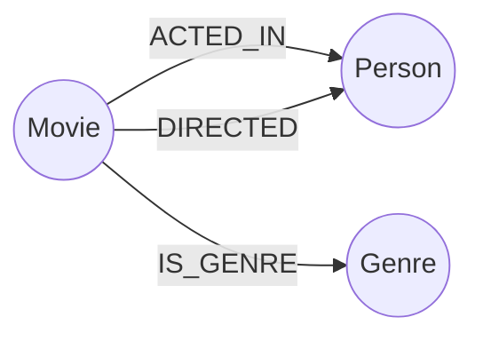

# Neo4j原理与代码实例讲解

## 1.背景介绍

### 1.1 什么是图数据库?

在传统的关系型数据库中,数据被存储在由行和列组成的表格中。这种结构非常适合处理结构化数据,但在处理高度互连的数据时就显得力不从心。图数据库则采用了一种全新的方式来存储数据,它使用节点(Node)、关系(Relationship)和属性(Properties)来表示数据,非常适合处理复杂的层次结构和网状结构数据。

图数据库可以高效地解决很多传统数据库难以处理的问题,如社交网络、推荐系统、路由导航、欺诈检测等,因此近年来受到了越来越多的关注。

### 1.2 Neo4j概述

Neo4j是一种开源的、高性能的图数据库,全面支持ACID(Atomicity、Consistency、Isolation、Durability)事务特性,能够高效地构建和遍历高度互连的数据。它采用了原生的图存储架构,将结构化数据存储在基于磁盘或内存的图数据模型中,并支持使用声明式的图查询语言Cypher进行数据查询。

Neo4j具有以下主要特点:

- 高度可扩展
- 高可用性
- 高性能查询
- 支持ACID事务
- 支持多种编程语言驱动
- 可视化界面

## 2.核心概念与联系

Neo4j的核心概念包括节点(Node)、关系(Relationship)和属性(Properties)。

### 2.1 节点

节点用于表示图数据库中的实体,如人物、地点、事物等。每个节点都有一个唯一的ID,可以包含任意数量的属性。

```
(节点)
```

### 2.2 关系

关系用于连接两个节点,表示它们之间的联系。每个关系都有一个类型、一个方向以及可选的属性。关系可以是有向的或无向的。

```
(节点1)-[关系]->(节点2)
```

### 2.3 属性

属性是附加在节点和关系上的键值对,用于存储实体的具体信息。属性可以是基本数据类型,也可以是复杂数据类型。

```
(节点 {name:'John', age:35})
```

### 2.4 核心概念联系

这三个核心概念相互关联、相互依赖,共同构建了Neo4j的数据模型:

- 节点表示现实世界中的实体
- 关系描述实体之间的联系
- 属性存储实体和关系的具体信息

通过灵活组合节点、关系和属性,Neo4j可以很好地表达和存储复杂的结构化数据。

## 3.核心算法原理具体操作步骤

Neo4j的核心算法主要包括:创建节点、创建关系、遍历图数据、查询图数据等。下面将详细介绍这些算法的原理和操作步骤。

### 3.1 创建节点

创建节点是构建图数据库的基础。Neo4j使用Cypher查询语言来创建节点,语法如下:

```cypher
CREATE (node:Label {properties})
```

- `CREATE`是创建节点的关键字
- `()`中是节点的标识符
- `:`后面是节点的标签(Label),可以有多个标签
- `{}`中是节点的属性(Properties)

例如,创建一个标签为`Person`、属性为`name`和`age`的节点:

```cypher
CREATE (p:Person {name:'John', age:35})
```

### 3.2 创建关系

创建关系用于连接两个节点,表示它们之间的关联。语法如下:

```cypher
CREATE (node1)-[rel:TYPE {properties}]->(node2)
```

- `(node1)`和`(node2)`是要连接的两个节点
- `[]`中是关系的标识符
- `:`后面是关系的类型(TYPE)
- `{}`中是关系的属性(Properties)
- `->`表示关系的方向,无向关系使用`-`

例如,创建一个类型为`FRIEND`的有向关系,连接两个`Person`节点:

```cypher
MATCH (a:Person),(b:Person)
WHERE a.name = 'John' AND b.name = 'Mike'
CREATE (a)-[r:FRIEND {since:2010}]->(b)
```

### 3.3 遍历图数据

Neo4j提供了多种方式来遍历图数据,最常用的是基于模式匹配的查询。

```cypher
MATCH pattern
RETURN result
```

- `MATCH`用于指定要匹配的模式
- `pattern`是一个由节点、关系和属性构成的模式
- `RETURN`用于指定要返回的结果

例如,查找所有`Person`节点及其朋友关系:

```cypher
MATCH (a:Person)-[:FRIEND]->(b:Person)
RETURN a.name, b.name
```

### 3.4 查询图数据

除了基本的模式匹配查询外,Neo4j还支持更复杂的查询,如聚合、排序、过滤等。

```cypher
MATCH pattern
WHERE condition
RETURN result
ORDER BY keys
SKIP skip_num
LIMIT limit_num
```

- `WHERE`用于指定查询条件
- `ORDER BY`用于排序结果
- `SKIP`用于跳过指定数量的结果
- `LIMIT`用于限制返回结果的数量

例如,查找年龄大于30岁的所有`Person`节点,按年龄降序排列,只返回前5个结果:

```cypher
MATCH (p:Person)
WHERE p.age > 30
RETURN p.name, p.age
ORDER BY p.age DESC
LIMIT 5
```

## 4.数学模型和公式详细讲解举例说明

在图数据库中,常用的数学模型和公式主要包括:

### 4.1 图遍历算法

图遍历是图论中的一个重要问题,常用的算法有深度优先搜索(DFS)和广度优先搜索(BFS)。

#### 4.1.1 深度优先搜索(DFS)

深度优先搜索从一个节点开始,沿着一条路径尽可能深入,直到无法继续为止,然后回溯到上一个节点,尝试另一条路径。其递归实现如下:

$$
\begin{align*}
\operatorname{DFS}(G, u) \\
\begin{array}{ll}
     \text{visited}[u] &\gets \text{true} \\
     \text{for each } v \in G.adj(u) \\
     \qquad \text{if not visited}[v] \\
     \qquad\qquad \operatorname{DFS}(G, v)
\end{array}
\end{align*}
$$

其中:
- $G$表示图
- $u$表示当前节点
- $\text{visited}$是一个布尔数组,记录节点是否被访问过
- $G.adj(u)$返回与节点$u$相邻的所有节点

#### 4.1.2 广度优先搜索(BFS)

广度优先搜索从一个节点开始,首先访问该节点的所有邻接节点,然后访问这些节点的邻接节点,以此类推,直到访问完所有节点。其实现可以使用队列:

$$
\begin{align*}
\operatorname{BFS}(G, u) \\
\begin{array}{ll}
     \text{visited}[u] &\gets \text{true} \\
     \text{queue} &\gets \text{new Queue}() \\
     \text{queue.enqueue}(u) \\
     \text{while not queue.isEmpty}() \\
     \qquad v &\gets \text{queue.dequeue}() \\
     \qquad \text{for each } w \in G.adj(v) \\
     \qquad\qquad \text{if not visited}[w] \\
     \qquad\qquad\qquad \text{visited}[w] \gets \text{true} \\
     \qquad\qquad\qquad \text{queue.enqueue}(w)
\end{array}
\end{align*}
$$

其中:
- $G$表示图
- $u$表示起始节点
- $\text{visited}$是一个布尔数组,记录节点是否被访问过
- $\text{queue}$是一个队列,用于存储待访问的节点
- $G.adj(v)$返回与节点$v$相邻的所有节点

### 4.2 最短路径算法

在图数据库中,常常需要计算两个节点之间的最短路径,常用的算法有Dijkstra算法和Floyd算法。

#### 4.2.1 Dijkstra算法

Dijkstra算法用于计算单源最短路径,即从一个节点出发到其他所有节点的最短路径。其算法思想是贪心策略,每次选择距离起点最近的未访问节点,并更新其他节点到起点的距离。算法如下:

$$
\begin{align*}
\operatorname{Dijkstra}(G, s) \\
\begin{array}{ll}
     \text{dist}[s] &\gets 0 \\
     \text{for each } v \in G.V \\
     \qquad \text{if } v \neq s \\
     \qquad\qquad \text{dist}[v] \gets \infty \\
     \text{pq} &\gets \text{new PriorityQueue}() \\
     \text{pq.enqueue}(s, 0) \\
     \text{while not pq.isEmpty}() \\
     \qquad u &\gets \text{pq.dequeue}() \\
     \qquad \text{for each } v \in G.adj(u) \\
     \qquad\qquad \text{alt} \gets \text{dist}[u] + G.weight(u, v) \\
     \qquad\qquad \text{if alt } < \text{dist}[v] \\
     \qquad\qquad\qquad \text{dist}[v] \gets \text{alt} \\
     \qquad\qquad\qquad \text{pq.enqueue}(v, \text{alt})
\end{array}
\end{align*}
$$

其中:
- $G$表示图
- $s$表示起始节点
- $\text{dist}$是一个数组,存储从起点到每个节点的最短距离
- $\text{pq}$是一个优先级队列,用于存储待访问的节点及其距离
- $G.V$表示图中所有节点的集合
- $G.adj(u)$返回与节点$u$相邻的所有节点
- $G.weight(u, v)$返回节点$u$和$v$之间边的权重

#### 4.2.2 Floyd算法

Floyd算法用于计算任意两点之间的最短路径,其算法思想是动态规划。算法如下:

$$
\begin{align*}
\operatorname{Floyd}(G) \\
\begin{array}{ll}
     \text{for each } u \in G.V \\
     \qquad \text{for each } v \in G.V \\
     \qquad\qquad \text{dist}[u][v] \gets G.weight(u, v) \\
     \text{for each } k \in G.V \\
     \qquad \text{for each } i \in G.V \\
     \qquad\qquad \text{for each } j \in G.V \\
     \qquad\qquad\qquad \text{dist}[i][j] \gets \min(\text{dist}[i][j], \text{dist}[i][k] + \text{dist}[k][j])
\end{array}
\end{align*}
$$

其中:
- $G$表示图
- $\text{dist}$是一个二维数组,存储任意两点之间的最短距离
- $G.V$表示图中所有节点的集合
- $G.weight(u, v)$返回节点$u$和$v$之间边的权重,如果不存在边则返回$\infty$

通过上述算法,可以高效地计算图数据库中任意两点之间的最短路径。

## 5.项目实践：代码实例和详细解释说明

接下来我们通过一个实际项目来演示Neo4j的使用,包括数据建模、数据导入、查询等操作。

### 5.1 项目概述

本项目基于一个电影数据集,包含了电影、演员、导演等实体及其关系。我们将构建一个图数据库,用于存储和查询这些数据。

### 5.2 数据建模

在Neo4j中,我们使用节点、关系和属性来表示实体和关系。对于电影数据集,我们可以定义以下模型:

- 节点类型:
  - `Movie`表示电影
  - `Person`表示演员和导演
  - `Genre`表示电影类型
- 关系类型:
  - `ACTED_IN`表示演员出演了某部电影
  - `DIRECTED`表示导演执导了某部电影
  - `IS_GENRE`表示电影属于某个类型



### 5.3 数据导入

Neo4j支持多种数据导入方式,包括Cypher查询、导入工具、API等。这里我们使用Cypher查询来导入示例数据。