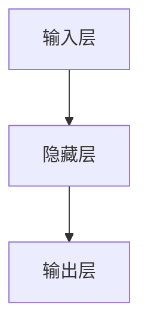

## 1.背景介绍

神经网络（Neural Networks，NN）是一种模仿人脑神经系统工作机制的算法模型，是人工智能领域的核心技术之一。自上世纪80年代以来，神经网络在模式识别、预测分析、自然语言处理等领域取得了显著的成果。本文将深入探讨神经网络的基本原理，并通过代码实战案例进行详细讲解。

## 2.核心概念与联系

神经网络的最基本单元是神经元（Neuron）。每个神经元接收一组输入，通过权重（Weight）和偏置（Bias）的调整，进行线性变换和非线性激活函数处理，输出一个结果。

神经元按照一定的结构组织在一起，就构成了神经网络。常见的神经网络结构有前馈神经网络（Feedforward Neural Network）、卷积神经网络（Convolutional Neural Network）和递归神经网络（Recurrent Neural Network）等。



## 3.核心算法原理具体操作步骤

神经网络的训练过程通常包括前向传播（Forward Propagation）和反向传播（Backpropagation）两个步骤。

1. 前向传播：输入数据从输入层开始，经过每一层的神经元处理，最终输出预测结果。

2. 反向传播：计算预测结果与真实值的误差，然后从输出层开始，逐层向前计算每个神经元的误差，并更新权重和偏置。

## 4.数学模型和公式详细讲解举例说明

假设一个神经元接收到的输入为$x=[x_1, x_2, ..., x_n]$，对应的权重为$w=[w_1, w_2, ..., w_n]$，偏置为$b$。那么，该神经元的输出$y$可以通过如下公式计算：

$$
y = f(\sum_{i=1}^{n}w_i*x_i + b)
$$

其中，$f$是激活函数，常见的激活函数有Sigmoid、ReLU等。

## 5.项目实践：代码实例和详细解释说明

接下来，我们将通过一个简单的二分类问题，来演示神经网络的训练过程。我们使用Python的深度学习库TensorFlow来实现。

```python
import tensorflow as tf

# 定义神经网络结构
model = tf.keras.Sequential([
    tf.keras.layers.Dense(10, activation='relu', input_shape=(2,)),
    tf.keras.layers.Dense(1, activation='sigmoid')
])

# 编译模型
model.compile(optimizer='adam', loss='binary_crossentropy', metrics=['accuracy'])

# 训练模型
model.fit(x_train, y_train, epochs=10)
```

## 6.实际应用场景

神经网络在许多领域都有广泛的应用，例如：图像识别、语音识别、自然语言处理、推荐系统等。

## 7.工具和资源推荐

1. TensorFlow：Google开源的深度学习框架，提供了丰富的神经网络模型和训练算法。

2. PyTorch：Facebook开源的深度学习框架，易于理解和使用，特别适合研究和教学。

3. Keras：基于TensorFlow的高级深度学习接口，简化了神经网络的构建和训练过程。

## 8.总结：未来发展趋势与挑战

神经网络作为人工智能的重要技术，其发展趋势和挑战主要有以下几点：

1. 模型复杂度：随着深度学习的发展，神经网络的结构越来越复杂，如何有效地训练这些复杂模型是一个重要的挑战。

2. 数据依赖：神经网络的训练需要大量的标注数据，如何在数据稀缺的情况下进行有效的训练是一个重要的问题。

3. 计算资源：神经网络的训练需要大量的计算资源，如何在有限的计算资源下进行高效的训练是一个重要的问题。

## 9.附录：常见问题与解答

1. 问：为什么神经网络需要激活函数？

   答：激活函数的引入可以增加神经网络的非线性，使得神经网络可以拟合更复杂的函数。

2. 问：如何选择合适的激活函数？

   答：一般来说，ReLU函数是一个不错的选择，它既可以解决梯度消失问题，又可以加速神经网络的训练。

作者：禅与计算机程序设计艺术 / Zen and the Art of Computer Programming